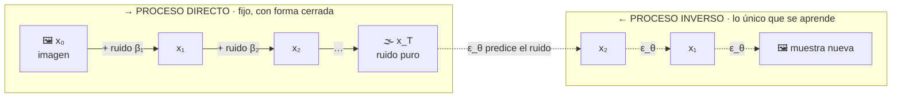

# P17 — Difusión (DDPM)

> Ruta ampliada · La generación deja de ser un salto en la oscuridad: se aprende a deshacer,
> paso a paso, un proceso de ruido que se conoce en forma cerrada.

**Nivel:** L3 · **Motor:** `diffusion` · **Notebook:** [`P17_diffusion.ipynb`](../../../notebooks/papers/P17_diffusion.ipynb)
· **Anexo matemático:** [probabilidad y verosimilitud](../../annexes/A02_PROBABILIDAD_Y_VEROSIMILITUD.md)

## 1. Identificación

| Campo | Valor |
|---|---|
| **Título original** | *Denoising Diffusion Probabilistic Models* |
| **Autoría** | Jonathan Ho, Ajay Jain, Pieter Abbeel |
| **Año** | 2020 |
| **Venue** | arXiv:2006.11239 · NeurIPS 2020 |
| **Fuente primaria** | [arXiv:2006.11239](https://arxiv.org/abs/2006.11239) |
| **Acceso** | Abierto |
| **Fecha de consulta** | 2026-08-16 |

## 2. Problema anterior

Generar imágenes tenía dos familias con defectos opuestos. Las **GAN** producían muestras
nítidas pero su entrenamiento adversario era inestable y colapsaba la diversidad: el generador
encontraba unos pocos modos que engañaban al discriminador y se quedaba ahí. Los **VAE** eran
estables y tenían verosimilitud tratable, pero sus muestras salían borrosas.

Faltaba un objetivo que fuera **estable como el de un VAE** y produjera **calidad de GAN**.

## 3. Propuesta

Definir un proceso **directo** que destruye la imagen añadiendo ruido gaussiano en `T` pasos
—fijo, sin parámetros que aprender, y con forma cerrada para saltar a cualquier paso— y
entrenar una red para invertirlo.

El giro decisivo es la parametrización: en vez de predecir la imagen limpia, la red predice
**el ruido `ε` que se añadió**. Con esa elección, la cota variacional se simplifica a un error
cuadrático medio entre el ruido real y el predicho.

El artículo establece además la conexión entre esta formulación y el *denoising score matching*
con dinámica de Langevin, lo que conecta dos líneas de investigación que iban por separado.

## 4. Intuición sin fórmulas

Una foto que se va llenando de nieve de televisor hasta quedar en ruido puro. Como sabes
exactamente cuánta nieve echaste en cada paso, puedes entrenar a alguien a estimarla y
quitarla. Generar es empezar desde nieve pura y quitar nieve muchas veces.

**Dónde deja de funcionar la analogía:** al quitar nieve no recuperas *la* foto original, sino
*una* foto plausible. El proceso inverso es estocástico: ahí está la generación, no en la
reconstrucción.

## 5. Matemática mínima

```text
Proceso directo (conocido, no se aprende):
    q(x_t | x_{t−1}) = N(x_t;  √(1−β_t)·x_{t−1},  β_t·I)

Salto directo a cualquier paso (la propiedad que lo hace entrenable):
    x_t = √ᾱ_t · x₀ + √(1−ᾱ_t) · ε,     ε ~ N(0, I),   ᾱ_t = Π_{s≤t} (1−β_s)

Despejando la imagen:
    x₀ = ( x_t − √(1−ᾱ_t)·ε ) / √ᾱ_t

Pérdida simplificada:
    L = E_{t, x₀, ε} ‖ ε − ε_θ(x_t, t) ‖²
```

La segunda línea es la que convierte un problema generativo en **regresión supervisada**: el
par de entrenamiento `(x_t, ε)` se fabrica gratis desde cualquier imagen y cualquier `t`.

## 6. Arquitectura o flujo



## 7. Qué observar en el paper original

- La **derivación de la cota variacional** y cómo, al reparametrizar en términos de `ε`,
  colapsa en un error cuadrático simple. Es el corazón del artículo.
- La sección que conecta con **score matching y Langevin**: explica por qué esto no es un truco
  aislado sino un punto de encuentro entre dos formulaciones.
- El **planificador de β** elegido y su efecto en la calidad de las muestras.
- Los resultados en **CIFAR-10** y **LSUN**, y la discusión sobre verosimilitud frente a
  calidad perceptual: el modelo no gana en ambas a la vez, y los autores lo dicen.

## 8. Evidencia y resultados

Síntesis de imágenes de alta calidad en CIFAR-10 y LSUN, con resultados del estado del arte de
la época en calidad de muestra.

> Los valores exactos de FID e Inception Score por conjunto están en las tablas del artículo.
> Verificarlos allí antes de citarlos.

La miniatura de este eje aporta la mecánica: la SNR cae de ~10⁴ a ~4,5 en 20 pasos, la
reconstrucción con el `ε` correcto es exacta hasta precisión de máquina, y el factor de
amplificación `√(1−ᾱ_t)/√ᾱ_t` explica por qué el muestreo va paso a paso.

## 9. Impacto

- Desplazó a las GAN como método por defecto para generación de imágenes en pocos años.
- Es la base técnica de los sistemas de texto a imagen posteriores, que añaden
  **condicionamiento** (a menudo con un codificador de texto tipo [CLIP](../P18_clip/README.md))
  y difusión en espacio latente.
- Trasladó la idea a audio, vídeo, moléculas y política de robots: cualquier dominio donde
  «añadir ruido» esté bien definido.

## 10. Limitaciones

1. **Muestreo lento.** Generar exige cientos o miles de pasadas por la red, frente a una sola
   de una GAN. Toda la investigación posterior de destilación y solucionadores rápidos ataca esto.
2. **Coste de entrenamiento alto.**
3. **Verosimilitud frente a calidad perceptual**: optimizar la cota no maximiza la calidad
   percibida, y el artículo lo documenta.
4. **Sin condicionamiento** en esta versión: no hay forma de pedir *qué* generar.
5. **Sesgo y contenido del conjunto de entrenamiento** se reproducen en las muestras; el
   artículo no aborda esa dimensión.
6. **El proceso directo gaussiano** no encaja igual de bien en datos discretos (texto), donde
   hicieron falta formulaciones distintas.

## 11. Errores comunes

| Error | Corrección |
|---|---|
| «El modelo predice la imagen limpia» | Predice **el ruido**. Es la parametrización que hace la pérdida simple y bien condicionada. |
| «La difusión la inventó este paper» | Sohl-Dickstein et al. (2015) la propuso antes; DDPM la hizo funcionar y la simplificó. |
| «Es determinista, luego no genera» | El proceso **inverso** es estocástico: de ahí sale la diversidad. |
| «Difusión = texto a imagen» | El condicionamiento por texto es **posterior**. Este paper genera sin condición. |
| «Más pasos siempre es mejor» | Hay rendimientos decrecientes, y el coste crece linealmente. |

## 12. Relación con trabajos anteriores

- **Sohl-Dickstein et al. (2015)** — difusión no supervisada; el antecedente directo.
  [arXiv:1503.03585](https://arxiv.org/abs/1503.03585)
- **VAE (2013) y GAN (2014)** — las dos familias cuyas debilidades motivan el trabajo.
- **[P02 Backpropagation](../P02_backpropagation/README.md)** y
  **[P04 AlexNet](../P04_alexnet/README.md)** — la red que predice `ε` es una CNN entrenada por
  retropropagación.

## 13. Relación con trabajos posteriores

- **[P18 CLIP](../P18_clip/README.md) (2021)** — aporta el espacio compartido imagen-texto que
  permite condicionar la generación con palabras.
- **Difusión latente y modelos de texto a imagen (2022+)** — difusión en un espacio comprimido
  en vez de en píxeles.
- **Destilación de muestreo (2022+)** — reducir cientos de pasos a unos pocos.

## 14. Notebook asociado

[`P17_diffusion.ipynb`](../../../notebooks/papers/P17_diffusion.ipynb)

**Qué implementa:** el proceso directo con forma cerrada, la trayectoria de SNR, la
reconstrucción desde `ε` y la amplificación del error por paso.

**Qué NO implementa:** la red `ε_θ`, el muestreo estocástico inverso, la U-Net ni ninguna
imagen. Cuatro números no son una imagen, y aquí el `ε` se conoce en lugar de predecirse.

```bash
ai-evolution paper-lab P17 --seed 7
```

## 15. Actividades Bloom

| Nivel | Actividad |
|---|---|
| **Recordar** | Escribe la fórmula del salto directo a `x_t` y define `ᾱ_t`. |
| **Explicar** | Explica por qué predecir `ε` es mejor condicionado que predecir `x₀`. |
| **Aplicar** | Calcula `ᾱ_t` para un planificador lineal de 20 pasos y localiza dónde la SNR cruza 1. |
| **Analizar** | Deriva el factor de amplificación del error de `ε` sobre `x₀` y explica su forma. |
| **Evaluar** | Un equipo reporta FID excelente y muestras poco diversas. ¿Qué métrica falta y por qué? |
| **Crear** | Diseña un proceso directo para datos **discretos** y argumenta qué se rompe respecto al gaussiano. |

## 16. Autoevaluación

1. ¿Por qué el proceso directo no tiene parámetros que aprender?
2. ¿Qué propiedad permite entrenar sin simular los `t` pasos uno a uno?
3. ¿Por qué la pérdida acaba siendo un error cuadrático simple?
4. ¿De dónde sale la diversidad de las muestras?
5. ¿Por qué el muestreo es lento y qué se ha hecho después al respecto?
6. ¿Qué le falta a este paper para poder pedirle «un gato con sombrero»?
7. ¿Qué idea que hoy se asocia a «difusión» no está en este artículo?

## 17. Respuestas esperadas

1. Porque `β_t` es un planificador fijo elegido de antemano: añadir ruido gaussiano está
   completamente especificado, no hay nada que ajustar.
2. La composición de gaussianas es gaussiana, así que `q(x_t | x₀)` tiene forma cerrada y se
   puede muestrear `t` al azar y saltar directamente.
3. Porque al reparametrizar la cota variacional en términos de `ε`, los términos se simplifican
   y queda `‖ε − ε_θ‖²` con un peso que el paper decide ignorar.
4. Del proceso inverso, que es estocástico: se parte de ruido distinto y se añade ruido en cada
   paso de denoising.
5. Porque requiere una pasada por la red por cada paso. Después llegaron solucionadores de
   pocos pasos y destilación del muestreador.
6. Condicionamiento. Necesita un espacio donde el texto y la imagen sean comparables — el
   problema de [P18](../P18_clip/README.md).
7. El condicionamiento por texto, la difusión latente y la guía sin clasificador: todo posterior.

## 18. Fuentes primarias

- Ho, J., Jain, A. y Abbeel, P. (2020). *Denoising Diffusion Probabilistic Models*.
  **NeurIPS 2020**. [arXiv:2006.11239](https://arxiv.org/abs/2006.11239) · consultado 2026-08-16.
- Sohl-Dickstein, J. et al. (2015). *Deep Unsupervised Learning using Nonequilibrium
  Thermodynamics*. [arXiv:1503.03585](https://arxiv.org/abs/1503.03585) · consultado 2026-08-16.

---

[📇 Índice](../../catalog/PAPERS_INDEX.md) ·
[📝 Evaluación](../../../assessments/papers/P17_diffusion.md) ·
[🏫 Clase 090 · Modelos de difusión](../../../classes/part-07-generative-ai-across-media/090-modelos-de-difusion/README.md) ·
[🏫 Clase 091 · Texto a imagen](../../../classes/part-07-generative-ai-across-media/091-texto-a-imagen-y-condicionamiento/README.md) ·
[➡️ Siguiente: P18 CLIP](../P18_clip/README.md)
