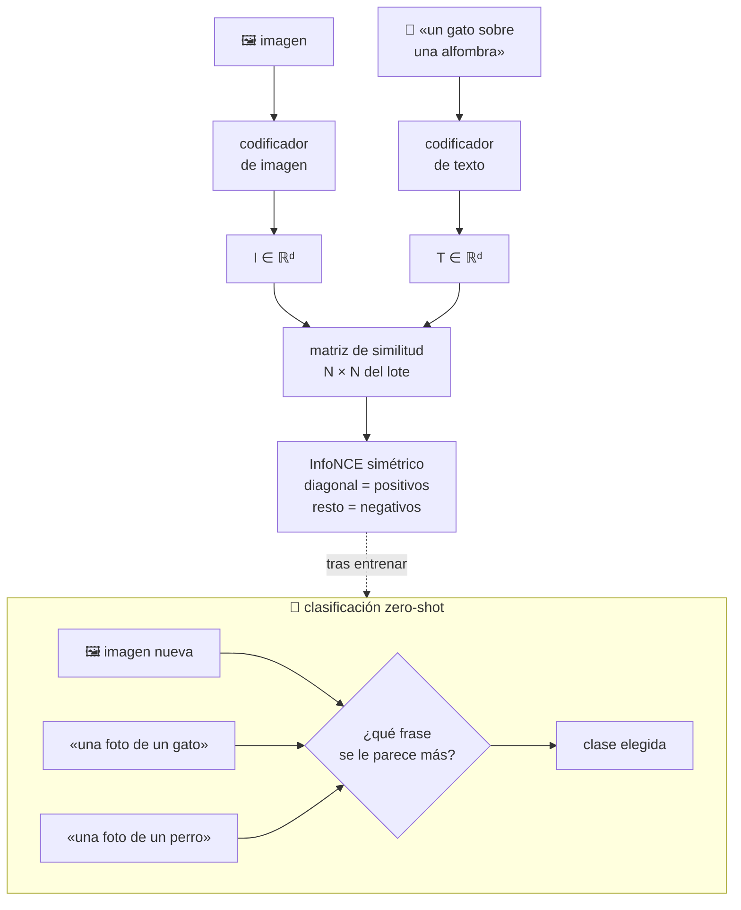

# P18 — CLIP

> Ruta ampliada · El texto se convierte en la etiqueta: un solo modelo clasifica categorías que
> nadie anotó, descritas con palabras.

**Nivel:** L3 · **Motor:** `clip` · **Notebook:** [`P18_clip.ipynb`](../../../notebooks/papers/P18_clip.ipynb)
· **Anexo matemático:** [álgebra y geometría](../../annexes/A01_ALGEBRA_Y_GEOMETRIA.md)

## 1. Identificación

| Campo | Valor |
|---|---|
| **Título original** | *Learning Transferable Visual Models From Natural Language Supervision* |
| **Autoría** | Alec Radford, Jong Wook Kim, Chris Hallacy, Aditya Ramesh, Gabriel Goh y otros (OpenAI) |
| **Año** | 2021 |
| **Venue** | arXiv:2103.00020 · ICML 2021 |
| **Fuente primaria** | [arXiv:2103.00020](https://arxiv.org/abs/2103.00020) |
| **Acceso** | Abierto |
| **Fecha de consulta** | 2026-08-16 |

## 2. Problema anterior

Desde [AlexNet](../P04_alexnet/README.md), la visión funcionaba así: alguien define un conjunto
cerrado de categorías, alguien etiqueta un millón de imágenes con ellas, y el modelo aprende a
elegir entre esas categorías y ninguna más.

Eso tiene dos costes. El primero es económico: cada tarea nueva exige anotar de nuevo. El
segundo es conceptual: el modelo aprende «clase 237», no *lo que la clase significa*. Un
clasificador de ImageNet no sabe nada de una categoría que no estuviera en su lista.

## 3. Propuesta

Usar como supervisión lo que **ya viene con las imágenes de internet**: su texto asociado.

Se entrenan dos codificadores —uno de imagen, otro de texto— con un objetivo **contrastivo**
sobre 400 millones de pares: acercar cada imagen a su texto y alejarla de los textos del resto
del lote. En un lote de `N`, cada par correcto tiene `N−1` negativos gratis.

Después, clasificar es comparar: se escriben las categorías como frases («una foto de un
gato»), se codifican y se elige la más parecida a la imagen. **Sin clasificador entrenado y sin
un solo ejemplo de la tarea.** El paper reporta que así iguala la exactitud de un ResNet-50 en
ImageNet sin usar ninguno de sus 1,28 millones de ejemplos de entrenamiento.

## 4. Intuición sin fórmulas

Una clase con una pizarra de fotos y otra de pies de foto, desordenadas. La tarea es unir cada
foto con su pie. Al hacerlo miles de millones de veces, aprendes qué aspecto tiene lo que las
palabras describen — y luego puedes buscar «un perro con gorro» aunque nadie te enseñara nunca
esa categoría.

**Dónde deja de funcionar la analogía:** el texto de internet no es una descripción cuidadosa;
es lo que había alrededor de la imagen. Aprende correlaciones del pie de foto, no la definición
del concepto.

## 5. Matemática mínima

```text
Similitud (coseno, ambos vectores normalizados):
    s_ij = (I_i · T_j) / (‖I_i‖ ‖T_j‖)

Logits con temperatura aprendida τ:
    logits = s / τ

Pérdida InfoNCE simétrica sobre un lote de N pares:
    L = ½·CrossEntropy(logits, etiquetas=diagonal)  por filas
      + ½·CrossEntropy(logitsᵀ, etiquetas=diagonal) por columnas

Clasificación zero-shot:
    ŷ = argmax_c  cos( I_imagen , T_"una foto de un {c}" )
```

La **diagonal** son los pares correctos. Todo lo demás del lote son negativos: por eso el
tamaño de lote es un hiperparámetro de primer orden y no un detalle de implementación.

## 6. Arquitectura o flujo



## 7. Qué observar en el paper original

- El **tamaño del conjunto**: 400 millones de pares recogidos de internet, y cómo se
  construyó. La escala **es** la contribución tanto como el objetivo.
- La discusión sobre **eficiencia del objetivo**: por qué el contrastivo escala mejor que
  predecir el texto exacto de la imagen.
- La sección de **prompt engineering y ensamblado de plantillas**: la exactitud zero-shot varía
  varios puntos según cómo se escriba la clase. Los autores lo documentan abiertamente.
- El **análisis de limitaciones y sesgo**, inusualmente extenso: rendimiento pobre en tareas
  abstractas o de conteo, y asociaciones problemáticas heredadas del corpus.
- Los experimentos de **robustez ante desplazamiento de distribución**, donde CLIP aguanta
  mejor que modelos entrenados solo en ImageNet.

## 8. Evidencia y resultados

Evaluación en más de 30 conjuntos de visión, en régimen zero-shot y como extractor de
características.

El resultado más citado: en ImageNet, la clasificación zero-shot iguala la exactitud de un
ResNet-50 supervisado **sin usar sus 1,28 millones de ejemplos etiquetados**.

> Las cifras por conjunto y por variante de codificador están en las tablas del artículo.
> Verificarlas allí antes de citarlas, y leer primero la sección de plantillas: el número
> depende de cómo se redacten las clases.

La miniatura de este eje muestra el mecanismo: la diagonal de la matriz de similitud sube y lo
de fuera baja, y la clasificación zero-shot acierta 4/4 comparando la imagen con el **texto**
de cada clase.

## 9. Impacto

- Convirtió el **texto en interfaz de la visión**: buscar, clasificar y filtrar imágenes
  describiéndolas.
- Su codificador de texto se volvió la pieza estándar para **condicionar generación**, lo que
  conecta directamente con [P17](../P17_diffusion/README.md).
- Popularizó el **preentrenamiento contrastivo multimodal** como receta general, extendida
  después a audio, vídeo y datos biomédicos.
- Reabrió la discusión sobre datos de internet: licencias, consentimiento y sesgo a escala.

## 10. Limitaciones

1. **Falla en tareas abstractas**: contar objetos, relaciones espaciales finas, texto dentro de
   la imagen.
2. **Sensible a la redacción de la clase.** «Zero-shot» esconde un ajuste de plantillas que, si
   se hace mirando el test, deja de ser zero-shot.
3. **Sesgo del corpus** heredado y amplificado; el propio paper lo mide y lo advierte.
4. **«Zero-shot» es relativo**: con 400 millones de pares de internet, pocas categorías comunes
   son realmente nuevas para el modelo.
5. **Coste de entrenamiento** fuera del alcance de casi cualquier equipo.
6. **Datos no públicos** en la versión original: la replicación independiente exigió construir
   corpus alternativos.
7. **Grano grueso**: distingue gato de perro mucho mejor que razas concretas.

## 11. Errores comunes

| Error | Corrección |
|---|---|
| «Zero-shot significa que nunca vio gatos» | Significa que no vio **este conjunto de etiquetas**. Vio 400 millones de pares. |
| «CLIP es un clasificador» | Es un **espacio compartido**. La clasificación es una consulta de similitud sobre él. |
| «La plantilla del prompt es un detalle» | Cambia el resultado varios puntos. Es parte del protocolo y debe reportarse. |
| «CLIP genera imágenes» | No genera nada. Aporta el espacio que otros modelos usan para condicionar. |
| «Contrastivo = supervisado» | La supervisión es **débil y gratuita**: el emparejamiento que ya existía, no una anotación. |

## 12. Relación con trabajos anteriores

- **[P04 AlexNet](../P04_alexnet/README.md) (2012)** — el paradigma de categorías fijas que este
  trabajo rompe.
- **[P05 Word2Vec](../P05_word2vec/README.md) (2013)** — la idea de que el significado vive en
  un espacio vectorial.
- **[P08 Transformer](../P08_transformer/README.md) (2017)** — el codificador de texto.
- **Russakovsky et al. (2015)** — ILSVRC y su marco de etiquetas cerradas.
  [arXiv:1409.0575](https://arxiv.org/abs/1409.0575)

## 13. Relación con trabajos posteriores

- **Generación condicionada por texto (2021+)** — usa el codificador de texto de CLIP o
  sucesores para guiar la difusión de [P17](../P17_diffusion/README.md).
- **Modelos de visión-lenguaje conversacionales (2023+)** — conectan un codificador visual a un
  LLM en vez de contrastar espacios.
- **Réplicas abiertas** con corpus públicos, que permitieron auditar el sesgo del método.

## 14. Notebook asociado

[`P18_clip.ipynb`](../../../notebooks/papers/P18_clip.ipynb)

**Qué implementa:** InfoNCE simétrico sobre cuatro pares, la matriz de similitud antes y
después de entrenar, y clasificación zero-shot por comparación con el texto de la clase.

**Qué NO implementa:** codificadores de imagen o texto, los 400 millones de pares ni lotes
grandes. Con lotes de 4, el contraste es trivial: la dificultad real del método está en la escala.

```bash
ai-evolution paper-lab P18 --seed 7
```

## 15. Actividades Bloom

| Nivel | Actividad |
|---|---|
| **Recordar** | Escribe la pérdida InfoNCE simétrica y di qué son los positivos y los negativos. |
| **Explicar** | Explica por qué el tamaño del lote es un hiperparámetro de primer orden. |
| **Aplicar** | Ejecuta el notebook con tres semillas y compara la separación diagonal/fuera. |
| **Analizar** | Diseña tres plantillas de texto para la misma clase y razona cuál debería funcionar mejor y por qué. |
| **Evaluar** | Alguien reporta 76 % zero-shot eligiendo la plantilla sobre el test. ¿Qué objetas? |
| **Crear** | Diseña un protocolo de evaluación zero-shot a prueba de ajuste encubierto de plantillas. |

## 16. Autoevaluación

1. ¿Qué supervisión usa CLIP y por qué es barata?
2. ¿Por qué el objetivo contrastivo escala mejor que predecir el texto exacto?
3. ¿Qué papel juega la temperatura `τ`?
4. ¿Cómo clasifica sin clasificador?
5. ¿En qué sentido «zero-shot» es una etiqueta discutible?
6. ¿Qué tipo de tareas se le dan mal y por qué?
7. ¿Qué aporta CLIP a un modelo de difusión?

## 17. Respuestas esperadas

1. El emparejamiento imagen-texto que ya existe en internet. Nadie anota categorías: la señal
   viene con los datos.
2. Porque predecir el texto exacto es una tarea mucho más difícil y con una salida enorme;
   distinguir cuál de `N` textos corresponde es una tarea más fácil que aún exige entender el
   contenido, y aprovecha `N−1` negativos gratis por ejemplo.
3. Escala los logits antes del softmax: controla cuán concentrada queda la distribución. Es un
   parámetro aprendido, no fijo.
4. Codificando las categorías como frases y eligiendo la de mayor coseno con la imagen. El
   «clasificador» se construye al vuelo desde texto.
5. Porque el modelo vio 400 millones de pares de internet: la categoría es nueva para *el
   protocolo*, no necesariamente para *el modelo*.
6. Conteo, relaciones espaciales, distinciones de grano fino y tareas abstractas: la
   correlación pie-de-foto/imagen no las cubre bien.
7. Un espacio donde texto e imagen son comparables, que permite guiar la generación con
   palabras — lo que a [P17](../P17_diffusion/README.md) le faltaba.

## 18. Fuentes primarias

- Radford, A. et al. (2021). *Learning Transferable Visual Models From Natural Language
  Supervision*. **ICML 2021**.
  [arXiv:2103.00020](https://arxiv.org/abs/2103.00020) · consultado 2026-08-16.
- Russakovsky, O. et al. (2015). *ImageNet Large Scale Visual Recognition Challenge*.
  [arXiv:1409.0575](https://arxiv.org/abs/1409.0575) · consultado 2026-08-16.

---

[⬅️ Anterior: P17 Difusión](../P17_diffusion/README.md) ·
[📇 Índice](../../catalog/PAPERS_INDEX.md) ·
[📝 Evaluación](../../../assessments/papers/P18_clip.md) ·
[🏫 Clase 069 · Modelos visión-lenguaje](../../../classes/part-05-language-vision-audio-and-multimodal-ai/069-modelos-vision-lenguaje/README.md) ·
[➡️ Siguiente: P19 Leyes de escalado](../P19_scaling_laws/README.md)
