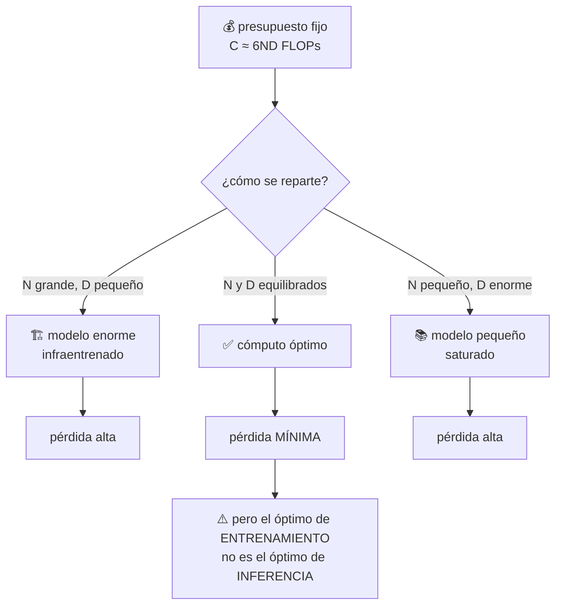

# P19 — Leyes de escalado con cómputo óptimo (Chinchilla)

> Ruta ampliada · Corrige la carrera por el tamaño: a cómputo fijo, los modelos de la época
> estaban infraentrenados en datos.

**Nivel:** L4 · **Motor:** `scaling_laws` · **Notebook:** [`P19_scaling_laws.ipynb`](../../../notebooks/papers/P19_scaling_laws.ipynb)
· **Anexo:** [complejidad y coste](../../annexes/A05_COMPLEJIDAD_Y_COSTE.md)
· **Anexo matemático:** [complejidad, coste y escalado](../../annexes/A05_COMPLEJIDAD_Y_COSTE.md)

## 1. Identificación

| Campo | Valor |
|---|---|
| **Título original** | *Training Compute-Optimal Large Language Models* |
| **Autoría** | Jordan Hoffmann, Sebastian Borgeaud, Arthur Mensch y otros (DeepMind) |
| **Año** | 2022 |
| **Venue** | arXiv:2203.15556 · NeurIPS 2022 |
| **Fuente primaria** | [arXiv:2203.15556](https://arxiv.org/abs/2203.15556) |
| **Acceso** | Abierto |
| **Fecha de consulta** | 2026-08-16 |

## 2. Problema anterior

Tras [GPT-3](../P10_gpt3/README.md), la industria interpretó las leyes de escalado de Kaplan et
al. (2020) como una consigna simple: **más parámetros**. Los modelos de los dos años siguientes
crecieron un orden de magnitud en `N` mientras el número de tokens de entrenamiento `D` se
mantenía prácticamente igual.

La pregunta que nadie había resuelto bien es distinta y más útil: **dado un presupuesto fijo de
cómputo, ¿cuánto conviene gastar en parámetros y cuánto en datos?** Sin esa respuesta, cada
laboratorio elegía por intuición y por marketing.

## 3. Propuesta

Medirlo. Los autores entrenan cientos de modelos variando `N` y `D` a lo largo de un rango
amplio de presupuestos, ajustan una forma paramétrica a la pérdida y resuelven el problema de
optimización con restricción de cómputo.

La conclusión: para minimizar la pérdida a cómputo fijo, **`N` y `D` deben escalarse
aproximadamente en la misma proporción**. Los modelos grandes de la época habían gastado
demasiado en parámetros y demasiado poco en tokens.

Y lo demuestran con la prueba más contundente posible: entrenan un modelo **considerablemente
más pequeño** con muchos más tokens, al mismo cómputo, y supera a los grandes.

## 4. Intuición sin fórmulas

Un presupuesto fijo para montar una biblioteca: puedes comprar muchas estanterías y pocos
libros, o pocas estanterías y muchos libros. Ninguno de los dos extremos es óptimo, y durante
años el sector compró estanterías.

**Dónde deja de funcionar la analogía:** las estanterías vacías no perjudican; los parámetros
infraentrenados sí consumen cómputo de entrenamiento **y** de inferencia para siempre.

## 5. Matemática mínima

```text
Forma paramétrica ajustada empíricamente:

    L(N, D) = E + A/N^α + B/D^β

        E = error irreducible (la entropía del propio lenguaje)
        A/N^α = lo que se compra con parámetros
        B/D^β = lo que se compra con datos

Restricción de presupuesto (aproximación estándar de FLOPs de entrenamiento):

    C ≈ 6·N·D

Problema:   minimizar L(N, D)   sujeto a   6ND = C
```

Sustituyendo `D = C/(6N)` y derivando respecto de `N`, la condición de óptimo iguala las
contribuciones marginales de ambos términos. El resultado es una **razón óptima de tokens por
parámetro** que depende de `α` y `β`, no del presupuesto.

> Los valores ajustados de `E`, `A`, `B`, `α` y `β` están en el artículo. El motor de este eje
> usa constantes **didácticas** para que la curva tenga la forma correcta: la forma es lo
> transferible, los números concretos hay que leerlos en la fuente.

<!-- puente:inicio -->
> [!TIP]
> **Puente matemático.** Esta sección da por sabido lo siguiente. Si algo no te suena,
> léelo primero: está explicado una sola vez, en un solo sitio, y sirve para todas las fichas.

| Dónde | Qué necesitas de ahí |
|---|---|
| [**A05 §4** · FLOPs de entrenamiento: la regla de 6ND](../../annexes/A05_COMPLEJIDAD_Y_COSTE.md#4-flops-de-entrenamiento-la-regla-de-6nd) | la regla de 6ND: el presupuesto de cómputo que se reparte |
| [**A05 §5** · Escalado: dónde gastar el presupuesto](../../annexes/A05_COMPLEJIDAD_Y_COSTE.md#5-escalado-dónde-gastar-el-presupuesto) | dónde gastarlo, que es exactamente la pregunta del paper |
<!-- puente:fin -->

## 6. Arquitectura o flujo



## 7. Qué observar en el paper original

- Los **tres enfoques independientes** con los que estiman el óptimo. Que tres métodos distintos
  converjan es lo que hace creíble el resultado: no es un ajuste afortunado.
- El **experimento de validación**: entrenar el modelo predicho como óptimo y comprobar que
  supera a los mayores de la época al mismo cómputo.
- La discusión sobre **disponibilidad de datos**: si `D` debe crecer con `N`, el cuello de
  botella se desplaza al corpus. Ese punto envejeció muy bien.
- Las **limitaciones que los autores declaran**: rango de ajuste, arquitectura concreta, y que
  la ley describe pérdida de preentrenamiento, no capacidad en tareas.

## 8. Evidencia y resultados

Cientos de modelos entrenados en un rango amplio de presupuestos, tres estimaciones
independientes del exponente óptimo, y una validación empírica entrenando el modelo predicho.

> Los tamaños concretos, la razón óptima de tokens por parámetro y los resultados por benchmark
> están en las tablas del artículo. Verificarlos allí: es un paper donde los números concretos
> se citan mal con mucha frecuencia.

La miniatura de este eje reproduce el **razonamiento**, no los valores: a cómputo idéntico, la
mejor y la peor asignación difieren claramente en pérdida, y al duplicar el presupuesto crecen
`N` y `D` a la vez.

## 9. Impacto

- Reorientó la industria: los modelos posteriores se entrenan con muchos más tokens por
  parámetro que antes de 2022.
- Convirtió los **datos** en el recurso escaso y disparó el trabajo sobre curación, filtrado,
  repetición controlada de épocas y datos sintéticos.
- Introdujo en la práctica la distinción entre **óptimo de entrenamiento** y **óptimo de
  despliegue**: si un modelo se sirve a millones de peticiones, conviene entrenar uno más
  pequeño *por debajo* del óptimo de Chinchilla y darle aún más datos.
- Es un ejemplo de manual de cómo una medición cuidadosa refuta una intuición dominante.

## 10. Limitaciones

1. **Describe pérdida de preentrenamiento**, no capacidad, utilidad ni seguridad.
2. **Rango de ajuste acotado**: extrapolar varios órdenes de magnitud fuera de él no está
   justificado por el paper.
3. **Ignora el coste de inferencia**, que hoy suele dominar el coste total del ciclo de vida.
4. **`C ≈ 6ND` es una aproximación** que depende de la arquitectura y del régimen.
5. **Supone datos abundantes y de calidad uniforme**: repetir épocas o mezclar calidades cambia
   la ecuación.
6. **No cubre arquitecturas dispersas**: un modelo de [mezcla de expertos](../P21_moe/README.md)
   tiene una relación distinta entre parámetros y cómputo.

## 11. Errores comunes

| Error | Corrección |
|---|---|
| «Chinchilla dice que 20 tokens por parámetro es la regla» | Es una razón derivada de exponentes ajustados en un rango concreto y con una arquitectura concreta. Citarla como constante universal es sobregeneralizar. |
| «Menor pérdida = mejor modelo para mi tarea» | La ley predice pérdida de preentrenamiento. La utilidad en tu tarea es otra medición. |
| «El óptimo de entrenamiento es el modelo que hay que desplegar» | Si vas a servir mucho, conviene un modelo más pequeño y más entrenado. |
| «Kaplan se equivocó» | Kaplan et al. midieron algo real con un protocolo distinto. Chinchilla corrige el reparto óptimo, no invalida el marco. |
| «Ya no hace falta escalar parámetros» | Hace falta escalar **ambos**. El resultado es sobre el reparto, no sobre parar. |

## 12. Relación con trabajos anteriores

- **[P10 GPT-3](../P10_gpt3/README.md) (2020)** — el modelo cuyo régimen de entrenamiento se
  cuestiona.
- **Kaplan et al. (2020)** — las leyes de escalado que este trabajo corrige.
  [arXiv:2001.08361](https://arxiv.org/abs/2001.08361)
- **[P08 Transformer](../P08_transformer/README.md) (2017)** — la arquitectura sobre la que se
  mide.

## 13. Relación con trabajos posteriores

- **[P21 Mixtral](../P21_moe/README.md) (2024)** — cambia la relación entre capacidad y cómputo,
  y por tanto la forma del problema.
- **[P22 DeepSeek-R1](../P22_deepseek_r1/README.md) (2025)** — mueve el cómputo al momento de
  la inferencia, una variable que esta ley no modela.
- **Snell et al. (2024)** — escalar cómputo en inferencia puede rendir más que escalar
  parámetros. [arXiv:2408.03314](https://arxiv.org/abs/2408.03314)
- **Trabajo sobre calidad y repetición de datos (2023+)** — la consecuencia directa de volver
  escaso el corpus.

## 14. Notebook asociado

[`P19_scaling_laws.ipynb`](../../../notebooks/papers/P19_scaling_laws.ipynb)

**Qué implementa:** la forma paramétrica, la comparación de asignaciones a **cómputo idéntico**,
el desplazamiento del óptimo al crecer el presupuesto y una comparación entre coste de
entrenamiento y de inferencia.

**Qué NO implementa:** ningún entrenamiento. Y sus constantes son **didácticas**, no las
ajustadas en el paper — el notebook lo declara en su salida.

```bash
ai-evolution paper-lab P19 --seed 7
```

## 15. Actividades Bloom

| Nivel | Actividad |
|---|---|
| **Recordar** | Escribe `L(N, D)` y explica qué representa cada término. |
| **Explicar** | Explica por qué `E` no se puede reducir con más cómputo. |
| **Aplicar** | Con la restricción `6ND = C`, calcula la pérdida de tres asignaciones y ordénalas. |
| **Analizar** | Deriva la condición de óptimo sustituyendo `D = C/(6N)` y anulando la derivada. |
| **Evaluar** | Un equipo cita «20 tokens por parámetro» como ley universal. Formula dos objeciones. |
| **Crear** | Extiende el análisis añadiendo un término de coste de inferencia y resuelve el nuevo óptimo. |

## 16. Autoevaluación

1. ¿Qué se mantiene constante al comparar asignaciones, y por qué es imprescindible?
2. ¿Qué significa `E` y por qué no baja al escalar?
3. ¿Por qué tres métodos independientes hacen más creíble el resultado?
4. ¿Qué recurso pasa a ser escaso como consecuencia de este paper?
5. ¿Por qué el óptimo de entrenamiento no es el óptimo de despliegue?
6. ¿Qué **no** predice esta ley?
7. ¿Por qué una arquitectura dispersa rompe la forma del problema?

## 17. Respuestas esperadas

1. El cómputo `C`. Sin fijarlo, comparar modelos es comparar presupuestos, no decisiones de
   diseño.
2. El error irreducible: la incertidumbre intrínseca del lenguaje. Ningún modelo puede predecir
   perfectamente el siguiente token, y `E` es esa cota.
3. Porque reduce la probabilidad de que el resultado sea un artefacto del método de ajuste. La
   convergencia de estimaciones independientes es evidencia; un solo ajuste es una hipótesis.
4. Los datos. Si `D` debe crecer con `N`, el corpus de calidad se vuelve el cuello de botella.
5. Porque el coste de inferencia es proporcional a `N` y se paga en **cada** petición, mientras
   que el de entrenamiento se paga una vez. Con volumen alto, conviene un modelo menor.
6. Capacidades concretas, utilidad, seguridad, comportamiento fuera de distribución, ni el
   resultado en tareas específicas.
7. Porque en un modelo disperso los parámetros totales y el cómputo por token dejan de ser
   proporcionales: `C ≈ 6ND` ya no se sostiene con la misma `N`.

## 18. Fuentes primarias

- Hoffmann, J. et al. (2022). *Training Compute-Optimal Large Language Models*. **NeurIPS 2022**.
  [arXiv:2203.15556](https://arxiv.org/abs/2203.15556) · consultado 2026-08-16.
- Kaplan, J. et al. (2020). *Scaling Laws for Neural Language Models*.
  [arXiv:2001.08361](https://arxiv.org/abs/2001.08361) · consultado 2026-08-16.
- Snell, C., Lee, J., Xu, K. y Kumar, A. (2024). *Scaling LLM Test-Time Compute Optimally can be
  More Effective than Scaling Model Parameters*.
  [arXiv:2408.03314](https://arxiv.org/abs/2408.03314) · consultado 2026-08-16.

---

[⬅️ Anterior: P18 CLIP](../P18_clip/README.md) ·
[📇 Índice](../../catalog/PAPERS_INDEX.md) ·
[📝 Evaluación](../../../assessments/papers/P19_scaling_laws.md) ·
[🏫 Clase 074 · Objetivos de preentrenamiento](../../../classes/part-06-foundation-models-and-llm-engineering/074-objetivos-de-preentrenamiento/README.md) ·
[➡️ Siguiente: P20 Mamba](../P20_mamba/README.md)
