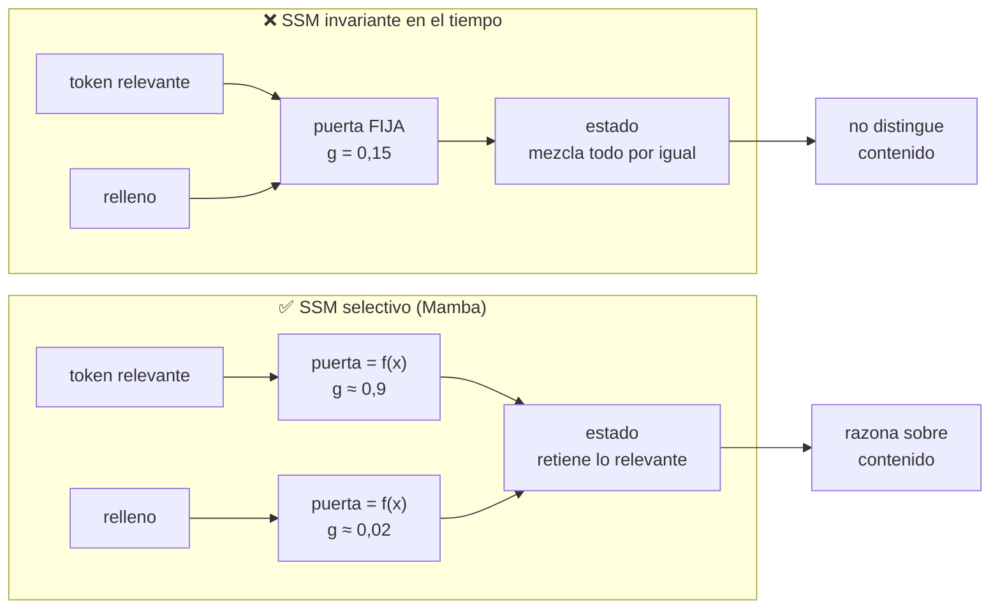

# P20 — Mamba

> Ruta ampliada · El primer competidor serio del Transformer en lenguaje: tiempo lineal y
> estado de tamaño fijo, sin atención.

**Nivel:** L4 · **Motor:** `ssm` · **Notebook:** [`P20_mamba.ipynb`](../../../notebooks/papers/P20_mamba.ipynb)
· **Anexo matemático:** [complejidad, coste y escalado](../../annexes/A05_COMPLEJIDAD_Y_COSTE.md)

## 1. Identificación

| Campo | Valor |
|---|---|
| **Título original** | *Mamba: Linear-Time Sequence Modeling with Selective State Spaces* |
| **Autoría** | Albert Gu, Tri Dao |
| **Año** | 2023 (arXiv v1, diciembre) |
| **Venue** | arXiv:2312.00752 · COLM 2024 (Outstanding Paper Award) |
| **Fuente primaria** | [arXiv:2312.00752](https://arxiv.org/abs/2312.00752) |
| **Acceso** | Abierto |
| **Fecha de consulta** | 2026-08-16 |

## 2. Problema anterior

El [Transformer](../P08_transformer/README.md) compró paralelismo pagando **O(n²)** en cómputo y
una caché que crece con la secuencia. Para contextos largos eso es prohibitivo, y no por falta
de ingeniería: es la forma del mecanismo.

Existían alternativas subcuadráticas —atención lineal, convoluciones con puertas, modelos
recurrentes, espacios de estados estructurados (S4)— y todas compartían el mismo destino:
funcionaban bien en señales continuas (audio, series) y **perdían claramente frente a la
atención en lenguaje**.

Los autores identifican por qué: esos modelos son **invariantes en el tiempo**. Sus parámetros
no dependen de lo que están leyendo, así que no pueden decidir ignorar un token irrelevante ni
retener uno importante. Les falta razonamiento sobre el **contenido**.

## 3. Propuesta

Hacer que los parámetros del espacio de estados sean **función de la entrada**. Esa es la
selección: la puerta que decide cuánto se propaga y cuánto se olvida depende del token actual.

Tiene un coste inmediato: un SSM con parámetros variables ya no se puede expresar como una
convolución, que era justo lo que hacía eficientes a los modelos previos. La segunda mitad de la
contribución es resolver eso con un **algoritmo paralelo consciente del hardware** que opera en
modo recurrente sin materializar el estado expandido en memoria lenta.

Con ambas piezas, integran el bloque en una arquitectura simplificada **sin atención y sin
bloques MLP separados**, y reportan inferencia con 5× más rendimiento que Transformers
comparables y escalado lineal en la longitud.

## 4. Intuición sin fórmulas

Un RNN es alguien tomando notas en una libreta de tamaño fijo: barato, pero acaba borrando. La
atención es alguien que se guarda todos los papeles: no olvida nada, pero necesita releerlos
todos cada vez. Mamba mantiene la libreta de tamaño fijo y añade criterio: **decide qué apuntar
según lo que está leyendo**.

**Dónde deja de funcionar la analogía:** una libreta de tamaño fijo **es** compresión con
pérdida. Por buena que sea la decisión, no puedes recuperar literalmente un token que decidiste
no apuntar. La atención sí.

## 5. Matemática mínima

```text
SSM invariante en el tiempo (S4 y anteriores):
    h_t = A·h_{t−1} + B·x_t
    y_t = C·h_t                      A, B, C FIJAS
    → equivalente a una convolución con un núcleo largo, y por tanto paralelizable

SSM selectivo (Mamba):
    h_t = A(x_t)·h_{t−1} + B(x_t)·x_t
    y_t = C(x_t)·h_t                 A, B, C DEPENDEN DE x_t
    → ya no es convolución; hace falta un escaneo paralelo explícito
```

Coste y memoria, para longitud `n`, dimensión `d` y estado `N`:

| | Cómputo por capa | Memoria durante la generación | Camino entre posiciones |
|---|---|---|---|
| **Atención** | `O(n²·d)` | `O(n·d)` — la caché KV crece | `O(1)` |
| **SSM selectivo** | `O(n·d·N)` | `O(d·N)` — **constante** | `O(n)` |

Las dos últimas columnas son el compromiso completo: memoria constante a cambio de perder el
acceso directo a cualquier posición.

## 6. Arquitectura o flujo



## 7. Qué observar en el paper original

- La **motivación por tareas sintéticas**: copia selectiva y cabezas de inducción. Están
  diseñadas para aislar exactamente la capacidad que falta a los SSM previos, y son la mejor
  parte pedagógica del artículo.
- La explicación de por qué la selección **rompe** la equivalencia con la convolución, y qué se
  hace al respecto. Es donde el paper es más honesto sobre su propio coste.
- El **algoritmo consciente del hardware**: qué se guarda en memoria rápida y qué se recomputa.
- Las **ablaciones** sobre qué parámetros conviene hacer selectivos.
- La comparación de **rendimiento de inferencia** y de escalado con la longitud, además de la
  calidad.

## 8. Evidencia y resultados

Evaluación en lenguaje, audio y genómica, con comparación frente a Transformers de tamaño
comparable y frente a SSM previos.

El artículo reporta que **Mamba-3B supera a Transformers de su mismo tamaño e iguala a
Transformers del doble de tamaño** en modelado de lenguaje, con **5× más rendimiento de
inferencia** y escalado lineal, con mejoras que se mantienen en secuencias de hasta longitud de
millones.

> Las cifras por tarea, tamaño y línea base están en las tablas del artículo. Verificarlas allí:
> los resultados dependen mucho de la escala evaluada, y el rango del paper no llega al de los
> modelos frontera.

La miniatura de este eje aísla el mecanismo: en una tarea de copia selectiva, el SSM selectivo
separa tokens marcados de relleno con el doble de margen que el invariante, y la tabla de
complejidad muestra la memoria constante frente a la caché creciente.

## 9. Impacto

- Reabrió una pregunta que se daba por cerrada: **si la atención es realmente necesaria**.
- Impulsó una línea completa de arquitecturas **híbridas** que alternan bloques de atención y de
  SSM para quedarse con lo mejor de ambos (por ejemplo Jamba, 2024).
- Llevó el foco al **coste de inferencia y a la memoria de contexto largo**, que la comunidad
  trataba como problema de ingeniería y aquí se ataca desde la arquitectura.
- Ganó el **Outstanding Paper Award de COLM 2024**.

## 10. Limitaciones

1. **Un estado fijo es compresión con pérdida.** No hay recuperación exacta de un token
   concreto, cosa que la atención sí ofrece.
2. **Rendimiento peor en tareas de copia literal y recuperación exacta**, precisamente donde la
   atención brilla.
3. **La escala evaluada** en el artículo es menor que la de los modelos frontera; extrapolar
   paridad general no está respaldado.
4. **El algoritmo depende del hardware**: parte de la ventaja proviene de una implementación
   cuidadosa, no solo de la arquitectura.
5. **Ecosistema mucho más pequeño** que el del Transformer: menos herramientas, menos kernels
   optimizados, menos experiencia acumulada.
6. **La selección añade parámetros y complejidad** frente a un SSM invariante.

## 11. Errores comunes

| Error | Corrección |
|---|---|
| «Mamba sustituye al Transformer» | Afirmación sin tarea, escala ni presupuesto. El paper reporta paridad en su rango, no en general. |
| «Los SSM son nuevos» | S4 y la línea de espacios de estados son anteriores. Lo nuevo es la **selección**. |
| «Es un RNN» | Comparte el estado recurrente, pero se entrena con un escaneo paralelo, no secuencialmente paso a paso. |
| «Tiempo lineal = siempre más rápido» | Para secuencias cortas, un Transformer bien optimizado puede ganar. La ventaja aparece con `n` grande. |
| «Memoria constante significa contexto infinito» | Significa que la memoria no crece. Lo que cabe en un estado fijo sigue siendo finito. |

## 12. Relación con trabajos anteriores

- **[P03 LSTM](../P03_lstm/README.md) (1997)** — el estado recurrente con puertas; Mamba es su
  descendiente conceptual con entrenamiento paralelizable.
- **[P08 Transformer](../P08_transformer/README.md) (2017)** — el coste cuadrático que motiva
  todo el trabajo.
- **S4 y espacios de estados estructurados (2021-2022)** — la base directa, invariante en el
  tiempo.
- **[P19 Leyes de escalado](../P19_scaling_laws/README.md) (2022)** — el marco económico donde
  se juzga si una arquitectura compensa.

## 13. Relación con trabajos posteriores

- **Jamba (AI21, 2024)** — híbrido Transformer-Mamba con mezcla de expertos, con contexto largo.
  [arXiv:2403.19887](https://arxiv.org/abs/2403.19887)
- **[P21 Mixtral](../P21_moe/README.md) (2024)** — el otro eje de abaratamiento: los parámetros
  en vez de la secuencia.
- **Arquitecturas híbridas posteriores** — la conclusión práctica de la comunidad: alternar
  ambos bloques en vez de elegir uno.

## 14. Notebook asociado

[`P20_mamba.ipynb`](../../../notebooks/papers/P20_mamba.ipynb)

**Qué implementa:** la tarea de copia selectiva comparando puertas fijas frente a puertas
dependientes de la entrada, y la tabla de cómputo y memoria frente a la atención.

**Qué NO implementa:** el escaneo paralelo consciente del hardware —que es la mitad de la
contribución—, parámetros aprendidos ni ningún entrenamiento. Las puertas están fijadas a mano
para aislar el mecanismo.

```bash
ai-evolution paper-lab P20 --seed 7
```

## 15. Actividades Bloom

| Nivel | Actividad |
|---|---|
| **Recordar** | Escribe la recurrencia del SSM invariante y la del selectivo, y señala la diferencia. |
| **Explicar** | Explica por qué la selección impide expresar el modelo como convolución. |
| **Aplicar** | Ejecuta el notebook y compara la separación de ambos modelos. |
| **Analizar** | Calcula, para `n = 100 000` y `d = 512`, cuántas veces más memoria usa la caché KV que un estado de `N = 16`. |
| **Evaluar** | ¿En qué tarea concreta apostarías por atención y no por un SSM? Justifica con el mecanismo. |
| **Crear** | Diseña una arquitectura híbrida y argumenta en qué capas pondrías atención y por qué. |

## 16. Autoevaluación

1. ¿Qué significa que un SSM sea «invariante en el tiempo» y por qué es una limitación?
2. ¿Qué se gana y qué se pierde al hacer los parámetros dependientes de la entrada?
3. ¿Por qué la memoria del SSM no crece con la longitud?
4. ¿Cuál es el camino entre dos posiciones distantes en cada arquitectura?
5. ¿En qué tipo de tarea esperarías que la atención siga ganando?
6. ¿Por qué el algoritmo consciente del hardware es parte de la contribución y no un detalle?
7. ¿Qué afirmación sobre Mamba **no** está respaldada por el paper?

## 17. Respuestas esperadas

1. Que `A`, `B` y `C` no dependen del token que se está procesando. Aplica la misma
   transformación a todo, así que no puede decidir ignorar el relleno ni retener lo relevante.
2. Se gana razonamiento sobre el contenido; se pierde la equivalencia con la convolución y, con
   ella, la vía eficiente de entrenamiento que había que reconstruir.
3. Porque el estado tiene dimensión fija `d·N`, decidida por la arquitectura y no por la
   entrada. Cada token actualiza ese estado en lugar de añadirse a una caché.
4. `O(1)` en atención —cualquier posición mira a cualquier otra directamente— y `O(n)` en el
   SSM, donde la información viaja a través del estado paso a paso.
5. En recuperación literal: copiar un identificador exacto visto miles de tokens atrás,
   búsqueda de un dato concreto en un contexto largo, tareas de *needle in a haystack*.
6. Porque sin él la selección sería inviable en la práctica: la ventaja de rendimiento que se
   reporta depende de esa implementación, no solo de la formulación.
7. Que sustituya al Transformer en general, o que alcance paridad a cualquier escala. El
   artículo evalúa un rango concreto y no afirma eso.

## 18. Fuentes primarias

- Gu, A. y Dao, T. (2023). *Mamba: Linear-Time Sequence Modeling with Selective State Spaces*.
  **COLM 2024**. [arXiv:2312.00752](https://arxiv.org/abs/2312.00752) · consultado 2026-08-16.
- Lieber, O. et al. (2024). *Jamba: A Hybrid Transformer-Mamba Language Model*.
  [arXiv:2403.19887](https://arxiv.org/abs/2403.19887) · consultado 2026-08-16.

---

[⬅️ Anterior: P19 Leyes de escalado](../P19_scaling_laws/README.md) ·
[📇 Índice](../../catalog/PAPERS_INDEX.md) ·
[📝 Evaluación](../../../assessments/papers/P20_mamba.md) ·
[🏫 Clase 055 · Atención y Transformer](../../../classes/part-04-neural-networks-and-deep-learning/055-atencion-y-arquitectura-transformer/README.md) ·
[➡️ Siguiente: P21 Mixtral](../P21_moe/README.md)
