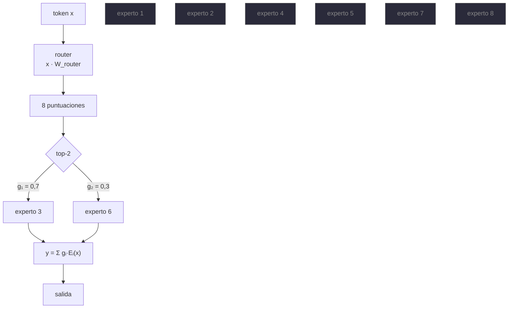

# P21 — Mixtral (mezcla dispersa de expertos)

> Ruta ampliada · Desacopla capacidad de cómputo: muchos parámetros disponibles, pocos activos
> por token.

**Nivel:** L3 · **Motor:** `moe` · **Notebook:** [`P21_moe.ipynb`](../../../notebooks/papers/P21_moe.ipynb)
· **Anexo:** [complejidad y coste](../../annexes/A05_COMPLEJIDAD_Y_COSTE.md)
· **Anexo matemático:** [complejidad, coste y escalado](../../annexes/A05_COMPLEJIDAD_Y_COSTE.md)

## 1. Identificación

| Campo | Valor |
|---|---|
| **Título original** | *Mixtral of Experts* |
| **Autoría** | Albert Q. Jiang y otros (Mistral AI) |
| **Año** | 2024 |
| **Venue** | arXiv:2401.04088 |
| **Fuente primaria** | [arXiv:2401.04088](https://arxiv.org/abs/2401.04088) |
| **Acceso** | Abierto · pesos publicados con licencia Apache 2.0 |
| **Fecha de consulta** | 2026-08-16 |

## 2. Problema anterior

En un Transformer **denso**, cada token que entra activa **todos** los parámetros del modelo.
Duplicar la capacidad duplica el coste de cada token, en entrenamiento y —lo que más duele— en
cada petición de inferencia para siempre.

[Chinchilla](../P19_scaling_laws/README.md) había dicho cuánto conviene gastar; no había dicho
cómo obtener más capacidad **sin** pagarla en cada token. La capa dispersa de expertos existía
desde Shazeer et al. (2017) y en trabajos posteriores, pero arrastraba fama de inestable y de
difícil de reproducir, y los modelos que la usaban no eran abiertos.

## 3. Propuesta

Sustituir la capa feed-forward de cada bloque por **8 expertos** y un **router** que elige
**2 por token**. La salida es la combinación ponderada de esos dos.

El modelo resultante tiene ≈47 000 millones de parámetros totales pero usa ≈13 000 millones por
token. El artículo reporta que iguala o supera a Llama 2 70B y a GPT-3.5 en los benchmarks
evaluados, con la variante ajustada a instrucciones superando también a varios modelos de chat
de la época.

Y —la parte que más impacto tuvo— **publica los pesos bajo Apache 2.0**, lo que convirtió la
arquitectura dispersa en algo que cualquiera podía inspeccionar, servir y ajustar.

## 4. Intuición sin fórmulas

Un hospital con ocho especialistas. Cada paciente no pasa por los ocho: recepción lo deriva a
los dos que corresponden. El hospital tiene la capacidad de ocho; cada consulta cuesta dos.

**Dónde deja de funcionar la analogía:** los ocho especialistas tienen que estar **contratados y
en el edificio** aunque solo trabajen dos. En un MoE hay que cargar todos los pesos en memoria
aunque solo se computen dos expertos. Ahorra cómputo, no memoria.

## 5. Matemática mínima

```text
Capa densa:
    y = FFN(x)                                   coste ∝ TODOS los parámetros

Capa MoE dispersa con top-k:
    scores  = x · W_router                        (uno por experto)
    top     = índices de los k scores mayores
    g(x)    = softmax( scores[top] )              pesos normalizados sobre los k elegidos
    y       = Σ_{i ∈ top}  g_i(x) · E_i(x)        coste ∝ k expertos
```

Con `n_expertos = 8` y `k = 2`, la **fracción activa** es `k/n = 25 %`.

**Balanceo de carga.** El router puede colapsar: unos pocos expertos reciben casi todos los
tokens y el resto no recibe gradiente. Se mitiga con un término auxiliar que penaliza el
desequilibrio, medible con el coeficiente de variación de la carga:

```text
CV = desviación_típica(carga) / media(carga)      →  0 = reparto perfecto
```

<!-- puente:inicio -->
> [!TIP]
> **Puente matemático.** Esta sección da por sabido lo siguiente. Si algo no te suena,
> léelo primero: está explicado una sola vez, en un solo sitio, y sirve para todas las fichas.

| Dónde | Qué necesitas de ahí |
|---|---|
| [**A05 §7** · Dispersión: cuando los parámetros dejan de ser uno](../../annexes/A05_COMPLEJIDAD_Y_COSTE.md#7-dispersión-cuando-los-parámetros-dejan-de-ser-uno) | dispersión: cuándo un parámetro deja de contar como coste por token |
<!-- puente:fin -->

## 6. Arquitectura o flujo



Los seis expertos en gris **no se computan** para este token — pero **sí están cargados en
memoria**, porque el siguiente token puede necesitarlos.

## 7. Qué observar en el paper original

- La **tabla de parámetros totales frente a activos**, y cómo se traduce en coste de inferencia.
- El **análisis de especialización del router**: los autores estudian si los expertos se
  especializan por dominio o por sintaxis. El resultado es menos limpio de lo que la intuición
  sugiere, y merece leerse con cuidado.
- La comparación de **coste efectivo** frente a modelos densos de rendimiento similar.
- La sección de la variante **instruct** y su evaluación.
- Que es un **informe técnico de un modelo publicado**, no un estudio controlado de la
  arquitectura: hay que leerlo con esa expectativa.

## 8. Evidencia y resultados

Evaluación frente a Llama 2 70B y GPT-3.5 en un conjunto amplio de benchmarks: razonamiento,
matemáticas, código y multilingüe.

El artículo reporta que Mixtral iguala o supera a ambos usando **muchos menos parámetros activos
por token**, y que la variante ajustada a instrucciones supera en evaluaciones humanas a varios
modelos de chat contemporáneos.

> Las cifras por benchmark están en las tablas del artículo. Verificarlas allí, y tener presente
> que un informe técnico de un laboratorio sobre su propio modelo pide replicación
> independiente antes de darse por firme.

La miniatura de este eje muestra la mecánica y su fallo característico: con 8 expertos y top-2,
la fracción activa es del 25 %, y el reparto de carga es desigual (CV≈0,13) hasta que se añade
el término de balanceo (CV≈0,04).

## 9. Impacto

- Normalizó la **mezcla de expertos** como arquitectura de producción, no como curiosidad de
  investigación.
- Al publicar los pesos con licencia permisiva, permitió que la comunidad estudiara, sirviera y
  ajustara un modelo disperso real.
- Obligó a la industria a distinguir **parámetros totales**, **parámetros activos** y **memoria
  necesaria** al comparar modelos: antes se citaba un solo número.
- Empujó el trabajo sobre servido de modelos dispersos: enrutado eficiente, expertos repartidos
  entre dispositivos y descarga a memoria del sistema.

## 10. Limitaciones

1. **Ahorra cómputo, no memoria.** Hay que cargar los 47 000 M aunque solo se computen 13 000 M.
   Es el malentendido más caro de esta arquitectura.
2. **Colapso del router**: sin balanceo, unos pocos expertos acaparan y el modelo disperso se
   comporta como uno denso más caro.
3. **Complejidad de servido**: enrutar tokens a expertos repartidos entre GPU añade comunicación
   y hace la latencia menos predecible.
4. **La especialización es difícil de interpretar**: los expertos no se corresponden con
   conceptos limpios.
5. **Informe técnico, no estudio controlado**: no aísla la contribución de la arquitectura frente
   a los datos o al entrenamiento.
6. **Ajuste fino más delicado** que en un modelo denso equivalente.

## 11. Errores comunes

| Error | Corrección |
|---|---|
| «13 000 M activos, luego cabe en una GPU de 13 000 M» | Falso y caro. Hay que cargar **todos** los expertos: dimensiona por los 47 000 M. |
| «Los expertos se especializan por tema» | El análisis del paper no muestra una especialización semántica limpia. |
| «MoE es siempre más barato» | Es más barato en **FLOPs por token**. En memoria y en complejidad de servido, no. |
| «Mixtral inventó la mezcla de expertos» | Shazeer et al. (2017) y trabajos posteriores son anteriores. Mixtral la hizo abierta y de producción. |
| «Más expertos siempre es mejor» | Más expertos con el mismo `k` agravan el desbalanceo y la complejidad de comunicación. |

## 12. Relación con trabajos anteriores

- **Shazeer et al. (2017)** — la capa MoE dispersa con puertas, el antecedente directo.
  [arXiv:1701.06538](https://arxiv.org/abs/1701.06538)
- **[P08 Transformer](../P08_transformer/README.md) (2017)** — la capa feed-forward que se
  sustituye, y donde vive la mayoría de los parámetros de cada bloque.
- **[P19 Leyes de escalado](../P19_scaling_laws/README.md) (2022)** — el marco de coste que esta
  arquitectura reescribe: `C ≈ 6ND` deja de valer con la misma `N`.

## 13. Relación con trabajos posteriores

- **Jamba (2024)** — combina MoE con bloques de [Mamba](../P20_mamba/README.md).
  [arXiv:2403.19887](https://arxiv.org/abs/2403.19887)
- **[P22 DeepSeek-R1](../P22_deepseek_r1/README.md) (2025)** — la línea de modelos abiertos de
  gran escala donde lo disperso ya es la norma.
- **Trabajo de servido de modelos dispersos (2024+)** — enrutado, descarga y paralelismo de
  expertos.

## 14. Notebook asociado

[`P21_moe.ipynb`](../../../notebooks/papers/P21_moe.ipynb)

**Qué implementa:** un router top-2 sobre 8 expertos con 400 tokens, el conteo de parámetros
totales frente a activos, la medición del desbalanceo con CV y el efecto del término de
balanceo. Incluye el cálculo de presupuesto de memoria correcto frente al incorrecto.

**Qué NO implementa:** los expertos no computan nada —solo se cuenta a quién se enruta—, no hay
entrenamiento conjunto, ni capacidad por experto, ni comunicación entre dispositivos, que es
donde está la dificultad real.

```bash
ai-evolution paper-lab P21 --seed 7
```

## 15. Actividades Bloom

| Nivel | Actividad |
|---|---|
| **Recordar** | Escribe la salida de una capa MoE con top-k y define `g_i(x)`. |
| **Explicar** | Explica por qué MoE ahorra cómputo pero no memoria. |
| **Aplicar** | Calcula la fracción activa para (8, k=1), (8, k=2), (64, k=2). |
| **Analizar** | Ejecuta el notebook y explica qué mide el CV y por qué un CV alto es un problema de entrenamiento, no solo de eficiencia. |
| **Evaluar** | Un proveedor anuncia «modelo de 13 000 M» para un MoE 8×7B. ¿Qué le objetas? |
| **Crear** | Diseña un experimento que distinga si los expertos se especializan por dominio o por token frecuente. |

## 16. Autoevaluación

1. ¿Qué se desacopla exactamente en una arquitectura dispersa?
2. ¿Por qué hace falta un término de balanceo de carga?
3. ¿Qué le pasa a un experto que no recibe tokens durante el entrenamiento?
4. ¿Por qué la memoria necesaria es la de **todos** los expertos?
5. ¿Cómo cambia `C ≈ 6ND` en un modelo disperso?
6. ¿Qué hace de este paper un informe técnico y no un estudio controlado?
7. ¿Qué ventaja no técnica tuvo publicar los pesos con Apache 2.0?

## 17. Respuestas esperadas

1. La **capacidad** (parámetros totales, que determinan cuánto puede saber el modelo) del
   **cómputo por token** (parámetros activos, que determinan cuánto cuesta cada token).
2. Porque el router tiende a concentrarse: si un experto empieza ligeramente mejor, recibe más
   tokens, mejora más y acapara. Es un bucle de realimentación positiva.
3. No recibe gradiente y deja de mejorar: su capacidad queda desperdiciada y el modelo disperso
   degenera hacia uno denso más pequeño y más caro de servir.
4. Porque el enrutado depende del token y cualquier token puede activar cualquier experto: no se
   puede saber de antemano cuáles harán falta.
5. Deja de valer con `N` = parámetros totales. El cómputo escala con los parámetros **activos**,
   así que hay que distinguir ambos en la ecuación.
6. Que describe un modelo concreto que se publica, sin ablaciones que aíslen la contribución de
   la arquitectura frente a los datos, el tamaño o la receta de entrenamiento.
7. Permitió replicación, auditoría y servido independientes, y convirtió lo disperso en algo
   estudiable por cualquiera en vez de en una afirmación de un laboratorio.

## 18. Fuentes primarias

- Jiang, A. Q. et al. (2024). *Mixtral of Experts*.
  [arXiv:2401.04088](https://arxiv.org/abs/2401.04088) · consultado 2026-08-16.
- Shazeer, N. et al. (2017). *Outrageously Large Neural Networks: The Sparsely-Gated
  Mixture-of-Experts Layer*.
  [arXiv:1701.06538](https://arxiv.org/abs/1701.06538) · consultado 2026-08-16.

---

[⬅️ Anterior: P20 Mamba](../P20_mamba/README.md) ·
[📇 Índice](../../catalog/PAPERS_INDEX.md) ·
[📝 Evaluación](../../../assessments/papers/P21_moe.md) ·
[🏫 Clase 086 · Selección de modelo](../../../classes/part-06-foundation-models-and-llm-engineering/086-seleccion-de-modelo-costo-latencia-y-privacidad/README.md) ·
[➡️ Siguiente: P22 DeepSeek-R1](../P22_deepseek_r1/README.md)
