# P22 — DeepSeek-R1

> Ruta ampliada · El razonamiento se incentiva con refuerzo puro, sin trazas humanas anotadas.
> Y es el primer LLM de pesos abiertos publicado tras revisión por pares.

**Nivel:** L5 · **Motor:** `rl_reasoning` · **Notebook:** [`P22_deepseek_r1.ipynb`](../../../notebooks/papers/P22_deepseek_r1.ipynb)
· **Anexo:** [cálculo y gradientes](../../annexes/A03_CALCULO_Y_GRADIENTES.md)
· **Anexo matemático:** [probabilidad y verosimilitud](../../annexes/A02_PROBABILIDAD_Y_VEROSIMILITUD.md)

## 1. Identificación

| Campo | Valor |
|---|---|
| **Título original** | *DeepSeek-R1: Incentivizing Reasoning Capability in LLMs via Reinforcement Learning* |
| **Autoría** | DeepSeek-AI |
| **Año** | 2025 |
| **Venue** | arXiv:2501.12948 (enero 2025) · **Nature** 645, 633–638 (18 sept. 2025) |
| **Fuente primaria** | [arXiv:2501.12948](https://arxiv.org/abs/2501.12948) · [DOI Nature](https://doi.org/10.1038/s41586-025-09422-z) |
| **Acceso** | Abierto · pesos publicados |
| **Fecha de consulta** | 2026-08-16 |

## 2. Problema anterior

El razonamiento en cadena de [ReAct](../P13_react/README.md) y del *chain-of-thought* funcionaba,
pero dependía de **demostraciones humanas**: alguien tenía que escribir miles de razonamientos
ejemplares para que el modelo los imitara. Eso es caro, no escala, y —más importante— **acota la
capacidad del modelo a la de quien escribió los ejemplos**.

La alineación por preferencias de [InstructGPT](../P12_instructgpt_rlhf/README.md) y
[DPO](../P15_dpo/README.md) optimizaba lo que a un anotador *le parecía* mejor, una señal
subjetiva y hackeable. Para razonar hay algo mejor disponible: en matemáticas y código, la
respuesta **se puede comprobar**.

## 3. Propuesta

Entrenar con **refuerzo puro sobre una recompensa verificable**: no se premia el estilo del
razonamiento ni se compara con una traza de referencia. Solo se comprueba si la respuesta final
es correcta.

El resultado central es que el comportamiento de razonamiento **emerge** de ese incentivo. El
artículo reporta la aparición de patrones como autorreflexión, verificación y adaptación
dinámica de la estrategia, sin que nadie los demostrara. Y esos patrones, una vez presentes en
un modelo grande, pueden **transferirse a modelos menores**.

> El algoritmo de refuerzo concreto y las variantes del modelo se describen en el cuerpo del
> artículo. El resumen no los nombra: verificarlos allí antes de citarlos.

## 4. Intuición sin fórmulas

Enseñar a resolver problemas de matemáticas sin corregir el procedimiento: solo dices «bien» o
«mal» al resultado. Con suficientes intentos, el alumno descubre por su cuenta que le renta
comprobar antes de entregar — porque comprobar sube su tasa de aciertos, no porque se lo
mandaran.

**Dónde deja de funcionar la analogía:** el alumno entiende *por qué* comprobar ayuda. El
modelo solo ha encontrado una política con más recompensa esperada. Y esa distinción importa
cuando el verificador no existe.

## 5. Matemática mínima

```text
RLHF (P12):    r = modelo de recompensa aprendido de preferencias humanas
               → subjetivo, aproximado, explotable (reward hacking)

Aquí     :     r(x, y) = 1 si respuesta_final(y) es correcta, 0 si no
               → objetivo, exacto, no explotable por estilo

Objetivo:      maximizar  E_{y ~ π(·|x)} [ r(x, y) ]
```

La señal **no dice cómo razonar**. Solo dice si acertaste. Todo lo que aparezca entre el
enunciado y la respuesta es instrumental: sobrevive si aumenta la probabilidad de acertar.

Consecuencia medible y no gratuita: las trayectorias que aciertan más son **más largas**, así
que la política aprendida gasta más tokens por respuesta. El cómputo se desplaza del
entrenamiento a la inferencia.

<!-- puente:inicio -->
> [!TIP]
> **Puente matemático.** Esta sección da por sabido lo siguiente. Si algo no te suena,
> léelo primero: está explicado una sola vez, en un solo sitio, y sirve para todas las fichas.

| Dónde | Qué necesitas de ahí |
|---|---|
| [**A03 §6** · Gradiente de política (REINFORCE)](../../annexes/A03_CALCULO_Y_GRADIENTES.md#6-gradiente-de-política-reinforce) | el gradiente de política, con una recompensa verificable en vez de aprendida |
<!-- puente:fin -->

## 6. Arquitectura o flujo

```mermaid
flowchart TD
    Q["📝 problema con<br/>solución conocida"] --> P["🤖 política π"]
    P --> M["muestrear k trayectorias<br/>de razonamiento"]
    M --> T1["traza 1 → respuesta A"]
    M --> T2["traza 2 → respuesta B"]
    M --> T3["traza k → respuesta C"]
    T1 --> V{"✅ ¿coincide con<br/>la solución?"}
    T2 --> V
    T3 --> V
    V -->|"sí → r = 1"| U["actualizar π<br/>hacia lo que acertó"]
    V -->|"no → r = 0"| U
    U --> P
    U -.-> E["📈 emerge: verificar,<br/>reflexionar, cambiar de estrategia"]
    E -.-> D["📦 destilar a<br/>modelos menores"]

    style V fill:#1a3a2a,stroke:#3fb950
```



Nadie etiqueta el contenido de las trazas. La única flecha con información humana es la que
aporta **la solución conocida** del problema.

## 7. Qué observar en el paper original

- El **algoritmo de refuerzo** empleado y por qué se elige frente a PPO: está en el cuerpo, no
  en el resumen.
- El **diseño de la recompensa**: qué se verifica exactamente y cómo se evita que el modelo
  aprenda a producir el formato correcto sin resolver el problema.
- Las **curvas de longitud de respuesta** a lo largo del entrenamiento: el modelo aprende solo a
  escribir más. Es la evidencia más elocuente de que el comportamiento emerge.
- La sección de **destilación** a modelos pequeños y qué se conserva.
- Las **limitaciones declaradas** y los dominios donde el método no aplica.
- Que existen **dos versiones**: el preprint de enero de 2025 y la versión revisada por pares en
  *Nature* de septiembre de 2025. Cita la que leíste.

## 8. Evidencia y resultados

Evaluación en matemáticas, código y tareas STEM, comparando frente a líneas base entrenadas con
demostraciones humanas.

El artículo reporta que el enfoque de refuerzo puro **supera a las líneas base supervisadas** y
que los patrones de razonamiento emergentes se pueden transferir a modelos menores.

> Las cifras por benchmark, los tamaños de modelo y el detalle de la destilación están en el
> artículo. Verificarlos allí — y preferir la versión de *Nature*, que pasó revisión.

La miniatura de este eje reproduce el mecanismo con tres estrategias: la política se desplaza
hacia la que verifica, la exactitud esperada sube de ~0,61 a ~0,81 **sin una sola traza
anotada**, y el coste en tokens casi se duplica en el mismo movimiento.

## 9. Impacto

- Consolidó el **razonamiento con recompensa verificable** como línea principal de trabajo,
  frente a la imitación de demostraciones.
- Trasladó el foco del **cómputo de entrenamiento** al **cómputo de inferencia**: una variable
  que las leyes de escalado de [P19](../P19_scaling_laws/README.md) no modelan.
- Como primer LLM de pesos abiertos publicado tras revisión por pares, marcó un precedente sobre
  qué nivel de escrutinio es exigible a un modelo, en un campo acostumbrado a informes técnicos
  autopublicados.
- Popularizó la **destilación de capacidad de razonamiento** a modelos pequeños y ejecutables
  localmente.

## 10. Limitaciones

1. **Solo funciona donde hay verificador.** Matemáticas y código lo tienen; redacción,
   diagnóstico o consejo legal, no. Es la limitación de fondo.
2. **Coste de inferencia mayor**: razonar más es gastar más tokens en cada respuesta.
3. **La traza no es una prueba.** Se optimizó la corrección de la respuesta final, no la validez
   de cada paso intermedio. Un razonamiento largo y seguro de sí mismo puede contener pasos
   inválidos.
4. **Riesgo de sobreajuste al verificador**: aprender a satisfacer la comprobación sin resolver
   el problema.
5. **Coste de entrenamiento** fuera del alcance de casi cualquier equipo.
6. **La destilación transfiere comportamiento, no garantías**: el modelo pequeño imita el patrón
   sin la misma base.
7. **Evaluar razonamiento es un problema abierto**: los benchmarks de matemáticas y código se
   saturan y se contaminan rápido.

## 11. Errores comunes

| Error | Corrección |
|---|---|
| «El modelo aprendió a razonar» | Aprendió una política con mayor recompensa esperada, en la que aparecen comportamientos que **parecen** razonamiento y que funcionan. Cuál de las dos descripciones es correcta es una pregunta abierta, no un hecho establecido. |
| «La cadena de pensamiento explica la respuesta» | Es el mismo error que en [ReAct](../P13_react/README.md), ahora con textos más largos y persuasivos. |
| «Esto sustituye a RLHF» | Resuelve el razonamiento en dominios verificables. La alineación con preferencias sigue siendo necesaria para lo demás. |
| «Más tokens de razonamiento = mejor respuesta» | Hay rendimientos decrecientes y un coste lineal. Conviene medir dónde deja de compensar. |
| «Refuerzo puro significa sin datos humanos» | Los problemas y sus soluciones conocidas son datos humanos. Lo que falta son las **trazas de razonamiento**. |

## 12. Relación con trabajos anteriores

- **[P12 InstructGPT](../P12_instructgpt_rlhf/README.md) (2022)** — el refuerzo con
  retroalimentación humana cuya señal subjetiva aquí se sustituye por una verificable.
- **[P13 ReAct](../P13_react/README.md) (2022)** y el *chain-of-thought* — el razonamiento
  explícito que dependía de demostraciones.
- **[P15 DPO](../P15_dpo/README.md) (2023)** — la línea de alineación simplificada.
- **[P19 Leyes de escalado](../P19_scaling_laws/README.md) (2022)** — el marco de cómputo que
  este trabajo desplaza hacia la inferencia.

## 13. Relación con trabajos posteriores

- **Snell et al. (2024)** — escalar cómputo en inferencia puede rendir más que escalar
  parámetros; el marco teórico del mismo fenómeno.
  [arXiv:2408.03314](https://arxiv.org/abs/2408.03314)
- **Lo posterior a 2025-08 no está aquí**: por el criterio de ascenso del eje, vive en
  [`frontier/current-topics.yaml`](../../../frontier/current-topics.yaml) con fecha de revisión.

Preguntas abiertas que conviene seguir:

- cómo definir recompensas verificables fuera de matemáticas y código;
- cómo evaluar la **validez de los pasos**, no solo del resultado;
- cuánto cómputo de inferencia compensa y cómo decidirlo por consulta.

## 14. Notebook asociado

[`P22_deepseek_r1.ipynb`](../../../notebooks/papers/P22_deepseek_r1.ipynb)

**Qué implementa:** una política sobre tres estrategias de resolución entrenada **solo** con la
corrección del resultado, la curva de exactitud frente a coste en tokens, y el análisis de
cuándo el presupuesto de inferencia hace inviable la estrategia que más acierta.

**Qué NO implementa:** ningún modelo de lenguaje, ninguna generación de trazas y ningún
algoritmo de refuerzo del artículo. Las exactitudes de cada estrategia están fijadas por diseño;
en el paper emergen del entrenamiento.

```bash
ai-evolution paper-lab P22 --seed 7
```

## 15. Actividades Bloom

| Nivel | Actividad |
|---|---|
| **Recordar** | Enuncia la diferencia entre la recompensa de RLHF y la de este trabajo. |
| **Explicar** | Explica por qué una recompensa verificable resiste el reward hacking clásico. |
| **Aplicar** | Ejecuta el notebook con tres semillas y compara exactitud y coste finales. |
| **Analizar** | Diseña una tarea donde el modelo pueda satisfacer al verificador **sin** resolver el problema. |
| **Evaluar** | Un sistema mejora 3 puntos gastando 5× tokens. ¿Compensa? Di qué necesitas saber para responder. |
| **Crear** | Propón un verificador para un dominio **no** verificable y argumenta honestamente sus fallos. |

## 16. Autoevaluación

1. ¿Qué señal sustituye a las trazas humanas anotadas?
2. ¿Por qué esa señal es más robusta que un modelo de recompensa aprendido?
3. ¿Qué comportamiento emerge y por qué, si nadie lo demostró?
4. ¿Qué le pasa al coste de inferencia y por qué es inevitable?
5. ¿Por qué el método no se traslada directamente a redactar un informe médico?
6. ¿Qué significa que sea el primer LLM de pesos abiertos revisado por pares?
7. ¿Qué NO demuestra una traza de razonamiento larga y convincente?

## 17. Respuestas esperadas

1. La corrección **verificable** de la respuesta final, comparada con una solución conocida.
2. Porque no se puede engañar con estilo, longitud o confianza aparente: o el resultado coincide
   o no. Un modelo de recompensa aprendido sí puede explotarse por esas vías.
3. Verificación, reflexión y cambio de estrategia. Emergen porque **aumentan la probabilidad de
   acertar**, que es lo único que se premia.
4. Sube, porque las trayectorias que aciertan tienden a ser más largas. Es inevitable: el
   incentivo premia acertar, y razonar más ayuda a acertar más.
5. Porque no existe un verificador barato y objetivo de «buen informe médico». Sin verificador,
   la recompensa vuelve a ser un juicio subjetivo y reaparecen todos los problemas de RLHF.
6. Que un tercero independiente examinó el método y las afirmaciones antes de publicarse, en un
   campo donde la norma es el informe técnico autopublicado por el propio laboratorio.
7. Que los pasos intermedios sean válidos. Se optimizó la respuesta final; el texto intermedio
   es un medio, no un certificado auditado.

## 18. Fuentes primarias

- DeepSeek-AI (2025). *DeepSeek-R1: Incentivizing Reasoning Capability in LLMs via Reinforcement
  Learning*. [arXiv:2501.12948](https://arxiv.org/abs/2501.12948) · consultado 2026-08-16.
- DeepSeek-AI (2025). *DeepSeek-R1 incentivizes reasoning in LLMs through reinforcement
  learning*. **Nature** 645, 633–638.
  [doi.org/10.1038/s41586-025-09422-z](https://doi.org/10.1038/s41586-025-09422-z) · consultado 2026-08-16.
- Snell, C., Lee, J., Xu, K. y Kumar, A. (2024). *Scaling LLM Test-Time Compute Optimally can be
  More Effective than Scaling Model Parameters*.
  [arXiv:2408.03314](https://arxiv.org/abs/2408.03314) · consultado 2026-08-16.

---

[⬅️ Anterior: P21 Mixtral](../P21_moe/README.md) ·
[📇 Índice](../../catalog/PAPERS_INDEX.md) ·
[📝 Evaluación](../../../assessments/papers/P22_deepseek_r1.md) ·
[🏫 Clase 078 · RLHF, RLAIF y DPO](../../../classes/part-06-foundation-models-and-llm-engineering/078-rlhf-rlaif-y-dpo/README.md) ·
[🔭 Frontera del programa](../../../frontier/current-topics.yaml) ·
[🗺️ Fin de la ruta ampliada](../../ROADMAP.md)
