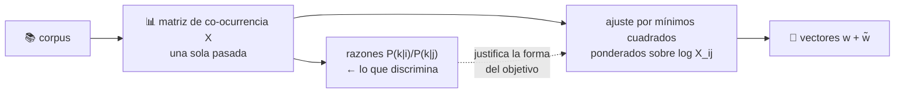

# P23 — GloVe

> Ruta de representación · Unifica las dos familias de embeddings: aprovechar las estadísticas
> globales del corpus **y** conseguir la estructura lineal de los métodos predictivos.

**Nivel:** L2 · **Motor:** `glove` · **Notebook:** [`P23_glove.ipynb`](../../../notebooks/papers/P23_glove.ipynb)
· **Anexo:** [álgebra y geometría](../../annexes/A01_ALGEBRA_Y_GEOMETRIA.md)

## 1. Identificación

| Campo | Valor |
|---|---|
| **Título original** | *GloVe: Global Vectors for Word Representation* |
| **Autoría** | Jeffrey Pennington, Richard Socher, Christopher D. Manning |
| **Año** | 2014 |
| **Venue** | EMNLP 2014 · ACL Anthology D14-1162 |
| **Fuente primaria** | [aclanthology.org/D14-1162](https://aclanthology.org/D14-1162/) · [DOI](https://doi.org/10.3115/v1/D14-1162) |
| **Acceso** | Abierto |
| **Fecha de consulta** | 2026-08-16 |

## 2. Problema anterior

Había dos familias de métodos y cada una renunciaba a algo. Los métodos de **conteo** (LSA y
derivados) construían la matriz de co-ocurrencia de todo el corpus —estadística global,
entrenamiento rápido— pero producían espacios con peor estructura para analogías. Los métodos
**predictivos** ([Word2Vec](../P05_word2vec/README.md)) daban esa estructura, pero aprendían de
ventanas locales, sin usar directamente las estadísticas agregadas del corpus.

La pregunta abierta: ¿qué propiedad de las estadísticas de co-ocurrencia es la que produce la
estructura lineal, y se puede modelar directamente?

## 3. Propuesta

La respuesta de los autores: lo informativo **no es la co-ocurrencia, sino su razón**.

`P(sólido | hielo) / P(sólido | vapor)` es muy grande; para «gas» es muy pequeña; para «agua»,
que acompaña a ambos, es ≈1. Esa razón discrimina lo que la co-ocurrencia bruta no.

Como las razones se convierten en diferencias al tomar logaritmos, proponen ajustar por mínimos
cuadrados ponderados el producto de vectores al **logaritmo** de la co-ocurrencia. La función de
peso evita que los pares muy frecuentes dominen y que los muy raros aporten ruido.

## 4. Intuición sin fórmulas

Word2Vec mira por una ventanita y aprende de lo que pasa cerca, millones de veces. GloVe cuenta
primero todo el corpus en una tabla y luego busca vectores que expliquen esa tabla. Mismo
destino, camino opuesto.

**Dónde deja de funcionar la analogía:** la tabla de conteos no es neutral. Cómo se define la
ventana, si se pondera por distancia y qué se hace con las palabras muy frecuentes son
decisiones que ya codifican una teoría del significado.

## 5. Matemática mínima

```text
J = Σ_ij  f(X_ij) · ( w_i·w̃_j + b_i + b̃_j − log X_ij )²

    X_ij  = veces que la palabra j aparece en el contexto de i
    w, w̃  = vectores de palabra y de contexto (dos matrices, como en skip-gram)
    b, b̃  = sesgos que absorben la frecuencia de cada palabra

    f(x) = (x/x_max)^α  si x < x_max,  si no 1        con α = 3/4
```

Dos decisiones que conviene entender:

- **El logaritmo** convierte razones en diferencias, que es lo que la geometría vectorial sabe
  representar como desplazamientos.
- **La función de peso** es asimétrica a propósito: atenúa los pares raros (ruido estadístico) y
  satura en los muy frecuentes (que si no, dominarían la suma).

<!-- puente:inicio -->
> [!TIP]
> **Puente matemático.** Esta sección da por sabido lo siguiente. Si algo no te suena,
> léelo primero: está explicado una sola vez, en un solo sitio, y sirve para todas las fichas.

| Dónde | Qué necesitas de ahí |
|---|---|
| [**A01 §4** · Matrices como transformaciones](../../annexes/A01_ALGEBRA_Y_GEOMETRIA.md#4-matrices-como-transformaciones) | factorizar una matriz de coocurrencias es buscar una transformación de rango bajo |
| [**A01 §1** · Producto escalar](../../annexes/A01_ALGEBRA_Y_GEOMETRIA.md#1-producto-escalar) | el producto escalar, que es lo que la factorización obliga a igualar |
<!-- puente:fin -->

## 6. Arquitectura o flujo



Frente a [Word2Vec](../P05_word2vec/README.md), que recorre el corpus muchas veces por parejas,
aquí el corpus se recorre **una vez** para construir `X` y después se entrena sobre los pares no
nulos de esa matriz.

## 7. Qué observar en el paper original

- La **tabla de razones de co-ocurrencia** con hielo y vapor. Es el argumento entero del paper
  condensado en una tabla; si se entiende esa, se entiende todo lo demás.
- La **derivación** que va desde «queremos modelar razones» hasta la forma funcional concreta.
- La **función de peso** y por qué `α = 3/4`.
- La comparación de **tiempo de entrenamiento** frente a los métodos predictivos: parte del
  argumento era práctico, no solo de calidad.

## 8. Evidencia y resultados

Evaluación en analogías de palabras, similitud y reconocimiento de entidades nombradas, frente a
Word2Vec y a métodos de factorización, con distintos tamaños de corpus y de vector.

> Las cifras por tarea, dimensión y tamaño de corpus están en las tablas del artículo. Verificarlas
> allí: las comparaciones de embeddings de esta época son muy sensibles al preprocesado y a los
> hiperparámetros, y ese es justamente el motivo de la sección 11.

La miniatura de este eje muestra el mecanismo: las razones separan limpiamente (≈25 para lo
propio del hielo, ≈0,05 para lo del vapor, ≈1 para lo compartido) y la pérdida baja mientras los
vectores aprenden a reproducir el logaritmo de los conteos.

## 9. Impacto

- Los vectores GloVe preentrenados fueron durante años el punto de partida por defecto de
  cualquier sistema de PLN, junto con los de Word2Vec.
- Puso sobre la mesa una pregunta teórica —qué se está modelando exactamente— en un área que
  avanzaba de forma muy empírica.
- Consolidó la práctica de **publicar vectores preentrenados** como artefacto reutilizable, no
  solo el método.

## 10. Limitaciones

1. **Un vector por palabra**: la polisemia sigue colapsada. Lo resolverá [ELMo](../P24_elmo/README.md).
2. **Memoria**: la matriz de co-ocurrencia de un corpus grande es enorme, aunque sea dispersa.
3. **Vocabulario cerrado**: sin vector para palabras no vistas.
4. **Sin composición**: no hay forma principiada de obtener el vector de una frase.
5. **Hereda los sesgos** del corpus, igual que cualquier método distribucional.
6. **La ventaja empírica sobre Word2Vec resultó frágil**: depende mucho de los hiperparámetros de
   ambos, como mostró trabajo posterior.

## 11. Errores comunes

| Error | Corrección |
|---|---|
| «GloVe es contador y word2vec predictivo, son cosas distintas» | Levy y Goldberg (2015) mostraron que word2vec con muestreo negativo factoriza implícitamente una matriz relacionada. La dicotomía es menos profunda de lo que parecía. |
| «GloVe es mejor que word2vec» | Depende del corpus, la tarea y los hiperparámetros. Las comparaciones de la época estaban mal controladas. |
| «Modela la co-ocurrencia» | Modela el **logaritmo** de la co-ocurrencia, y lo hace porque el objeto de interés son las **razones**. |
| «La función de peso es un detalle» | Sin ella, los pares funcionales frecuentes dominan la pérdida y el espacio se degrada. |

## 12. Relación con trabajos anteriores

- **[P05 Word2Vec](../P05_word2vec/README.md) (2013)** — la familia predictiva que sirve de contraste.
- **LSA y factorización de matrices de co-ocurrencia (1990)** — la familia de conteo.
- **Harris (1954), Firth (1957)** — la hipótesis distribucional que ambas comparten.

## 13. Relación con trabajos posteriores

- **Levy y Goldberg (2015)** — el puente teórico entre ambas familias.
  [ACL Anthology](https://aclanthology.org/Q15-1016/)
- **FastText (2016)** — subpalabras, resuelve el vocabulario cerrado.
- **[P24 ELMo](../P24_elmo/README.md) (2018)** — el paso a representaciones contextuales.
- **[P18 CLIP](../P18_clip/README.md) (2021)** — la misma idea de espacio compartido, con imágenes.

## 14. Notebook asociado

[`P23_glove.ipynb`](../../../notebooks/papers/P23_glove.ipynb)

**Qué implementa:** el ajuste por mínimos cuadrados ponderados sobre una matriz de co-ocurrencia
de juguete con la estructura del ejemplo del paper, y la tabla de razones que justifica el objetivo.

**Qué NO implementa:** ningún corpus real. Con seis palabras no emerge semántica: se ve la
mecánica del ajuste, no el resultado.

```bash
ai-evolution paper-lab P23 --seed 7
```

## 15. Actividades Bloom

| Nivel | Actividad |
|---|---|
| **Recordar** | Escribe la función objetivo y di qué representa cada término. |
| **Explicar** | Explica por qué se modela el logaritmo y no la co-ocurrencia directa. |
| **Aplicar** | Calcula las tres razones del ejemplo hielo/vapor a partir de la tabla del notebook. |
| **Analizar** | ¿Qué pasa con la pérdida si `f(x) = 1` para todo x? Razónalo y compruébalo. |
| **Evaluar** | Lee el resumen de Levy y Goldberg (2015) y decide si la distinción contador/predictivo sigue siendo útil para enseñar. |
| **Crear** | Diseña una función de peso alternativa y argumenta qué propiedad conserva y cuál rompe. |

## 16. Autoevaluación

1. ¿Por qué la razón de co-ocurrencias discrimina mejor que la co-ocurrencia?
2. ¿Qué papel juegan los sesgos `b_i` y `b̃_j`?
3. ¿Por qué hay dos matrices de vectores?
4. ¿Qué problema resuelve la función de peso, por sus dos extremos?
5. ¿En qué se parece realmente a Word2Vec, según trabajo posterior?
6. ¿Qué limitación comparte con Word2Vec y no puede resolver?
7. ¿Qué ventaja práctica, no de calidad, defendía el paper?

## 17. Respuestas esperadas

1. Porque cancela la frecuencia general de la palabra de contexto. «Agua» es frecuente con todo;
   la razón entre dos palabras revela qué es específico de cada una.
2. Absorben la frecuencia global de cada palabra, para que el producto de vectores capture la
   parte informativa y no el simple hecho de que una palabra sea común.
3. Porque cada palabra juega dos papeles —centro y contexto— y necesita una representación para
   cada uno. Suelen sumarse o promediarse al final.
4. Por arriba, evita que los pares muy frecuentes dominen la suma; por abajo, atenúa los pares
   raros, cuyos conteos son ruido estadístico.
5. Levy y Goldberg mostraron que skip-gram con muestreo negativo factoriza implícitamente una
   matriz de información mutua puntual desplazada: ambos acaban factorizando estadísticas.
6. Un vector por palabra: la polisemia. Lo resuelven los embeddings contextuales.
7. El coste de entrenamiento: una sola pasada para construir la matriz y después entrenar solo
   sobre entradas no nulas.

## 18. Fuentes primarias

- Pennington, J., Socher, R. y Manning, C. D. (2014). *GloVe: Global Vectors for Word
  Representation*. **EMNLP 2014**.
  [ACL Anthology D14-1162](https://aclanthology.org/D14-1162/) ·
  [DOI](https://doi.org/10.3115/v1/D14-1162) · consultado 2026-08-16.
- Levy, O. y Goldberg, Y. (2015). *Improving Distributional Similarity with Lessons Learned from
  Word Embeddings*. **TACL**.
  [ACL Anthology Q15-1016](https://aclanthology.org/Q15-1016/) · consultado 2026-08-16.

---

[📇 Índice](../../catalog/PAPERS_INDEX.md) ·
[📝 Evaluación](../../../assessments/papers/P23_glove.md) ·
[🏫 Clase 066 · Embeddings semánticos](../../../classes/part-05-language-vision-audio-and-multimodal-ai/066-embeddings-semanticos-y-similitud/README.md) ·
[➡️ Siguiente: P24 ELMo](../P24_elmo/README.md)
