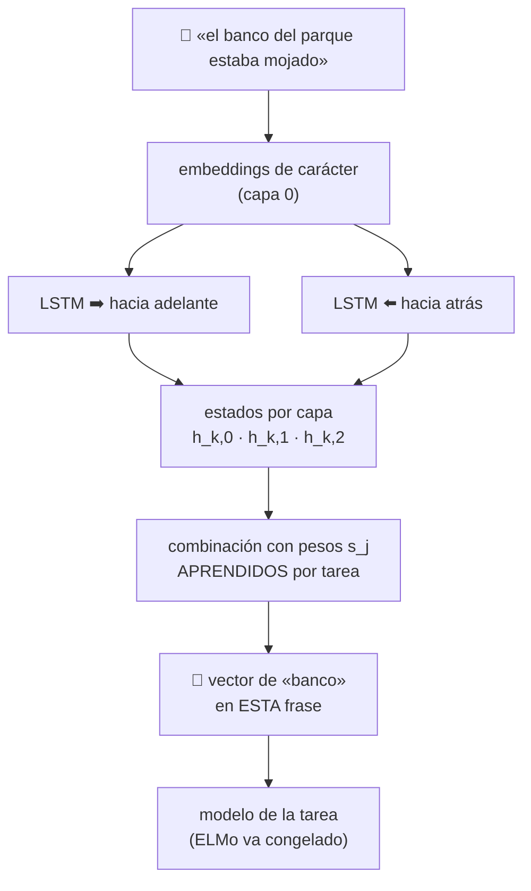

# P24 — ELMo

> Ruta de representación · Un vector por **aparición** y no por palabra: la polisemia deja de
> colapsar en un único punto del espacio.

**Nivel:** L3 · **Motor:** `elmo` · **Notebook:** [`P24_elmo.ipynb`](../../../notebooks/papers/P24_elmo.ipynb)
· **Anexo:** [álgebra y geometría](../../annexes/A01_ALGEBRA_Y_GEOMETRIA.md)

## 1. Identificación

| Campo | Valor |
|---|---|
| **Título original** | *Deep Contextualized Word Representations* |
| **Autoría** | Matthew E. Peters, Mark Neumann, Mohit Iyyer, Matt Gardner, Christopher Clark, Kenton Lee, Luke Zettlemoyer |
| **Año** | 2018 |
| **Venue** | NAACL-HLT 2018 · ACL Anthology N18-1202 |
| **Fuente primaria** | [aclanthology.org/N18-1202](https://aclanthology.org/N18-1202/) |
| **Acceso** | Abierto |
| **Fecha de consulta** | 2026-08-16 |

## 2. Problema anterior

[Word2Vec](../P05_word2vec/README.md) y [GloVe](../P23_glove/README.md) dan **un vector por
palabra**. Eso significa que «banco del parque», «banco central» y «banco del río» comparten
exactamente la misma representación: el sentido se pierde antes de que el modelo de la tarea
empiece a trabajar.

Existían intentos de inducir sentidos y agruparlos, pero exigían decidir de antemano cuántos
sentidos tiene cada palabra —una decisión artificial— y no aprovechaban la frase concreta.

## 3. Propuesta

Calcular la representación **en función de la frase entera**, usando los estados internos de un
modelo de lenguaje bidireccional profundo entrenado sobre un corpus grande.

Dos decisiones importantes:

1. Las representaciones son **profundas**: no se usa solo la última capa, sino una combinación
   de todas.
2. Los pesos de esa combinación se **aprenden por tarea**, porque distintas capas capturan cosas
   distintas —las bajas, más sintaxis; las altas, más semántica—.

Se usaban como **características congeladas**: se calculaban los vectores y se alimentaban a un
modelo específico de la tarea.

## 4. Intuición sin fórmulas

Un diccionario da una entrada por palabra. Un lector da un significado por aparición. ELMo deja
de ser diccionario y pasa a leer: el vector de «banco» se calcula tras haber leído la frase.

**Dónde deja de funcionar la analogía:** un lector entiende; ELMo solo condiciona su
representación en el contexto. Que dos apariciones queden lejos no implica que el modelo sepa
que son sentidos distintos, solo que las representa distinto.

## 5. Matemática mínima

```text
Modelo de lenguaje bidireccional: se entrenan dos direcciones y se suman sus verosimilitudes

    Σ_k [ log p(t_k | t_1…t_{k−1}) + log p(t_k | t_{k+1}…t_N) ]

Representación para la tarea:

    ELMo_k = γ · Σ_{j=0}^{L}  s_j · h_{k,j}

    h_{k,j} = estado de la capa j en la posición k
    s_j     = pesos por capa, normalizados con softmax y APRENDIDOS por tarea
    γ       = escala global, también aprendida
```

Lo esencial: `ELMo_k` depende de `k` **y de toda la frase**. Un embedding estático no tiene el
subíndice `k`.

<!-- puente:inicio -->
> [!TIP]
> **Puente matemático.** Esta sección da por sabido lo siguiente. Si algo no te suena,
> léelo primero: está explicado una sola vez, en un solo sitio, y sirve para todas las fichas.

| Dónde | Qué necesitas de ahí |
|---|---|
| [**A01 §2** · Norma y coseno](../../annexes/A01_ALGEBRA_Y_GEOMETRIA.md#2-norma-y-coseno) | el coseno, que es como se comprueba que dos apariciones de la misma palabra se separan |
<!-- puente:fin -->

## 6. Arquitectura o flujo



## 7. Qué observar en el paper original

- El **análisis por capas**: la evidencia de que las capas bajas sirven mejor para tareas
  sintácticas y las altas para semánticas. Justifica que los pesos se aprendan por tarea.
- La comparación con usar **solo la capa superior**, que es lo que la intuición sugeriría.
- La sección de **desambiguación de sentidos**: es la comprobación directa de que la polisemia
  deja de colapsar.
- Que ELMo se **añade** a modelos existentes: el paper mejora seis tareas sin rediseñarlas.

## 8. Evidencia y resultados

Seis tareas de PLN —respuesta a preguntas, inferencia textual, análisis de sentimiento,
etiquetado de roles semánticos, resolución de correferencia y reconocimiento de entidades— con
mejoras al añadir ELMo a la arquitectura ya existente de cada una.

> Las cifras por tarea y las ablaciones por capa están en las tablas del artículo. Verificarlas
> allí antes de citarlas.

La miniatura de este eje muestra el fenómeno central: con embedding estático las tres
apariciones de «banco» tienen coseno 1,0 entre sí; con representación contextual bajan de forma
desigual, y los sentidos más distintos quedan más separados.

## 9. Impacto

- Fue el paper que **normalizó las representaciones contextuales** en PLN, meses antes de BERT.
- Su análisis por capas abrió la línea de trabajo sobre **qué codifica cada capa** de un modelo
  de lenguaje, que sigue viva en interpretabilidad.
- Marcó la última etapa del paradigma «características congeladas»: [BERT](../P09_bert/README.md),
  poco después, ajustaría el modelo entero.

## 10. Limitaciones

1. **Bidireccionalidad superficial**: son dos modelos unidireccionales concatenados, no un modelo
   que atienda a ambos lados a la vez en cada capa. Ese es exactamente el argumento de BERT.
2. **Características congeladas**: no se ajusta el modelo base, así que se aprovecha menos.
3. **Basado en LSTM**: secuencial, no paraleliza sobre la longitud.
4. **Coste**: hay que ejecutar el modelo de lenguaje completo para obtener las representaciones.
5. **Los pesos por capa se aprenden por tarea**, lo que añade un ajuste extra.
6. **Sigue heredando** los sesgos del corpus de preentrenamiento.

## 11. Errores comunes

| Error | Corrección |
|---|---|
| «ELMo es bidireccional como BERT» | Es una concatenación de dos direcciones independientes. BERT atiende a ambos lados **en cada capa**, y para eso necesita enmascarar. |
| «Basta con la última capa» | El paper muestra que distintas tareas prefieren distintas capas; por eso los pesos se aprenden. |
| «ELMo es un modelo de lenguaje» | Se entrena como tal, pero se **usa** como extractor de representaciones congeladas. |
| «Resolvió la polisemia» | Hace que las representaciones dependan del contexto. Que eso equivalga a distinguir sentidos es otra afirmación, y el paper la evalúa por separado. |

## 12. Relación con trabajos anteriores

- **[P05 Word2Vec](../P05_word2vec/README.md)** y **[P23 GloVe](../P23_glove/README.md)** — los
  embeddings estáticos cuya limitación se ataca.
- **[P03 LSTM](../P03_lstm/README.md) (1997)** — la celda con la que se construye.
- **Howard y Ruder (2018), ULMFiT** — transferencia en PLN, contemporáneo.
  [arXiv:1801.06146](https://arxiv.org/abs/1801.06146)

## 13. Relación con trabajos posteriores

- **[P09 BERT](../P09_bert/README.md) (2018)** — bidireccionalidad profunda real y ajuste fino
  del modelo completo; el paper con el que ELMo se compara explícitamente.
- **[P25 T5](../P25_t5/README.md) (2019)** — la unificación del formato de tarea.
- **Interpretabilidad por capas (2019+)** — la línea que abre su análisis.

## 14. Notebook asociado

[`P24_elmo.ipynb`](../../../notebooks/papers/P24_elmo.ipynb)

**Qué implementa:** el vector de «banco» en tres frases con sentidos distintos, de forma
estática y contextual, y la comparación de similitudes.

**Qué NO implementa:** ni LSTM ni modelo de lenguaje entrenado. La mezcla con decaimiento simula
los estados internos, y los pesos por capa están fijados a mano en vez de aprendidos.

```bash
ai-evolution paper-lab P24 --seed 7
```

## 15. Actividades Bloom

| Nivel | Actividad |
|---|---|
| **Recordar** | Escribe la fórmula de `ELMo_k` y di qué es `s_j`. |
| **Explicar** | Explica por qué dos LSTM concatenadas no son lo mismo que atención bidireccional. |
| **Aplicar** | Añade una cuarta frase con «banco» como asiento y mira con cuál se agrupa. |
| **Analizar** | ¿Qué pesos por capa esperarías para etiquetado gramatical frente a respuesta a preguntas? |
| **Evaluar** | ¿Es «resolvió la polisemia» una afirmación defendible? Argumenta con lo que el paper mide. |
| **Crear** | Diseña una prueba que distinga «representación distinta» de «sentido distinguido». |

## 16. Autoevaluación

1. ¿Qué significa que la representación sea contextual, en términos de la fórmula?
2. ¿Por qué se combinan varias capas en vez de usar la última?
3. ¿En qué sentido la bidireccionalidad de ELMo es superficial?
4. ¿Qué quiere decir que se use como «características congeladas»?
5. ¿Qué ventaja tiene eso, y qué se pierde?
6. ¿Qué problema de [P23](../P23_glove/README.md) resuelve y cuál no?
7. ¿Qué hizo BERT distinto pocos meses después?

## 17. Respuestas esperadas

1. Que lleva subíndice `k` y depende de los estados del modelo sobre **esa** frase: la misma
   palabra en otra frase da otro vector.
2. Porque las capas codifican información distinta y cada tarea necesita una mezcla distinta; el
   paper lo demuestra con ablaciones.
3. Porque son dos modelos unidireccionales entrenados por separado y concatenados. En ninguna
   capa hay una representación que haya atendido a ambos lados simultáneamente.
4. Que el modelo base no se actualiza: se calculan los vectores y se pasan a un modelo específico
   de la tarea, que es el único que se entrena.
5. Ventaja: barato, reutilizable, no requiere reentrenar el modelo grande. Pérdida: se aprovecha
   mucho menos el conocimiento del preentrenamiento.
6. Resuelve el vector único por palabra. No resuelve el vocabulario cerrado, la composición de
   frases ni el sesgo del corpus.
7. Bidireccionalidad profunda mediante enmascarado, y ajuste fino del modelo entero en vez de
   características congeladas.

## 18. Fuentes primarias

- Peters, M. E. et al. (2018). *Deep Contextualized Word Representations*. **NAACL-HLT 2018**.
  [ACL Anthology N18-1202](https://aclanthology.org/N18-1202/) · consultado 2026-08-16.
- Howard, J. y Ruder, S. (2018). *Universal Language Model Fine-tuning for Text Classification*.
  [arXiv:1801.06146](https://arxiv.org/abs/1801.06146) · consultado 2026-08-16.

---

[⬅️ Anterior: P23 GloVe](../P23_glove/README.md) ·
[📇 Índice](../../catalog/PAPERS_INDEX.md) ·
[📝 Evaluación](../../../assessments/papers/P24_elmo.md) ·
[🏫 Clase 066 · Embeddings semánticos](../../../classes/part-05-language-vision-audio-and-multimodal-ai/066-embeddings-semanticos-y-similitud/README.md) ·
[➡️ Siguiente: P25 T5](../P25_t5/README.md)
