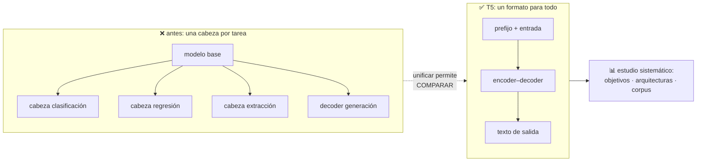

# P25 — T5

> Ruta de representación · Todo problema de texto se reescribe como texto → texto: un solo
> modelo, una sola pérdida, cero cabezas específicas por tarea.

**Nivel:** L3 · **Motor:** `t5` · **Notebook:** [`P25_t5.ipynb`](../../../notebooks/papers/P25_t5.ipynb)
· **Anexo:** [probabilidad y verosimilitud](../../annexes/A02_PROBABILIDAD_Y_VEROSIMILITUD.md)

## 1. Identificación

| Campo | Valor |
|---|---|
| **Título original** | *Exploring the Limits of Transfer Learning with a Unified Text-to-Text Transformer* |
| **Autoría** | Colin Raffel, Noam Shazeer, Adam Roberts, Katherine Lee, Sharan Narang, Michael Matena, Yanqi Zhou, Wei Li, Peter J. Liu |
| **Año** | 2019 (arXiv) · 2020 (JMLR) |
| **Venue** | arXiv:1910.10683 · JMLR 21(140) |
| **Fuente primaria** | [arXiv:1910.10683](https://arxiv.org/abs/1910.10683) · [JMLR](https://jmlr.org/papers/v21/20-074.html) |
| **Acceso** | Abierto |
| **Fecha de consulta** | 2026-08-16 |

## 2. Problema anterior

Tras [BERT](../P09_bert/README.md), el campo se llenó de variantes: distintos objetivos de
preentrenamiento, arquitecturas, corpus, tamaños y recetas de ajuste. Y **no se podían comparar**,
porque cada trabajo cambiaba varias cosas a la vez y cada tarea usaba su propia cabeza, su propio
formato y su propia métrica.

Además, ese zoo de cabezas —clasificación, regresión, extracción de índices, generación— era una
fricción de ingeniería constante: nada se reutilizaba entre tareas.

## 3. Propuesta

Dos contribuciones que se apoyan la una en la otra.

**El marco**: reescribir toda tarea de texto como «texto de entrada → texto de salida», con un
prefijo que indica cuál es. Clasificar es emitir la palabra `negative`; la regresión, emitir
`4.2`; extraer, emitir el fragmento. Una sola pérdida: verosimilitud del texto de salida.

**El estudio**: una vez todo es comparable, hacer el barrido sistemático que faltaba —objetivos
de preentrenamiento, arquitecturas, corpus, estrategias de ajuste, tamaños— midiendo cada decisión
por separado. Y publicar el corpus resultante, **C4** (*Colossal Clean Crawled Corpus*).

## 4. Intuición sin fórmulas

Cinco máquinas distintas, cada una con su enchufe. T5 propone un enchufe único: si todo entra y
sale como texto, sobra el adaptador.

**Dónde deja de funcionar la analogía:** el enchufe único tiene un coste real. Emitir un número
como texto pierde precisión, y emitir una etiqueta como palabra permite que el modelo genere algo
que no es ninguna de las etiquetas válidas.

## 5. Matemática mínima

```text
Todas las tareas:      maximizar  log p_θ( texto_salida | texto_entrada )

Lo único que cambia:   el PREFIJO del texto de entrada

    "translate English to German: That is good."   →  "Das ist gut."
    "cola sentence: The movie was terrible."       →  "negative"
    "stsb sentence1: … sentence2: …"               →  "4.2"
    "summarize: …"                                 →  "…"
```

Objetivo de preentrenamiento elegido tras el barrido: **corrupción de tramos** — se enmascaran
secuencias contiguas de tokens y el modelo debe emitirlas, con centinelas que marcan cada hueco.
No es el enmascarado token a token de BERT, y el paper explica por qué gana.

<!-- puente:inicio -->
> [!TIP]
> **Puente matemático.** Esta sección da por sabido lo siguiente. Si algo no te suena,
> léelo primero: está explicado una sola vez, en un solo sitio, y sirve para todas las fichas.

| Dónde | Qué necesitas de ahí |
|---|---|
| [**A02 §3** · Verosimilitud y entropía cruzada](../../annexes/A02_PROBABILIDAD_Y_VEROSIMILITUD.md#3-verosimilitud-y-entropía-cruzada) | una sola pérdida —entropía cruzada sobre texto— para todas las tareas |
<!-- puente:fin -->

## 6. Arquitectura o flujo



## 7. Qué observar en el paper original

- Es un artículo **largo** y su valor está en la sección de experimentos: cada subsección aísla
  una decisión de diseño. Leerlo como catálogo de resultados es más útil que leerlo en orden.
- La comparación de **objetivos de preentrenamiento**, que justifica la corrupción de tramos.
- La comparación de **arquitecturas** (encoder-decoder frente a solo decoder frente a solo
  encoder) a igualdad de parámetros y de cómputo.
- El apartado de **C4**: cómo se filtró Common Crawl y qué se descartó. Ese filtrado es una
  decisión editorial con consecuencias.
- La sección de **limitaciones y trabajo futuro**, inusualmente franca sobre lo que no midieron.

## 8. Evidencia y resultados

Resultados del estado del arte de la época en múltiples benchmarks (GLUE, SuperGLUE, SQuAD,
resumen y traducción), obtenidos con el mismo modelo y el mismo procedimiento.

> Las cifras por benchmark y por tamaño de modelo están en las tablas del artículo, junto con los
> resultados de cada ablación. Verificarlas allí: la mayoría del valor del paper está en esas
> tablas comparativas, no en la cifra final.

La miniatura de este eje muestra el marco: cinco tareas que exigían cinco tipos de cabeza se
reducen a un único formato, con cero cabezas específicas y un solo objetivo.

## 9. Impacto

- Estableció **texto → texto** como interfaz por defecto, algo que hoy se da por evidente cada
  vez que se le pide algo a un modelo con una instrucción en lenguaje natural.
- **C4** se convirtió en corpus de referencia y en objeto de estudio por derecho propio.
- Su metodología —barrido sistemático con todo lo demás fijo— es el estándar de cómo se debe
  comparar en este campo, y sigue siendo raro verlo.
- La familia encoder-decoder que consolida sigue siendo la elección natural para traducir y
  resumir.

## 10. Limitaciones

1. **Precisión numérica**: emitir números como texto obliga a discretizar y pierde resolución.
2. **Salidas fuera del conjunto válido**: nada impide generar una etiqueta que no existe.
3. **Coste del estudio**: el barrido sistemático solo está al alcance de quien tiene mucho cómputo.
4. **C4 hereda los sesgos de Common Crawl**, y su filtrado introduce otros propios.
5. **Los prefijos son arbitrarios** y el rendimiento depende algo de cómo se redacten.
6. **No cubre** el aprendizaje en contexto de [GPT-3](../P10_gpt3/README.md), publicado meses
   después: T5 sigue asumiendo ajuste fino por tarea.

## 11. Errores comunes

| Error | Corrección |
|---|---|
| «T5 es un modelo» | Es un **marco** más un estudio más un corpus. El modelo es el vehículo. |
| «Texto a texto es solo un formato» | Es lo que hace comparables las tareas, y por tanto lo que permite el estudio. Formato y método están acoplados. |
| «Usa el enmascarado de BERT» | Usa **corrupción de tramos**, y el paper justifica la diferencia con una ablación. |
| «Encoder-decoder es peor que solo decoder» | El paper mide ambos a igualdad de cómputo. La conclusión es matizada y depende de la tarea. |
| «La regresión como texto es un truco feo» | Es una decisión con coste explícito, medida y documentada en el propio artículo. |

## 12. Relación con trabajos anteriores

- **[P08 Transformer](../P08_transformer/README.md) (2017)** — la arquitectura encoder-decoder.
- **[P09 BERT](../P09_bert/README.md) (2018)** — el paradigma preentrenar-y-ajustar que sistematiza.
- **[P24 ELMo](../P24_elmo/README.md) (2018)** — la etapa anterior de transferencia en PLN.
- **Lewis et al. (2019), BART** — el otro encoder-decoder preentrenado, contemporáneo.
  [arXiv:1910.13461](https://arxiv.org/abs/1910.13461)

## 13. Relación con trabajos posteriores

- **[P10 GPT-3](../P10_gpt3/README.md) (2020)** — cuestiona el ajuste fino por tarea que T5 asume.
- **[P11 RAG](../P11_rag/README.md) (2020)** — usa un generador seq2seq de esta familia.
- **Modelos ajustados a instrucciones (2021+)** — llevan el prefijo a su conclusión: la tarea se
  describe en lenguaje natural.
- **Estudios sobre C4** — auditorías del corpus y de su filtrado.

## 14. Notebook asociado

[`P25_t5.ipynb`](../../../notebooks/papers/P25_t5.ipynb)

**Qué implementa:** cinco tareas reescritas al formato texto → texto, el recuento de cabezas
específicas antes y después, y el coste de precisión al emitir números como texto.

**Qué NO implementa:** ningún modelo. Aquí se ve el **contrato de entrada y salida**, que es la
idea; el estudio sistemático y C4 quedan por completo fuera de alcance local.

```bash
ai-evolution paper-lab P25 --seed 7
```

## 15. Actividades Bloom

| Nivel | Actividad |
|---|---|
| **Recordar** | Escribe el objetivo único y di qué distingue una tarea de otra. |
| **Explicar** | Explica por qué unificar el formato es condición para poder comparar decisiones de diseño. |
| **Aplicar** | Reescribe una tarea propia al formato texto → texto con su prefijo. |
| **Analizar** | Calcula cuánta precisión se pierde al discretizar una escala continua en pasos de 0,2. |
| **Evaluar** | ¿Qué tarea NO conviene reescribir como texto → texto? Justifica con el coste concreto. |
| **Crear** | Diseña una ablación propia sobre el objetivo de preentrenamiento y di qué mediría. |

## 16. Autoevaluación

1. ¿Cuál es el objetivo de entrenamiento, exactamente, y para cuántas tareas vale?
2. ¿Qué distingue una tarea de otra en este marco?
3. ¿Por qué el marco es condición para el estudio, y no solo una comodidad?
4. ¿Qué objetivo de preentrenamiento elige el paper y en qué se diferencia del de BERT?
5. ¿Qué se pierde al emitir números como texto y cómo lo mitiga el paper?
6. ¿Qué es C4 y por qué su filtrado es una decisión editorial?
7. ¿Qué supuesto de T5 cuestiona GPT-3 pocos meses después?

## 17. Respuestas esperadas

1. Maximizar la verosimilitud del texto de salida dado el de entrada. Vale para todas: no hay
   objetivo específico de tarea.
2. Únicamente el prefijo del texto de entrada.
3. Porque si cada tarea tiene su propia cabeza, formato y métrica, cambiar el objetivo de
   preentrenamiento cambia varias cosas a la vez y no se puede atribuir la diferencia. Con formato
   único, se varía una sola cosa.
4. Corrupción de tramos: se enmascaran secuencias contiguas y se emiten con centinelas, frente al
   enmascarado token a token de BERT. El paper lo justifica con una ablación.
5. Resolución: `4.25` se convierte en `4.2`. Se mitiga discretizando la escala en incrementos
   fijos, de modo que el modelo elige entre un conjunto pequeño de valores.
6. Un corpus derivado de Common Crawl con un filtrado explícito. Es editorial porque decidir qué
   se descarta —idioma, longitud, listas de palabras— determina qué aprende el modelo.
7. Que haga falta ajuste fino por tarea. GPT-3 muestra que se puede especificar la tarea en el
   prompt sin actualizar pesos.

## 18. Fuentes primarias

- Raffel, C. et al. (2020). *Exploring the Limits of Transfer Learning with a Unified
  Text-to-Text Transformer*. **JMLR** 21(140).
  [arXiv:1910.10683](https://arxiv.org/abs/1910.10683) ·
  [JMLR](https://jmlr.org/papers/v21/20-074.html) · consultado 2026-08-16.
- Lewis, M. et al. (2019). *BART: Denoising Sequence-to-Sequence Pre-training*.
  [arXiv:1910.13461](https://arxiv.org/abs/1910.13461) · consultado 2026-08-16.

---

[⬅️ Anterior: P24 ELMo](../P24_elmo/README.md) ·
[📇 Índice](../../catalog/PAPERS_INDEX.md) ·
[📝 Evaluación](../../../assessments/papers/P25_t5.md) ·
[🏫 Clase 074 · Objetivos de preentrenamiento](../../../classes/part-06-foundation-models-and-llm-engineering/074-objetivos-de-preentrenamiento/README.md) ·
[➡️ Siguiente: P26 DQN](../P26_dqn/README.md)
