# P26 — DQN

> Ruta de agentes · El primer agente que aprende a actuar directamente desde píxeles, con la
> misma arquitectura y los mismos hiperparámetros en decenas de juegos.

**Nivel:** L3 · **Motor:** `dqn` · **Notebook:** [`P26_dqn.ipynb`](../../../notebooks/papers/P26_dqn.ipynb)
· **Anexo:** [cálculo y gradientes](../../annexes/A03_CALCULO_Y_GRADIENTES.md)

## 1. Identificación

| Campo | Valor |
|---|---|
| **Título original** | *Human-level control through deep reinforcement learning* |
| **Autoría** | Volodymyr Mnih, Koray Kavukcuoglu, David Silver y otros (DeepMind) |
| **Año** | 2015 |
| **Venue** | *Nature* 518, 529–533 |
| **Fuente primaria** | [doi.org/10.1038/nature14236](https://doi.org/10.1038/nature14236) |
| **Acceso** | Restringido (revista de suscripción) |
| **Fecha de consulta** | 2026-08-16 |

## 2. Problema anterior

El aprendizaje por refuerzo tenía una teoría sólida —Q-learning es de 1989— pero funcionaba con
tablas: un valor por cada par estado-acción. En cuanto el estado es una imagen, la tabla es
imposible y hay que **aproximar** la función Q.

Y ahí estaba el problema conocido: combinar refuerzo con aproximación de función no lineal era
notoriamente inestable, por dos motivos que se refuerzan. Las muestras consecutivas están muy
**correlacionadas** (los fotogramas seguidos se parecen), y el **objetivo se mueve** mientras se
aprende, porque se calcula con la misma red que se está actualizando.

## 3. Propuesta

Q-learning con una red convolucional que lee píxeles, estabilizado con dos mecanismos:

1. **Repetición de experiencia**: guardar las transiciones `(s, a, r, s')` en un buffer y
   entrenar con lotes muestreados al azar. Rompe la correlación temporal y permite reutilizar
   cada experiencia muchas veces.
2. **Red objetivo**: una copia congelada de la red que se usa para calcular el objetivo y solo se
   sincroniza cada cierto número de pasos. El blanco deja de moverse mientras se dispara.

Y una afirmación de generalidad: **la misma arquitectura y los mismos hiperparámetros** en
decenas de juegos de Atari, sin ajuste específico por juego.

## 4. Intuición sin fórmulas

Aprender a jugar sin que nadie explique las reglas: pruebas, ves el marcador, ajustas. El problema
es que si aprendes solo del último movimiento, te obsesionas con él. El buffer es una libreta de
experiencias pasadas que relees en desorden.

**Dónde deja de funcionar la analogía:** una persona transfiere entre juegos parecidos. DQN
aprende cada juego desde cero.

## 5. Matemática mínima

```text
Actualización de Q-learning:
    Q(s,a) ← Q(s,a) + α·[ r + γ·max_{a'} Q(s',a') − Q(s,a) ]
                          └──── objetivo ────┘

Con red objetivo congelada θ⁻:
    L(θ) = E_{(s,a,r,s') ~ buffer} [ ( r + γ·max_{a'} Q(s',a'; θ⁻) − Q(s,a; θ) )² ]
                                                              ↑ NO se actualiza cada paso
```

`γ ∈ [0,1)` descuenta el futuro. `α` es la tasa de aprendizaje. El `max` sobre `a'` es lo que
hace a Q-learning **fuera de política**: aprende el valor de actuar óptimamente aunque esté
explorando.

## 6. Arquitectura o flujo

```mermaid
flowchart TD
    E["🎮 entorno"] -->|"s, r"| A["agente"]
    A -->|"a (ε-greedy)"| E
    A --> B[("🗄️ buffer de experiencia<br/>(s, a, r, s')")]
    B -->|"lote ALEATORIO<br/>rompe la correlación"| Q["red Q(θ)"]
    QT["red objetivo Q(θ⁻)<br/>CONGELADA"] -->|"calcula el objetivo"| Q
    Q -->|"cada N pasos<br/>se copia"| QT
    Q --> A
    style QT fill:#1a2a3a,stroke:#58a6ff
```



## 7. Qué observar en el paper original

- La **figura de la arquitectura**: convoluciones sobre fotogramas apilados, con una salida por
  acción posible. Una sola pasada da el valor de todas las acciones.
- La **tabla de resultados por juego** y, sobre todo, en cuáles **falla** —los que requieren
  planificación a largo plazo, como Montezuma's Revenge—. Esa columna es la más informativa.
- La **visualización t-SNE** de las representaciones aprendidas: estados perceptualmente
  distintos con valor similar acaban juntos.
- Las **ablaciones** de repetición de experiencia y red objetivo, que es donde se demuestra que
  cada mecanismo aporta.

## 8. Evidencia y resultados

Evaluación en 49 juegos de Atari 2600 con la misma red y los mismos hiperparámetros, comparando
con un jugador humano profesional y con los mejores métodos de refuerzo previos.

> Las puntuaciones por juego, la normalización respecto al desempeño humano y las ablaciones
> están en el artículo y su material suplementario. Verificarlos allí antes de citar cualquier
> cifra: el resumen frecuente «supera al humano» esconde que en varios juegos queda muy por debajo.

La miniatura de este eje aísla las dos estabilizaciones con Q tabular en una rejilla: con ambas,
la política converge cerca del óptimo; sin ellas, empeora y varía más entre semillas.

## 9. Impacto

- Convirtió el refuerzo profundo en un área central, tras años de escepticismo sobre la
  combinación de refuerzo y redes.
- La **repetición de experiencia** y la **red objetivo** pasaron a ser piezas estándar.
- Es el antecedente directo de [AlphaGo](../P27_alphago/README.md) y, más adelante, del uso de
  refuerzo para alinear modelos de lenguaje ([P12](../P12_instructgpt_rlhf/README.md)) y para
  incentivar razonamiento ([P22](../P22_deepseek_r1/README.md)).
- Fijó Atari como banco de pruebas de la comunidad durante casi una década.

## 10. Limitaciones

1. **Ineficiencia extrema en muestras**: necesita decenas de millones de fotogramas por juego,
   órdenes de magnitud más que una persona.
2. **Falla donde hace falta exploración dirigida**: recompensas muy dispersas o planificación
   larga.
3. **Un modelo por juego**: no transfiere entre juegos.
4. **Solo acciones discretas**: el control continuo requiere otros métodos.
5. **Sobreestimación del valor** por el `max`, que trabajos posteriores corrigen (Double DQN).
6. **Sensible a hiperparámetros** pese a la afirmación de uniformidad, y con alta varianza entre
   semillas — algo que la comunidad tardó años en reportar de forma sistemática.

## 11. Errores comunes

| Error | Corrección |
|---|---|
| «DQN inventó Q-learning» | Q-learning es de Watkins (1989). La contribución es **estabilizarlo** con aproximación no lineal. |
| «Supera a los humanos en Atari» | Los supera en muchos juegos y queda muy por debajo en otros. El agregado esconde la distribución. |
| «Aprende como una persona» | Necesita millones de partidas para lo que una persona aprende en minutos. |
| «La red objetivo es un detalle de implementación» | Sin ella el objetivo se mueve con cada actualización y el entrenamiento diverge. |
| «Es aprendizaje no supervisado» | Es aprendizaje por **refuerzo**: hay una señal de recompensa, aunque no haya etiquetas. |

## 12. Relación con trabajos anteriores

- **Watkins (1989)** — Q-learning tabular.
- **[P02 Backpropagation](../P02_backpropagation/README.md)** y
  **[P04 AlexNet](../P04_alexnet/README.md)** — la red que aproxima Q y su capacidad de leer píxeles.
- **Sutton y Barto** — el marco teórico del refuerzo.
  [libro abierto](http://incompleteideas.net/book/the-book.html)

## 13. Relación con trabajos posteriores

- **[P27 AlphaGo](../P27_alphago/README.md) (2016)** — añade búsqueda a la ecuación.
- **Double DQN, Dueling DQN, Rainbow (2015–2017)** — corrigen la sobreestimación y combinan mejoras.
- **[P12 InstructGPT](../P12_instructgpt_rlhf/README.md) (2022)** y
  **[P22 DeepSeek-R1](../P22_deepseek_r1/README.md) (2025)** — el refuerzo aplicado a modelos de lenguaje.

## 14. Notebook asociado

[`P26_dqn.ipynb`](../../../notebooks/papers/P26_dqn.ipynb)

**Qué implementa:** Q tabular en una rejilla 4×4, con y sin repetición de experiencia y red
objetivo, más una demostración numérica de por qué un objetivo móvil desestabiliza.

**Qué NO implementa:** ninguna red neuronal, ningún píxel, ningún juego. Con 16 estados no hace
falta aproximar nada: se ve el efecto de las estabilizaciones, no el problema que las motiva.

```bash
ai-evolution paper-lab P26 --seed 7
```

## 15. Actividades Bloom

| Nivel | Actividad |
|---|---|
| **Recordar** | Escribe la actualización de Q-learning y señala cuál es el objetivo. |
| **Explicar** | Explica por qué las muestras consecutivas correlacionadas perjudican el aprendizaje. |
| **Aplicar** | Ejecuta el notebook con tres semillas y compara ambas configuraciones. |
| **Analizar** | ¿Por qué el `max` sobre `a'` produce sobreestimación del valor? |
| **Evaluar** | «DQN supera a los humanos en Atari». Reescribe la afirmación de forma defendible. |
| **Crear** | Diseña un entorno donde la repetición de experiencia sea contraproducente y explica por qué. |

## 16. Autoevaluación

1. ¿Qué dos problemas hacen inestable el refuerzo con aproximación no lineal?
2. ¿Cómo ataca cada uno de los dos mecanismos propuestos?
3. ¿Qué significa que Q-learning sea «fuera de política»?
4. ¿Qué papel juega `γ` y qué pasa si vale 0?
5. ¿En qué tipo de juegos falla DQN y por qué?
6. ¿Qué afirmación de generalidad hace el paper, y por qué es más fuerte que un buen resultado?
7. ¿Qué relación tiene esto con alinear un modelo de lenguaje?

## 17. Respuestas esperadas

1. La correlación entre muestras consecutivas y el hecho de que el objetivo se calcule con la
   misma red que se está actualizando, de modo que el blanco se mueve.
2. La repetición de experiencia muestrea al azar de un buffer, rompiendo la correlación. La red
   objetivo congela la red que calcula el objetivo durante N pasos, fijando el blanco.
3. Que aprende el valor de la política **óptima** (por el `max`) aunque los datos se hayan
   recogido con una política exploratoria distinta.
4. Descuenta el futuro. Con `γ = 0` el agente solo optimiza la recompensa inmediata y no planifica.
5. En los de recompensa muy dispersa o que exigen planificación larga: explorar al azar casi
   nunca encuentra la primera recompensa.
6. Que la misma arquitectura y los mismos hiperparámetros valen para decenas de juegos. Es más
   fuerte porque descarta el ajuste específico como explicación del resultado.
7. Es el mismo marco: hay una señal de recompensa y una política que se optimiza. Cambia el
   entorno (texto en vez de juego) y el origen de la recompensa (humana o verificable).

## 18. Fuentes primarias

- Mnih, V. et al. (2015). *Human-level control through deep reinforcement learning*. **Nature**
  518, 529–533. [doi.org/10.1038/nature14236](https://doi.org/10.1038/nature14236) ·
  consultado 2026-08-16.
- Sutton, R. S. y Barto, A. G. *Reinforcement Learning: An Introduction*.
  [versión abierta](http://incompleteideas.net/book/the-book.html) · consultado 2026-08-16.

---

[⬅️ Anterior: P25 T5](../P25_t5/README.md) ·
[📇 Índice](../../catalog/PAPERS_INDEX.md) ·
[📝 Evaluación](../../../assessments/papers/P26_dqn.md) ·
[🏫 Clase 029 · Procesos de decisión de Markov](../../../classes/part-02-probabilistic-evolutionary-and-decision-ai/029-procesos-de-decision-de-markov/README.md) ·
[➡️ Siguiente: P27 AlphaGo](../P27_alphago/README.md)
