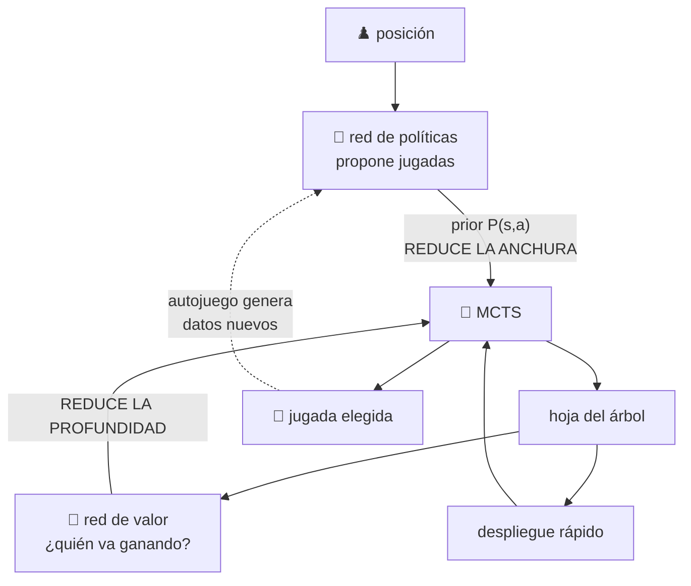

# P27 — AlphaGo

> Ruta de agentes · Une las dos tradiciones que el programa enseña por separado: la búsqueda
> simbólica de la parte 01 y el aprendizaje profundo de la parte 04.

**Nivel:** L4 · **Motor:** `alphago` · **Notebook:** [`P27_alphago.ipynb`](../../../notebooks/papers/P27_alphago.ipynb)
· **Anexo:** [complejidad y coste](../../annexes/A05_COMPLEJIDAD_Y_COSTE.md)

## 1. Identificación

| Campo | Valor |
|---|---|
| **Título original** | *Mastering the game of Go with deep neural networks and tree search* |
| **Autoría** | David Silver, Aja Huang, Chris J. Maddison y otros (DeepMind) |
| **Año** | 2016 |
| **Venue** | *Nature* 529, 484–489 |
| **Fuente primaria** | [doi.org/10.1038/nature16961](https://doi.org/10.1038/nature16961) |
| **Acceso** | Restringido (revista de suscripción) |
| **Fecha de consulta** | 2026-08-16 |

## 2. Problema anterior

El ajedrez cayó en 1997 con búsqueda y una función de evaluación escrita por expertos. El go
resistió veinte años más por dos razones concretas: su **factor de ramificación** es un orden de
magnitud mayor, y nadie sabía escribir una función que dijera si una posición es buena.

La búsqueda de Monte Carlo en árbol había mejorado el nivel, pero seguía lejos del profesional.
El cuello de botella era doble: demasiadas jugadas que considerar (anchura) y partidas demasiado
largas para simular hasta el final (profundidad).

## 3. Propuesta

Atacar cada dimensión con una red:

- **Red de políticas** `p(a|s)`: propone las jugadas plausibles y **reduce la anchura** del árbol.
  Se entrena primero imitando partidas humanas y después se refina por autojuego.
- **Red de valor** `v(s)`: estima quién va ganando sin llegar al final y **reduce la
  profundidad**, sustituyendo simulaciones completas.
- **MCTS**: usa ambas para repartir un presupuesto de simulaciones y decidir la jugada.

Ninguna de las tres piezas basta sola, y el título del paper nombra las dos familias: redes
profundas **y** búsqueda en árbol.

## 4. Intuición sin fórmulas

Un buen jugador no calcula todas las jugadas: su intuición descarta casi todo y solo analiza a
fondo tres o cuatro. AlphaGo hace exactamente eso — la red da la intuición, la búsqueda hace el
análisis.

**Dónde deja de funcionar la analogía:** la intuición humana viene de entender el juego; la de la
red viene de correlaciones sobre millones de posiciones. Que el resultado se parezca no implica
que el proceso lo haga.

## 5. Matemática mínima

```text
Selección en el árbol (variante de UCT):
    a* = argmax_a [ Q(s,a) + u(s,a) ]        con  u(s,a) ∝ P(s,a) / (1 + N(s,a))

    Q(s,a) = valor medio observado en las simulaciones que pasaron por (s,a)
    P(s,a) = prior de la red de políticas   ← concentra el presupuesto
    N(s,a) = visitas                        ← penaliza lo ya explorado

Evaluación de una hoja: mezcla de la red de valor y de un despliegue rápido
    V(s) = (1−λ)·v_θ(s) + λ·z_despliegue
```

El término `u` decae con las visitas: al principio manda el prior, y conforme se acumula
evidencia manda `Q`. Es el compromiso explorar/explotar de [DQN](../P26_dqn/README.md), ahora
dentro del árbol.

<!-- puente:inicio -->
> [!TIP]
> **Puente matemático.** Esta sección da por sabido lo siguiente. Si algo no te suena,
> léelo primero: está explicado una sola vez, en un solo sitio, y sirve para todas las fichas.

| Dónde | Qué necesitas de ahí |
|---|---|
| [**A02 §1** · Softmax](../../annexes/A02_PROBABILIDAD_Y_VEROSIMILITUD.md#1-softmax) | el softmax de la red de política, que da la prior de la búsqueda |
| [**A03 §6** · Gradiente de política (REINFORCE)](../../annexes/A03_CALCULO_Y_GRADIENTES.md#6-gradiente-de-política-reinforce) | el gradiente de política con el que se refina jugando |
<!-- puente:fin -->

## 6. Arquitectura o flujo



## 7. Qué observar en el paper original

- La **figura del pipeline de entrenamiento**: red de políticas supervisada → refinada por
  refuerzo → red de valor entrenada con partidas de autojuego. Es una cadena, no un modelo suelto.
- Las **ablaciones**: qué pasa con solo política, solo valor, solo despliegues, y las
  combinaciones. Ahí está la demostración de que las tres piezas se necesitan.
- El **escalado con el número de simulaciones** y con el hardware: el nivel de juego es función
  del presupuesto de búsqueda, no solo de la red.
- La distinción entre la red de políticas **supervisada** y la refinada por **refuerzo**, y por
  qué usan una u otra en distintos puntos.

## 8. Evidencia y resultados

Victoria por 5-0 frente al campeón europeo Fan Hui, y una tasa de victoria muy alta frente a los
mejores programas de go de la época.

> Las tasas de victoria por configuración, las ablaciones y los detalles del hardware están en el
> artículo y su material suplementario. Verificarlos allí. El match posterior contra Lee Sedol
> (2016) es un hecho ampliamente documentado pero **no** forma parte de este artículo.

La miniatura de este eje aísla el mecanismo en tres en raya: el prior propone por preferencia
fija, la búsqueda estima un valor por casilla. Ambas aciertan el tipo de jugada, pero solo la
segunda produce números comparables y auditables, y solo la segunda mejora con más presupuesto.

## 9. Impacto

- Es el resultado que llevó la IA moderna a la conversación pública, más que cualquier paper
  técnico anterior.
- Demostró que **búsqueda y aprendizaje se potencian**: una lección que reaparece en
  [Tree of Thoughts](../P29_tree_of_thoughts/README.md) y en el cómputo en inferencia de
  [P22](../P22_deepseek_r1/README.md).
- Su sucesor AlphaGo Zero (2017) eliminó las partidas humanas por completo, aprendiendo solo por
  autojuego.
- Consolidó el **autojuego** como forma de generar datos donde no los hay.

## 10. Limitaciones

1. **Requiere un simulador perfecto**: reglas conocidas, estado completamente observable y
   posibilidad de simular millones de partidas. Casi ningún problema real cumple eso.
2. **Coste computacional enorme**, tanto de entrenamiento como de juego.
3. **Dominio único**: no transfiere a otro juego sin rehacer el proceso.
4. **Depende de partidas humanas** en esta versión (AlphaGo Zero lo corregirá).
5. **Información perfecta**: no cubre juegos con azar u ocultación.
6. **No explica sus decisiones**: la jugada sale de un recuento de simulaciones, no de un
   argumento.

## 11. Errores comunes

| Error | Corrección |
|---|---|
| «Una red neuronal venció al campeón» | La red sola no vence a nadie. El título nombra las dos piezas: redes **y** búsqueda. |
| «AlphaGo aprendió solo» | Esta versión parte de partidas humanas. La que aprende sola es AlphaGo Zero (2017). |
| «Demuestra que la IA razona» | Demuestra que búsqueda guiada por redes gana al go. Cualquier extrapolación es interpretación. |
| «MCTS es una novedad del paper» | MCTS es anterior. La novedad es **guiarla y truncarla** con redes aprendidas. |
| «Sirve para cualquier problema» | Necesita simulador perfecto e información completa. Es una restricción muy fuerte. |

## 12. Relación con trabajos anteriores

- **[P26 DQN](../P26_dqn/README.md) (2015)** — refuerzo profundo del mismo grupo.
- **[P04 AlexNet](../P04_alexnet/README.md) (2012)** — las convoluciones que leen el tablero.
- **MCTS y UCT (2006–2007)** — la búsqueda que se guía.
- **Deep Blue (1997)** — el precedente en ajedrez, con evaluación escrita a mano.

## 13. Relación con trabajos posteriores

- **AlphaGo Zero (2017)** y **AlphaZero (2018)** — sin partidas humanas, y generalizado a otros juegos.
  [DOI](https://doi.org/10.1038/nature24270)
- **[P29 Tree of Thoughts](../P29_tree_of_thoughts/README.md) (2023)** — la misma idea de buscar
  con evaluación, aplicada a pasos de razonamiento.
- **[P22 DeepSeek-R1](../P22_deepseek_r1/README.md) (2025)** — gastar cómputo al decidir, no solo
  al entrenar.

## 14. Notebook asociado

[`P27_alphago.ipynb`](../../../notebooks/papers/P27_alphago.ipynb)

**Qué implementa:** una posición de tres en raya resuelta con prior heurístico solo, y con
búsqueda guiada por ese prior mediante despliegues aleatorios; más el reparto del presupuesto de
simulaciones.

**Qué NO implementa:** nada del paper. No hay redes entrenadas, ni MCTS con UCT, ni autojuego.
Tres en raya tiene 9 casillas; el go tiene más estados legales que átomos observables.

```bash
ai-evolution paper-lab P27 --seed 7
```

## 15. Actividades Bloom

| Nivel | Actividad |
|---|---|
| **Recordar** | Di qué reduce la red de políticas y qué reduce la red de valor. |
| **Explicar** | Explica el término `u(s,a)` y por qué decae con las visitas. |
| **Aplicar** | Ejecuta el notebook y compara la jugada del prior con la de la búsqueda. |
| **Analizar** | ¿Por qué el go resistió veinte años más que el ajedrez? Da las dos razones técnicas. |
| **Evaluar** | ¿Qué problema real de tu entorno cumple los requisitos de este método? ¿Y cuál no? |
| **Crear** | Diseña una función de evaluación para conecta-4 y compárala con despliegues aleatorios. |

## 16. Autoevaluación

1. ¿Qué dos dimensiones del árbol de búsqueda ataca cada red?
2. ¿Por qué no bastaba MCTS con despliegues aleatorios?
3. ¿Qué hace el prior cuando `N(s,a)` es 0 y qué cuando es grande?
4. ¿Qué requisito del entorno hace inaplicable este método a la mayoría de problemas reales?
5. ¿Qué diferencia hay entre esta versión y AlphaGo Zero?
6. ¿Por qué el nivel de juego depende del presupuesto de simulaciones?
7. ¿Qué idea de este paper reaparece en el razonamiento de modelos de lenguaje?

## 17. Respuestas esperadas

1. La red de políticas reduce la **anchura** proponiendo pocas jugadas plausibles; la de valor
   reduce la **profundidad** evaluando sin llegar al final de la partida.
2. Porque el factor de ramificación del go hace que los despliegues aleatorios sean demasiado
   poco informativos: se desperdicia el presupuesto en jugadas absurdas.
3. Con `N = 0` domina el prior, que es la única información disponible. Con `N` grande el término
   `u` decae y manda `Q`, la evidencia acumulada por las simulaciones.
4. Necesita un **simulador perfecto** con reglas conocidas e información completa, y la
   posibilidad de simular millones de partidas.
5. AlphaGo Zero prescinde de partidas humanas: aprende solo por autojuego desde cero.
6. Porque la decisión sale de un recuento de simulaciones: más simulaciones, mejor estimación de
   `Q` y por tanto mejor elección.
7. Que gastar cómputo **al decidir** —buscar, deliberar, verificar— puede rendir más que un modelo
   más grande que responde de una vez.

## 18. Fuentes primarias

- Silver, D. et al. (2016). *Mastering the game of Go with deep neural networks and tree search*.
  **Nature** 529, 484–489. [doi.org/10.1038/nature16961](https://doi.org/10.1038/nature16961) ·
  consultado 2026-08-16.
- Silver, D. et al. (2017). *Mastering the game of Go without human knowledge*. **Nature** 550.
  [doi.org/10.1038/nature24270](https://doi.org/10.1038/nature24270) · consultado 2026-08-16.

---

[⬅️ Anterior: P26 DQN](../P26_dqn/README.md) ·
[📇 Índice](../../catalog/PAPERS_INDEX.md) ·
[📝 Evaluación](../../../assessments/papers/P27_alphago.md) ·
[🏫 Clase 017 · Juegos, minimax y poda alfa-beta](../../../classes/part-01-symbolic-ai-search-logic-and-planning/017-juegos-minimax-y-poda-alfa-beta/README.md) ·
[➡️ Siguiente: P28 Chain-of-Thought](../P28_chain_of_thought/README.md)
