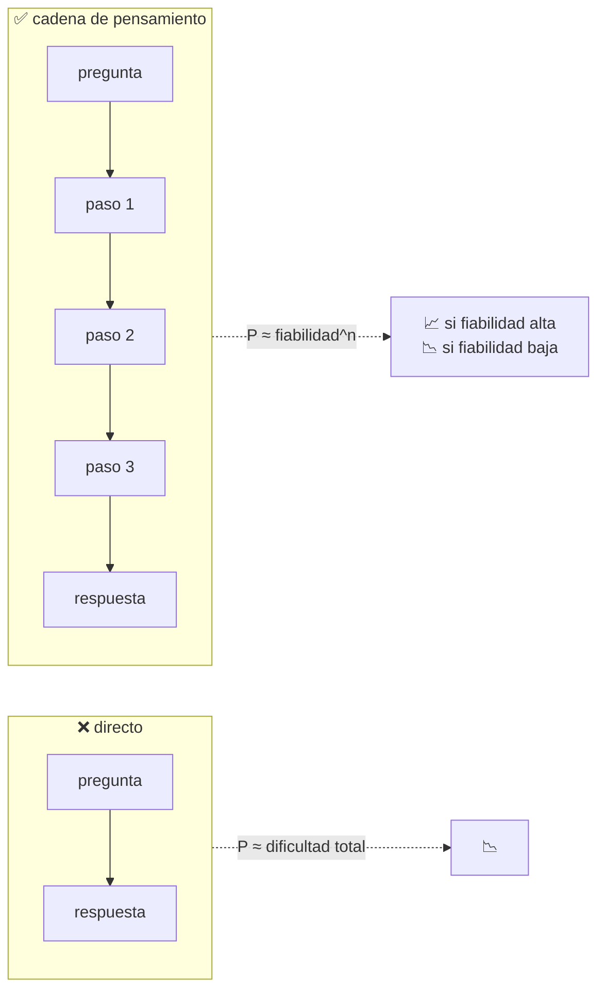

# P28 — Chain-of-Thought

> Ruta de agentes · Descomponer en pasos intermedios desbloquea tareas que el mismo modelo
> fallaba respondiendo de una sola vez.

**Nivel:** L2 · **Motor:** `cot` · **Notebook:** [`P28_chain_of_thought.ipynb`](../../../notebooks/papers/P28_chain_of_thought.ipynb)
· **Anexo:** [probabilidad y verosimilitud](../../annexes/A02_PROBABILIDAD_Y_VEROSIMILITUD.md)

## 1. Identificación

| Campo | Valor |
|---|---|
| **Título original** | *Chain-of-Thought Prompting Elicits Reasoning in Large Language Models* |
| **Autoría** | Jason Wei, Xuezhi Wang, Dale Schuurmans, Maarten Bosma, Brian Ichter, Fei Xia, Ed Chi, Quoc Le, Denny Zhou |
| **Año** | 2022 |
| **Venue** | arXiv:2201.11903 · NeurIPS 2022 |
| **Fuente primaria** | [arXiv:2201.11903](https://arxiv.org/abs/2201.11903) |
| **Acceso** | Abierto |
| **Fecha de consulta** | 2026-08-16 |

## 2. Problema anterior

[GPT-3](../P10_gpt3/README.md) resolvía tareas sorprendentes con pocos ejemplos y fallaba en
otras aparentemente más fáciles: aritmética de varios pasos, problemas de lógica, razonamiento de
sentido común encadenado. Escalar el modelo mejoraba muchas cosas pero **no** estas: las curvas
se quedaban planas.

La interpretación dominante era que esas capacidades simplemente no estaban. La hipótesis
alternativa —que resultó ser la correcta— es que sí estaban, pero se le pedía el resultado sin
dejarle espacio para llegar a él.

## 3. Propuesta

Cambiar los ejemplos del prompt: en vez de pares `(pregunta, respuesta)`, usar tríos
`(pregunta, razonamiento paso a paso, respuesta)`.

Nada más. Sin ajuste fino, sin datos nuevos, sin cambiar el modelo. Ocho ejemplos escritos a mano
bastan, y el efecto aparece solo en modelos suficientemente grandes: en los pequeños, las cadenas
que generan son incoherentes y empeoran el resultado.

## 4. Intuición sin fórmulas

Pedir una multiplicación de tres cifras «de cabeza» falla; pedirla por pasos, no. No es que sepas
más: es que te han dado sitio donde hacer la cuenta.

**Dónde deja de funcionar la analogía:** una persona sabe si su cuenta intermedia está bien. El
modelo genera pasos que **parecen** cálculo y a veces no lo son, y aun así puede acertar.

## 5. Matemática mínima

No hay ecuación nueva. Lo que hay es aritmética de probabilidades, y explica el fenómeno entero:

```text
P(acertar directo)  ≈ dificultad del problema completo
P(acertar cadena)   ≈ (fiabilidad por paso)^n
```

Descomponer gana **si y solo si** cada paso es mucho más fiable que el problema entero. De ahí
salen las tres consecuencias observables:

- si la fiabilidad por paso es baja, descomponer **empeora** (se multiplican errores);
- por encima de un umbral, mejora;
- como la fiabilidad por paso crece con la escala del modelo, el efecto **emerge**: un producto
  de números cruza un umbral.

## 6. Arquitectura o flujo



## 7. Qué observar en el paper original

- Las **curvas de escala**: el efecto no existe en modelos pequeños y aparece de golpe. Esa forma
  es el argumento de la «emergencia».
- Los **ejemplos concretos** de cadenas, incluidos los erróneos. Los apéndices con fallos son lo
  más instructivo.
- El **análisis de ablación**: qué pasa si las cadenas son correctas pero irrelevantes, o si solo
  se añade la ecuación sin el razonamiento. Sirve para descartar explicaciones alternativas.
- Que se evalúa en **tres familias** de razonamiento —aritmético, de sentido común y simbólico—,
  no solo en matemáticas.

## 8. Evidencia y resultados

Mejoras sustanciales en benchmarks de razonamiento aritmético, de sentido común y simbólico, con
modelos de varios tamaños para trazar las curvas de escala.

El resultado más citado: un modelo de 540 000 millones de parámetros con **ocho ejemplos** en el
prompt alcanza el estado del arte en un benchmark de problemas matemáticos, superando a modelos
ajustados específicamente para la tarea.

> Las cifras por benchmark y por tamaño están en las tablas del artículo. Verificarlas allí.

La miniatura de este eje modela la aritmética del fenómeno: localiza el umbral de fiabilidad por
paso por debajo del cual descomponer empeora, y muestra que la cadena se degrada con la longitud
aun cuando siga ganando.

## 9. Impacto

- Convirtió el diseño del prompt en una variable de primer orden: la misma pregunta con otro
  formato da otro resultado.
- Es el punto de partida de casi todo el trabajo posterior sobre razonamiento:
  [autoconsistencia](https://arxiv.org/abs/2203.11171), [ReAct](../P13_react/README.md),
  [Tree of Thoughts](../P29_tree_of_thoughts/README.md) y el cómputo en inferencia de
  [P22](../P22_deepseek_r1/README.md).
- Popularizó —para bien y para mal— la palabra «emergencia» en el vocabulario del campo.

## 10. Limitaciones

1. **Solo funciona a escala suficiente**: en modelos pequeños empeora.
2. **La cadena puede ser inválida y la respuesta correcta**, y al revés. No es una demostración.
3. **Cuesta tokens**: más latencia y más dinero por respuesta.
4. **Los ejemplos hay que escribirlos** y la calidad del resultado depende de ellos.
5. **Se degrada con la longitud**: cadenas muy largas multiplican la probabilidad de fallo.
6. **La palabra «emergencia» es discutida**: trabajo posterior señaló que parte del efecto puede
   ser un artefacto de métricas discontinuas (acierta/falla) sobre una mejora continua.

## 11. Errores comunes

| Error | Corrección |
|---|---|
| «La cadena explica cómo razonó el modelo» | Es texto generado, optimizado para que la respuesta final sea correcta. Puede racionalizar en vez de describir. |
| «Siempre conviene pedir razonamiento» | En tareas de un paso añade coste sin mejorar, y en modelos pequeños empeora. |
| «Es una capacidad emergente inexplicable» | Se explica con aritmética elemental: un producto de fiabilidades cruzando un umbral. |
| «CoT enseña a razonar al modelo» | No cambia ningún peso. Cambia el formato del contexto. |
| «Si la cadena es correcta, la respuesta lo es» | No se sigue. El propio paper documenta ambos tipos de disociación. |

## 12. Relación con trabajos anteriores

- **[P10 GPT-3](../P10_gpt3/README.md) (2020)** — el aprendizaje en contexto que hace posible el método.
- **[P25 T5](../P25_t5/README.md) (2019)** — la idea de describir la tarea en el propio texto.
- Trabajo previo sobre **explicaciones intermedias** en resolución de problemas matemáticos.

## 13. Relación con trabajos posteriores

- **Wang et al. (2022), autoconsistencia** — muestrear varias cadenas y votar la respuesta.
  [arXiv:2203.11171](https://arxiv.org/abs/2203.11171)
- **[P13 ReAct](../P13_react/README.md) (2022)** — intercalar acciones reales entre pensamientos.
- **[P29 Tree of Thoughts](../P29_tree_of_thoughts/README.md) (2023)** — explorar varias ramas.
- **[P22 DeepSeek-R1](../P22_deepseek_r1/README.md) (2025)** — hacer que el razonamiento emerja
  por refuerzo en vez de por ejemplos.

## 14. Notebook asociado

[`P28_chain_of_thought.ipynb`](../../../notebooks/papers/P28_chain_of_thought.ipynb)

**Qué implementa:** el modelo probabilístico de por qué descomponer gana o pierde, el umbral de
fiabilidad por paso, la degradación con la longitud y la emergencia con la escala.

**Qué NO implementa:** ningún modelo de lenguaje ni ninguna cadena generada. Las fiabilidades son
didácticas: se modela el argumento, no se reproduce el experimento.

```bash
ai-evolution paper-lab P28 --seed 7
```

## 15. Actividades Bloom

| Nivel | Actividad |
|---|---|
| **Recordar** | Escribe las dos probabilidades y di cuándo gana la cadena. |
| **Explicar** | Explica por qué el efecto no aparece en modelos pequeños. |
| **Aplicar** | Ejecuta el notebook y localiza el umbral de fiabilidad por paso. |
| **Analizar** | Calcula cuántos pasos aguanta una cadena con fiabilidad 0,95 antes de bajar del 50 %. |
| **Evaluar** | ¿Es «capacidad emergente» una buena descripción? Argumenta a favor y en contra. |
| **Crear** | Diseña una tarea donde CoT **empeore** el resultado y explica por qué. |

## 16. Autoevaluación

1. ¿Qué cambia exactamente en el modelo al usar CoT?
2. ¿De qué depende que descomponer compense?
3. ¿Por qué el efecto emerge con la escala?
4. ¿Puede una cadena inválida llevar a la respuesta correcta? ¿Y al revés?
5. ¿Qué cuesta CoT en producción?
6. ¿Por qué la palabra «emergencia» es discutida?
7. ¿Qué límite de CoT ataca directamente Tree of Thoughts?

## 17. Respuestas esperadas

1. Nada en el modelo: solo el formato de los ejemplos del prompt. Cero pesos actualizados.
2. De que la fiabilidad de cada paso sea suficientemente alta comparada con la dificultad del
   problema completo. Es una comparación entre `q^n` y la dificultad global.
3. Porque la fiabilidad por paso crece con el tamaño del modelo, y el producto `q^n` cruza el
   umbral de golpe al superarse cierta calidad.
4. Sí en ambos casos, y el paper lo documenta. Por eso la cadena no es una demostración.
5. Tokens: más latencia y más coste por respuesta, en cada llamada.
6. Porque parte del salto aparente puede deberse a medir con una métrica de todo o nada sobre una
   mejora subyacente continua.
7. Que la cadena es lineal e irreversible: un paso malo condena el resto sin posibilidad de
   retroceder.

## 18. Fuentes primarias

- Wei, J. et al. (2022). *Chain-of-Thought Prompting Elicits Reasoning in Large Language Models*.
  **NeurIPS 2022**. [arXiv:2201.11903](https://arxiv.org/abs/2201.11903) · consultado 2026-08-16.
- Wang, X. et al. (2022). *Self-Consistency Improves Chain of Thought Reasoning*.
  [arXiv:2203.11171](https://arxiv.org/abs/2203.11171) · consultado 2026-08-16.

---

[⬅️ Anterior: P27 AlphaGo](../P27_alphago/README.md) ·
[📇 Índice](../../catalog/PAPERS_INDEX.md) ·
[📝 Evaluación](../../../assessments/papers/P28_chain_of_thought.md) ·
[🏫 Clase 114 · Ciclo ReAct](../../../classes/part-09-ai-agent-engineering/114-ciclo-react-y-observacion-del-entorno/README.md) ·
[➡️ Siguiente: P29 Tree of Thoughts](../P29_tree_of_thoughts/README.md)
