# P29 — Tree of Thoughts

> Ruta de agentes · Devuelve la búsqueda clásica al razonamiento: explorar varias ramas,
> evaluarlas y poder retroceder.

**Nivel:** L3 · **Motor:** `tot` · **Notebook:** [`P29_tree_of_thoughts.ipynb`](../../../notebooks/papers/P29_tree_of_thoughts.ipynb)
· **Anexo:** [complejidad y coste](../../annexes/A05_COMPLEJIDAD_Y_COSTE.md)

## 1. Identificación

| Campo | Valor |
|---|---|
| **Título original** | *Tree of Thoughts: Deliberate Problem Solving with Large Language Models* |
| **Autoría** | Shunyu Yao, Dian Yu, Jeffrey Zhao, Izhak Shafran, Thomas L. Griffiths, Yuan Cao, Karthik Narasimhan |
| **Año** | 2023 |
| **Venue** | arXiv:2305.10601 · NeurIPS 2023 |
| **Fuente primaria** | [arXiv:2305.10601](https://arxiv.org/abs/2305.10601) |
| **Acceso** | Abierto |
| **Fecha de consulta** | 2026-08-16 |

## 2. Problema anterior

[Chain-of-Thought](../P28_chain_of_thought/README.md) razona de izquierda a derecha y **sin vuelta
atrás**. Cada token se genera condicionado a los anteriores, y una decisión intermedia
localmente razonable pero globalmente equivocada condena toda la solución sin que nada la
corrija.

Hay una clase de problemas donde eso es fatal: los que requieren **explorar** —probar una
combinación, ver que no lleva a nada y volver—. La generación autorregresiva no tiene ese
mecanismo.

## 3. Propuesta

Tratar los pasos de razonamiento como **nodos de un árbol** y aplicar búsqueda clásica sobre
ellos. Hacen falta tres piezas:

1. **Generar** varios candidatos de «pensamiento» por estado, no uno.
2. **Evaluar** estados parciales: el propio modelo juzga si una rama promete o es un callejón
   sin salida.
3. **Buscar**: anchura, profundidad, poda y retroceso, con un presupuesto de nodos.

El resultado más citado del artículo: en el juego de las 24, la tasa de éxito pasa del 4 % con
cadena de pensamiento al 74 % con árbol.

## 4. Intuición sin fórmulas

Una cadena de pensamiento es escribir a bolígrafo: si el tercer paso está mal, sigues adelante
con él. Un árbol es escribir a lápiz con varias hojas: exploras, comparas y borras.

**Dónde deja de funcionar la analogía:** quien escribe a lápiz sabe cuándo una hoja no va a
ningún sitio. Aquí ese juicio lo hace el propio modelo, y si lo hace mal, el árbol solo multiplica
el gasto.

## 5. Matemática mínima

```text
Cadena :  s₀ → s₁ → s₂ → s₃                    una rama, decisión irreversible
Árbol  :  s₀ → {s₁ᵃ, s₁ᵇ, s₁ᶜ} → …             varias ramas, con evaluación y poda

Coste, con ramificación b, profundidad d y anchura de haz k:

    cadena :  b · d          nodos evaluados
    árbol  :  b · k · d      nodos evaluados     →  k veces más caro
```

Con `k = 1`, el árbol **es** la cadena. Cada unidad de anchura multiplica el coste y compra la
posibilidad de recuperarse de un mal paso. El compromiso es explícito y presupuestable.

## 6. Arquitectura o flujo

```mermaid
flowchart TD
    S["problema"] --> G1["generar k candidatos"]
    G1 --> A["rama A"]
    G1 --> B["rama B"]
    G1 --> C["rama C"]
    A --> E{"🧠 evaluar<br/>¿promete?"}
    B --> E
    C --> E
    E -->|"seguro"| K1["conservar"]
    E -->|"quizá"| K2["conservar"]
    E -->|"imposible"| X["✂️ podar"]
    K1 --> G2["generar siguiente nivel"]
    K2 --> G2
    G2 --> R["🎯 solución"]
    style X fill:#3a1a1a,stroke:#f85149
```



## 7. Qué observar en el paper original

- Las **tres tareas** elegidas: juego de las 24, escritura creativa y crucigramas. No son
  arbitrarias: en las tres el progreso parcial es evaluable, que es el requisito del método.
- Cómo se implementa el **evaluador**: pedir al modelo que clasifique un estado parcial como
  seguro/quizá/imposible, o que puntúe. Ese diseño es la pieza frágil.
- La comparación con **cadena + autoconsistencia**, que es la línea base honesta: muestrear varias
  cadenas y votar ya mejora, y hay que superarla.
- El **coste en llamadas al modelo**, que el paper reporta. Sin ese número, la comparación de
  exactitud no significa nada.

## 8. Evidencia y resultados

Evaluación en tres tareas que requieren exploración, comparando con prompting directo, cadena de
pensamiento y autoconsistencia.

En el juego de las 24, la tasa de éxito reportada pasa del **4 %** con cadena de pensamiento al
**74 %** con árbol de pensamientos.

> Las cifras de las otras dos tareas, la configuración de búsqueda y el número de llamadas al
> modelo están en el artículo. Verificarlos allí: el salto del 4 % al 74 % es real pero se paga
> en llamadas, y citar solo el primero es medio dato.

La miniatura de este eje compara nodos evaluados por ambos métodos y comprueba el caso límite:
con anchura 1, el árbol se comporta exactamente como la cadena.

## 9. Impacto

- Reintrodujo la **búsqueda** —el tema de la parte 01 del programa— en el trabajo con modelos de
  lenguaje, que hasta entonces lo había ignorado.
- Es uno de los antecedentes conceptuales del **cómputo en inferencia**: gastar más al responder
  en vez de entrenar más grande, la línea que consolida [P22](../P22_deepseek_r1/README.md).
- Popularizó la idea de que el modelo puede actuar como **evaluador de sí mismo** sobre estados
  parciales, no solo como generador.

## 10. Limitaciones

1. **Coste multiplicado**: cada nodo evaluado es una llamada al modelo. Es el método más caro de
   su familia.
2. **Depende por completo del evaluador**. Con un evaluador mediocre, la poda es aleatoria y solo
   se gasta más.
3. **Requiere que el progreso parcial sea evaluable**: en muchas tareas no lo es.
4. **Latencia alta**, difícil de justificar en un producto interactivo.
5. **Hay que diseñar el espacio de «pensamientos»** por tarea: qué es un paso no es evidente.
6. **La línea base correcta es autoconsistencia**, no cadena simple; compararse solo con la
   segunda infla la mejora aparente.

## 11. Errores comunes

| Error | Corrección |
|---|---|
| «ToT siempre mejora sobre CoT» | Solo en tareas que requieren exploración y con un evaluador competente. En tareas de un paso, es gasto puro. |
| «Del 4 % al 74 %, luego es 18× mejor» | Ese salto se paga en llamadas al modelo. Sin el coste, la comparación está incompleta. |
| «El árbol razona mejor» | Busca mejor. Razonar y buscar no son lo mismo, y la distinción importa. |
| «Basta con ampliar la anchura» | Sin mejorar el evaluador, más anchura es más coste con la misma calidad de poda. |
| «Es una idea nueva» | La búsqueda con evaluación es de los años 60. Lo nuevo es aplicarla a pasos de razonamiento generados. |

## 12. Relación con trabajos anteriores

- **[P28 Chain-of-Thought](../P28_chain_of_thought/README.md) (2022)** — la cadena lineal que generaliza.
- **[P13 ReAct](../P13_react/README.md) (2022)** — del mismo primer autor; actuar en vez de deliberar.
- **[P27 AlphaGo](../P27_alphago/README.md) (2016)** — búsqueda guiada por evaluación aprendida.
- **Búsqueda en espacios de estados** (parte 01 del programa) — el marco clásico que se reutiliza.

## 13. Relación con trabajos posteriores

- **[P22 DeepSeek-R1](../P22_deepseek_r1/README.md) (2025)** — el razonamiento largo como política
  aprendida, en vez de como búsqueda explícita orquestada desde fuera.
- **Snell et al. (2024)** — el marco de escalar cómputo en inferencia.
  [arXiv:2408.03314](https://arxiv.org/abs/2408.03314)
- **Verificadores y modelos de recompensa por proceso (2023+)** — atacan justo la pieza frágil:
  la calidad del evaluador.

## 14. Notebook asociado

[`P29_tree_of_thoughts.ipynb`](../../../notebooks/papers/P29_tree_of_thoughts.ipynb)

**Qué implementa:** la comparación de nodos evaluados entre cadena lineal y búsqueda con poda, el
efecto de la anchura, el caso límite `k = 1` y el experimento de qué pasa con un evaluador al azar.

**Qué NO implementa:** ningún modelo. El evaluador es una función hash determinista, no un modelo
juzgando estados parciales — que es exactamente la parte difícil.

```bash
ai-evolution paper-lab P29 --seed 7
```

## 15. Actividades Bloom

| Nivel | Actividad |
|---|---|
| **Recordar** | Escribe las tres piezas que necesita el método. |
| **Explicar** | Explica por qué con anchura 1 el árbol es la cadena. |
| **Aplicar** | Ejecuta el notebook y compara nodos evaluados para varias anchuras. |
| **Analizar** | ¿Qué pasa con un evaluador al 50 % de acierto? Razónalo y compruébalo. |
| **Evaluar** | Te presentan «74 % frente a 4 %». ¿Qué dato pides antes de aceptarlo? |
| **Crear** | Define el espacio de «pensamientos» para un problema de tu dominio y di si el progreso parcial es evaluable. |

## 16. Autoevaluación

1. ¿Qué limitación de la cadena de pensamiento ataca?
2. ¿Cuáles son las tres piezas del método?
3. ¿Cuál es el caso límite con anchura 1?
4. ¿Por qué el evaluador es la pieza frágil?
5. ¿En qué tipo de tarea NO conviene?
6. ¿Cuál es la línea base honesta con la que compararse?
7. ¿Qué relación tiene con AlphaGo?

## 17. Respuestas esperadas

1. Que decide de izquierda a derecha sin vuelta atrás: un paso malo no se puede deshacer.
2. Generar varios candidatos por estado, evaluar estados parciales y aplicar una estrategia de
   búsqueda con poda.
3. Con anchura 1 solo se conserva una rama en cada nivel: es exactamente una cadena lineal.
4. Porque la poda depende de él. Con un evaluador aleatorio, se descartan buenas ramas y se
   conservan malas: el coste se multiplica y la calidad no mejora.
5. En tareas de un solo paso, en las que el progreso parcial no se puede juzgar, y donde la
   latencia o el coste por respuesta son críticos.
6. Cadena de pensamiento con **autoconsistencia** (muestrear varias y votar), no cadena simple.
7. Es la misma estructura: un generador propone, un evaluador juzga y una búsqueda reparte el
   presupuesto. Cambia el dominio —pasos de texto en vez de jugadas— y que aquí no hay simulador.

## 18. Fuentes primarias

- Yao, S. et al. (2023). *Tree of Thoughts: Deliberate Problem Solving with Large Language
  Models*. **NeurIPS 2023**. [arXiv:2305.10601](https://arxiv.org/abs/2305.10601) ·
  consultado 2026-08-16.
- Yao, S. et al. (2023). *ReAct: Synergizing Reasoning and Acting in Language Models*.
  [arXiv:2210.03629](https://arxiv.org/abs/2210.03629) · consultado 2026-08-16.

---

[⬅️ Anterior: P28 Chain-of-Thought](../P28_chain_of_thought/README.md) ·
[📇 Índice](../../catalog/PAPERS_INDEX.md) ·
[📝 Evaluación](../../../assessments/papers/P29_tree_of_thoughts.md) ·
[🏫 Clase 014 · Búsqueda en anchura y profundidad](../../../classes/part-01-symbolic-ai-search-logic-and-planning/014-busqueda-en-anchura-y-profundidad/README.md) ·
[➡️ Siguiente: P30 Reflexion](../P30_reflexion/README.md)
