# P30 — Reflexion

> Ruta de agentes · El agente aprende entre intentos sin tocar un solo peso: el refuerzo ocurre
> en el contexto, en lenguaje natural.

**Nivel:** L2 · **Motor:** `reflexion` · **Notebook:** [`P30_reflexion.ipynb`](../../../notebooks/papers/P30_reflexion.ipynb)
· **Anexo:** [cálculo y gradientes](../../annexes/A03_CALCULO_Y_GRADIENTES.md)

## 1. Identificación

| Campo | Valor |
|---|---|
| **Título original** | *Reflexion: Language Agents with Verbal Reinforcement Learning* |
| **Autoría** | Noah Shinn, Federico Cassano, Ashwin Gopinath, Karthik Narasimhan, Shunyu Yao |
| **Año** | 2023 |
| **Venue** | arXiv:2303.11366 · NeurIPS 2023 |
| **Fuente primaria** | [arXiv:2303.11366](https://arxiv.org/abs/2303.11366) |
| **Acceso** | Abierto |
| **Fecha de consulta** | 2026-08-16 |

## 2. Problema anterior

Un bucle [ReAct](../P13_react/README.md) que falla vuelve a empezar de cero. No conserva nada del
intento anterior, así que **repite el mismo error** con la misma confianza.

La alternativa clásica sería ajustar los pesos con refuerzo, pero eso es caro, lento y exige
acceso al modelo. Para un agente construido sobre una API, ni siquiera es posible.

## 3. Propuesta

Cerrar el bucle **en el contexto**. Tras cada intento fallido:

1. una señal de evaluación indica que falló (test que no pasa, error del entorno, heurística);
2. el modelo genera una **reflexión verbal** sobre qué salió mal;
3. esa reflexión se guarda en una memoria episódica;
4. el siguiente intento se condiciona con ella.

Es refuerzo en el sentido de que la política mejora con la experiencia, pero la «actualización»
es texto añadido al contexto. Cero gradientes.

## 4. Intuición sin fórmulas

Un agente sin memoria de sus fallos es alguien que repite el mismo error con entusiasmo.
Reflexion añade lo mínimo para romper el bucle: escribir qué salió mal y leerlo antes de
reintentar.

**Dónde deja de funcionar la analogía:** una persona reflexiona aunque nadie le diga que falló.
Aquí la reflexión necesita una señal externa; sin ella, degenera en autoafirmación.

## 5. Matemática mínima

No hay ecuación. Lo que hay es un bucle con estado:

```text
memoria = []
para intento en 1..N:
    trayectoria = política(tarea, memoria)      ← el contexto incluye las reflexiones
    resultado   = evaluar(trayectoria)          ← señal EXTERNA, verificable
    si resultado == éxito: terminar
    memoria.append( reflexionar(trayectoria, resultado) )
```

La comparación con el refuerzo clásico es directa: donde RL actualiza `θ`, aquí se actualiza el
**contexto**. Es más barato e inmediato, y también más frágil y efímero.

## 6. Arquitectura o flujo

```mermaid
flowchart TD
    T["🎯 tarea"] --> A["🤖 actor<br/>(bucle ReAct)"]
    M[("🧠 memoria de<br/>reflexiones")] --> A
    A --> R["trayectoria"]
    R --> E{"✅ evaluador<br/>¿funcionó?"}
    E -->|"sí"| OK["entregar"]
    E -->|"no"| REF["✍️ reflexionar:<br/>«falló porque…»"]
    REF --> M
    M -.->|"condiciona el<br/>siguiente intento"| A
    style E fill:#1a3a2a,stroke:#3fb950
```



## 7. Qué observar en el paper original

- Los **tres tipos de señal de evaluación** que consideran, según la tarea: exacta (tests),
  heurística y generada por el propio modelo. La calidad del método baja con la calidad de la señal.
- Las **curvas de éxito acumulado por número de intentos**: es la forma correcta de reportar un
  método iterativo, no una sola cifra.
- Los ejemplos de **reflexiones inútiles** («ser más cuidadoso»), que es el modo de fallo
  característico.
- La comparación con simplemente **reintentar sin reflexión**, que es la línea base honesta: parte
  de la mejora viene solo de tener más intentos.

## 8. Evidencia y resultados

Evaluación en tareas de toma de decisiones, razonamiento y generación de código, comparando con
ReAct y con reintentos sin reflexión.

> Las tasas de éxito por tarea y por número de intentos están en el artículo. Verificarlas allí, y
> comparar siempre contra «reintentar N veces sin reflexión»: sin esa columna, la mejora
> atribuida a la reflexión está inflada.

La miniatura de este eje muestra el mecanismo: sin memoria, el agente repite el primer fallo y no
termina en cuatro intentos; con memoria verbal, elimina un error por intento y converge. Con cero
pesos actualizados.

## 9. Impacto

- Instaló la idea de **memoria entre intentos** como componente estándar de un agente.
- Es uno de los antecedentes directos del bucle de autocrítica que hoy llevan casi todos los
  sistemas de generación de código.
- Marcó la distinción entre aprendizaje **en parámetros** y aprendizaje **en contexto** como una
  decisión de diseño, no como una limitación.

## 10. Limitaciones

1. **Depende de una señal de fallo fiable.** Sin verificador no hay sobre qué reflexionar.
2. **La reflexión puede ser incorrecta o genérica**, y entonces empeora el siguiente intento.
3. **La memoria ocupa contexto** y crece con los intentos: no escala a cientos.
4. **Efímero**: lo aprendido se pierde al terminar la sesión, salvo que se persista aparte.
5. **Coste multiplicado** por el número de intentos.
6. **Riesgo de bucle**: si la reflexión se repite, el agente puede quedar atrapado.

## 11. Errores comunes

| Error | Corrección |
|---|---|
| «El modelo aprende» | Aprende **en el contexto**. Cierra la sesión y no queda nada. |
| «Basta con pedirle que revise su respuesta» | Sin señal externa, la autocrítica tiende a la autoafirmación o al cambio aleatorio. |
| «La mejora es de la reflexión» | Parte viene de tener más intentos. Hay que comparar contra reintentar sin reflexionar. |
| «Es aprendizaje por refuerzo» | Comparte la estructura (política, señal, mejora) pero no actualiza parámetros. La analogía es útil y también engañosa. |
| «Cuantos más intentos, mejor» | Con memoria creciente y sin criterio de parada, el coste crece y la calidad se estanca. |

## 12. Relación con trabajos anteriores

- **[P13 ReAct](../P13_react/README.md) (2022)** — el bucle que se envuelve.
- **[P28 Chain-of-Thought](../P28_chain_of_thought/README.md) (2022)** — el razonamiento explícito.
- **[P26 DQN](../P26_dqn/README.md) (2015)** — el marco de refuerzo con el que se hace la analogía.

## 13. Relación con trabajos posteriores

- **Madaan et al. (2023), Self-Refine** — refinamiento iterativo sin señal externa; el contraste
  útil. [arXiv:2303.17651](https://arxiv.org/abs/2303.17651)
- **[P31 Generative Agents](../P31_generative_agents/README.md) (2023)** — memoria que persiste
  entre tareas, no solo entre intentos.
- **[P16 Sistemas agentic](../P16_agentic_systems/README.md)** — la síntesis operativa.

## 14. Notebook asociado

[`P30_reflexion.ipynb`](../../../notebooks/papers/P30_reflexion.ipynb)

**Qué implementa:** el bucle de reintentos con y sin memoria verbal, el conteo de pesos
actualizados (cero) y el análisis de cuánto contexto ocupa la memoria al crecer los intentos.

**Qué NO implementa:** las reflexiones son una lista escrita a mano. En el paper las genera el
modelo, y pueden ser inútiles — que es justo el modo de fallo interesante.

```bash
ai-evolution paper-lab P30 --seed 7
```

## 15. Actividades Bloom

| Nivel | Actividad |
|---|---|
| **Recordar** | Escribe los cuatro pasos del bucle. |
| **Explicar** | Explica por qué hace falta una señal externa. |
| **Aplicar** | Ejecuta el notebook y compara ambos bucles. |
| **Analizar** | Calcula cuántos intentos caben en un contexto de 8 000 tokens con reflexiones de 80. |
| **Evaluar** | Un equipo reporta +15 % con Reflexion. ¿Qué línea base exiges? |
| **Crear** | Diseña un detector de reflexión inútil («ser más cuidadoso») y di qué haría el agente al detectarla. |

## 16. Autoevaluación

1. ¿Qué se actualiza exactamente en cada iteración?
2. ¿Por qué se le llama refuerzo si no hay gradientes?
3. ¿Qué pasa sin señal de evaluación externa?
4. ¿Cuál es la línea base correcta para medir la mejora?
5. ¿Qué límite impone el tamaño del contexto?
6. ¿Cómo se evita que el bucle no termine?
7. ¿Qué diferencia hay entre esta memoria y la de Generative Agents?

## 17. Respuestas esperadas

1. El **contexto**: se añade una reflexión a la memoria que condiciona el siguiente intento. Los
   parámetros no cambian.
2. Porque comparte la estructura del refuerzo —política, señal de resultado, mejora iterativa—
   aunque el mecanismo de actualización sea textual.
3. La reflexión no tiene información nueva que incorporar: el modelo tiende a declararse
   satisfecho o a cambiar cosas al azar.
4. Reintentar el mismo número de veces **sin** reflexión. Parte de la mejora viene solo de tener
   más oportunidades.
5. La memoria crece con los intentos y compite por el contexto con la tarea. A partir de cierto
   punto hay que resumir o priorizar.
6. Con límite de intentos, detección de reflexiones repetidas y escalamiento a un humano.
7. Reflexion recuerda entre **intentos de la misma tarea**; Generative Agents mantiene memoria
   **entre tareas y a lo largo del tiempo**, con recuperación puntuada.

## 18. Fuentes primarias

- Shinn, N. et al. (2023). *Reflexion: Language Agents with Verbal Reinforcement Learning*.
  **NeurIPS 2023**. [arXiv:2303.11366](https://arxiv.org/abs/2303.11366) · consultado 2026-08-16.
- Madaan, A. et al. (2023). *Self-Refine: Iterative Refinement with Self-Feedback*.
  [arXiv:2303.17651](https://arxiv.org/abs/2303.17651) · consultado 2026-08-16.

---

[⬅️ Anterior: P29 Tree of Thoughts](../P29_tree_of_thoughts/README.md) ·
[📇 Índice](../../catalog/PAPERS_INDEX.md) ·
[📝 Evaluación](../../../assessments/papers/P30_reflexion.md) ·
[🏫 Clase 122 · Evaluación y depuración de agentes](../../../classes/part-09-ai-agent-engineering/122-evaluacion-y-depuracion-de-agentes/README.md) ·
[➡️ Siguiente: P31 Generative Agents](../P31_generative_agents/README.md)
