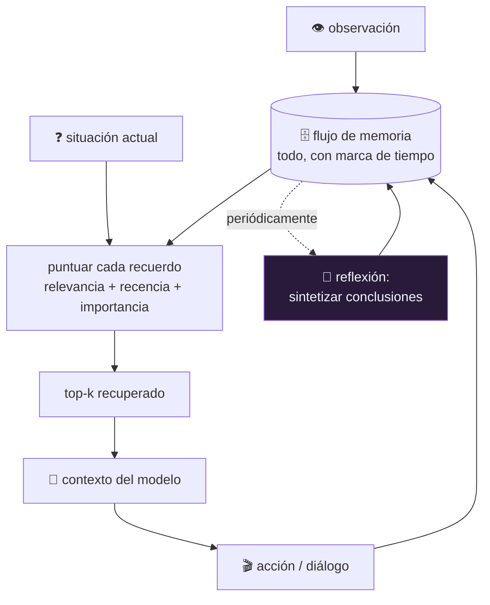

# P31 — Generative Agents

> Ruta de agentes · Resuelve la memoria de un agente que vive mucho tiempo: qué recordar, cuándo
> y por qué, cuando el contexto no da para todo.

**Nivel:** L3 · **Motor:** `generative_agents` · **Notebook:** [`P31_generative_agents.ipynb`](../../../notebooks/papers/P31_generative_agents.ipynb)
· **Anexo:** [álgebra y geometría](../../annexes/A01_ALGEBRA_Y_GEOMETRIA.md)

## 1. Identificación

| Campo | Valor |
|---|---|
| **Título original** | *Generative Agents: Interactive Simulacra of Human Behavior* |
| **Autoría** | Joon Sung Park, Joseph C. O'Brien, Carrie J. Cai, Meredith Ringel Morris, Percy Liang, Michael S. Bernstein |
| **Año** | 2023 |
| **Venue** | arXiv:2304.03442 · UIST 2023 |
| **Fuente primaria** | [arXiv:2304.03442](https://arxiv.org/abs/2304.03442) |
| **Acceso** | Abierto |
| **Fecha de consulta** | 2026-08-16 |

## 2. Problema anterior

[Reflexion](../P30_reflexion/README.md) recuerda entre intentos de una misma tarea. Pero un agente
que **vive** —que actúa durante días, conversa, cambia de plan— acumula una historia que no cabe
en ninguna ventana de contexto.

Y la solución obvia no funciona: guardar todo y recuperar lo más reciente devuelve lo trivial. Si
acabas de comprar café, eso será lo último; que mañana hay una fiesta importante quedará
enterrado.

## 3. Propuesta

Una arquitectura de memoria con tres piezas:

1. **Flujo de memoria**: todo se registra, con marca de tiempo, en lenguaje natural.
2. **Recuperación puntuada** por tres señales combinadas —relevancia respecto a la situación
   actual, recencia con decaimiento, e importancia intrínseca del recuerdo (que el propio modelo
   puntúa al guardarlo)—.
3. **Reflexión**: periódicamente, el agente sintetiza sus recuerdos en conclusiones de nivel
   superior («Klaus está muy metido en su investigación»), que se guardan como recuerdos nuevos y
   pueden a su vez sintetizarse.

Sobre esa memoria se construyen planificación y reacción, y todo ello se demuestra en una
simulación con veinticinco agentes.

## 4. Intuición sin fórmulas

Una persona no recuerda su día en orden cronológico: recuerda lo que viene a cuento. Si un agente
guarda todo y recupera lo último, recordará que compró café en vez de que mañana hay una fiesta.

**Dónde deja de funcionar la analogía:** la memoria humana olvida, distorsiona y consolida
durmiendo. Aquí nada se borra: se puntúa. Es un archivo con buen buscador, no una memoria.

## 5. Matemática mínima

```text
puntuación(m) = α_rel · relevancia(m, consulta)
              + α_rec · recencia(m)
              + α_imp · importancia(m)

    relevancia  = similitud coseno entre embeddings   (ver A01)
    recencia    = γ^(pasos desde el último acceso)    decaimiento exponencial
    importancia = puntuación del modelo al guardar    de 1 a 10
```

Se recuperan los `k` de mayor puntuación y **solo esos** entran al contexto. Las tres señales son
necesarias: sin relevancia se recupera ruido, sin recencia se ignora lo que acaba de pasar, y sin
importancia lo trivial reciente gana siempre.

<!-- puente:inicio -->
> [!TIP]
> **Puente matemático.** Esta sección da por sabido lo siguiente. Si algo no te suena,
> léelo primero: está explicado una sola vez, en un solo sitio, y sirve para todas las fichas.

| Dónde | Qué necesitas de ahí |
|---|---|
| [**A01 §2** · Norma y coseno](../../annexes/A01_ALGEBRA_Y_GEOMETRIA.md#2-norma-y-coseno) | el coseno, que es una de las tres señales de la puntuación de recuperación |
<!-- puente:fin -->

## 6. Arquitectura o flujo



## 7. Qué observar en el paper original

- La **arquitectura de memoria** en detalle: es la contribución técnica, por encima de la
  simulación que da titulares.
- El **árbol de reflexión**: las conclusiones se construyen sobre recuerdos y sobre otras
  conclusiones. Eso es lo que permite comportamiento coherente a lo largo de días simulados.
- La **evaluación con humanos**: se pide a personas que juzguen si el comportamiento es creíble, y
  se hacen **ablaciones** quitando memoria, reflexión o planificación. Esa tabla es la evidencia.
- El caso de la **fiesta de San Valentín**, que se propaga entre agentes sin que nadie lo
  programe: es el ejemplo más citado y conviene leer cómo se produce realmente.

## 8. Evidencia y resultados

Simulación de veinticinco agentes en un entorno tipo pueblo, con evaluación humana de la
credibilidad del comportamiento y ablaciones de cada componente de la arquitectura.

El resultado que sostiene el paper es de **ablación**: quitar memoria, reflexión o planificación
degrada la credibilidad juzgada por personas, y quitar la memoria es lo que más daña.

> Las condiciones del experimento, el número de evaluadores y los resultados por ablación están
> en el artículo. Verificarlos allí, y tener presente que «credibilidad juzgada por humanos» es
> una métrica subjetiva por construcción.

La miniatura de este eje aísla la recuperación: con las tres señales sube lo relevante e
importante; ordenando solo por recencia sube lo trivial.

## 9. Impacto

- Es la referencia obligada sobre **memoria de agentes de larga duración**, y su esquema de
  puntuación se copió por todas partes.
- Popularizó la idea de **reflexión como síntesis** —no solo como corrección de un fallo, que es
  lo de [Reflexion](../P30_reflexion/README.md)—.
- Abrió una línea de simulación social con agentes que se usa en ciencias sociales
  computacionales, con las cautelas metodológicas del caso.

## 10. Limitaciones

1. **Coste alto**: cada acción requiere recuperar, y cada reflexión más llamadas al modelo.
2. **La importancia la puntúa el propio modelo**, con sus sesgos y sin calibración.
3. **Nada se olvida nunca**: el flujo crece indefinidamente y la recuperación se encarece.
4. **La credibilidad no es corrección**: que un comportamiento parezca humano no lo hace correcto
   ni útil.
5. **Los pesos de las tres señales** son hiperparámetros sin una teoría que los fije.
6. **Riesgo de sobreinterpretación**: son simulacros de comportamiento, no modelos de personas, y
   usarlos como sustituto de participantes humanos en investigación es metodológicamente delicado.

## 11. Errores comunes

| Error | Corrección |
|---|---|
| «Los agentes tienen memoria» | Tienen un **archivo con recuperación puntuada**. No olvidan, no consolidan, no distorsionan. |
| «Es una demo tipo Los Sims» | La simulación es el vehículo; la contribución es la arquitectura de memoria y sus ablaciones. |
| «Simulan personas» | Simulan **comportamiento creíble** según jueces humanos. Los propios autores advierten contra el salto. |
| «Basta con RAG sobre el historial» | RAG recupera por relevancia. Aquí hacen falta las tres señales, y la reflexión no es recuperación sino síntesis. |
| «Se puede sustituir a participantes humanos» | Es precisamente el uso contra el que la comunidad ha advertido. |

## 12. Relación con trabajos anteriores

- **[P11 RAG](../P11_rag/README.md) (2020)** — la memoria consultable; aquí se le añaden recencia,
  importancia y síntesis.
- **[P13 ReAct](../P13_react/README.md) (2022)** — el bucle de acción sobre el que se monta.
- **[P30 Reflexion](../P30_reflexion/README.md) (2023)** — reflexión como corrección; aquí es síntesis.

## 13. Relación con trabajos posteriores

- **[P32 Voyager](../P32_voyager/README.md) (2023)** — memoria **procedimental** (habilidades) en
  vez de episódica (recuerdos).
- **[P16 Sistemas agentic](../P16_agentic_systems/README.md)** — la síntesis operativa del bloque.
- **Arquitecturas de memoria jerárquica (2023+)** — gestionar el contexto como un sistema operativo
  gestiona la memoria.

## 14. Notebook asociado

[`P31_generative_agents.ipynb`](../../../notebooks/papers/P31_generative_agents.ipynb)

**Qué implementa:** la puntuación de cinco recuerdos con las tres señales, la comparación con
ordenar solo por recencia, el efecto del factor de decaimiento y la cuenta de por qué concatenar
el historial no escala.

**Qué NO implementa:** la relevancia se calcula por solapamiento de conjuntos, no por embeddings;
la importancia está escrita a mano; y falta la reflexión, que es la mitad del aporte.

```bash
ai-evolution paper-lab P31 --seed 7
```

## 15. Actividades Bloom

| Nivel | Actividad |
|---|---|
| **Recordar** | Escribe la fórmula de puntuación y nombra las tres señales. |
| **Explicar** | Explica qué falla si se quita cada una de las tres. |
| **Aplicar** | Ejecuta el notebook y compara el ranking completo con el de solo recencia. |
| **Analizar** | Calcula cuántos tokens ocupa una semana de vida de un agente y decide si cabe. |
| **Evaluar** | «Credibilidad juzgada por humanos» como métrica: ¿qué mide y qué no? |
| **Crear** | Diseña una política de olvido y argumenta qué se pierde al no tenerla. |

## 16. Autoevaluación

1. ¿Por qué recuperar por recencia no funciona?
2. ¿Qué aporta cada una de las tres señales?
3. ¿Qué es la reflexión aquí y en qué se diferencia de la de Reflexion?
4. ¿Por qué no cabe todo en el contexto? Da una cuenta aproximada.
5. ¿Qué demuestran las ablaciones del paper?
6. ¿Por qué «credibilidad» no equivale a «corrección»?
7. ¿Qué diferencia hay entre memoria episódica y procedimental?

## 17. Respuestas esperadas

1. Porque lo más reciente suele ser lo más trivial. La utilidad de un recuerdo no depende de
   cuándo ocurrió sino de si viene a cuento ahora.
2. Relevancia filtra por tema; recencia da peso a lo que acaba de pasar; importancia evita que lo
   trivial reciente desplace a lo significativo antiguo.
3. Aquí es **síntesis**: agregar recuerdos en conclusiones de nivel superior que se guardan como
   memoria. En Reflexion es **corrección**: analizar un fallo para no repetirlo.
4. Un agente con ~30 eventos por hora genera miles de eventos en una semana; a decenas de tokens
   cada uno, se van a cientos de miles. No cabe, y concatenar tampoco sería útil.
5. Que cada componente aporta: quitar memoria, reflexión o planificación degrada la credibilidad
   evaluada por personas, y la memoria es la más determinante.
6. Porque un comportamiento puede parecer humano y ser inútil, sesgado o falso. La credibilidad
   mide verosimilitud percibida, no acierto.
7. La episódica guarda **qué pasó** (recuerdos); la procedimental guarda **qué sé hacer**
   (habilidades ejecutables), que es lo de [Voyager](../P32_voyager/README.md).

## 18. Fuentes primarias

- Park, J. S. et al. (2023). *Generative Agents: Interactive Simulacra of Human Behavior*.
  **UIST 2023**. [arXiv:2304.03442](https://arxiv.org/abs/2304.03442) · consultado 2026-08-16.
- Lewis, P. et al. (2020). *Retrieval-Augmented Generation*.
  [arXiv:2005.11401](https://arxiv.org/abs/2005.11401) · consultado 2026-08-16.

---

[⬅️ Anterior: P30 Reflexion](../P30_reflexion/README.md) ·
[📇 Índice](../../catalog/PAPERS_INDEX.md) ·
[📝 Evaluación](../../../assessments/papers/P31_generative_agents.md) ·
[🏫 Clase 107 · Knowledge graphs y GraphRAG](../../../classes/part-08-retrieval-context-memory-and-knowledge/107-knowledge-graphs-y-graphrag/README.md) ·
[➡️ Siguiente: P32 Voyager](../P32_voyager/README.md)
