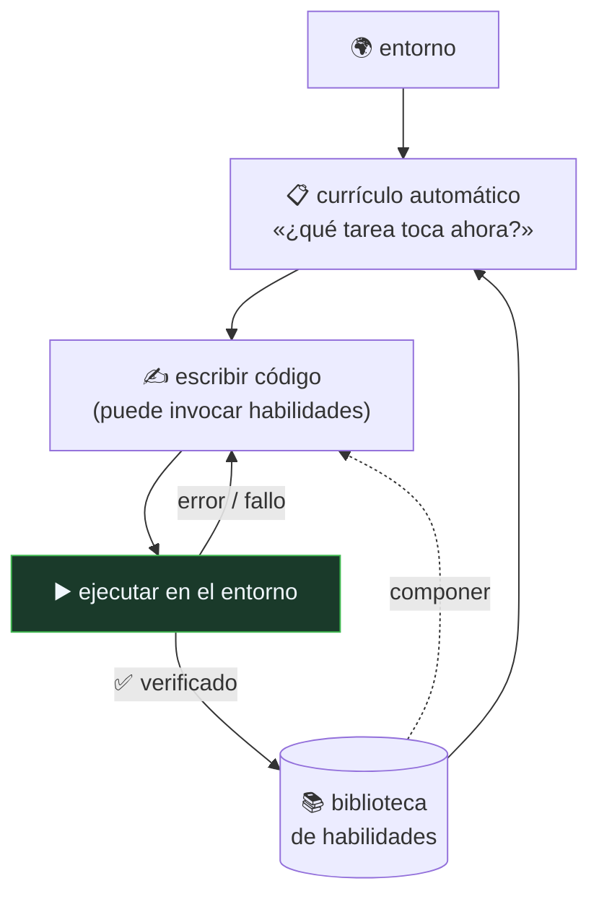

# P32 — Voyager

> Ruta de agentes · El agente acumula **habilidades reutilizables** en vez de contexto: memoria
> procedimental que no se borra al terminar la tarea.

**Nivel:** L3 · **Motor:** `voyager` · **Notebook:** [`P32_voyager.ipynb`](../../../notebooks/papers/P32_voyager.ipynb)
· **Anexo:** [complejidad y coste](../../annexes/A05_COMPLEJIDAD_Y_COSTE.md)

## 1. Identificación

| Campo | Valor |
|---|---|
| **Título original** | *Voyager: An Open-Ended Embodied Agent with Large Language Models* |
| **Autoría** | Guanzhi Wang, Yuqi Xie, Yunfan Jiang, Ajay Mandlekar, Chaowei Xiao, Yuke Zhu, Linxi Fan, Anima Anandkumar |
| **Año** | 2023 |
| **Venue** | arXiv:2305.16291 |
| **Fuente primaria** | [arXiv:2305.16291](https://arxiv.org/abs/2305.16291) |
| **Acceso** | Abierto |
| **Fecha de consulta** | 2026-08-16 |

## 2. Problema anterior

Un agente que resuelve cada tarea desde cero **no mejora con la experiencia**. Y la solución
inmediata —guardar lo aprendido como texto en el contexto— choca con dos muros: el contexto es
finito, y el texto no es ejecutable.

Además faltaba la otra mitad: en un entorno de final abierto, **nadie dice qué hacer a
continuación**. Sin objetivos, un agente competente no hace nada.

## 3. Propuesta

Tres componentes que se realimentan:

1. **Currículo automático**: el agente propone su siguiente tarea en función de lo que ya sabe y
   de lo que observa, buscando el punto en que sea alcanzable pero no trivial.
2. **Biblioteca de habilidades**: cada solución verificada se guarda como **código ejecutable**
   con nombre y descripción, e indexada para poder recuperarla. Las habilidades se componen unas
   con otras.
3. **Bucle iterativo de prompting**: se escribe código, se ejecuta en el entorno, y los errores
   del intérprete y la retroalimentación del juego alimentan el siguiente intento.

Se demuestra en Minecraft, un entorno de final abierto sin objetivo terminal.

## 4. Intuición sin fórmulas

Aprender a cocinar no es recordar cada vez la receta entera: es que «hacer un sofrito» pase a ser
una sola cosa que sabes hacer. Voyager guarda habilidades, no anécdotas.

**Dónde deja de funcionar la analogía:** una persona generaliza una habilidad a situaciones
parecidas. Aquí una habilidad es código concreto: si el entorno cambia lo suficiente, deja de
funcionar y no hay adaptación automática.

## 5. Matemática mínima

No hay ecuación; hay una estructura de composición:

```text
habilidad := [ primitiva | habilidad ]*

    conseguir_madera  = [talar, recoger]                          → 2 primitivas
    fabricar_mesa     = [conseguir_madera, fabricar]              → 3 primitivas
    fabricar_pico     = [conseguir_madera, fabricar_mesa, fabricar] → 6 primitivas
```

El **factor de compresión** —primitivas equivalentes dividido entre pasos declarados— crece con
el currículo. Eso es lo que significa acumular capacidad, frente a acumular texto: cada nivel
esconde más trabajo bajo el mismo número de pasos.

<!-- puente:inicio -->
> [!TIP]
> **Puente matemático.** Esta sección da por sabido lo siguiente. Si algo no te suena,
> léelo primero: está explicado una sola vez, en un solo sitio, y sirve para todas las fichas.

| Dónde | Qué necesitas de ahí |
|---|---|
| [**A05 §1** · Notación O(): qué dice y qué no](../../annexes/A05_COMPLEJIDAD_Y_COSTE.md#1-notación-o-qué-dice-y-qué-no) | reutilizar una habilidad cambia el orden de crecimiento del problema |
<!-- puente:fin -->

## 6. Arquitectura o flujo



La flecha que importa es la de **verificación**: solo entra en la biblioteca lo que se ejecutó y
funcionó.

## 7. Qué observar en el paper original

- Cómo se genera el **currículo**: qué información recibe el modelo para proponer la siguiente
  tarea y cómo se evita que proponga cosas imposibles.
- El formato de las **habilidades** —código con descripción— y cómo se recuperan cuando hacen falta.
- Las **ablaciones**: sin biblioteca, sin currículo, sin bucle iterativo. Ahí se ve qué aporta cada
  pieza.
- Las **curvas de progreso**: número de ítems distintos obtenidos y distancia recorrida frente a
  las líneas base. Es un entorno sin puntuación única, así que las métricas son necesariamente
  indirectas.

## 8. Evidencia y resultados

Evaluación en Minecraft frente a líneas base de agentes con modelos de lenguaje, midiendo
descubrimiento de ítems, progresión en el árbol tecnológico del juego y capacidad de generalizar
a mundos nuevos reutilizando la biblioteca.

> Las cifras concretas y las ablaciones están en el artículo. Verificarlas allí, y tener presente
> que es un preprint sin revisión por pares y que las métricas de un entorno de final abierto son
> discutibles por construcción.

La miniatura de este eje aísla la composición: la quinta tarea se declara en tres pasos pero
equivale a once acciones primitivas, y una habilidad rota sin verificar contamina las cuatro que
la componen.

## 9. Impacto

- Popularizó la **biblioteca de habilidades** como forma de memoria de agente, distinta de la
  episódica de [Generative Agents](../P31_generative_agents/README.md).
- Puso el foco en el **aprendizaje de final abierto**: qué hace un agente cuando nadie le da
  objetivos.
- Reforzó la idea de que **el código es una buena representación** de una capacidad: es
  ejecutable, componible, verificable y legible.

## 10. Limitaciones

1. **Depende de un entorno con retroalimentación programática** rica: errores de intérprete,
   estado consultable. Casi ningún dominio real lo tiene igual de limpio.
2. **Una habilidad no verificada contamina** todas las que la compongan.
3. **Sin generalización**: el código es concreto; un cambio en el entorno lo rompe.
4. **Coste alto** en llamadas al modelo por el bucle iterativo.
5. **La biblioteca crece** y recuperar la habilidad correcta se vuelve un problema de búsqueda.
6. **Preprint sin revisión por pares**, y las métricas de un mundo abierto son difíciles de
   comparar entre trabajos.

## 11. Errores comunes

| Error | Corrección |
|---|---|
| «El agente aprende como un humano» | Acumula funciones ejecutables verificadas. No generaliza ni transfiere por analogía. |
| «La biblioteca es memoria» | Es memoria **procedimental**. No recuerda qué pasó, sino qué sabe hacer. |
| «Basta con guardar lo que funcionó» | Sin verificación en el entorno, se guarda código que solo *parece* correcto y se propaga. |
| «Es un agente autónomo» | Opera dentro de un entorno concreto, con primitivas dadas y un objetivo implícito (explorar). |
| «Sirve para cualquier dominio» | Necesita ejecución verificable. Sin ella, el bucle no cierra. |

## 12. Relación con trabajos anteriores

- **[P13 ReAct](../P13_react/README.md) (2022)** — el bucle de acción y observación.
- **[P14 Toolformer](../P14_toolformer/README.md) (2023)** — aprender a usar herramientas; aquí se
  **crean** herramientas nuevas.
- **[P30 Reflexion](../P30_reflexion/README.md) (2023)** — el bucle de reintento con
  retroalimentación.

## 13. Relación con trabajos posteriores

- **[P33 AutoGen](../P33_autogen/README.md) (2023)** — de un agente que acumula a varios que se
  coordinan.
- **[P16 Sistemas agentic](../P16_agentic_systems/README.md)** — la síntesis operativa.
- **Agentes de programación (2023+)** — la biblioteca de habilidades como base de código que el
  agente mantiene.

## 14. Notebook asociado

[`P32_voyager.ipynb`](../../../notebooks/papers/P32_voyager.ipynb)

**Qué implementa:** la composición de habilidades con su factor de compresión, el experimento de
la habilidad rota que contamina a las que dependen de ella, y el contrato de entrada a la
biblioteca.

**Qué NO implementa:** las habilidades son listas de nombres, no programas. No hay entorno, así
que nada se ejecuta ni puede fallar — que es exactamente donde está la dificultad real.

```bash
ai-evolution paper-lab P32 --seed 7
```

## 15. Actividades Bloom

| Nivel | Actividad |
|---|---|
| **Recordar** | Enumera los tres componentes y di qué hace cada uno. |
| **Explicar** | Explica la diferencia entre memoria episódica y procedimental. |
| **Aplicar** | Ejecuta el notebook y calcula el factor de compresión de cada tarea. |
| **Analizar** | ¿Cuántas tareas se rompen si falla una habilidad de nivel 1? Cuéntalo en el grafo. |
| **Evaluar** | ¿Qué dominio de tu trabajo cumple el requisito de ejecución verificable? |
| **Crear** | Escribe el contrato de entrada a una biblioteca de habilidades para tu dominio. |

## 16. Autoevaluación

1. ¿Qué problema resuelve la biblioteca que el contexto no puede resolver?
2. ¿Por qué el código es una buena representación de una habilidad?
3. ¿Para qué sirve el currículo automático?
4. ¿Qué pasa si se guarda una habilidad sin verificar?
5. ¿Qué requisito del entorno es imprescindible?
6. ¿Qué significa el factor de compresión?
7. ¿En qué se diferencia de Toolformer?

## 17. Respuestas esperadas

1. La persistencia y el coste: el contexto es finito y se pierde al terminar; la biblioteca crece
   sin ocupar contexto y se invoca por nombre.
2. Porque es ejecutable (se puede verificar), componible (se puede invocar desde otra), legible
   (se puede auditar) y persistente.
3. Para que el agente tenga objetivos en un entorno sin objetivo terminal, y que esos objetivos
   estén en el punto justo de dificultad dado lo que ya sabe.
4. Se propaga a todas las habilidades que la compongan: un fallo de nivel 1 rompe todo lo que
   dependa de él, directa o indirectamente.
5. Retroalimentación programática verificable: poder ejecutar y saber si funcionó.
6. Cuántas acciones primitivas esconde cada paso declarado. Crece con el currículo, y es la
   medida de que se está acumulando capacidad y no texto.
7. Toolformer aprende **cuándo llamar** a herramientas que ya existen; Voyager **crea** las
   herramientas y las guarda.

## 18. Fuentes primarias

- Wang, G. et al. (2023). *Voyager: An Open-Ended Embodied Agent with Large Language Models*.
  [arXiv:2305.16291](https://arxiv.org/abs/2305.16291) · consultado 2026-08-16.
- Schick, T. et al. (2023). *Toolformer*.
  [arXiv:2302.04761](https://arxiv.org/abs/2302.04761) · consultado 2026-08-16.

---

[⬅️ Anterior: P31 Generative Agents](../P31_generative_agents/README.md) ·
[📇 Índice](../../catalog/PAPERS_INDEX.md) ·
[📝 Evaluación](../../../assessments/papers/P32_voyager.md) ·
[🏫 Clase 147 · Proyecto: agente que actúa con límites](../../../classes/part-11-embodied-ai-robotics-and-computer-use/147-proyecto-agente-que-actua-con-limites/README.md) ·
[➡️ Siguiente: P33 AutoGen](../P33_autogen/README.md)
