# P33 — AutoGen

> Ruta de agentes · El multiagente deja de ser una metáfora y pasa a ser un patrón de
> programación: agentes con rol que conversan hasta converger.

**Nivel:** L4 · **Motor:** `autogen` · **Notebook:** [`P33_autogen.ipynb`](../../../notebooks/papers/P33_autogen.ipynb)
· **Anexo:** [complejidad y coste](../../annexes/A05_COMPLEJIDAD_Y_COSTE.md)

## 1. Identificación

| Campo | Valor |
|---|---|
| **Título original** | *AutoGen: Enabling Next-Gen LLM Applications via Multi-Agent Conversation* |
| **Autoría** | Qingyun Wu, Gagan Bansal, Jieyu Zhang, Yiran Wu y otros |
| **Año** | 2023 |
| **Venue** | arXiv:2308.08155 |
| **Fuente primaria** | [arXiv:2308.08155](https://arxiv.org/abs/2308.08155) |
| **Acceso** | Abierto |
| **Fecha de consulta** | 2026-08-16 |

## 2. Problema anterior

Un solo agente escribe y juzga su propio trabajo, así que arrastra sus propios puntos ciegos: lee
lo que quiso escribir. [Reflexion](../P30_reflexion/README.md) mitiga eso con reintentos, pero
sigue siendo el mismo agente evaluándose.

Y había un problema de ingeniería: componer varios agentes, decidir quién habla cuándo, meter a
una persona en el bucle o permitir ejecución de código se hacía **ad hoc** en cada proyecto. No
existía una abstracción común.

## 3. Propuesta

Modelar la aplicación como una **conversación entre agentes configurables**. Cada agente se define
por tres ejes:

- qué modelo usa (o si no usa ninguno);
- si ejecuta código;
- si tiene una persona detrás (human-in-the-loop, en varios grados).

Y los patrones de conversación —quién habla, en qué orden, cuándo termina— se **programan**: hay
conversaciones de dos, en grupo con moderador, jerárquicas y anidadas.

La tesis: muchas aplicaciones se expresan mejor como conversación multiagente que como un único
prompt largo, y tener una abstracción común hace ese diseño reutilizable.

## 4. Intuición sin fórmulas

Quien escribe un texto es mal corrector de su propio texto. Poner a otro a revisarlo no es
redundancia: es un punto de vista distinto sobre el mismo trabajo.

**Dónde deja de funcionar la analogía:** dos revisores humanos tienen experiencias distintas. Dos
agentes con el mismo modelo base comparten sesgos, así que la «segunda opinión» puede ser la
misma opinión con otro nombre. La diferencia hay que construirla con el rol y el objetivo.

## 5. Matemática mínima

No hay ecuación. Hay una cuenta de coste que conviene hacer siempre:

```text
Un agente    : 1 llamada al modelo
Multiagente  : T llamadas, con T = turnos hasta converger

Coste relativo = T
Beneficio      = P(detectar error | multiagente) − P(detectar error | uno solo)
```

Multiagente compensa **si y solo si** el error que captura cuesta más que los turnos que añade.
Esa desigualdad casi nunca se escribe, y es la que decide.

Fiabilidad compuesta, además: con `n` agentes y probabilidad `p` de que cada uno haga bien su
parte, el sistema completo va como `p^n` salvo que haya verificación entre pasos.

<!-- puente:inicio -->
> [!TIP]
> **Puente matemático.** Esta sección da por sabido lo siguiente. Si algo no te suena,
> léelo primero: está explicado una sola vez, en un solo sitio, y sirve para todas las fichas.

| Dónde | Qué necesitas de ahí |
|---|---|
| [**A05 §6** · La cuenta que casi nadie hace: inferencia](../../annexes/A05_COMPLEJIDAD_Y_COSTE.md#6-la-cuenta-que-casi-nadie-hace-inferencia) | el coste de inferencia se multiplica por el número de agentes y de turnos |
<!-- puente:fin -->

## 6. Arquitectura o flujo

```mermaid
flowchart TD
    U["👤 usuario"] --> P["📋 planificador"]
    P --> C["💻 programador"]
    C --> X["▶️ ejecutar código"]
    X --> K["🔍 crítico<br/>objetivo: ENCONTRAR fallos"]
    K -->|"falla: «rompe con lista vacía»"| C
    K -->|"pasa"| E["✅ entregar"]
    K -.->|"presupuesto agotado"| H["🙋 escalar a humano"]
    style K fill:#3a2a1a,stroke:#d29922
```



El crítico funciona porque su **objetivo es distinto**: encontrar fallos, no producir código. Si
comparte prompt y objetivo con el programador, la crítica se vuelve ceremonial.

## 7. Qué observar en el paper original

- Los **patrones de conversación** que catalogan y en qué tipo de problema encaja cada uno.
- Los casos donde el multiagente **no** mejora: es la sección más útil y la que menos se cita.
- Cómo integran la **ejecución de código** y el **humano en el bucle** como grados de un mismo eje,
  no como casos especiales.
- Que es un **artículo de sistema**: describe un marco y sus aplicaciones, no un estudio
  controlado con ablaciones limpias. Hay que leerlo con esa expectativa.

## 8. Evidencia y resultados

Demostración del marco en seis aplicaciones —matemáticas, programación, respuesta a preguntas,
juegos, análisis de datos— con comparaciones frente a implementaciones de un solo agente.

> Los resultados por aplicación están en el artículo. Verificarlos allí, y con una cautela: en un
> paper de sistema, la línea base de «un solo agente» no siempre está tan optimizada como la
> propuesta. Es el sesgo estructural de este tipo de trabajos.

La miniatura de este eje muestra el mecanismo y su precio: la conversación detecta un fallo que el
agente único entrega sin ver, a cambio de cinco veces más turnos.

## 9. Impacto

- Convirtió el multiagente en un patrón con vocabulario común: rol, turno, moderador, terminación.
- Popularizó el **crítico** como rol explícito, que hoy aparece en casi todos los sistemas de
  generación de código.
- Empujó la discusión hacia la **orquestación** —quién habla, cuándo se para, quién decide— que
  es donde están los fallos operativos reales.

## 10. Limitaciones

1. **Coste multiplicado** por el número de turnos, en dinero y en latencia.
2. **Sin criterio de parada, no converge**: dos agentes educados pueden felicitarse indefinidamente.
3. **Sesgos compartidos**: agentes con el mismo modelo base pueden coincidir en el error.
4. **Sicofancia entre agentes**: el crítico puede aprender a aprobar, sobre todo si no ejecuta nada.
5. **Fiabilidad compuesta**: más agentes, más puntos de fallo, salvo verificación entre pasos.
6. **Línea base débil**: la comparación honesta es contra un agente único **bien construido**, no
   contra uno ingenuo.
7. **Artículo de sistema**, no estudio controlado: difícil atribuir la mejora a la arquitectura.

## 11. Errores comunes

| Error | Corrección |
|---|---|
| «Más agentes es mejor» | Cada agente añade coste, latencia y modos de fallo. Hay que demostrar qué error captura que uno solo no captura. |
| «El crítico garantiza calidad» | Solo si tiene objetivo distinto **y** acceso a evidencia (ejecución, tests). Si no, aprueba. |
| «Es como un equipo humano» | Comparten modelo base y por tanto sesgos. La diversidad hay que diseñarla, no viene dada. |
| «Multiagente resuelve la fiabilidad» | La empeora si no hay verificación: los fallos se componen. |
| «AutoGen inventó el multiagente» | Los sistemas multiagente son un área clásica de la IA. Lo nuevo es la abstracción conversacional sobre modelos de lenguaje. |

## 12. Relación con trabajos anteriores

- **[P13 ReAct](../P13_react/README.md) (2022)** — el bucle de un agente.
- **[P30 Reflexion](../P30_reflexion/README.md) (2023)** — autocrítica dentro del mismo agente.
- **Sistemas multiagente clásicos** — el área de la parte 10 del programa, anterior a los LLM.

## 13. Relación con trabajos posteriores

- **[P16 Sistemas agentic](../P16_agentic_systems/README.md)** — la síntesis operativa: presupuesto,
  criterio de parada, permisos y trazas.
- **Model Context Protocol (2024)** — interoperabilidad de herramientas entre agentes y
  proveedores. [modelcontextprotocol.io](https://modelcontextprotocol.io)
- **Evaluación de sistemas multiagente (2024+)** — el problema abierto: cómo comparar
  arquitecturas de forma justa.

## 14. Notebook asociado

[`P33_autogen.ipynb`](../../../notebooks/papers/P33_autogen.ipynb)

**Qué implementa:** la comparación entre una entrega de un solo agente y una conversación de tres
roles que detecta y corrige el fallo, el coste relativo en turnos, el anti-patrón de conversación
sin criterio de parada y un protocolo con terminación, detección de bucle y escalamiento.

**Qué NO implementa:** los mensajes están escritos a mano. En el paper los genera un modelo, y el
crítico puede equivocarse o adular — que es el modo de fallo interesante.

```bash
ai-evolution paper-lab P33 --seed 7
```

## 15. Actividades Bloom

| Nivel | Actividad |
|---|---|
| **Recordar** | Nombra los tres ejes que definen un agente en este marco. |
| **Explicar** | Explica por qué el crítico necesita un objetivo distinto del programador. |
| **Aplicar** | Ejecuta el notebook y calcula el coste relativo en turnos. |
| **Analizar** | Con 4 agentes al 90 % de fiabilidad y sin verificación, ¿cuál es la fiabilidad del sistema? |
| **Evaluar** | Te presentan un sistema multiagente con +12 % de exactitud. ¿Qué línea base y qué costes pides? |
| **Crear** | Diseña un protocolo de conversación con criterio de parada, detección de bucle y escalamiento. |

## 16. Autoevaluación

1. ¿Qué añade un crítico que un solo agente no puede aportar?
2. ¿Bajo qué condición deja de aportar?
3. ¿Cuál es el fallo operativo característico de una conversación multiagente?
4. ¿Por qué la fiabilidad puede empeorar al añadir agentes?
5. ¿Cuál es la línea base honesta?
6. ¿Qué significa que sea un «artículo de sistema»?
7. ¿Qué relación tiene con la sección de límites de [P16](../P16_agentic_systems/README.md)?

## 17. Respuestas esperadas

1. Un punto de vista con **objetivo distinto**: buscar fallos en vez de producir. Eso cambia qué
   partes del trabajo recibe atención.
2. Cuando comparte prompt, modelo y objetivo con el autor, o cuando no tiene acceso a evidencia
   (ejecución, tests) y solo puede opinar.
3. No terminar: sin criterio de parada, los agentes pueden alternar indefinidamente, y cada turno
   cuesta una llamada al modelo.
4. Porque los fallos se componen: con `n` pasos al `p` de fiabilidad y sin verificación entre
   ellos, el sistema va como `p^n`.
5. Un agente único **bien construido** —con buen prompt, con acceso a las mismas herramientas y
   con reintentos—, no una versión ingenua.
6. Que describe un marco y sus aplicaciones sin aislar la contribución de la arquitectura frente
   a los prompts, el modelo o la ingeniería. Pide replicación independiente.
7. Es el paper que aporta la pieza de orquestación; P16 añade lo que falta para operarlo:
   presupuesto, criterio de parada, permisos, trazas y escalamiento.

## 18. Fuentes primarias

- Wu, Q. et al. (2023). *AutoGen: Enabling Next-Gen LLM Applications via Multi-Agent
  Conversation*. [arXiv:2308.08155](https://arxiv.org/abs/2308.08155) · consultado 2026-08-16.
- *Model Context Protocol* — especificación abierta.
  [modelcontextprotocol.io](https://modelcontextprotocol.io) · consultado 2026-08-16.

---

[⬅️ Anterior: P32 Voyager](../P32_voyager/README.md) ·
[📇 Índice](../../catalog/PAPERS_INDEX.md) ·
[📝 Evaluación](../../../assessments/papers/P33_autogen.md) ·
[🏫 Clase 124 · Workflow, subagente y multiagente](../../../classes/part-10-multi-agent-systems-and-interoperability/124-workflow-subagente-y-sistema-multiagente/README.md) ·
[🔭 Frontera del programa](../../../frontier/current-topics.yaml) ·
[🗺️ Fin de la ruta de agentes](../../ROADMAP.md)
