# P34 — RoPE

> Memoria y contexto · La posición se codifica **rotando**, y la atención pasa a depender solo de
> la distancia relativa. Es la base de casi todo modelo actual.

**Nivel:** L3 · **Motor:** `rope` · **Notebook:** [`P34_rope.ipynb`](../../../notebooks/papers/P34_rope.ipynb)
· **Anexo:** [álgebra y geometría](../../annexes/A01_ALGEBRA_Y_GEOMETRIA.md)

## 1. Identificación

| Campo | Valor |
|---|---|
| **Título original** | *RoFormer: Enhanced Transformer with Rotary Position Embedding* |
| **Autoría** | Jianlin Su, Yu Lu, Shengfeng Pan, Ahmed Murtadha, Bo Wen, Yunfeng Liu |
| **Año** | 2021 |
| **Venue** | arXiv:2104.09864 |
| **Fuente primaria** | [arXiv:2104.09864](https://arxiv.org/abs/2104.09864) |
| **Acceso** | Abierto |
| **Fecha de consulta** | 2026-08-16 |

## 2. Problema anterior

La codificación sinusoidal del [Transformer](../P08_transformer/README.md) se **suma** al
embedding y codifica posición **absoluta**. Pero en lenguaje lo que importa casi siempre es la
distancia: que dos palabras estén separadas por tres posiciones significa lo mismo al principio
de un documento que al final.

Existían variantes con posición relativa (Shaw et al., 2018), pero añadían parámetros, tablas o
términos extra en el cálculo de la atención.

## 3. Propuesta

Rotar los vectores de consulta y clave según su posición, por pares de coordenadas. La propiedad
que se busca —y que se demuestra— es que el producto escalar entre una consulta en la posición
`m` y una clave en la `n` depende **solo de `m − n`**.

La posición absoluta se usa para construir la rotación, pero desaparece del resultado. Sin
parámetros nuevos, sin tablas y sin cambiar la forma de la ecuación de atención.

## 4. Intuición sin fórmulas

Dos relojes puestos en hora distinta. Si comparas sus manecillas, lo que obtienes no depende de
qué hora marque cada uno, sino de la diferencia entre ambos.

**Dónde deja de funcionar la analogía:** las manecillas dan la vuelta y se repiten. Las
frecuencias de RoPE están elegidas para que, en el rango de trabajo, posiciones distintas no
colisionen — y ese rango es finito.

## 5. Matemática mínima

```text
Para cada par de coordenadas (2i, 2i+1) y posición m, con θᵢ = 10000^(−2i/d):

    R_m = [ cos(mθᵢ)  −sin(mθᵢ) ]
          [ sin(mθᵢ)   cos(mθᵢ) ]

    q_m = R_m · q      k_n = R_n · k

    ⟨q_m, k_n⟩ = ⟨R_m·q, R_n·k⟩ = qᵀ R_{n−m} k      ← solo la DIFERENCIA
```

La última igualdad sale de que las rotaciones componen: `R_mᵀ R_n = R_{n−m}`. Ahí está todo el
paper.

<!-- puente:inicio -->
> [!TIP]
> **Puente matemático.** Esta sección da por sabido lo siguiente. Si algo no te suena,
> léelo primero: está explicado una sola vez, en un solo sitio, y sirve para todas las fichas.

| Dónde | Qué necesitas de ahí |
|---|---|
| [**A01 §4** · Matrices como transformaciones](../../annexes/A01_ALGEBRA_Y_GEOMETRIA.md#4-matrices-como-transformaciones) | una rotación es una matriz ortogonal: preserva la norma y cambia el ángulo |
| [**A04** · la atención paso a paso](../../annexes/A04_ATENCION_PASO_A_PASO.md) | dónde entra exactamente la posición dentro del cálculo de la atención |
<!-- puente:fin -->

## 6. Arquitectura o flujo

```mermaid
flowchart LR
    Q["q en posición m"] --> RM["rotar por m"]
    K["k en posición n"] --> RN["rotar por n"]
    RM --> P["producto escalar"]
    RN --> P
    P --> R["resultado = f(q, k, m−n)<br/>la posición absoluta se cancela"]
    style R fill:#1a3a2a,stroke:#3fb950
```



## 7. Qué observar en el paper original

- La **demostración** de que el producto solo depende de `m − n`. Es corta y merece seguirse.
- La elección de **frecuencias** por par de coordenadas, heredada de la codificación sinusoidal.
- El argumento sobre el **decaimiento** del producto con la distancia, que se presenta como
  propiedad deseable en lenguaje.
- Que se aplica a **q y k**, no al embedding de entrada: eso es lo que permite que la
  cancelación ocurra dentro de la atención.

## 8. Evidencia y resultados

Experimentos en tareas de comprensión y en modelado de lenguaje comparando RoPE con
codificaciones absolutas y relativas previas.

> Las cifras por tarea están en el artículo. Verificarlas allí. La adopción masiva de RoPE se
> debe tanto a sus resultados como a su simplicidad de implementación, y conviene no confundir
> ambas razones.

La miniatura de este eje comprueba la propiedad central: las parejas (5,3), (50,48) y (500,498)
dan **exactamente** el mismo producto escalar.

## 9. Impacto

- Es la codificación posicional de la mayoría de modelos de lenguaje abiertos actuales.
- Al no añadir parámetros, se convirtió en el valor por defecto sin coste de adopción.
- Su formulación abrió la vía a las técnicas de **extensión de contexto** por interpolación de
  posiciones, que son posteriores y no están en este paper.

## 10. Limitaciones

1. **No garantiza extrapolación**: fuera del rango de posiciones visto en entrenamiento, el
   rendimiento cae. Las técnicas para arreglarlo son posteriores.
2. El **decaimiento con la distancia** es un sesgo, y hay tareas donde es indeseable.
3. Se aplica a la atención: **no** resuelve el coste cuadrático, que es otro problema
   ([P35](../P35_flashattention/README.md)).
4. **Es un preprint** sin revisión por pares en su forma original.
5. La elección de la base (10000) es heredada y no está optimizada en el artículo.

## 11. Errores comunes

| Error | Corrección |
|---|---|
| «RoPE permite contexto infinito» | Da posición relativa. Extender el contexto exige interpolación de posiciones, que es trabajo posterior. |
| «Es una codificación posicional más» | Es la única común que hace que la posición absoluta **se cancele** dentro del producto de atención. |
| «Se suma al embedding» | Se aplica **rotando q y k**, dentro de la atención. Ahí está la diferencia. |
| «Resuelve el coste de la atención» | No toca el coste. Ese es el problema de FlashAttention y de Mamba. |

## 12. Relación con trabajos anteriores

- **[P08 Transformer](../P08_transformer/README.md) (2017)** — la codificación sinusoidal que sustituye.
- **Shaw et al. (2018)** — posición relativa con parámetros extra.
  [arXiv:1803.02155](https://arxiv.org/abs/1803.02155)

## 13. Relación con trabajos posteriores

- **[P35 FlashAttention](../P35_flashattention/README.md) (2022)** — el otro pilar del contexto largo.
- **Interpolación y extensión de posiciones (2023+)** — hacen extrapolable lo que RoPE no extrapola solo.
- **[P20 Mamba](../P20_mamba/README.md) (2023)** — la alternativa que prescinde de posiciones.

## 14. Notebook asociado

[`P34_rope.ipynb`](../../../notebooks/papers/P34_rope.ipynb)

**Qué implementa:** la rotación por posición, la comprobación de invariancia relativa y la tabla
de decaimiento con la distancia.

**Qué NO implementa:** ni modelo, ni entrenamiento, ni extensión de contexto.

```bash
ai-evolution paper-lab P34 --seed 7
```

## 15. Actividades Bloom

| Nivel | Actividad |
|---|---|
| **Recordar** | Escribe la matriz de rotación y di sobre qué se aplica. |
| **Explicar** | Explica por qué la posición absoluta se cancela en el producto. |
| **Aplicar** | Ejecuta el notebook y verifica la invariancia con tres parejas propias. |
| **Analizar** | ¿Qué le pasa al producto con distancia 0? ¿Y por qué decae? |
| **Evaluar** | «RoPE da contexto infinito». Reescribe la afirmación de forma defendible. |
| **Crear** | Diseña un experimento que mida hasta qué posición extrapola un modelo con RoPE. |

## 16. Autoevaluación

1. ¿Sobre qué vectores se aplica la rotación y por qué ahí?
2. ¿Por qué `R_mᵀ R_n = R_{n−m}` es la clave de todo?
3. ¿Qué parámetros nuevos añade RoPE?
4. ¿Qué NO resuelve?
5. ¿Por qué el decaimiento con la distancia se considera deseable en lenguaje?
6. ¿Qué hace falta para extender el contexto más allá del entrenamiento?
7. ¿En qué se diferencia de la codificación sinusoidal de P08?

## 17. Respuestas esperadas

1. Sobre `q` y `k`, dentro de la atención. Si se aplicara al embedding de entrada, la
   cancelación no ocurriría en el producto escalar.
2. Porque hace que el producto dependa solo de la diferencia de posiciones: es la propiedad que
   convierte una codificación absoluta en un efecto relativo.
3. Ninguno. La rotación se calcula, no se aprende.
4. El coste cuadrático de la atención, la extrapolación a longitudes no vistas y la calidad del
   uso del contexto largo.
5. Porque en lenguaje la dependencia entre palabras tiende a decaer con la distancia: es un
   sesgo inductivo alineado con el dominio.
6. Técnicas posteriores de interpolación o reescalado de posiciones. No está en este paper.
7. La sinusoidal se **suma** al embedding y codifica posición absoluta; RoPE **rota** q y k, y el
   resultado depende solo de la distancia.

## 18. Fuentes primarias

- Su, J. et al. (2021). *RoFormer: Enhanced Transformer with Rotary Position Embedding*.
  [arXiv:2104.09864](https://arxiv.org/abs/2104.09864) · consultado 2026-08-16.
- Shaw, P., Uszkoreit, J. y Vaswani, A. (2018). *Self-Attention with Relative Position
  Representations*. [arXiv:1803.02155](https://arxiv.org/abs/1803.02155) · consultado 2026-08-16.

---

[📇 Índice](../../catalog/PAPERS_INDEX.md) ·
[📝 Evaluación](../../../assessments/papers/P34_rope.md) ·
[🏫 Clase 055 · Atención y Transformer](../../../classes/part-04-neural-networks-and-deep-learning/055-atencion-y-arquitectura-transformer/README.md) ·
[➡️ Siguiente: P35 FlashAttention](../P35_flashattention/README.md)
