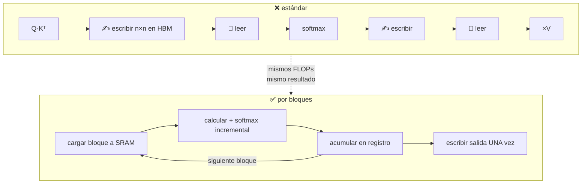

# P35 — FlashAttention

> Memoria y contexto · El cuello de botella de la atención no eran los FLOPs sino las lecturas y
> escrituras a memoria. Y la solución es **exacta**, no una aproximación.

**Nivel:** L4 · **Motor:** `flashattention` · **Notebook:** [`P35_flashattention.ipynb`](../../../notebooks/papers/P35_flashattention.ipynb)
· **Anexo:** [complejidad y coste](../../annexes/A05_COMPLEJIDAD_Y_COSTE.md)

## 1. Identificación

| Campo | Valor |
|---|---|
| **Título original** | *FlashAttention: Fast and Memory-Efficient Exact Attention with IO-Awareness* |
| **Autoría** | Tri Dao, Daniel Y. Fu, Stefano Ermon, Atri Rudra, Christopher Ré |
| **Año** | 2022 |
| **Venue** | arXiv:2205.14135 · NeurIPS 2022 |
| **Fuente primaria** | [arXiv:2205.14135](https://arxiv.org/abs/2205.14135) |
| **Acceso** | Abierto |
| **Fecha de consulta** | 2026-08-16 |

## 2. Problema anterior

Desde 2019 la comunidad atacaba el coste `O(n²)` de la atención con **aproximaciones**: atención
dispersa, lineal, de bajo rango. Reducían los FLOPs sobre el papel y, en la práctica, muchas no
aceleraban nada — y sí perdían calidad.

El diagnóstico estaba equivocado. El proceso no estaba limitado por cómputo sino por **memoria**:
materializar la matriz de atención `n×n` y moverla entre la memoria lenta de la GPU (HBM) y la
rápida del chip (SRAM) costaba más que las multiplicaciones.

## 3. Propuesta

Reorganizar el cálculo para que la matriz de atención **nunca llegue a existir** en memoria
lenta. Se recorre por bloques que caben en SRAM, se calcula el softmax de forma **incremental**
con reescalado, y se acumula el resultado.

Dos consecuencias que conviene separar: el resultado es **numéricamente exacto** —no es una
aproximación— y los FLOPs son los mismos. Lo único que cambia es el tráfico de memoria.

## 4. Intuición sin fórmulas

Cocinar con la despensa lejos. No es que cortar y freír sea lento: es que vas y vuelves a la
despensa por cada ingrediente. La solución no es cocinar menos, es traer una bandeja con lo que
necesitas y trabajar sin moverte.

**Dónde deja de funcionar la analogía:** el softmax necesita el máximo y la suma de **toda** la
fila, que no cabe en la bandeja. Por eso hace falta el reescalado incremental, que es la parte
técnicamente difícil.

## 5. Matemática mínima

```text
Softmax incremental (estabilidad + acumulación por bloques):

    para cada bloque j:
        m_nuevo = max(m_viejo, max(S_j))
        l_nuevo = e^{m_viejo − m_nuevo}·l_viejo + Σ e^{S_j − m_nuevo}
        O_nuevo = e^{m_viejo − m_nuevo}·O_viejo + e^{S_j − m_nuevo}·V_j

Accesos a memoria lenta:
    estándar:  Θ(n² + n·d)          ← materializa la matriz
    por bloques: Θ(n²·d² / M)       ← M = tamaño de SRAM
```

Como `M ≫ d`, el segundo es mucho menor. Y la salida es idéntica bit a bit salvo redondeo.

## 6. Arquitectura o flujo



## 7. Qué observar en el paper original

- El **análisis de accesos a memoria**: es la contribución conceptual, más que el algoritmo.
- La derivación del **softmax por bloques con reescalado**, que es lo que hace posible no
  materializar la matriz.
- Los **speedups medidos**, y en qué configuraciones: no son uniformes.
- El apartado de **Path-X y Path-256**: por primera vez un Transformer supera el azar en esas
  tareas de secuencia larguísima, no por ser más listo sino por poder ejecutarse.

## 8. Evidencia y resultados

Medidas de aceleración de extremo a extremo en entrenamiento, y resultados en tareas de secuencia
larga que antes eran inabordables.

El artículo reporta **15 % de aceleración en BERT-large** (longitud 512), **3× en GPT-2**
(longitud 1K) y **2,4× en Long Range Arena** (1K–4K), además de habilitar Path-X (16K) y
Path-256 (64K), donde antes no se superaba el azar.

> Verificar las condiciones exactas en el artículo: los speedups dependen del hardware, la
> longitud y la configuración.

La miniatura de este eje cuenta accesos a memoria frente a FLOPs, y muestra que con `n = 65 536`
la reducción de tráfico es de más de un orden de magnitud **con los mismos FLOPs**.

## 9. Impacto

- Es una de las razones prácticas de que existan modelos con contexto largo: pasó de ser un
  problema de investigación a uno de ingeniería resuelta.
- Se integró como implementación por defecto en las bibliotecas principales, así que casi todo
  el mundo lo usa sin saberlo.
- Reorientó el trabajo sobre eficiencia: de reducir FLOPs a **considerar la jerarquía de memoria**.

## 10. Limitaciones

1. **No cambia la complejidad asintótica**: sigue siendo `O(n²)` en cómputo.
2. **Depende del hardware**: la ganancia se calcula sobre una jerarquía de memoria concreta.
3. **Implementación compleja**: es un kernel de bajo nivel, no unas líneas de código.
4. **No ayuda con lotes muy pequeños** ni secuencias cortas, donde el proceso no está limitado
   por memoria.
5. **No resuelve** que el modelo **use** bien el contexto largo, que es el problema de
   [P36](../P36_lost_in_middle/README.md).

## 11. Errores comunes

| Error | Corrección |
|---|---|
| «Es una atención aproximada» | Es **exacta**. Da el mismo resultado; cambia cómo se calcula. |
| «Reduce el coste a O(n)» | El cómputo sigue siendo cuadrático. Lo que baja es el tráfico de memoria. |
| «Resuelve el contexto largo» | Lo hace **viable**. Que el modelo lo aproveche es otro problema. |
| «Optimizar FLOPs es optimizar velocidad» | Es la lección del paper: en hardware moderno, mover datos suele costar más que calcular. |

## 12. Relación con trabajos anteriores

- **[P08 Transformer](../P08_transformer/README.md) (2017)** — la atención cuyo coste se ataca.
- **Atención aproximada (2019–2021)** — la línea de trabajo que este paper desplaza.
- **Modelo roofline y jerarquía de memoria** — la clase 081 del programa.

## 13. Relación con trabajos posteriores

- **[P36 Lost in the Middle](../P36_lost_in_middle/README.md) (2023)** — el contexto largo ya es
  viable; ahora se mide si sirve.
- **[P20 Mamba](../P20_mamba/README.md) (2023)** — la alternativa por arquitectura al mismo problema.
- **Versiones posteriores de FlashAttention** — más optimizaciones sobre la misma idea.

## 14. Notebook asociado

[`P35_flashattention.ipynb`](../../../notebooks/papers/P35_flashattention.ipynb)

**Qué implementa:** el conteo comparado de FLOPs y accesos a memoria, y la memoria que ocuparía
la matriz de atención a distintas longitudes.

**Qué NO implementa:** el kernel, el softmax por bloques con reescalado ni ninguna medida real
de tiempo. Es un modelo de coste, no una implementación.

```bash
ai-evolution paper-lab P35 --seed 7
```

## 15. Actividades Bloom

| Nivel | Actividad |
|---|---|
| **Recordar** | Di qué se materializa en la versión estándar y qué no en la de bloques. |
| **Explicar** | Explica por qué el algoritmo es exacto pese a calcular por bloques. |
| **Aplicar** | Ejecuta el notebook y calcula la memoria de la matriz para n = 128 000. |
| **Analizar** | ¿Por qué no ayuda con secuencias cortas? |
| **Evaluar** | Un método reduce FLOPs a la mitad y no acelera. ¿Qué hipótesis formulas? |
| **Crear** | Diseña un experimento que distinga si tu proceso está limitado por cómputo o por memoria. |

## 16. Autoevaluación

1. ¿Cuál era el diagnóstico equivocado que dominó tres años?
2. ¿Qué significa que el algoritmo sea «exacto»?
3. ¿Por qué hace falta reescalar el softmax al ir por bloques?
4. ¿Cambia la complejidad asintótica?
5. ¿Por qué la ganancia depende del hardware?
6. ¿Qué problema del contexto largo **no** resuelve?
7. ¿Qué lección general deja, más allá de la atención?

## 17. Respuestas esperadas

1. Que el cuello de botella eran los FLOPs. Por eso se buscaban aproximaciones que reducían
   cómputo y seguían moviendo la matriz por memoria lenta.
2. Que produce el mismo resultado numérico que la atención estándar, salvo redondeo. No sacrifica
   calidad por velocidad.
3. Porque el softmax necesita el máximo y la suma de toda la fila, y al procesar por bloques solo
   se conoce una parte: hay que corregir lo acumulado cuando aparece un máximo mayor.
4. No: sigue siendo cuadrática en cómputo. Cambia el término de memoria.
5. Porque se calcula sobre una jerarquía concreta (tamaño de SRAM, ancho de banda de HBM); en
   otra máquina el punto de equilibrio cambia.
6. Que el modelo **aproveche** el contexto largo, que es lo que mide
   [P36](../P36_lost_in_middle/README.md).
7. Que en hardware moderno mover datos suele costar más que calcular, y que optimizar sin medir
   dónde está el límite lleva a soluciones que no aceleran nada.

## 18. Fuentes primarias

- Dao, T., Fu, D. Y., Ermon, S., Rudra, A. y Ré, C. (2022). *FlashAttention: Fast and
  Memory-Efficient Exact Attention with IO-Awareness*. **NeurIPS 2022**.
  [arXiv:2205.14135](https://arxiv.org/abs/2205.14135) · consultado 2026-08-16.

---

[⬅️ Anterior: P34 RoPE](../P34_rope/README.md) ·
[📇 Índice](../../catalog/PAPERS_INDEX.md) ·
[📝 Evaluación](../../../assessments/papers/P35_flashattention.md) ·
[🏫 Clase 081 · Aceleradores y roofline](../../../classes/part-06-foundation-models-and-llm-engineering/081-aceleradores-memoria-y-el-limite-real-del-computo/README.md) ·
[➡️ Siguiente: P36 Lost in the Middle](../P36_lost_in_middle/README.md)
