# P36 — Lost in the Middle

> Memoria y contexto · Tener contexto largo no es usarlo: el rendimiento cae en forma de U cuando
> el dato relevante está en el medio.

**Nivel:** L3 · **Motor:** `lost_in_middle` · **Notebook:** [`P36_lost_in_middle.ipynb`](../../../notebooks/papers/P36_lost_in_middle.ipynb)
· **Anexo:** [complejidad y coste](../../annexes/A05_COMPLEJIDAD_Y_COSTE.md)

## 1. Identificación

| Campo | Valor |
|---|---|
| **Título original** | *Lost in the Middle: How Language Models Use Long Contexts* |
| **Autoría** | Nelson F. Liu, Kevin Lin, John Hewitt, Ashwin Paranjape, Michele Bevilacqua, Fabio Petroni, Percy Liang |
| **Año** | 2023 |
| **Venue** | arXiv:2307.03172 · TACL |
| **Fuente primaria** | [arXiv:2307.03172](https://arxiv.org/abs/2307.03172) |
| **Acceso** | Abierto |
| **Fecha de consulta** | 2026-08-16 |

## 2. Problema anterior

Con [RoPE](../P34_rope/README.md) y [FlashAttention](../P35_flashattention/README.md), el
contexto largo dejó de ser un problema técnico. La industria pasó a competir en tamaño de
ventana: 4K, 32K, 128K, un millón de tokens.

Nadie estaba midiendo lo obvio: **si el modelo realmente usa todo ese espacio**. La ficha técnica
dice cuántos tokens caben, no cuántos se aprovechan.

## 3. Propuesta

Un experimento controlado y sencillo. Se coloca el **mismo** documento relevante en distintas
posiciones dentro del contexto, se hace la **misma** pregunta y se mide la exactitud en función
de la posición.

Nada más cambia: ni el contenido, ni la pregunta, ni el modelo, ni la longitud total.

## 4. Intuición sin fórmulas

Un examen a libro abierto con veinte páginas de apuntes. Recuerdas bien lo primero que leíste y
lo último; lo del medio se difumina. El modelo hace lo mismo.

**Dónde deja de funcionar la analogía:** una persona puede volver a mirar la página del medio. El
modelo tiene todo delante a la vez y aun así lo usa peor.

## 5. Matemática mínima

No hay ecuación: hay un protocolo experimental, que es el aporte.

```text
para posición p en 1..k:
    contexto = [doc₁ … doc_{p−1}, DOC_RELEVANTE, doc_{p+1} … doc_k]
    exactitud[p] = evaluar(modelo, contexto, pregunta)

resultado: exactitud[p] tiene forma de U
    alta en p=1      (primacía)
    baja en p≈k/2    ← el hallazgo
    alta en p=k      (recencia)
```

<!-- puente:inicio -->
> [!TIP]
> **Puente matemático.** Esta sección da por sabido lo siguiente. Si algo no te suena,
> léelo primero: está explicado una sola vez, en un solo sitio, y sirve para todas las fichas.

| Dónde | Qué necesitas de ahí |
|---|---|
| [**A02 §2** · Entropía](../../annexes/A02_PROBABILIDAD_Y_VEROSIMILITUD.md#2-entropía) | la posición como variable: la exactitud no es uniforme a lo largo del contexto |
<!-- puente:fin -->

## 6. Arquitectura o flujo

```mermaid
flowchart LR
    D["📄 mismo documento<br/>relevante"] --> P1["posición 1"]
    D --> P10["posición 10"]
    D --> P20["posición 20"]
    P1 --> Q["misma pregunta"]
    P10 --> Q
    P20 --> Q
    Q --> R1["✅ alta"]
    Q --> R2["❌ baja"]
    Q --> R3["✅ alta"]
    style R2 fill:#3a1a1a,stroke:#f85149
```



## 7. Qué observar en el paper original

- Las **curvas por modelo y por longitud**: la forma de U aparece de forma consistente, incluso
  en modelos anunciados como de contexto largo.
- El experimento con **modelos de contexto extendido**: tener más ventana no aplana la curva.
- La conexión con **sistemas de recuperación**: cuántos pasajes conviene pasar y en qué orden.
- La discusión sobre posibles **causas**, que el paper plantea sin cerrar.

## 8. Evidencia y resultados

Evaluación en respuesta a preguntas con múltiples documentos y en recuperación de clave-valor,
sobre varios modelos y longitudes de contexto.

El hallazgo central: el rendimiento es más alto cuando la información relevante está al principio
o al final, y **cae de forma marcada** cuando está en el medio — incluso en modelos diseñados
explícitamente para contexto largo.

> Las magnitudes por modelo están en el artículo. Verificarlas allí: la caída varía y tomarla
> como constante sería un error.

La miniatura de este eje reproduce la forma de la curva con un perfil didáctico de primacía y
recencia, para poder razonar sobre sus consecuencias.

## 9. Impacto

- Cambió el discurso comercial: el tamaño de ventana dejó de ser un argumento suficiente.
- Introdujo la **prueba de aguja en el pajar por posición** como evaluación estándar de contexto largo.
- Tiene consecuencia directa en RAG: **el orden de los pasajes recuperados importa**, y colocar el
  mejor en medio es sabotearse.

## 10. Limitaciones

1. **Mide unos modelos concretos en un momento concreto**: los resultados envejecen.
2. **No explica la causa**, solo la documenta. Las hipótesis quedan abiertas.
3. Las tareas son **sintéticas y de recuperación**: no cubren razonamiento sobre todo el contexto.
4. La magnitud de la caída **depende del modelo**; generalizar un número sería incorrecto.
5. No dice **cuánto contexto conviene usar**, solo que más no es automáticamente mejor.

## 11. Errores comunes

| Error | Corrección |
|---|---|
| «Este modelo tiene 128K de contexto, luego maneja 128K» | La ventana dice qué cabe, no qué se aprovecha. Hay que medirlo. |
| «Basta con meter todos los documentos» | Añadir pasajes irrelevantes empuja el bueno hacia el medio y empeora el resultado. |
| «El problema se arregla con más ventana» | El paper prueba modelos de contexto extendido y la curva sigue ahí. |
| «Es un fallo de un modelo concreto» | Se observa de forma consistente en varios modelos y familias. |

## 12. Relación con trabajos anteriores

- **[P34 RoPE](../P34_rope/README.md)** y **[P35 FlashAttention](../P35_flashattention/README.md)**
  — hicieron viable el contexto largo cuya utilidad aquí se cuestiona.
- **[P11 RAG](../P11_rag/README.md) (2020)** — el sistema al que más directamente afecta.
- **[P10 GPT-3](../P10_gpt3/README.md) (2020)** — la sensibilidad al prompt, de la que esto es un caso.

## 13. Relación con trabajos posteriores

- **[P37 MemGPT](../P37_memgpt/README.md) (2023)** — si la ventana no basta ni usándola bien,
  hay que gestionarla como memoria.
- **Reordenamiento de pasajes en RAG (2023+)** — consecuencia práctica directa.
- **Evaluaciones de contexto largo (2024+)** — el género de benchmark que este paper inaugura.

## 14. Notebook asociado

[`P36_lost_in_middle.ipynb`](../../../notebooks/papers/P36_lost_in_middle.ipynb)

**Qué implementa:** la curva en U con un perfil de primacía y recencia, la caída entre extremos y
el protocolo de comprobación por posición.

**Qué NO implementa:** ningún modelo. El perfil está **modelado**, no medido: sirve para razonar
sobre las consecuencias, no para afirmar magnitudes.

```bash
ai-evolution paper-lab P36 --seed 7
```

## 15. Actividades Bloom

| Nivel | Actividad |
|---|---|
| **Recordar** | Describe el protocolo experimental en tres líneas. |
| **Explicar** | Explica por qué esto afecta a un sistema RAG. |
| **Aplicar** | Ejecuta el notebook y localiza la peor posición. |
| **Analizar** | Si recuperas 10 pasajes y el mejor va tercero, ¿qué harías? |
| **Evaluar** | Un proveedor anuncia 1M de tokens. ¿Qué le pides antes de creerlo? |
| **Crear** | Diseña una prueba de aguja en el pajar para tu propio sistema. |

## 16. Autoevaluación

1. ¿Qué se mantiene constante en el experimento y por qué es imprescindible?
2. ¿Qué forma tiene la curva y cómo se llaman sus dos extremos altos?
3. ¿Se arregla con una ventana mayor?
4. ¿Qué implicación tiene para ordenar pasajes en RAG?
5. ¿Explica el paper la causa?
6. ¿Por qué no conviene citar una magnitud concreta de caída?
7. ¿Qué evaluación estándar inaugura?

## 17. Respuestas esperadas

1. El documento, la pregunta, el modelo y la longitud total. Solo cambia la posición; si algo más
   cambiara, la diferencia no sería atribuible a la posición.
2. Forma de U: primacía al principio y recencia al final, con un valle en el medio.
3. No. El paper evalúa modelos de contexto extendido y el patrón persiste.
4. Que conviene colocar los pasajes más relevantes al principio o al final, y no pasar pasajes
   irrelevantes que empujen el bueno hacia el medio.
5. No. Documenta el fenómeno y plantea hipótesis, sin cerrarlas.
6. Porque varía según el modelo y la tarea; tomarla como constante convierte una observación en
   un dato falso.
7. La prueba de aguja en el pajar por posición, hoy habitual al evaluar contexto largo.

## 18. Fuentes primarias

- Liu, N. F. et al. (2023). *Lost in the Middle: How Language Models Use Long Contexts*. **TACL**.
  [arXiv:2307.03172](https://arxiv.org/abs/2307.03172) · consultado 2026-08-16.

---

[⬅️ Anterior: P35 FlashAttention](../P35_flashattention/README.md) ·
[📇 Índice](../../catalog/PAPERS_INDEX.md) ·
[📝 Evaluación](../../../assessments/papers/P36_lost_in_middle.md) ·
[🏫 Clase 109 · Compresión de contexto](../../../classes/part-08-retrieval-context-memory-and-knowledge/109-compresion-de-contexto-y-caches-semanticos/README.md) ·
[➡️ Siguiente: P37 MemGPT](../P37_memgpt/README.md)
