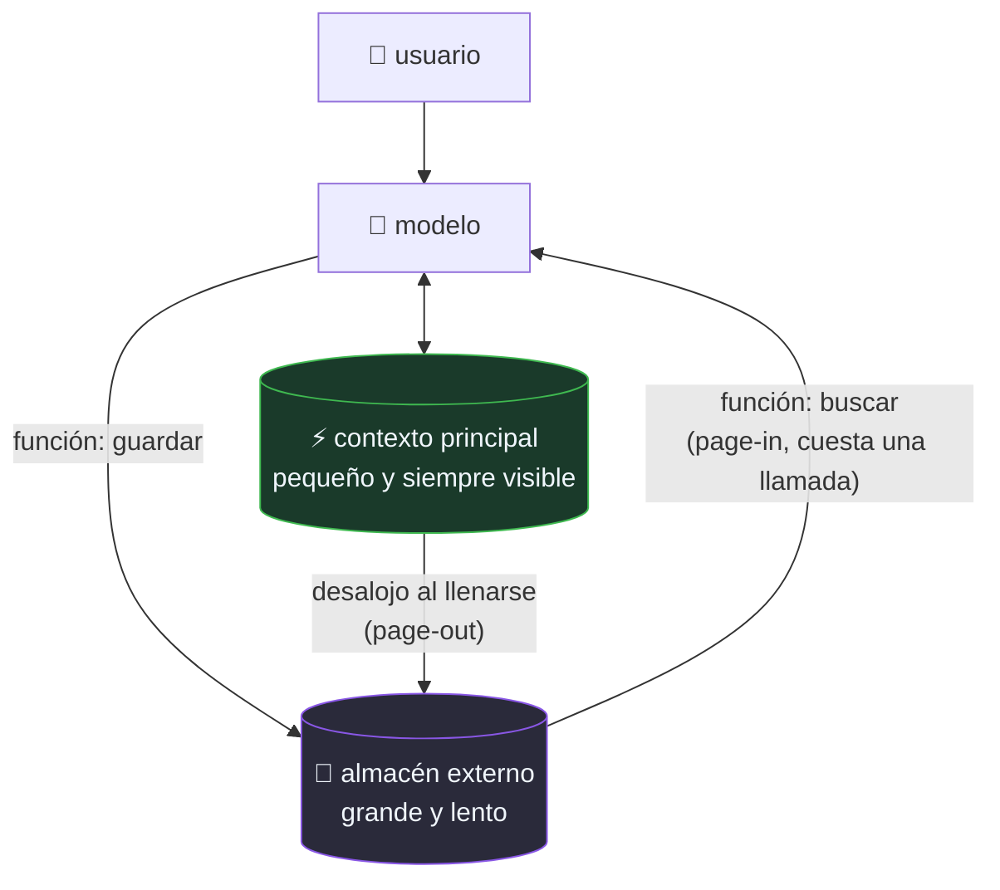

# P37 — MemGPT

> Memoria y contexto · Aplica al contexto la idea de memoria virtual: una jerarquía que da la
> ilusión de memoria grande sobre una pequeña y rápida.

**Nivel:** L3 · **Motor:** `memgpt` · **Notebook:** [`P37_memgpt.ipynb`](../../../notebooks/papers/P37_memgpt.ipynb)
· **Anexo:** [complejidad y coste](../../annexes/A05_COMPLEJIDAD_Y_COSTE.md)

## 1. Identificación

| Campo | Valor |
|---|---|
| **Título original** | *MemGPT: Towards LLMs as Operating Systems* |
| **Autoría** | Charles Packer, Sarah Wooders, Kevin Lin, Vivian Fang, Shishir G. Patil, Ion Stoica, Joseph E. Gonzalez |
| **Año** | 2023 |
| **Venue** | arXiv:2310.08560 |
| **Fuente primaria** | [arXiv:2310.08560](https://arxiv.org/abs/2310.08560) |
| **Acceso** | Abierto |
| **Fecha de consulta** | 2026-08-16 |

## 2. Problema anterior

La ventana de contexto es un **límite duro**: lo que no cabe, no existe para el modelo.
Ampliarla es caro y, como demuestra [P36](../P36_lost_in_middle/README.md), tampoco garantiza que
se aproveche.

Y hay casos donde ninguna ventana bastaría: un asistente que conversa durante meses, o el
análisis de un corpus documental completo.

## 3. Propuesta

Tomar prestada la solución que la informática lleva décadas usando: **memoria virtual**.

- **Contexto principal**: pequeño, rápido, siempre visible. Es la RAM.
- **Almacén externo**: grande, lento, accesible bajo demanda. Es el disco.
- **El propio modelo gestiona el trasiego** mediante llamadas de función: decide qué desalojar y
  qué traer, igual que un sistema operativo pagina.

Se añaden interrupciones para ceder el control entre el modelo y el usuario.

## 4. Intuición sin fórmulas

Tu ordenador abre archivos mucho mayores que su RAM porque no los carga enteros: los pagina. Aquí
igual, con una diferencia notable: **quien decide qué paginar es el propio modelo**.

**Dónde deja de funcionar la analogía:** un sistema operativo pagina con políticas deterministas y
probadas. Aquí la política la decide un modelo que puede equivocarse, desalojar lo importante y
no darse cuenta.

## 5. Matemática mínima

No hay ecuación; hay un contrato de gestión:

```text
contexto_principal  : capacidad fija C
almacén_externo     : capacidad ~ilimitada, acceso por función

si |contexto| > C:
    desalojar(según política) → almacén_externo

al necesitar algo ausente:
    buscar(almacén_externo) → traer al contexto   ← cuesta UNA LLAMADA extra
```

El coste no desaparece: se convierte en **latencia por acceso**, exactamente como un fallo de
página.

<!-- puente:inicio -->
> [!TIP]
> **Puente matemático.** Esta sección da por sabido lo siguiente. Si algo no te suena,
> léelo primero: está explicado una sola vez, en un solo sitio, y sirve para todas las fichas.

| Dónde | Qué necesitas de ahí |
|---|---|
| [**A05 §6** · La cuenta que casi nadie hace: inferencia](../../annexes/A05_COMPLEJIDAD_Y_COSTE.md#6-la-cuenta-que-casi-nadie-hace-inferencia) | el coste por token de un contexto que no cabe, que es lo que obliga a paginar |
<!-- puente:fin -->

## 6. Arquitectura o flujo



## 7. Qué observar en el paper original

- La **analogía con el sistema operativo** desarrollada en serio: no es una metáfora suelta, es
  el marco de diseño.
- Cómo se le da al modelo el **control de la gestión** mediante funciones, y qué pasa cuando la
  usa mal.
- Las **dos aplicaciones** evaluadas: conversación de larga duración y análisis de documentos.
- El manejo de **interrupciones** y del flujo de control entre modelo y usuario.

## 8. Evidencia y resultados

Evaluación en conversación multisesión de larga duración y en preguntas sobre documentos que
exceden ampliamente la ventana.

> Las métricas y comparaciones están en el artículo. Verificarlas allí, y tener presente que es
> un preprint y que el sistema depende mucho del modelo base que lo ejecute.

La miniatura de este eje muestra la mecánica: con capacidad 5, los datos antiguos se desalojan
sin perderse y se recuperan mediante una llamada de función.

## 9. Impacto

- Dio vocabulario prestado —paginación, jerarquía, interrupciones— a un problema que se estaba
  tratando sin marco.
- Es uno de los antecedentes de la **gestión explícita de contexto** en agentes, hoy una
  disciplina propia.
- Empujó la idea de que el modelo puede ser **gestor de su propio contexto**, no solo consumidor.

## 10. Limitaciones

1. **La política la decide el modelo**, y puede desalojar mal sin advertirlo.
2. **Cada page-in cuesta una llamada**: la ilusión de contexto infinito se paga en latencia.
3. **Depende de que el modelo base sepa usar funciones** de forma fiable.
4. **Preprint sin revisión por pares**.
5. **No resuelve [P36](../P36_lost_in_middle/README.md)**: lo que sí está en el contexto principal
   sigue sufriendo el problema de posición.
6. **Complejidad operativa**: más piezas, más modos de fallo, más difícil de depurar.

## 11. Errores comunes

| Error | Corrección |
|---|---|
| «Da contexto infinito» | Da la **ilusión** de contexto grande, con coste por acceso. Como la memoria virtual. |
| «Sustituye a RAG» | Es complementario: RAG recupera de un corpus externo; esto gestiona la memoria del propio agente. |
| «El almacén externo es gratis» | Cada consulta es una llamada más al modelo: latencia y dinero. |
| «Es una arquitectura de modelo» | Es una arquitectura **de sistema** alrededor de un modelo que no se modifica. |

## 12. Relación con trabajos anteriores

- **[P11 RAG](../P11_rag/README.md) (2020)** — recuperación de conocimiento externo.
- **[P31 Generative Agents](../P31_generative_agents/README.md) (2023)** — la otra vía: memoria
  con recuperación puntuada en vez de paginación explícita.
- **[P36 Lost in the Middle](../P36_lost_in_middle/README.md) (2023)** — la evidencia de que
  agrandar la ventana no basta.

## 13. Relación con trabajos posteriores

- **[P16 Sistemas agentic](../P16_agentic_systems/README.md)** — la memoria como componente
  operativo, con presupuesto y criterio de parada.
- **Gestión e ingeniería de contexto (2024+)** — la disciplina que se consolida a partir de aquí.

## 14. Notebook asociado

[`P37_memgpt.ipynb`](../../../notebooks/papers/P37_memgpt.ipynb)

**Qué implementa:** la jerarquía de dos niveles con desalojo y recuperación, la traza de page-out
y page-in, y el coste en llamadas.

**Qué NO implementa:** el modelo no decide nada — aquí se desaloja lo más antiguo. En el paper,
la política es del propio modelo, que es la parte interesante y la más frágil.

```bash
ai-evolution paper-lab P37 --seed 7
```

## 15. Actividades Bloom

| Nivel | Actividad |
|---|---|
| **Recordar** | Nombra los dos niveles de memoria y su equivalente en un sistema operativo. |
| **Explicar** | Explica por qué un page-in cuesta una llamada al modelo. |
| **Aplicar** | Baja la capacidad a 2 y observa cuántos datos acaban fuera. |
| **Analizar** | ¿Qué política de desalojo usarías para un asistente personal? Justifícala. |
| **Evaluar** | ¿Cuándo conviene esto frente a simplemente usar un modelo de contexto mayor? |
| **Crear** | Diseña un presupuesto de accesos por respuesta y qué hacer al agotarlo. |

## 16. Autoevaluación

1. ¿Cuál es la analogía central y hasta dónde se sostiene?
2. ¿Qué le pasa a un dato desalojado?
3. ¿Cuánto cuesta recuperarlo?
4. ¿Quién decide la política de paginación y por qué es frágil?
5. ¿En qué se diferencia de RAG?
6. ¿Resuelve el problema de la posición dentro del contexto?
7. ¿Qué hay que presupuestar al desplegarlo?

## 17. Respuestas esperadas

1. La memoria virtual de un sistema operativo. Se sostiene en la estructura (jerarquía, coste por
   acceso) y se rompe en la política: aquí la decide un modelo falible, no un algoritmo probado.
2. Baja al almacén externo. No se pierde.
3. Una llamada de función extra: latencia y coste, como un fallo de página.
4. El propio modelo, mediante llamadas de función. Es frágil porque puede desalojar lo importante
   o no buscar cuando debería, y nada lo detecta automáticamente.
5. RAG recupera de un corpus **externo** de conocimiento; esto gestiona la memoria **del propio
   agente** sobre su historia. Son complementarios.
6. No. Lo que sí está en el contexto principal sigue sujeto a la curva en U de P36.
7. Número máximo de page-ins por respuesta, qué vive siempre en el contexto principal, y qué
   hacer cuando se agota el presupuesto.

## 18. Fuentes primarias

- Packer, C. et al. (2023). *MemGPT: Towards LLMs as Operating Systems*.
  [arXiv:2310.08560](https://arxiv.org/abs/2310.08560) · consultado 2026-08-16.

---

[⬅️ Anterior: P36 Lost in the Middle](../P36_lost_in_middle/README.md) ·
[📇 Índice](../../catalog/PAPERS_INDEX.md) ·
[📝 Evaluación](../../../assessments/papers/P37_memgpt.md) ·
[🏫 Clase 108 · Memoria de corto y largo plazo](../../../classes/part-08-retrieval-context-memory-and-knowledge/108-memoria-de-corto-y-largo-plazo/README.md) ·
[➡️ Siguiente: P38 VAE](../P38_vae/README.md)
