# P38 — VAE

> Arquitectura y entrenamiento · Hace entrenable un modelo generativo latente: el truco de
> reparametrización deja pasar el gradiente a través del muestreo.

**Nivel:** L3 · **Motor:** `vae` · **Notebook:** [`P38_vae.ipynb`](../../../notebooks/papers/P38_vae.ipynb)
· **Anexo:** [probabilidad y verosimilitud](../../annexes/A02_PROBABILIDAD_Y_VEROSIMILITUD.md)

## 1. Identificación

| Campo | Valor |
|---|---|
| **Título original** | *Auto-Encoding Variational Bayes* |
| **Autoría** | Diederik P. Kingma, Max Welling |
| **Año** | 2013 |
| **Venue** | arXiv:1312.6114 · ICLR 2014 |
| **Fuente primaria** | [arXiv:1312.6114](https://arxiv.org/abs/1312.6114) |
| **Acceso** | Abierto |
| **Fecha de consulta** | 2026-08-16 |

## 2. Problema anterior

Un modelo generativo con variables latentes dice: hay un `z` oculto que explica el dato `x`. Para
entrenarlo hay que **muestrear** `z`, y muestrear es un nodo estocástico: no tiene derivada, así
que la [retropropagación](../P02_backpropagation/README.md) no puede atravesarlo.

La inferencia variacional existía, pero requería aproximaciones costosas y no escalaba a conjuntos
grandes ni encajaba con el entrenamiento por gradiente.

## 3. Propuesta

Dos piezas que se apoyan.

**El truco de reparametrización**: escribir `z = μ + σ·ε` con `ε` de una normal fija. La
distribución de `z` es la misma, pero ahora el azar está **fuera** del camino del gradiente: `μ` y
`σ` son funciones deterministas de la entrada, y se puede derivar respecto a ellas.

**El objetivo**: maximizar una cota inferior de la verosimilitud (ELBO), con dos términos —uno de
reconstrucción y otro que mantiene el espacio latente cerca de una distribución simple—.

## 4. Intuición sin fórmulas

Quieres derivar respecto a la media de un dado trucado. Pero tirar el dado no tiene derivada. La
solución: tira un dado normal aparte, y luego aplica la media y la escala con una fórmula que sí
se puede derivar.

**Dónde deja de funcionar la analogía:** el truco solo vale para familias de distribuciones que se
pueden escribir así. No es universal.

## 5. Matemática mínima

```text
Reparametrización:   z = μ_θ(x) + σ_θ(x) · ε,     ε ~ N(0, I)

ELBO:   log p(x) ≥ E_q[log p(x|z)] − KL( q(z|x) ‖ p(z) )
                    └─ reconstrucción ─┘   └── regularización ──┘

Con ambas gaussianas, la KL tiene forma cerrada:
    KL = −½ Σ (1 + log σ² − μ² − σ²)
```

Sin el término KL, el codificador puede mapear cada `x` a una gaussiana estrechísima y aislada:
el espacio latente deja de ser continuo y muestrear de la prior no genera nada coherente.

## 6. Arquitectura o flujo

```mermaid
flowchart LR
    X["x"] --> E["codificador<br/>q(z|x)"]
    E --> MU["μ"]
    E --> SG["σ"]
    EPS["ε ~ N(0,1)<br/>FUERA del grafo"] --> Z
    MU --> Z["z = μ + σ·ε"]
    SG --> Z
    Z --> D["decodificador<br/>p(x|z)"]
    D --> XR["x̂"]
    style EPS fill:#2a2a3a,stroke:#8957e5
```



## 7. Qué observar en el paper original

- La **derivación del ELBO** y por qué es una cota inferior de la verosimilitud.
- El **estimador reparametrizado** y su comparación de varianza con alternativas: ahí está el
  argumento cuantitativo.
- Los **experimentos con espacio latente 2D**, que muestran una variedad continua e interpolable.
- Que se publica casi a la vez que Rezende et al. (2014), con la misma idea: es un caso claro de
  descubrimiento simultáneo.

## 8. Evidencia y resultados

Experimentos de estimación de verosimilitud y generación en conjuntos de imágenes pequeños,
comparando con métodos de inferencia variacional previos.

> Las cifras están en el artículo. Verificarlas allí; lo transferible es el estimador, no los
> números de 2013.

La miniatura de este eje comprueba lo esencial: `z = μ + σ·ε` reproduce la distribución buscada
y el gradiente respecto a `μ` existe y vale 1.

## 9. Impacto

- Hizo entrenable por gradiente toda una familia de modelos latentes profundos.
- El truco de reparametrización se usa hoy mucho más allá del VAE: políticas estocásticas,
  cuantización diferenciable, atención con puertas.
- Su espacio latente continuo e interpolable es un antecedente directo de los espacios latentes
  de los modelos de difusión modernos.

## 10. Limitaciones

1. **Muestras borrosas**: el término de reconstrucción penaliza el error medio, y la media de
   varias imágenes plausibles es borrosa.
2. **Colapso posterior**: si el decodificador es muy potente, puede ignorar `z` por completo.
3. **La KL en forma cerrada** solo existe para familias concretas.
4. **Es una cota inferior**: optimizarla no es optimizar la verosimilitud.
5. **Compromiso reconstrucción/regularización** difícil de ajustar.

## 11. Errores comunes

| Error | Corrección |
|---|---|
| «Es un autoencoder con ruido» | Es inferencia variacional. El ruido tiene un papel probabilístico, no de regularización. |
| «Maximiza la verosimilitud» | Maximiza una **cota inferior**. La brecha depende de lo buena que sea `q`. |
| «El término KL es opcional» | Sin él, el espacio latente deja de ser muestreable y el modelo deja de ser generativo. |
| «Las muestras borrosas son un bug» | Son consecuencia directa del objetivo. Es un límite del método, no un error de implementación. |

## 12. Relación con trabajos anteriores

- **[P02 Backpropagation](../P02_backpropagation/README.md) (1986)** — el método que el truco
  permite aplicar aquí.
- **Inferencia variacional clásica** — el marco que se hace escalable.
- **Rezende et al. (2014)** — derivación independiente y simultánea.
  [arXiv:1401.4082](https://arxiv.org/abs/1401.4082)

## 13. Relación con trabajos posteriores

- **GAN (Goodfellow et al., 2014)** — la respuesta opuesta al mismo problema: un juego adversario en vez de una cota variacional. [arXiv:1406.2661](https://arxiv.org/abs/1406.2661)
- **[P17 Difusión](../P17_diffusion/README.md) (2020)** — combina estabilidad de entrenamiento y
  calidad de muestra, que era justo lo que ninguno de los dos lograba a la vez.
- **Difusión latente (2022)** — difusión sobre un espacio latente tipo autoencoder.

## 14. Notebook asociado

[`P38_vae.ipynb`](../../../notebooks/papers/P38_vae.ipynb)

**Qué implementa:** el truco de reparametrización aislado, la comprobación de que la distribución
se preserva, el gradiente respecto a `μ` y el cálculo de la KL en forma cerrada.

**Qué NO implementa:** codificador, decodificador ni datos. Solo el mecanismo.

```bash
ai-evolution paper-lab P38 --seed 7
```

## 15. Actividades Bloom

| Nivel | Actividad |
|---|---|
| **Recordar** | Escribe la reparametrización y los dos términos del ELBO. |
| **Explicar** | Explica por qué el azar tiene que quedar fuera del camino del gradiente. |
| **Aplicar** | Ejecuta el notebook y comprueba media y varianza empíricas. |
| **Analizar** | ¿Qué pasa con el espacio latente si el peso de la KL tiende a 0? |
| **Evaluar** | ¿Por qué las muestras son borrosas? ¿Es un fallo o una consecuencia? |
| **Crear** | Diseña un experimento que detecte colapso posterior. |

## 16. Autoevaluación

1. ¿Por qué muestrear bloquea el gradiente?
2. ¿Qué hace exactamente la reparametrización?
3. ¿Qué mide cada término del ELBO?
4. ¿Por qué es una cota inferior y no la verosimilitud?
5. ¿De dónde vienen las muestras borrosas?
6. ¿Qué es el colapso posterior?
7. ¿Dónde más se usa el truco de reparametrización?

## 17. Respuestas esperadas

1. Porque es un nodo estocástico: la salida no es una función determinista de los parámetros, así
   que no hay derivada que propagar.
2. Reescribe la muestra como una función determinista de los parámetros y de una fuente de ruido
   independiente, de modo que el gradiente puede atravesarla.
3. Uno mide si el decodificador reconstruye `x` desde `z`; el otro, cuánto se aleja la posterior
   aproximada de la prior, para que el espacio latente sea muestreable.
4. Porque se aproxima la posterior verdadera con una familia `q` más simple; la diferencia entre
   ambas es la brecha entre la cota y la verosimilitud real.
5. Del término de reconstrucción: penaliza el error medio, y la media de varias reconstrucciones
   plausibles es una imagen difusa.
6. Que el decodificador se vuelva tan potente que ignore `z`, y el término KL empuje `q` hacia la
   prior: el latente deja de codificar información.
7. En políticas estocásticas de refuerzo, en cuantización diferenciable y en cualquier sitio
   donde haya que derivar a través de una muestra.

## 18. Fuentes primarias

- Kingma, D. P. y Welling, M. (2014). *Auto-Encoding Variational Bayes*. **ICLR 2014**.
  [arXiv:1312.6114](https://arxiv.org/abs/1312.6114) · consultado 2026-08-16.
- Rezende, D. J., Mohamed, S. y Wierstra, D. (2014). *Stochastic Backpropagation and Approximate
  Inference in Deep Generative Models*.
  [arXiv:1401.4082](https://arxiv.org/abs/1401.4082) · consultado 2026-08-16.

---

[⬅️ Anterior: P37 MemGPT](../P37_memgpt/README.md) ·
[📇 Índice](../../catalog/PAPERS_INDEX.md) ·
[📝 Evaluación](../../../assessments/papers/P38_vae.md) ·
[🏫 Clase 088 · Espacios latentes y VAE](../../../classes/part-07-generative-ai-across-media/088-espacios-latentes-y-autoencoders-variacionales/README.md) ·
[🚧 Siguiente en construcción: P39 GAN](../../catalog/PAPERS_INDEX.md)
