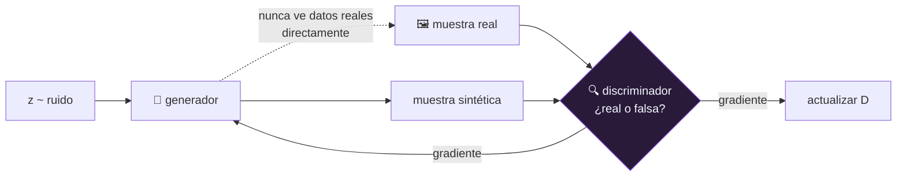

# P39 — GAN

> Arquitectura y entrenamiento · Convierte la generación en un juego: dos redes compiten y ninguna
> necesita una verosimilitud explícita.

**Nivel:** L3 · **Motor:** `gan` · **Notebook:** [`P39_gan.ipynb`](../../../notebooks/papers/P39_gan.ipynb)
· **Anexo:** [probabilidad y verosimilitud](../../annexes/A02_PROBABILIDAD_Y_VEROSIMILITUD.md)

## 1. Identificación

| Campo | Valor |
|---|---|
| **Título original** | *Generative Adversarial Networks* |
| **Autoría** | Ian J. Goodfellow, Jean Pouget-Abadie, Mehdi Mirza y otros |
| **Año** | 2014 |
| **Venue** | arXiv:1406.2661 · NeurIPS (NIPS) 2014 |
| **Fuente primaria** | [arXiv:1406.2661](https://arxiv.org/abs/1406.2661) |
| **Acceso** | Abierto |
| **Fecha de consulta** | 2026-08-16 |

## 2. Problema anterior

Los modelos generativos de la época exigían definir y optimizar una **verosimilitud explícita**.
Eso obligaba a aproximaciones costosas —cadenas de Markov, inferencia variacional— o producía
muestras borrosas, como en el [VAE](../P38_vae/README.md) publicado meses antes.

La pregunta abierta: ¿se puede entrenar un generador **sin** escribir nunca la probabilidad que
asigna a cada muestra?

## 3. Propuesta

Sí, si otro modelo aporta la señal. Se entrenan dos redes en un juego de suma cero:

- el **discriminador** `D` aprende a distinguir muestras reales de sintéticas;
- el **generador** `G` aprende a producir muestras que `D` no distinga.

El generador nunca ve datos reales directamente: solo recibe gradiente **a través** del
discriminador. No hay verosimilitud, no hay cadenas de Markov, no hay inferencia aproximada — solo
retropropagación a través de dos redes.

En el óptimo teórico, `D` no puede distinguir y la distribución del generador iguala a la real.

## 4. Intuición sin fórmulas

Un falsificador y un policía que aprenden a la vez. El falsificador mejora porque el policía lo
pilla; el policía mejora porque el falsificador se refina. Nadie le enseña al falsificador qué es
un billete bueno: solo si coló o no.

**Dónde deja de funcionar la analogía:** al falsificador le basta con dominar **un** tipo de
billete para colar siempre. No necesita saber hacer toda la serie — y eso es exactamente el modo
de fallo del método.

## 5. Matemática mínima

```text
min_G max_D  V(D, G) = E_{x~p_datos}[log D(x)] + E_{z~p_z}[log(1 − D(G(z)))]

Discriminador óptimo para un G fijo:
    D*(x) = p_datos(x) / ( p_datos(x) + p_G(x) )

Sustituyendo, el objetivo de G equivale a minimizar la divergencia
de Jensen-Shannon entre p_datos y p_G.
```

**Detalle práctico del propio paper:** al principio del entrenamiento `D` rechaza todo con
facilidad, `log(1 − D(G(z)))` se satura y el gradiente para `G` casi desaparece. Por eso se
entrena `G` maximizando `log D(G(z))` en lugar de minimizando el término original — mismo punto
fijo, gradientes mucho mejores.

<!-- puente:inicio -->
> [!TIP]
> **Puente matemático.** Esta sección da por sabido lo siguiente. Si algo no te suena,
> léelo primero: está explicado una sola vez, en un solo sitio, y sirve para todas las fichas.

| Dónde | Qué necesitas de ahí |
|---|---|
| [**A02 §3** · Verosimilitud y entropía cruzada](../../annexes/A02_PROBABILIDAD_Y_VEROSIMILITUD.md#3-verosimilitud-y-entropía-cruzada) | verosimilitud, para ver qué es exactamente lo que este método **evita** calcular |
| [**A02 §4** · Divergencia KL](../../annexes/A02_PROBABILIDAD_Y_VEROSIMILITUD.md#4-divergencia-kl) | la KL, de la que deriva la divergencia de Jensen-Shannon del objetivo |
<!-- puente:fin -->

## 6. Arquitectura o flujo



## 7. Qué observar en el paper original

- La **demostración de convergencia** con capacidad infinita: es elegante y también explica por
  qué las garantías no se trasladan al caso real de redes con capacidad limitada.
- El **truco del gradiente no saturante**, en la sección de entrenamiento. Es un detalle de
  implementación con consecuencias enormes.
- Que el algoritmo alterna `k` pasos de `D` por cada paso de `G`, y por qué ese equilibrio importa.
- Que las muestras del paper son **modestas** para los estándares actuales: lo que se propone es
  un marco, y los resultados espectaculares llegan con trabajos posteriores.

## 8. Evidencia y resultados

Experimentos de generación en conjuntos de imágenes pequeños, con estimaciones de verosimilitud
mediante ventanas de Parzen y comparación con modelos generativos de la época.

> Las cifras están en el artículo. Verificarlas allí, y tener presente que la métrica usada
> (ventanas de Parzen) fue criticada después por poco fiable en alta dimensión: es un buen ejemplo
> de cómo una métrica dominante puede resultar inadecuada.

La miniatura de este eje muestra el modo de fallo característico: con tres modos en la
distribución real, el generador converge a **uno solo** — y desde el punto de vista de su
objetivo, hace bien.

## 9. Impacto

- Abrió una década de investigación en generación adversaria: rostros sintéticos, traducción de
  imagen a imagen, superresolución, datos sintéticos.
- Introdujo la idea de **aprender la función de pérdida** en vez de escribirla, que reaparece en
  el modelo de recompensa de [RLHF](../P12_instructgpt_rlhf/README.md).
- Popularizó el problema social de los medios sintéticos, con todo lo que trajo después.
- Y fue desplazado por la [difusión](../P17_diffusion/README.md) hacia 2021-2022, precisamente por
  su inestabilidad y su colapso de modos.

## 10. Limitaciones

1. **Colapso de modos**: el generador cubre una región de la distribución y abandona el resto.
2. **Entrenamiento inestable**: dos objetivos en competencia, sin una pérdida que baje de forma
   monótona y que sirva para saber si va bien.
3. **Sin verosimilitud**: no se puede evaluar la probabilidad que el modelo asigna a un dato.
4. **Métricas difíciles**: no hay una medida sencilla y fiable de calidad y cobertura a la vez.
5. **Sensible a la arquitectura y a los hiperparámetros** de forma notoria.
6. **Las garantías teóricas suponen capacidad infinita** y optimización perfecta: ninguna de las
   dos se cumple.

## 11. Errores comunes

| Error | Corrección |
|---|---|
| «Las muestras son buenas, luego el modelo es bueno» | El colapso de modos produce muestras excelentes y poco diversas. Hay que medir **cobertura**, no solo calidad. |
| «El generador aprende de los datos reales» | Nunca los ve. Solo recibe gradiente a través del discriminador. |
| «La pérdida baja, luego va bien» | En un juego adversario, la pérdida no es un indicador de progreso: puede oscilar mientras el modelo mejora, o bajar mientras colapsa. |
| «Las GAN quedaron obsoletas» | Fueron desplazadas en generación de imagen general, pero siguen siendo competitivas donde la latencia importa: generan en una pasada, no en cientos. |
| «El objetivo del paper es el que se usa» | Se usa la variante no saturante, que el propio artículo introduce por el problema de gradiente. |

## 12. Relación con trabajos anteriores

- **[P38 VAE](../P38_vae/README.md) (2013)** — el enfoque opuesto al mismo problema: cota
  variacional frente a juego adversario.
- **[P02 Backpropagation](../P02_backpropagation/README.md) (1986)** — el único mecanismo de
  entrenamiento que hace falta.
- **Modelos generativos con verosimilitud explícita** — la familia que se esquiva.

## 13. Relación con trabajos posteriores

- **DCGAN (2015), Wasserstein GAN (2017), StyleGAN (2018-2020)** — estabilización, mejores
  métricas y calidad fotorrealista.
- **[P17 Difusión](../P17_diffusion/README.md) (2020)** — estabilidad de entrenamiento **y**
  calidad de muestra, que es justo lo que ni GAN ni VAE lograban a la vez.
- **[P12 InstructGPT](../P12_instructgpt_rlhf/README.md) (2022)** — aprender la señal de
  entrenamiento con otro modelo, la misma idea en otro dominio.

## 14. Notebook asociado

[`P39_gan.ipynb`](../../../notebooks/papers/P39_gan.ipynb)

**Qué implementa:** la dinámica del generador persiguiendo el modo más cercano en una distribución
de tres modos, el conteo de modos cubiertos y la lista de lo que hay que reportar en un modelo
generativo.

**Qué NO implementa:** el discriminador está simplificado a una comparación de medias y no hay
entrenamiento adversario alterno real. Se modela la dinámica del colapso, no se ejecuta una GAN.

```bash
ai-evolution paper-lab P39 --seed 7
```

## 15. Actividades Bloom

| Nivel | Actividad |
|---|---|
| **Recordar** | Escribe el objetivo minimax e identifica qué maximiza y qué minimiza cada red. |
| **Explicar** | Explica por qué el generador nunca necesita ver datos reales. |
| **Aplicar** | Ejecuta el notebook y observa a qué modo colapsa según la posición inicial. |
| **Analizar** | Deriva `D*(x)` para un `G` fijo y explica qué significa que valga 1/2 en todas partes. |
| **Evaluar** | Un equipo enseña 20 muestras excelentes. ¿Qué métrica falta y por qué? |
| **Crear** | Diseña una medida de cobertura de modos para una distribución 2D conocida. |

## 16. Autoevaluación

1. ¿Qué señal de entrenamiento sustituye a la verosimilitud?
2. ¿Por qué se entrena `G` maximizando `log D(G(z))` y no con el término original?
3. ¿Qué es el colapso de modos y por qué es racional desde el objetivo del generador?
4. ¿Por qué la pérdida no sirve como indicador de progreso?
5. ¿Qué supone la demostración de convergencia que no se cumple en la práctica?
6. ¿En qué gana todavía una GAN frente a un modelo de difusión?
7. ¿Qué idea de este paper reaparece en RLHF?

## 17. Respuestas esperadas

1. El discriminador: una red que aprende a distinguir, y cuyo gradiente le dice al generador
   cómo mejorar. Se aprende la pérdida en vez de escribirla.
2. Porque al principio `D` rechaza casi todo, `log(1 − D(G(z)))` se satura y el gradiente para `G`
   se anula. La variante no saturante tiene el mismo punto fijo y gradientes útiles.
3. Que el generador cubre solo una parte de la distribución. Es racional porque su objetivo es
   engañar al discriminador, y para eso basta con ser convincente en una región.
4. Porque es un juego: si `D` mejora, la pérdida de `G` sube aunque `G` también haya mejorado. No
   hay una cantidad que descienda de forma monótona hacia el óptimo.
5. Capacidad infinita para ambas redes y optimización perfecta en cada paso. Con redes reales y
   descenso de gradiente alterno, ninguna se cumple.
6. En velocidad de muestreo: genera en **una** pasada, mientras la difusión necesita decenas o
   cientos. Donde la latencia manda, sigue siendo relevante.
7. Aprender la función objetivo con otro modelo en vez de escribirla: el modelo de recompensa de
   RLHF cumple el papel que aquí cumple el discriminador.

## 18. Fuentes primarias

- Goodfellow, I. J. et al. (2014). *Generative Adversarial Networks*. **NIPS 2014**.
  [arXiv:1406.2661](https://arxiv.org/abs/1406.2661) · consultado 2026-08-16.
- Kingma, D. P. y Welling, M. (2014). *Auto-Encoding Variational Bayes*.
  [arXiv:1312.6114](https://arxiv.org/abs/1312.6114) · consultado 2026-08-16.

---

[⬅️ Anterior: P38 VAE](../P38_vae/README.md) ·
[📇 Índice](../../catalog/PAPERS_INDEX.md) ·
[📝 Evaluación](../../../assessments/papers/P39_gan.md) ·
[🏫 Clase 089 · GAN y entrenamiento adversarial](../../../classes/part-07-generative-ai-across-media/089-gan-y-entrenamiento-adversarial/README.md) ·
[➡️ Siguiente: P40 Dropout](../P40_dropout/README.md)
