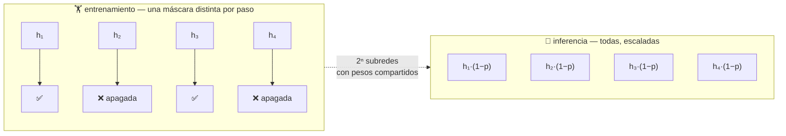

# P40 — Dropout

> Arquitectura y entrenamiento · Apagar unidades al azar equivale a entrenar un ensamblado
> exponencial de subredes que comparten pesos.

**Nivel:** L2 · **Motor:** `dropout` · **Notebook:** [`P40_dropout.ipynb`](../../../notebooks/papers/P40_dropout.ipynb)
· **Anexo:** [probabilidad y verosimilitud](../../annexes/A02_PROBABILIDAD_Y_VEROSIMILITUD.md)

## 1. Identificación

| Campo | Valor |
|---|---|
| **Título original** | *Dropout: A Simple Way to Prevent Neural Networks from Overfitting* |
| **Autoría** | Nitish Srivastava, Geoffrey Hinton, Alex Krizhevsky, Ilya Sutskever, Ruslan Salakhutdinov |
| **Año** | 2014 |
| **Venue** | *Journal of Machine Learning Research* 15(56), 1929–1958 |
| **Fuente primaria** | [jmlr.org/papers/v15/srivastava14a](https://jmlr.org/papers/v15/srivastava14a.html) |
| **Acceso** | Abierto |
| **Fecha de consulta** | 2026-08-16 |

## 2. Problema anterior

Las redes grandes memorizaban el conjunto de entrenamiento. La receta conocida contra eso —
promediar muchos modelos entrenados por separado — funciona muy bien y es **inviable** con redes
profundas: entrenar diez redes cuesta diez veces más, y servirlas también.

Había además un problema más sutil que el sobreajuste clásico: la **co-adaptación**. Una unidad
podía desarrollar una función que solo era útil en presencia de otra unidad concreta. El conjunto
funcionaba en entrenamiento y era frágil ante cualquier cambio.

## 3. Propuesta

En cada paso de entrenamiento, poner a cero cada unidad con probabilidad `p`, de forma
independiente. Ninguna función puede depender de que una unidad concreta esté presente, porque a
menudo no lo estará.

La interpretación que da el paper: con `n` unidades hay `2ⁿ` subredes posibles, y entrenar con
dropout es entrenar ese **ensamblado exponencial** con pesos compartidos. En inferencia se usan
todas las unidades con los pesos escalados, lo que aproxima el promedio de todas esas subredes.

## 4. Intuición sin fórmulas

Si en un equipo cada tarea depende de dos personas concretas, el día que una falte no se hace
nada. Si todos pueden cubrir varias tareas, el equipo aguanta. Dropout obliga a lo segundo
haciendo faltar a gente al azar cada día.

**Dónde deja de funcionar la analogía:** un equipo real reorganiza el trabajo conscientemente. La
red no «decide» ser redundante: es que las representaciones redundantes son las únicas que
reciben gradiente útil de forma consistente.

## 5. Matemática mínima

```text
Entrenamiento:   m ~ Bernoulli(1 − p)        una máscara nueva por paso
                 h̃ = m ⊙ h

Inferencia   :   h_test = (1 − p) · h        se usan todas, escaladas

Equivalente y más usado (inverted dropout):
                 h̃ = (m ⊙ h) / (1 − p)       durante el entrenamiento
                 h_test = h                   sin cambio en inferencia
```

El escalado no es cosmético: sin él, la magnitud esperada de las activaciones en inferencia es
`1/(1−p)` veces la del entrenamiento, y el modelo trabaja en un régimen distinto del que aprendió.

**Por qué premia la redundancia**, con `p = 0,5` y unidades independientes:

```text
una función que necesita 2 unidades concretas → disponible el 25 % de los pasos
una repartida entre 3 unidades cualesquiera   → disponible el 87,5 %
```

<!-- puente:inicio -->
> [!TIP]
> **Puente matemático.** Esta sección da por sabido lo siguiente. Si algo no te suena,
> léelo primero: está explicado una sola vez, en un solo sitio, y sirve para todas las fichas.

| Dónde | Qué necesitas de ahí |
|---|---|
| [**A02 §2** · Entropía](../../annexes/A02_PROBABILIDAD_Y_VEROSIMILITUD.md#2-entropía) | probabilidad de una máscara y valor esperado: de ahí sale el escalado en inferencia |
<!-- puente:fin -->

## 6. Arquitectura o flujo



## 7. Qué observar en el paper original

- La **interpretación como ensamblado** y por qué el escalado en inferencia aproxima el promedio
  geométrico de las subredes. Es una aproximación, y el paper lo dice.
- Los experimentos sobre **qué aprenden las unidades** con y sin dropout: las representaciones
  visualizadas son más localizadas e interpretables con dropout.
- La discusión sobre el **valor de `p`**: 0,5 en capas ocultas y valores menores en la entrada, y
  por qué.
- Que se evalúa en **muchos dominios** —visión, voz, texto, genómica—: la afirmación es de
  generalidad, no de un buen resultado puntual.

## 8. Evidencia y resultados

Mejoras consistentes en conjuntos de visión, reconocimiento de voz, clasificación de documentos y
datos biológicos, comparando la misma arquitectura con y sin dropout.

> Las cifras por conjunto están en el artículo. Verificarlas allí; lo transferible es el mecanismo
> y el patrón de mejora, no los números de 2014.

La miniatura de este eje cuantifica el argumento de la co-adaptación: una función que depende de
dos unidades concretas está disponible una cuarta parte de las veces, y una repartida entre tres,
casi siempre.

## 9. Impacto

- Fue la regularización por defecto en deep learning durante media década.
- Su interpretación como ensamblado influyó en toda una línea de trabajo sobre regularización
  estocástica.
- Y hoy se usa **menos** en visión y en Transformers grandes, donde la escala de datos y otras
  técnicas cumplen ese papel. Es un buen recordatorio de que las recetas del campo caducan.

## 10. Limitaciones

1. **Ralentiza la convergencia**: hacen falta más épocas para el mismo resultado.
2. **Interacción mal entendida con la normalización por lotes**, que produjo fallos sutiles
   durante años al combinarlas.
3. **La equivalencia con el ensamblado es aproximada**, no exacta, y el paper lo declara.
4. **Menos útil con muchos datos**: si el conjunto es grande, hay poco sobreajuste que evitar.
5. **Un hiperparámetro más** (`p`) que ajustar por capa.
6. **Poco efectivo en capas convolucionales** frente a las densas, por la compartición de pesos.

## 11. Errores comunes

| Error | Corrección |
|---|---|
| «Dropout añade ruido para regularizar» | Cambia **qué representaciones son rentables**: penaliza la dependencia de unidades concretas. |
| Dejarlo activo en inferencia | La misma entrada daría salidas distintas y con magnitud equivocada. Es un fallo clásico en producción. |
| Aplicar el escalado dos veces | Existen dos convenciones (escalar en inferencia o dividir en entrenamiento). Usar ambas rompe el modelo. |
| «Siempre conviene ponerlo» | Con muchos datos o arquitecturas modernas puede no aportar y sí ralentizar. |
| «Es equivalente a entrenar 2ⁿ redes» | Es una **aproximación** al promedio de esas subredes, no una equivalencia exacta. |

## 12. Relación con trabajos anteriores

- **[P04 AlexNet](../P04_alexnet/README.md) (2012)** — lo usa en sus capas densas; este artículo
  es el desarrollo completo de la idea.
- **Hinton et al. (2012)** — la versión preliminar.
  [arXiv:1207.0580](https://arxiv.org/abs/1207.0580)
- **Bagging y ensamblados** — el marco clásico que se aproxima sin pagar su coste.

## 13. Relación con trabajos posteriores

- **[P43 BatchNorm](../P43_batchnorm/README.md) (2015)** — otra forma de estabilizar, con la que
  interactúa de forma no trivial.
- **DropConnect, DropPath, stochastic depth** — variantes sobre la misma idea.
- **Regularización moderna** — aumento de datos, decaimiento de pesos y escala, que en muchos
  casos lo han sustituido.

## 14. Notebook asociado

[`P40_dropout.ipynb`](../../../notebooks/papers/P40_dropout.ipynb)

**Qué implementa:** el cálculo de disponibilidad de una función co-adaptada frente a una
redundante, el conteo de subredes y la demostración del escalado en inferencia.

**Qué NO implementa:** no hay red, ni datos, ni entrenamiento. Se cuentan probabilidades de
máscara para exhibir el argumento.

```bash
ai-evolution paper-lab P40 --seed 7
```

## 15. Actividades Bloom

| Nivel | Actividad |
|---|---|
| **Recordar** | Escribe qué ocurre en entrenamiento y qué en inferencia. |
| **Explicar** | Explica por qué dropout premia las representaciones redundantes. |
| **Aplicar** | Calcula la disponibilidad de una función que necesita 4 unidades concretas con `p=0,5`. |
| **Analizar** | ¿Por qué es menos efectivo en capas convolucionales? |
| **Evaluar** | Un modelo «funciona peor en producción» sin causa aparente. ¿Qué comprobarías primero? |
| **Crear** | Diseña un experimento que distinga el efecto de ensamblado del de anti-co-adaptación. |

## 16. Autoevaluación

1. ¿Qué es la co-adaptación y por qué es un problema?
2. ¿Cuántas subredes hay con `n` unidades?
3. ¿Por qué hace falta escalar y qué pasa si no se hace?
4. ¿Cuáles son las dos convenciones de escalado?
5. ¿Por qué ralentiza la convergencia?
6. ¿Por qué se usa menos hoy en modelos grandes?
7. ¿En qué sentido la equivalencia con un ensamblado es aproximada?

## 17. Respuestas esperadas

1. Que una unidad desarrolle una función útil solo en presencia de otra concreta. Produce
   soluciones frágiles que dependen de una configuración exacta del resto de la red.
2. `2ⁿ`, una por cada subconjunto de unidades activas. Todas comparten los mismos pesos.
3. Porque en entrenamiento solo está activa la fracción `1−p` de las unidades, así que la suma
   esperada es menor. Sin escalar, en inferencia las activaciones son `1/(1−p)` veces mayores que
   las vistas al entrenar.
4. Escalar por `(1−p)` en inferencia, o dividir por `(1−p)` durante el entrenamiento (inverted
   dropout). Se elige una; aplicar las dos rompe el modelo.
5. Porque cada paso entrena una subred distinta y con gradiente más ruidoso: hacen falta más
   pasos para el mismo progreso efectivo.
6. Porque con conjuntos enormes hay poco sobreajuste, y otras técnicas —aumento de datos,
   decaimiento de pesos, la propia escala— cubren ese papel con menos coste.
7. El escalado en inferencia aproxima el promedio geométrico de las predicciones de las subredes,
   pero no lo calcula exactamente. El propio paper lo presenta como aproximación.

## 18. Fuentes primarias

- Srivastava, N. et al. (2014). *Dropout: A Simple Way to Prevent Neural Networks from
  Overfitting*. **JMLR** 15(56), 1929–1958.
  [jmlr.org/papers/v15/srivastava14a](https://jmlr.org/papers/v15/srivastava14a.html) ·
  consultado 2026-08-16.
- Hinton, G. E. et al. (2012). *Improving neural networks by preventing co-adaptation of feature
  detectors*. [arXiv:1207.0580](https://arxiv.org/abs/1207.0580) · consultado 2026-08-16.

---

[⬅️ Anterior: P39 GAN](../P39_gan/README.md) ·
[📇 Índice](../../catalog/PAPERS_INDEX.md) ·
[📝 Evaluación](../../../assessments/papers/P40_dropout.md) ·
[🏫 Clase 052 · Optimizadores y regularización](../../../classes/part-04-neural-networks-and-deep-learning/052-optimizadores-regularizacion-y-schedulers/README.md) ·
[➡️ Siguiente: P41 Adam](../P41_adam/README.md)
