# P41 — Adam

> Arquitectura y entrenamiento · Un paso de aprendizaje por dimensión, adaptado a la escala de su
> propio gradiente. Es el optimizador por defecto de casi todo lo que vino después.

**Nivel:** L2 · **Motor:** `adam` · **Notebook:** [`P41_adam.ipynb`](../../../notebooks/papers/P41_adam.ipynb)
· **Anexo:** [cálculo y gradientes](../../annexes/A03_CALCULO_Y_GRADIENTES.md)

## 1. Identificación

| Campo | Valor |
|---|---|
| **Título original** | *Adam: A Method for Stochastic Optimization* |
| **Autoría** | Diederik P. Kingma, Jimmy Ba |
| **Año** | 2014 |
| **Venue** | arXiv:1412.6980 · ICLR 2015 |
| **Fuente primaria** | [arXiv:1412.6980](https://arxiv.org/abs/1412.6980) |
| **Acceso** | Abierto |
| **Fecha de consulta** | 2026-08-16 |

## 2. Problema anterior

El descenso de gradiente estocástico usa **la misma tasa de aprendizaje en todas las
direcciones**. En un problema mal condicionado —donde una dirección es mucho más curva que
otra— eso obliga a elegir entre dos males: una tasa grande hace oscilar la dirección empinada, y
una pequeña deja la dirección plana avanzando a paso de tortuga.

Existían métodos adaptativos (AdaGrad, RMSProp) pero cada uno tenía su punto débil: AdaGrad
acumula gradientes al cuadrado desde el inicio y su paso efectivo tiende a cero; RMSProp lo
arregla con una media móvil pero no usa momento.

## 3. Propuesta

Combinar ambas ideas y añadir la pieza que faltaba:

1. **Primer momento**: una media móvil del gradiente, que suaviza la dirección (momento clásico).
2. **Segundo momento**: una media móvil del gradiente al cuadrado, que estima la escala típica de
   cada coordenada.
3. **Corrección de sesgo**: ambas medias empiezan en cero y por tanto subestiman al principio; se
   corrige dividiendo por `1 − βᵗ`.

El paso de cada coordenada acaba siendo del orden de `η`, sea cual sea la magnitud de su
gradiente.

## 4. Intuición sin fórmulas

Bajar un valle largo y estrecho. En la dirección estrecha, un paso normal te hace rebotar de pared
a pared; en la larga, ese mismo paso no avanza nada. Adam mide cuánto se mueve cada dirección y
ajusta su paso por separado.

**Dónde deja de funcionar la analogía:** el valle real está fijo. En una red, el paisaje cambia
con cada minilote, y las estimaciones de escala se hacen sobre un objetivo que se mueve.

## 5. Matemática mínima

```text
m_t = β₁·m_{t−1} + (1 − β₁)·g_t              primer momento
v_t = β₂·v_{t−1} + (1 − β₂)·g_t²             segundo momento

m̂_t = m_t / (1 − β₁ᵗ)                        corrección de sesgo
v̂_t = v_t / (1 − β₂ᵗ)

θ_t = θ_{t−1} − η · m̂_t / (√v̂_t + ε)
```

Valores por defecto del paper: `β₁ = 0,9`, `β₂ = 0,999`, `ε = 1e-8`.

**Por qué hace falta la corrección de sesgo:** con `m₀ = 0` y `β₁ = 0,9`, tras el primer paso
`m₁ = 0,1·g₁`, diez veces menor que el gradiente real. Sin corregir, los primeros pasos serían
diminutos justo cuando más falta hace avanzar.

<!-- puente:inicio -->
> [!TIP]
> **Puente matemático.** Esta sección da por sabido lo siguiente. Si algo no te suena,
> léelo primero: está explicado una sola vez, en un solo sitio, y sirve para todas las fichas.

| Dónde | Qué necesitas de ahí |
|---|---|
| [**A03 §1** · Derivada: la pregunta que resuelve](../../annexes/A03_CALCULO_Y_GRADIENTES.md#1-derivada-la-pregunta-que-resuelve) | qué es una derivada y qué información da su magnitud |
| [**A03 §2** · Regla de la cadena](../../annexes/A03_CALCULO_Y_GRADIENTES.md#2-regla-de-la-cadena) | la regla de la cadena, que produce los gradientes que Adam consume |
<!-- puente:fin -->

## 6. Arquitectura o flujo

```mermaid
flowchart LR
    G["gradiente g_t"] --> M["m_t: media móvil<br/>→ DIRECCIÓN"]
    G --> V["v_t: media móvil de g²<br/>→ ESCALA"]
    M --> C1["corrección de sesgo"]
    V --> C2["corrección de sesgo"]
    C1 --> P["θ ← θ − η·m̂/(√v̂+ε)"]
    C2 --> P
    P --> R["paso ≈ η en CADA<br/>coordenada, sea cual sea<br/>su escala de gradiente"]
    style R fill:#1a3a2a,stroke:#3fb950
```



## 7. Qué observar en el paper original

- La **derivación de la corrección de sesgo**: es la aportación técnica que distingue a Adam de
  RMSProp con momento.
- El **análisis de regret** en el caso convexo: da garantías, y conviene ver hasta dónde llegan
  (y hasta dónde no, porque las redes no son convexas).
- La discusión sobre el **paso efectivo acotado** por `η`, que es lo que da robustez frente a la
  escala del gradiente.
- **AdaMax**, la variante con norma infinito, que el mismo artículo introduce y casi nadie usa.

## 8. Evidencia y resultados

Experimentos de regresión logística, redes densas y convolucionales, comparando con SGD con
momento, AdaGrad, RMSProp y otros.

> Las curvas por experimento están en el artículo. Verificarlas allí, y con una cautela: la
> literatura posterior encontró que con SGD bien ajustado la comparación es más ajustada de lo que
> sugieren esas figuras, sobre todo en visión.

La miniatura de este eje aísla el argumento en un problema con número de condición 100: SGD queda
oscilando con pérdida ~100 y Adam converge a ~1e-8.

## 9. Impacto

- Es el optimizador por defecto de prácticamente todos los modelos de este eje.
- Redujo drásticamente el esfuerzo de ajustar la tasa de aprendizaje, que era una de las mayores
  fricciones prácticas del deep learning.
- Su ubicuidad lo convirtió también en objeto de crítica: buena parte del trabajo posterior sobre
  optimización se define por comparación con él.

## 10. Limitaciones

1. **No siempre generaliza mejor**: hay evidencia de que SGD con momento bien ajustado generaliza
   mejor en algunas tareas de visión.
2. **El decaimiento de pesos se comporta mal** dentro de Adam: al dividirse también por `√v̂`, la
   regularización acaba siendo distinta por coordenada. Lo corrige AdamW (2017).
3. **Más memoria**: guarda dos estados por parámetro, lo que en modelos enormes es significativo.
4. **La prueba de convergencia original tenía un error**, señalado en 2018, que motivó variantes
   como AMSGrad.
5. **Sensible a `ε`** en regímenes de gradiente muy pequeño.
6. **Las garantías son para el caso convexo**, y las redes no lo son.

## 11. Errores comunes

| Error | Corrección |
|---|---|
| «Adam es siempre mejor que SGD» | Converge más rápido en muchos casos; generalizar mejor es otra afirmación y no siempre se sostiene. |
| Usar el decaimiento de pesos de SGD tal cual | Dentro de Adam se divide también por `√v̂` y deja de ser la regularización pretendida. Para eso está AdamW. |
| «La corrección de sesgo es un detalle» | Sin ella, los primeros pasos son diminutos, justo cuando más importa avanzar. |
| «Adapta la tasa de aprendizaje» | Adapta el **paso por coordenada**. La tasa global `η` sigue siendo un hiperparámetro que hay que elegir. |
| «Tiene garantías de convergencia» | Para el caso convexo, y la prueba original fue corregida después. En redes profundas no hay garantía. |

## 12. Relación con trabajos anteriores

- **[P02 Backpropagation](../P02_backpropagation/README.md) (1986)** — quien calcula el gradiente
  que Adam consume.
- **AdaGrad (2011) y RMSProp (2012)** — los métodos adaptativos que combina.
- **Momento de Polyak (1964)** — el primer momento.

## 13. Relación con trabajos posteriores

- **AdamW (2017)** — desacopla el decaimiento de pesos del paso adaptativo.
  [arXiv:1711.05101](https://arxiv.org/abs/1711.05101)
- **AMSGrad (2018)** — corrige el problema de la prueba de convergencia.
- **Optimizadores para modelos grandes (2023+)** — la línea que busca reducir el estado por
  parámetro que Adam necesita.

## 14. Notebook asociado

[`P41_adam.ipynb`](../../../notebooks/papers/P41_adam.ipynb)

**Qué implementa:** SGD y Adam sobre una cuadrática con número de condición 100, con los tres
componentes explícitos, y la explicación de por qué el decaimiento de pesos necesita tratamiento
aparte.

**Qué NO implementa:** ninguna red, ningún minilote, ningún paisaje no convexo. Es el mecanismo
aislado.

```bash
ai-evolution paper-lab P41 --seed 7
```

## 15. Actividades Bloom

| Nivel | Actividad |
|---|---|
| **Recordar** | Escribe las cuatro líneas del algoritmo y di qué hace cada una. |
| **Explicar** | Explica por qué el paso efectivo es del orden de `η` en toda coordenada. |
| **Aplicar** | Ejecuta el notebook y sube el número de condición a 10 000. |
| **Analizar** | Calcula `m̂₁` con y sin corrección de sesgo y compara. |
| **Evaluar** | ¿Cuándo elegirías SGD con momento pese a la conveniencia de Adam? |
| **Crear** | Diseña un experimento que compare generalización, no solo velocidad de convergencia. |

## 16. Autoevaluación

1. ¿Qué estima el segundo momento y para qué sirve?
2. ¿Por qué las medias móviles empiezan sesgadas?
3. ¿Qué problema de AdaGrad resuelve la media móvil?
4. ¿Por qué el decaimiento de pesos se comporta mal dentro de Adam?
5. ¿Cuánta memoria extra necesita por parámetro?
6. ¿Qué garantiza el análisis del paper y qué no?
7. ¿En qué caso puede convenir SGD?

## 17. Respuestas esperadas

1. La magnitud típica del gradiente de cada coordenada. Dividir por su raíz normaliza el paso, de
   modo que cada dirección avanza a un ritmo comparable.
2. Porque se inicializan a cero: las primeras iteraciones promedian con ese cero y subestiman el
   valor real. La corrección `1 − βᵗ` lo compensa y desaparece al crecer `t`.
3. Que AdaGrad acumula **todos** los gradientes al cuadrado desde el inicio, así que el
   denominador solo crece y el paso efectivo tiende a cero. La media móvil olvida lo antiguo.
4. Porque el término de decaimiento se suma al gradiente y acaba dividido por `√v̂`: la fuerza de
   la regularización pasa a depender de la escala de gradiente de cada coordenada, que no es lo
   que se quería.
5. Dos estados por parámetro (`m` y `v`), es decir, aproximadamente el doble de memoria que los
   propios pesos.
6. Una cota de regret en el caso **convexo**. No garantiza nada en el no convexo, y la prueba
   original tuvo que corregirse.
7. En tareas donde la generalización importe más que la velocidad de convergencia y haya
   presupuesto para ajustar bien la tasa de aprendizaje y su planificación.

## 18. Fuentes primarias

- Kingma, D. P. y Ba, J. (2015). *Adam: A Method for Stochastic Optimization*. **ICLR 2015**.
  [arXiv:1412.6980](https://arxiv.org/abs/1412.6980) · consultado 2026-08-16.
- Loshchilov, I. y Hutter, F. (2019). *Decoupled Weight Decay Regularization* (AdamW).
  [arXiv:1711.05101](https://arxiv.org/abs/1711.05101) · consultado 2026-08-16.

---

[⬅️ Anterior: P40 Dropout](../P40_dropout/README.md) ·
[📇 Índice](../../catalog/PAPERS_INDEX.md) ·
[📝 Evaluación](../../../assessments/papers/P41_adam.md) ·
[🏫 Clase 052 · Optimizadores y regularización](../../../classes/part-04-neural-networks-and-deep-learning/052-optimizadores-regularizacion-y-schedulers/README.md) ·
[➡️ Siguiente: P42 Ejemplos adversarios](../P42_adversarial/README.md)
