# P42 — Ejemplos adversarios

> Arquitectura y entrenamiento · Una perturbación imperceptible cambia la predicción. Y la causa
> no es la profundidad: es la **linealidad** en dimensión alta.

**Nivel:** L3 · **Motor:** `adversarial` · **Notebook:** [`P42_adversarial.ipynb`](../../../notebooks/papers/P42_adversarial.ipynb)
· **Anexo:** [álgebra y geometría](../../annexes/A01_ALGEBRA_Y_GEOMETRIA.md)

## 1. Identificación

| Campo | Valor |
|---|---|
| **Título original** | *Explaining and Harnessing Adversarial Examples* |
| **Autoría** | Ian J. Goodfellow, Jonathon Shlens, Christian Szegedy |
| **Año** | 2014 |
| **Venue** | arXiv:1412.6572 · ICLR 2015 |
| **Fuente primaria** | [arXiv:1412.6572](https://arxiv.org/abs/1412.6572) |
| **Acceso** | Abierto |
| **Fecha de consulta** | 2026-08-16 |

## 2. Problema anterior

Szegedy et al. (2013) habían descubierto algo desconcertante: perturbaciones minúsculas e
invisibles al ojo humano hacían que una red clasificara mal con altísima confianza. La
explicación que se manejaba era que las redes profundas son **extremadamente no lineales** y
tienen bolsas de comportamiento errático repartidas por el espacio.

Esa hipótesis no explicaba dos observaciones incómodas: que los ejemplos adversarios
**transfieran** entre modelos distintos, y que también afecten a modelos lineales sencillos.

## 3. Propuesta

La explicación contraria: el problema es que los modelos se comportan de forma **demasiado
lineal** en dimensión alta.

Si la salida depende de `wᵀx` y perturbas cada componente en `ε` en la dirección del signo de `w`,
el cambio total es `ε · Σ|wᵢ|`, que **crece con la dimensión**. Con miles de componentes, una
perturbación invisible por píxel produce un cambio enorme en la salida.

De ahí sale un ataque de un solo paso —**FGSM**— y una defensa: entrenar con ejemplos adversarios
generados sobre la marcha.

## 4. Intuición sin fórmulas

Mover una milésima cada uno de diez mil dígitos de una suma. Ninguna cifra cambia visiblemente, y
el total se mueve diez unidades. La imperceptibilidad es **por componente**; el efecto es sobre
la **suma**.

**Dónde deja de funcionar la analogía:** en una suma sabes exactamente cuánto contribuye cada
sumando. Aquí lo que hace peligroso el ataque es que la dirección de máximo daño se puede
calcular con un solo gradiente.

## 5. Matemática mínima

```text
FGSM (Fast Gradient Sign Method):

    x' = x + ε · sign( ∇ₓ L(θ, x, y) )

Para un modelo lineal wᵀx, el cambio en la salida es:

    wᵀ(x' − x) = ε · Σᵢ |wᵢ| = ε · ‖w‖₁

    → crece linealmente con la DIMENSIÓN
```

| dimensión | ε por componente | cambio en la salida |
|---:|---:|---:|
| 10 | 0,01 | ~0,1 |
| 784 (imagen 28×28) | 0,01 | ~7,8 |
| 10 000 | 0,01 | ~100 |

La perturbación se mide en norma infinito —cuánto cambia **cada** componente— y el efecto se
acumula en norma 1.

## 6. Arquitectura o flujo

```mermaid
flowchart LR
    X["🖼️ imagen<br/>clasificada bien"] --> G["∇ₓ L<br/>gradiente respecto<br/>a la ENTRADA"]
    G --> S["sign(∇ₓ L)<br/>dirección de máximo daño"]
    S --> P["x' = x + ε·sign(...)"]
    X --> P
    P --> R["🖼️ visualmente idéntica<br/>❌ clasificada mal<br/>con alta confianza"]
    style R fill:#3a1a1a,stroke:#f85149
```



## 7. Qué observar en el paper original

- El **argumento de la linealidad**, con el ejemplo del modelo lineal. Es corto y es toda la tesis.
- La famosa **figura del panda**: la imagen original, la perturbación amplificada y el resultado.
  Conviene mirar la escala real de la perturbación.
- La sección de **entrenamiento adversario** como regularizador, y cuánto cuesta en exactitud
  limpia.
- La discusión sobre **transferencia**: por qué el ataque generado contra un modelo funciona en
  otro. Es lo que convierte esto en un problema de seguridad y no en una curiosidad.

## 8. Evidencia y resultados

Experimentos sobre modelos lineales y redes en conjuntos de imágenes, midiendo la tasa de error
bajo ataque y el efecto del entrenamiento adversario.

> Las tasas por modelo y `ε` están en el artículo. Verificarlas allí: la exactitud robusta depende
> por completo del ataque usado y de su presupuesto, y una cifra sin esos dos datos no significa nada.

La miniatura de este eje aísla el argumento dimensional: con `ε = 0,01`, el cambio en la salida
pasa de ~0,1 en dimensión 10 a ~100 en dimensión 10 000.

## 9. Impacto

- Fundó el área de **aprendizaje automático adversario** como disciplina.
- El **entrenamiento adversario** sigue siendo la defensa de referencia, una década después.
- Cambió la forma de evaluar: la exactitud sobre la distribución natural dejó de considerarse
  suficiente en aplicaciones donde alguien puede atacar la entrada.
- Es un antecedente conceptual de los ataques a modelos de lenguaje: inyección de prompt y
  jailbreaks son la versión textual del mismo problema.

## 10. Limitaciones

1. **FGSM es un ataque débil**: un solo paso. Ataques iterativos como PGD son mucho más fuertes.
2. **El entrenamiento adversario cuesta exactitud limpia** y multiplica el coste de entrenamiento.
3. **Defenderse de un ataque concreto no es ser robusto**: muchas defensas publicadas cayeron ante
   ataques adaptativos.
4. **La explicación lineal es parcial**: describe bien el fenómeno pero no lo agota.
5. **La norma infinito es una elección**: hay amenazas que no encajan en ese modelo (rotaciones,
   parches físicos, cambios de iluminación).

## 11. Errores comunes

| Error | Corrección |
|---|---|
| «Es un fallo de las redes profundas» | Afecta también a modelos lineales. La causa es la dimensión alta, no la profundidad. |
| «Exactitud alta = modelo robusto» | Son métricas distintas: una sobre la distribución natural, otra bajo entrada elegida por un atacante. |
| «Mi defensa funciona: baja la tasa de éxito de FGSM» | FGSM es débil. Hay que evaluar con ataques adaptativos que conozcan la defensa. |
| «La perturbación es invisible, luego es un truco de laboratorio» | Existen ataques físicos con parches y pegatinas. La invisibilidad no es un requisito del problema. |
| «Se resolvió» | Sigue abierto. La robustez certificada solo se consigue con garantías limitadas y a un coste alto. |

## 12. Relación con trabajos anteriores

- **Szegedy et al. (2013)** — el descubrimiento original del fenómeno.
  [arXiv:1312.6199](https://arxiv.org/abs/1312.6199)
- **[P04 AlexNet](../P04_alexnet/README.md) (2012)** — los modelos de visión sobre los que se
  demuestra.
- **[P02 Backpropagation](../P02_backpropagation/README.md)** — el gradiente respecto a la
  **entrada**, no a los pesos, es lo que hace posible el ataque.

## 13. Relación con trabajos posteriores

- **PGD y entrenamiento adversario robusto (2017)** — el ataque y la defensa de referencia actuales.
- **Robustez certificada (2019+)** — garantías demostrables, con un coste alto.
- **[P52 Superposición](../P52_superposition/README.md)** — otra vía para entender qué hay dentro
  del modelo y por qué se comporta así.
- **Inyección de prompt y jailbreaks** — la versión en lenguaje del mismo problema estructural.

## 14. Notebook asociado

[`P42_adversarial.ipynb`](../../../notebooks/papers/P42_adversarial.ipynb)

**Qué implementa:** el cálculo del cambio en la salida frente a la dimensión, para varios `ε`, y
el protocolo de evaluación con exactitud limpia y robusta por separado.

**Qué NO implementa:** ninguna red ni ningún gradiente real. Se usa el signo de los pesos, que en
el caso lineal coincide con el signo del gradiente.

```bash
ai-evolution paper-lab P42 --seed 7
```

## 15. Actividades Bloom

| Nivel | Actividad |
|---|---|
| **Recordar** | Escribe la fórmula de FGSM y di respecto a qué se deriva. |
| **Explicar** | Explica por qué el efecto crece con la dimensión. |
| **Aplicar** | Calcula el `ε` necesario para mover la salida 10 unidades en dimensión 784. |
| **Analizar** | ¿Por qué la transferencia entre modelos es más preocupante que el ataque en sí? |
| **Evaluar** | Una defensa reporta 95 % de exactitud bajo FGSM. ¿Qué objetas? |
| **Crear** | Diseña un protocolo de evaluación de robustez que resista un ataque adaptativo. |

## 16. Autoevaluación

1. ¿Cuál era la explicación anterior y por qué no encajaba?
2. ¿Respecto a qué se calcula el gradiente en FGSM?
3. ¿Por qué la perturbación es imperceptible y el efecto no?
4. ¿Qué es la transferencia y por qué importa?
5. ¿Qué cuesta el entrenamiento adversario?
6. ¿Por qué una defensa evaluada solo con FGSM no es creíble?
7. ¿Qué relación tiene esto con los jailbreaks de modelos de lenguaje?

## 17. Respuestas esperadas

1. Que las redes son extremadamente no lineales y tienen bolsas erráticas. No encajaba porque el
   fenómeno también afecta a modelos lineales y porque los ataques transfieren entre modelos.
2. Respecto a la **entrada**, no a los pesos. Es la misma retropropagación, usada para preguntar
   cómo cambiar la imagen en vez de cómo cambiar el modelo.
3. Porque la perturbación se acota **por componente** (norma infinito) y el efecto se acumula
   sobre **todas** las componentes: crece con la dimensión.
4. Que un ataque generado contra un modelo funciona contra otro entrenado por separado. Importa
   porque significa que no hace falta acceso al modelo objetivo para atacarlo.
5. Exactitud sobre datos limpios y coste de entrenamiento, porque hay que generar ejemplos
   adversarios en cada paso.
6. Porque FGSM es un ataque de un solo paso y muy débil. Una defensa puede vencerlo y caer ante
   un ataque iterativo o adaptativo que conozca la defensa.
7. Es el mismo problema estructural: una entrada cuidadosamente construida lleva al modelo fuera
   del comportamiento esperado, y la superficie de ataque crece con la expresividad de la entrada.

## 18. Fuentes primarias

- Goodfellow, I. J., Shlens, J. y Szegedy, C. (2015). *Explaining and Harnessing Adversarial
  Examples*. **ICLR 2015**.
  [arXiv:1412.6572](https://arxiv.org/abs/1412.6572) · consultado 2026-08-16.
- Szegedy, C. et al. (2014). *Intriguing properties of neural networks*.
  [arXiv:1312.6199](https://arxiv.org/abs/1312.6199) · consultado 2026-08-16.

---

[⬅️ Anterior: P41 Adam](../P41_adam/README.md) ·
[📇 Índice](../../catalog/PAPERS_INDEX.md) ·
[📝 Evaluación](../../../assessments/papers/P42_adversarial.md) ·
[🏫 Clase 162 · Red teaming y abuso](../../../classes/part-13-evaluation-safety-security-and-governance/162-red-teaming-y-abuso/README.md) ·
[➡️ Siguiente: P43 Batch Normalization](../P43_batchnorm/README.md)
