# P43 — Batch Normalization

> Arquitectura y entrenamiento · Normalizar las activaciones dentro de la red permite tasas de
> aprendizaje mucho mayores y hace el entrenamiento profundo mucho menos frágil.

**Nivel:** L2 · **Motor:** `batchnorm` · **Notebook:** [`P43_batchnorm.ipynb`](../../../notebooks/papers/P43_batchnorm.ipynb)
· **Anexo:** [cálculo y gradientes](../../annexes/A03_CALCULO_Y_GRADIENTES.md)

## 1. Identificación

| Campo | Valor |
|---|---|
| **Título original** | *Batch Normalization: Accelerating Deep Network Training by Reducing Internal Covariate Shift* |
| **Autoría** | Sergey Ioffe, Christian Szegedy |
| **Año** | 2015 |
| **Venue** | arXiv:1502.03167 · ICML 2015 |
| **Fuente primaria** | [arXiv:1502.03167](https://arxiv.org/abs/1502.03167) |
| **Acceso** | Abierto |
| **Fecha de consulta** | 2026-08-16 |

## 2. Problema anterior

Entrenar redes profundas exigía tasas de aprendizaje pequeñas e inicializaciones cuidadosas. El
motivo práctico era observable: la distribución de las activaciones de cada capa **se desplaza**
durante el entrenamiento, porque los pesos de las capas anteriores cambian.

Con activaciones saturantes como sigmoide o tanh, eso es fatal: si las entradas de una capa se van
a la zona plana, la derivada se acerca a cero y esa capa deja de aprender. El resultado era un
entrenamiento lento y muy sensible a la configuración inicial.

## 3. Propuesta

Normalizar cada activación usando la media y la varianza **del minilote**, dentro de la red, como
una capa más.

Y una pieza que evita perder capacidad expresiva: dos parámetros aprendidos, `γ` y `β`, que
permiten reescalar y desplazar el resultado. Si a la red le conviene deshacer la normalización,
puede hacerlo — pero ahora es una decisión aprendida, no un accidente.

En inferencia no hay minilote, así que se usan estadísticas acumuladas durante el entrenamiento.

## 4. Intuición sin fórmulas

Una tubería de doce filtros donde cada uno amplifica un poco. Al final, la señal está saturada o
extinguida. Normalizar entre etapas es reajustar el caudal para que cada filtro reciba lo que sabe
procesar.

**Dónde deja de funcionar la analogía:** el caudal se mide sobre el **lote**, no sobre cada
muestra. Eso significa que la salida para una muestra depende de con quién le tocó viajar, algo
que no tiene equivalente en la tubería y que es la raíz de sus problemas prácticos.

## 5. Matemática mínima

```text
Sobre el minilote B, para cada activación:

    μ_B = (1/m) Σ x_i
    σ²_B = (1/m) Σ (x_i − μ_B)²

    x̂_i = (x_i − μ_B) / √(σ²_B + ε)        normalizar
    y_i = γ · x̂_i + β                       reescalar y desplazar (APRENDIDOS)

Inferencia: μ y σ² son estadísticas acumuladas (media móvil), no del lote.
```

El `ε` no es decorativo: con un lote donde todas las activaciones sean iguales, `σ² = 0` y la
división explota. Ese epsilon evita un NaN que se propagaría a toda la red.

<!-- puente:inicio -->
> [!TIP]
> **Puente matemático.** Esta sección da por sabido lo siguiente. Si algo no te suena,
> léelo primero: está explicado una sola vez, en un solo sitio, y sirve para todas las fichas.

| Dónde | Qué necesitas de ahí |
|---|---|
| [**A02 §2** · Entropía](../../annexes/A02_PROBABILIDAD_Y_VEROSIMILITUD.md#2-entropía) | media y varianza de un lote, y por qué estimarlas con pocas muestras es ruido |
| [**A03 §4** · Por qué el gradiente se desvanece](../../annexes/A03_CALCULO_Y_GRADIENTES.md#4-por-qué-el-gradiente-se-desvanece) | el gradiente que se desvanece al saturar, que es lo que la normalización evita |
<!-- puente:fin -->

## 6. Arquitectura o flujo

```mermaid
flowchart LR
    subgraph S["❌ sin normalizar"]
        A1["capa 1"] --> A2["capa 5<br/>activaciones creciendo"] --> A3["capa 11<br/>🔴 saturadas, gradiente ≈ 0"]
    end
    subgraph C["✅ con batch norm"]
        B1["capa 1"] --> N1["norm"] --> B2["capa 5<br/>desv ≈ 1"] --> N2["norm"] --> B3["capa 11<br/>🟢 en rango útil"]
    end
    style A3 fill:#3a1a1a,stroke:#f85149
    style B3 fill:#1a3a2a,stroke:#3fb950
```



## 7. Qué observar en el paper original

- La **definición de «internal covariate shift»** y cómo la miden. Esta parte es la que envejeció
  peor, y merece leerse sabiéndolo.
- Que la normalización se aplica **antes** de la no linealidad, y por qué.
- El experimento donde eliminan el **dropout** al añadir batch norm: sugiere que tiene un efecto
  regularizador propio, por el ruido que introduce la estadística del lote.
- Los resultados con **tasas de aprendizaje mucho mayores**: ese es el beneficio práctico
  principal y el más fácil de verificar.

## 8. Evidencia y resultados

Experimentos en clasificación de imágenes mostrando convergencia mucho más rápida con la misma
arquitectura, tolerancia a tasas de aprendizaje mayores y menor dependencia de la inicialización.

> Las curvas y el número de pasos hasta una exactitud dada están en el artículo. Verificarlos
> allí. La aceleración reportada es grande y es lo que explica su adopción inmediata.

La miniatura de este eje muestra el mecanismo: sin normalizar, la fracción de activaciones
saturadas en la capa 11 es muy alta; con normalización, la desviación se mantiene cerca de 1 y las
unidades siguen en su rango útil.

## 9. Impacto

- Adopción prácticamente universal en visión durante media década.
- Hizo entrenables arquitecturas mucho más profundas, y es una de las piezas que permitieron
  [ResNet](../P44_resnet/README.md) ese mismo año.
- Abrió la familia de técnicas de normalización: LayerNorm —la que usa el
  [Transformer](../P08_transformer/README.md)—, GroupNorm, InstanceNorm, RMSNorm.
- Y es un caso de estudio sobre la diferencia entre **que algo funcione** y **que la explicación
  ofrecida sea correcta**.

## 10. Limitaciones

1. **Depende del tamaño de lote**: con lotes muy pequeños las estadísticas son ruido y el método
   se degrada. Es su punto débil práctico.
2. **Comportamiento distinto en entrenamiento e inferencia**, lo que causa fallos sutiles si las
   estadísticas acumuladas no se gestionan bien.
3. **Complica el paralelismo de datos**: las estadísticas son por dispositivo salvo que se
   sincronicen, con su coste.
4. **La explicación original fue cuestionada**: Santurkar et al. (2018) argumentan que el
   beneficio viene de suavizar el paisaje de optimización, no de reducir el desplazamiento de
   covariables.
5. **Interacción no trivial con dropout**, que produjo errores frecuentes al combinarlos.
6. **No encaja bien en secuencias de longitud variable**, motivo por el que el Transformer usa
   LayerNorm.

## 11. Errores comunes

| Error | Corrección |
|---|---|
| «Funciona porque reduce el internal covariate shift» | Es la explicación del paper y fue **discutida después**. Que la técnica funcione no valida la explicación. |
| Olvidar poner el modelo en modo evaluación | En inferencia se usan estadísticas acumuladas. Si se dejan las del lote, la salida depende de con quién viaje la muestra. |
| Usarlo con lotes de 1 o 2 | La estadística es ruido puro. Para eso están GroupNorm o LayerNorm. |
| «γ y β son opcionales» | Sin ellos la red pierde capacidad expresiva: no podría representar una activación con media distinta de 0. |
| «Es lo mismo que normalizar la entrada» | Normalizar la entrada se hace una vez; esto ocurre **en cada capa y en cada paso**, con estadísticas que cambian. |

## 12. Relación con trabajos anteriores

- **[P02 Backpropagation](../P02_backpropagation/README.md) (1986)** — el gradiente que se
  intenta mantener vivo.
- **[P04 AlexNet](../P04_alexnet/README.md) (2012)** — su normalización de respuesta local es el
  antecedente que este método deja obsoleto.
- **Inicialización de Glorot (2010) y He (2015)** — la vía alternativa al mismo problema.

## 13. Relación con trabajos posteriores

- **[P44 ResNet](../P44_resnet/README.md) (2015)** — la usa en cada bloque.
- **LayerNorm (2016)** y **[P08 Transformer](../P08_transformer/README.md) (2017)** — normalización
  por muestra, que no depende del lote.
- **Santurkar et al. (2018)** — la revisión de la explicación.
  [arXiv:1805.11604](https://arxiv.org/abs/1805.11604)

## 14. Notebook asociado

[`P43_batchnorm.ipynb`](../../../notebooks/papers/P43_batchnorm.ipynb)

**Qué implementa:** la propagación de activaciones por doce capas con y sin normalización,
midiendo media, desviación y fracción saturada; el error relativo de la estadística según el
tamaño de lote; y la comparación con LayerNorm y GroupNorm.

**Qué NO implementa:** no hay entrenamiento, así que no se mide el efecto real sobre la
convergencia — que es el beneficio principal del método.

```bash
ai-evolution paper-lab P43 --seed 7
```

## 15. Actividades Bloom

| Nivel | Actividad |
|---|---|
| **Recordar** | Escribe las cuatro líneas del algoritmo y di qué se aprende. |
| **Explicar** | Explica por qué `γ` y `β` no anulan el propósito de normalizar. |
| **Aplicar** | Ejecuta el notebook y observa la fracción saturada por capa. |
| **Analizar** | ¿Por qué el error de la estadística escala como `1/√lote`? |
| **Evaluar** | «Funciona porque reduce el covariate shift». Evalúa la afirmación. |
| **Crear** | Diseña un experimento que distinga aceleración de convergencia de efecto regularizador. |

## 16. Autoevaluación

1. ¿Sobre qué se calculan la media y la varianza, y qué cambia en inferencia?
2. ¿Para qué sirven `γ` y `β`?
3. ¿Por qué hace falta el `ε` y qué pasa sin él?
4. ¿Por qué falla con lotes pequeños?
5. ¿Cuál es el beneficio práctico más claro y verificable?
6. ¿Por qué el Transformer usa LayerNorm en vez de esto?
7. ¿Qué parte del paper envejeció peor?

## 17. Respuestas esperadas

1. Sobre el **minilote** durante el entrenamiento. En inferencia no hay lote, así que se usan
   estadísticas acumuladas por media móvil.
2. Permiten reescalar y desplazar el resultado normalizado. Sin ellos la red no podría representar
   activaciones con media o escala distintas de la normalizada, y perdería capacidad expresiva.
3. Para evitar dividir por cero cuando la varianza del lote es nula. Sin él, un lote de valores
   idénticos produce un NaN que se propaga a toda la red.
4. Porque la media y la varianza estimadas sobre pocas muestras son ruido: el error relativo va
   como `1/√lote`, y con lote 2 la normalización deja de tener sentido.
5. Que permite usar tasas de aprendizaje mucho mayores y reduce la dependencia de la
   inicialización. Es fácil de comprobar barriendo tasas con y sin normalización.
6. Porque las secuencias tienen longitud variable y el tamaño de lote efectivo por posición
   cambia. LayerNorm normaliza por muestra y no depende del lote.
7. La explicación —el «internal covariate shift»—. Trabajo posterior argumenta que el beneficio
   viene de suavizar el paisaje de optimización.

## 18. Fuentes primarias

- Ioffe, S. y Szegedy, C. (2015). *Batch Normalization: Accelerating Deep Network Training by
  Reducing Internal Covariate Shift*. **ICML 2015**.
  [arXiv:1502.03167](https://arxiv.org/abs/1502.03167) · consultado 2026-08-16.
- Santurkar, S. et al. (2018). *How Does Batch Normalization Help Optimization?*
  [arXiv:1805.11604](https://arxiv.org/abs/1805.11604) · consultado 2026-08-16.

---

[⬅️ Anterior: P42 Ejemplos adversarios](../P42_adversarial/README.md) ·
[📇 Índice](../../catalog/PAPERS_INDEX.md) ·
[📝 Evaluación](../../../assessments/papers/P43_batchnorm.md) ·
[🏫 Clase 051 · Activaciones, inicialización y normalización](../../../classes/part-04-neural-networks-and-deep-learning/051-activaciones-inicializacion-y-normalizacion/README.md) ·
[➡️ Siguiente: P44 ResNet](../P44_resnet/README.md)
