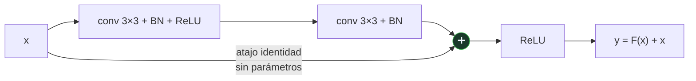

# P44 — ResNet

> Arquitectura y entrenamiento · Un atajo que suma la entrada a la salida convierte la profundidad
> de obstáculo en recurso.

**Nivel:** L2 · **Motor:** `resnet` · **Notebook:** [`P44_resnet.ipynb`](../../../notebooks/papers/P44_resnet.ipynb)
· **Anexo:** [cálculo y gradientes](../../annexes/A03_CALCULO_Y_GRADIENTES.md)

## 1. Identificación

| Campo | Valor |
|---|---|
| **Título original** | *Deep Residual Learning for Image Recognition* |
| **Autoría** | Kaiming He, Xiangyu Zhang, Shaoqing Ren, Jian Sun |
| **Año** | 2015 |
| **Venue** | arXiv:1512.03385 · CVPR 2016 |
| **Fuente primaria** | [arXiv:1512.03385](https://arxiv.org/abs/1512.03385) |
| **Acceso** | Abierto |
| **Fecha de consulta** | 2026-08-16 |

## 2. Problema anterior

Una observación que no cuadraba con nada: al añadir capas, el error de **entrenamiento** empeoraba.

No era sobreajuste —eso empeora el error de test, no el de entrenamiento— y no era falta de
capacidad —una red de 56 capas contiene a una de 20 más capas identidad, así que **como mínimo**
debería igualarla—. El paper llama a esto **degradación**, y su conclusión es incómoda: el problema
no estaba en el modelo, sino en la optimización. El descenso de gradiente no encontraba esa
solución trivial.

## 3. Propuesta

Cambiar lo que cada bloque tiene que aprender. En vez de pedirle la transformación completa `H(x)`,
se le pide el **residuo**:

```text
y = F(x) + x
```

Si lo óptimo para ese bloque es no hacer nada, basta con que `F` se acerque a cero — y llevar pesos
a cero es fácil. La identidad deja de ser una solución difícil de alcanzar y pasa a ser el punto
de partida.

El atajo tiene además un efecto sobre el gradiente: la derivada de cada bloque es `1 + F'(x)`, y
ese `1` sostiene el producto al retropropagar aunque los términos residuales sean pequeños.

## 4. Intuición sin fórmulas

Corregir un texto ajeno frente a reescribirlo entero. Si el original ya está bien, corregir es no
tocar nada; reescribir obliga a reproducirlo de memoria y siempre sale peor.

**Dónde deja de funcionar la analogía:** el corrector ve el texto y decide. La red no decide: es
que la parametrización hace que «no tocar nada» sea el estado más barato al que llegar.

## 5. Matemática mínima

```text
Bloque plano   : y = H(x)                → aprender H desde cero
Bloque residual: y = F(x) + x            → aprender solo la CORRECCIÓN

Al retropropagar:
    ∂y/∂x = I + ∂F/∂x

Producto sobre L bloques:
    plano    : Π f'ᵢ              → si f'ᵢ < 1, colapsa exponencialmente
    residual : Π (1 + F'ᵢ)        → el 1 sostiene el producto
```

El notebook lo hace explícito con factores fijados a mano: con 152 capas y un factor de 0,85 por
capa, el gradiente sin atajo cae a **1,9e-11**; con `1 + (−0,02)` por bloque, se queda en
**4,6e-02**. Nueve órdenes de magnitud de diferencia entre desaparecer y sobrevivir.

<!-- puente:inicio -->
> [!TIP]
> **Puente matemático.** Esta sección da por sabido lo siguiente. Si algo no te suena,
> léelo primero: está explicado una sola vez, en un solo sitio, y sirve para todas las fichas.

| Dónde | Qué necesitas de ahí |
|---|---|
| [**A03 §4** · Por qué el gradiente se desvanece](../../annexes/A03_CALCULO_Y_GRADIENTES.md#4-por-qué-el-gradiente-se-desvanece) | por qué un producto de derivadas colapsa, y qué cambia al sumarle un 1 |
| [**A03 §2** · Regla de la cadena](../../annexes/A03_CALCULO_Y_GRADIENTES.md#2-regla-de-la-cadena) | la regla de la cadena, de donde sale ese producto |
<!-- puente:fin -->

## 6. Arquitectura o flujo



## 7. Qué observar en el paper original

- La **figura de la degradación**: 20 capas frente a 56, con el error de **entrenamiento** peor en
  la más profunda. Es el dato que motiva todo y conviene mirarlo antes que la solución.
- Que el atajo es **identidad y sin parámetros** en el caso general. Añade cero coste.
- El **bloque cuello de botella** (1×1, 3×3, 1×1) para las variantes de 50 capas en adelante, y por
  qué reduce el cómputo.
- Los resultados a **152 capas**: no solo entrena, sino que mejora — que es justo lo que la
  degradación impedía.

## 8. Evidencia y resultados

Resultados en clasificación de imágenes a gran escala y en detección, con redes de 18, 34, 50, 101
y 152 capas, comparadas contra sus equivalentes planas.

> Las cifras de error por profundidad están en el artículo. Verificarlas allí. Lo relevante es el
> patrón: en las planas el error sube con la profundidad y en las residuales baja.

La miniatura de este eje aísla el mecanismo del gradiente, con factores puestos a mano. No mide
exactitud ni entrena nada: muestra por qué el producto no colapsa.

## 9. Impacto

- Es, con el [Transformer](../P08_transformer/README.md), una de las dos arquitecturas más citadas
  del campo.
- La conexión residual está **dentro** del Transformer: cada subcapa es `x + Sublayer(x)`. Sin
  ella, los modelos de lenguaje profundos no entrenarían.
- Cambió el techo práctico de profundidad de decenas a cientos de capas.
- Y reencuadró un problema: lo que parecía un límite de capacidad era un límite de optimización.

## 10. Limitaciones

1. **No elimina la necesidad de normalización**: sin BatchNorm y buena inicialización, la
   profundidad sigue siendo difícil.
2. **Más profundidad no es gratis**: más cómputo, más memoria de activaciones, más latencia.
3. **Rendimientos decrecientes**: de 152 a 1000 capas el paper reporta problemas, no mejoras
   proporcionales.
4. **La explicación de por qué funciona siguió discutiéndose**: hay trabajo que lo describe como un
   ensamblado implícito de rutas de distinta longitud (Veit et al., 2016).
5. **El atajo obliga a que las dimensiones cuadren**; cuando cambian hace falta una proyección, que
   ya no es gratuita.

## 11. Errores comunes

| Error | Corrección |
|---|---|
| «Resuelve el gradiente que se desvanece» | Ayuda mucho, pero el problema que motiva el paper es la **degradación del error de entrenamiento**, que es otra cosa. |
| «El problema era que faltaba capacidad» | Al revés: la red profunda contiene a la superficial. Era la optimización la que no llegaba. |
| «El atajo tiene pesos» | En el caso general es la identidad, sin parámetros. Solo se proyecta cuando cambian las dimensiones. |
| «Es específico de visión» | La conexión residual es hoy universal: está en cada bloque de cada Transformer. |
| «Más capas siempre mejor» | El paper mismo muestra que el retorno decrece y que a profundidades extremas reaparecen problemas. |

## 12. Relación con trabajos anteriores

- **[P43 BatchNorm](../P43_batchnorm/README.md) (2015)** — se usa dentro de cada bloque; las dos
  piezas juntas son lo que hace entrenable la profundidad.
- **[P04 AlexNet](../P04_alexnet/README.md) (2012)** y **VGG (2014)** — la línea de «más profundo es
  mejor» que aquí choca contra un muro.
- **[P03 LSTM](../P03_lstm/README.md) (1997)** — la misma idea en el tiempo: un camino aditivo por
  el que el gradiente viaja sin atenuarse.

## 13. Relación con trabajos posteriores

- **[P08 Transformer](../P08_transformer/README.md) (2017)** — `x + Sublayer(x)` en cada subcapa.
- **DenseNet (2016)** — lleva la idea al extremo conectando cada capa con todas las siguientes.
- **Veit et al. (2016)** — la lectura de las redes residuales como ensamblado de rutas.
  [arXiv:1605.06431](https://arxiv.org/abs/1605.06431)
- **[P46 Vision Transformer](../P46_vit/README.md) (2020)** — el sucesor que discute su hegemonía en
  visión, y que también usa residuos.

## 14. Notebook asociado

[`P44_resnet.ipynb`](../../../notebooks/papers/P44_resnet.ipynb)

**Qué implementa:** el producto de derivadas a 10, 20, 50 y 152 capas, con y sin atajo, para
mostrar cuándo colapsa el gradiente.

**Qué NO implementa:** no hay convoluciones, ni datos, ni entrenamiento. Los factores están fijados
a mano para aislar el efecto; el aporte experimental del paper —entrenar 152 capas de verdad— no
está aquí.

```bash
ai-evolution paper-lab P44 --seed 7
```

## 15. Actividades Bloom

| Nivel | Actividad |
|---|---|
| **Recordar** | Escribe la ecuación del bloque residual y di qué aprende `F`. |
| **Explicar** | Explica por qué la degradación no es sobreajuste. |
| **Aplicar** | Ejecuta el notebook y cambia el factor por capa a 0,95. |
| **Analizar** | Deriva `∂y/∂x` y explica el papel del término `1`. |
| **Evaluar** | «Una red de 56 capas debería ser al menos tan buena como una de 20». Evalúa el argumento. |
| **Crear** | Diseña una variante del atajo para cuando cambian las dimensiones y justifica el coste. |

## 16. Autoevaluación

1. ¿Qué es la degradación y por qué no es sobreajuste?
2. ¿Qué aprende un bloque residual que no aprende uno plano?
3. ¿Por qué la identidad es fácil de alcanzar con el atajo y difícil sin él?
4. ¿Cuál es la derivada de un bloque residual y por qué importa?
5. ¿El atajo tiene parámetros?
6. ¿Dónde aparece esta idea fuera de visión?
7. ¿Qué no resuelve el atajo?

## 17. Respuestas esperadas

1. Que al añadir capas empeora el error de **entrenamiento**. El sobreajuste empeora el de test
   mientras el de entrenamiento baja: es un síntoma distinto y apunta a la optimización.
2. La **corrección** sobre su entrada, no la transformación completa. Si lo óptimo es no hacer
   nada, le basta con llevar `F` a cero.
3. Porque con atajo la identidad se obtiene con `F = 0`, que es el estado más barato. Sin atajo,
   la red tendría que aprender explícitamente la transformación identidad con sus pesos.
4. `I + ∂F/∂x`. Al multiplicar sobre muchos bloques, ese `1` impide que el producto colapse
   exponencialmente hacia cero.
5. No, en el caso general es la identidad y no añade ningún coste. Solo hace falta una proyección
   cuando cambian las dimensiones entre entrada y salida.
6. En el Transformer: cada subcapa de atención y cada red feed-forward está envuelta en
   `x + Sublayer(x)`. Es una pieza universal en modelos profundos.
7. La necesidad de normalización y de una inicialización razonable. Y no hace que más profundidad
   sea siempre mejor: el retorno decrece.

## 18. Fuentes primarias

- He, K., Zhang, X., Ren, S. y Sun, J. (2016). *Deep Residual Learning for Image Recognition*.
  **CVPR 2016**. [arXiv:1512.03385](https://arxiv.org/abs/1512.03385) · consultado 2026-08-16.
- Veit, A., Wilber, M. y Belongie, S. (2016). *Residual Networks Behave Like Ensembles of
  Relatively Shallow Networks*. [arXiv:1605.06431](https://arxiv.org/abs/1605.06431) ·
  consultado 2026-08-16.

---

[⬅️ Anterior: P43 Batch Normalization](../P43_batchnorm/README.md) ·
[📇 Índice](../../catalog/PAPERS_INDEX.md) ·
[📝 Evaluación](../../../assessments/papers/P44_resnet.md) ·
[🏫 Clase 053 · CNN y aprendizaje espacial](../../../classes/part-04-neural-networks-and-deep-learning/053-cnn-y-aprendizaje-espacial/README.md) ·
[➡️ Siguiente: P45 Destilación](../P45_distillation/README.md)
