# P45 — Destilación de conocimiento

> Arquitectura y entrenamiento · Lo que un modelo grande sabe no está en su respuesta, está en
> **cómo reparte** la probabilidad entre las respuestas que descartó.

**Nivel:** L2 · **Motor:** `distillation` · **Notebook:** [`P45_distillation.ipynb`](../../../notebooks/papers/P45_distillation.ipynb)
· **Anexo:** [probabilidad y verosimilitud](../../annexes/A02_PROBABILIDAD_Y_VEROSIMILITUD.md)

## 1. Identificación

| Campo | Valor |
|---|---|
| **Título original** | *Distilling the Knowledge in a Neural Network* |
| **Autoría** | Geoffrey Hinton, Oriol Vinyals, Jeff Dean |
| **Año** | 2015 |
| **Venue** | arXiv:1503.02531 · NIPS 2014 Deep Learning Workshop |
| **Fuente primaria** | [arXiv:1503.02531](https://arxiv.org/abs/1503.02531) |
| **Acceso** | Abierto |
| **Fecha de consulta** | 2026-08-16 |

## 2. Problema anterior

Los mejores resultados venían de modelos enormes o de ensamblados de muchos modelos. Servir eso en
producción —con latencia y coste acotados— era inviable.

La salida obvia, entrenar un modelo pequeño con las mismas etiquetas, daba resultados claramente
peores. Y había una asimetría desaprovechada: el modelo grande produce, para cada entrada, una
distribución completa sobre las clases, y de todo eso solo se usaba el argmax.

## 3. Propuesta

Entrenar el modelo pequeño contra la **distribución** del grande, no contra la etiqueta.

Una etiqueta dura dice «perro» y asigna 0 a lobo, a gato y a coche por igual. La distribución del
maestro dice «perro, pero se parece bastante a un lobo, algo a un gato y nada a un coche». Esa
estructura de similitud —el paper la llama **conocimiento oscuro**— es información que la etiqueta
tira a la basura.

Para hacerla visible se aplica una **temperatura** `T` al softmax: subirla aplana la distribución
y saca a la luz las probabilidades pequeñas, que son justo las informativas.

## 4. Intuición sin fórmulas

Un examen corregido con solo «bien/mal» frente a uno donde el profesor anota qué alternativas
estuviste a punto de marcar y cuáles ni te rozaron. Lo segundo enseña mucho más rápido.

**Dónde deja de funcionar la analogía:** el profesor sabe la verdad. El maestro aquí solo tiene
sus creencias, aciertos y errores incluidos — y el alumno hereda ambos.

## 5. Matemática mínima

```text
Softmax con temperatura:
    p_i = exp(z_i / T) / Σ_j exp(z_j / T)

T = 1  → distribución habitual
T > 1  → más plana, más entropía, más estructura visible

Pérdida del alumno:
    L = α · CE(alumno_T, maestro_T) · T²  +  (1 − α) · CE(alumno_1, etiqueta)
```

El factor `T²` no es opcional: los gradientes del término suave escalan como `1/T²`, y sin
compensarlo el peso relativo de los dos términos cambiaría al mover la temperatura.

Con logits `[4,0 · 2,0 · 1,5 · −1,0]` para perro, lobo, gato y coche:

| T | perro | lobo | gato | coche | entropía |
|---:|---:|---:|---:|---:|---:|
| 1 | 0,817 | 0,111 | 0,067 | 0,006 | 0,619 |
| 5 | 0,378 | 0,254 | 0,229 | 0,139 | 1,328 |
| 10 | 0,312 | 0,256 | 0,243 | 0,189 | 1,371 |

El orden `lobo > gato > coche` está siempre; la temperatura solo lo hace **utilizable** como señal
de gradiente.

<!-- puente:inicio -->
> [!TIP]
> **Puente matemático.** Esta sección da por sabido lo siguiente. Si algo no te suena,
> léelo primero: está explicado una sola vez, en un solo sitio, y sirve para todas las fichas.

| Dónde | Qué necesitas de ahí |
|---|---|
| [**A02 §1** · Softmax](../../annexes/A02_PROBABILIDAD_Y_VEROSIMILITUD.md#1-softmax) | el softmax con temperatura: la pieza central del método |
| [**A02 §2** · Entropía](../../annexes/A02_PROBABILIDAD_Y_VEROSIMILITUD.md#2-entropía) | la entropía, que es cómo se mide cuánta estructura revela cada temperatura |
<!-- puente:fin -->

## 6. Arquitectura o flujo

```mermaid
flowchart LR
    X["entrada"] --> M["🧠 maestro grande<br/>(congelado)"]
    X --> A["🎓 alumno pequeño"]
    M --> PT["softmax con T<br/>distribución suave"]
    A --> PA["softmax con T"]
    PT -->|"pérdida suave × T²"| L(("Σ"))
    PA --> L
    Y["etiqueta dura"] --> L
    L --> G["gradiente → alumno"]
    style M fill:#2a1a3a,stroke:#8957e5
```



## 7. Qué observar en el paper original

- El **ejemplo del 2 y el 7**: por qué la probabilidad que el maestro asigna a la clase equivocada
  contiene información sobre la geometría del problema.
- La **derivación del factor `T²`** y la relación con entrenar contra logits directamente.
- El experimento donde el alumno aprende clases que **casi no vio** en su conjunto de
  transferencia: es el resultado más sorprendente del artículo.
- Los **modelos especialistas** para conjuntos con muchísimas clases, una parte del paper que casi
  nadie cita.

## 8. Evidencia y resultados

Experimentos en reconocimiento de dígitos, reconocimiento de voz a gran escala y un conjunto
interno con miles de clases, comparando el alumno destilado contra el mismo alumno entrenado solo
con etiquetas.

> Las cifras están en el artículo. Verificarlas allí. Lo que hay que retener es el patrón: el
> alumno destilado se acerca al maestro mucho más que el alumno entrenado con etiquetas duras.

La miniatura de este eje no entrena nada: exhibe la información que contiene la distribución del
maestro y cómo la temperatura la revela.

## 9. Impacto

- Es el fundamento de casi todos los modelos pequeños de uso práctico: DistilBERT, TinyBERT y la
  familia entera de modelos «mini» derivados de otros grandes.
- Se convirtió en pieza estándar del pipeline de despliegue, junto a la
  [cuantización](../P49_qlora/README.md) y la poda.
- En la era de los LLM, entrenar con salidas de un modelo mayor es una práctica generalizada — y
  una fuente de disputas sobre licencias y términos de servicio.
- Sostiene también el argumento de que **la capacidad no siempre necesita el tamaño** que se usó
  para descubrirla.

## 10. Limitaciones

1. **El alumno hereda los errores del maestro**, y también sus sesgos: la destilación transfiere
   comportamiento, no corrección.
2. **Sigue haciendo falta el maestro**: hay que entrenarlo y ejecutarlo sobre todo el conjunto de
   transferencia.
3. **Techo de capacidad**: si el alumno es demasiado pequeño, no hay temperatura que lo salve.
4. **`T` y `α` son hiperparámetros más** que ajustar.
5. **Explicación incompleta**: por qué funciona tan bien sigue siendo objeto de estudio; hay
   trabajo que lo atribuye tanto a la regularización como a la transferencia de similitud.
6. **Cuestiones de licencia**: destilar de un modelo ajeno puede violar sus términos de uso.

## 11. Errores comunes

| Error | Corrección |
|---|---|
| «El alumno copia al maestro» | Aprende su **distribución**, que es una señal mucho más rica y suave que copiar predicciones. |
| «La temperatura crea información» | La información ya está en los logits. La temperatura solo la hace visible al gradiente. |
| Olvidar el factor `T²` | Los gradientes del término suave escalan como `1/T²`. Sin compensar, cambiar `T` cambia el equilibrio entre los dos términos. |
| «Un alumno destilado es tan bueno como el maestro» | Se acerca mucho más que sin destilar, pero hay un techo impuesto por su capacidad. |
| «Sirve para corregir al maestro» | Al contrario: le transfiere también sus errores y sesgos. |

## 12. Relación con trabajos anteriores

- **Buciluă, Caruana y Niculescu-Mizil (2006)** — comprimir un ensamblado en un modelo único; el
  antecedente directo.
- **[P04 AlexNet](../P04_alexnet/README.md) (2012)** — los modelos grandes cuyo despliegue motiva
  el problema.
- **Ensamblados** — la técnica cara que se busca comprimir.

## 13. Relación con trabajos posteriores

- **DistilBERT (2019)** — la aplicación más citada, sobre [BERT](../P09_bert/README.md).
- **[P48 LoRA](../P48_lora/README.md) (2021)** y **[P49 QLoRA](../P49_qlora/README.md) (2023)** — la
  otra vía para reducir coste: no achicar el modelo, sino su ajuste y sus bits.
- **Destilación desde LLM (2023+)** — entrenar modelos pequeños con salidas de modelos grandes, con
  el debate de licencias que arrastra.

## 14. Notebook asociado

[`P45_distillation.ipynb`](../../../notebooks/papers/P45_distillation.ipynb)

**Qué implementa:** la distribución del maestro a cuatro temperaturas, su entropía, y la
comparación explícita contra la etiqueta dura.

**Qué NO implementa:** no hay maestro ni alumno entrenados, ni conjunto de transferencia, ni el
factor `T²` en una pérdida real. Se exhibe la información, no se destila.

```bash
ai-evolution paper-lab P45 --seed 7
```

## 15. Actividades Bloom

| Nivel | Actividad |
|---|---|
| **Recordar** | Escribe el softmax con temperatura y di qué hace `T > 1`. |
| **Explicar** | Explica qué es el conocimiento oscuro con el ejemplo perro/lobo/coche. |
| **Aplicar** | Ejecuta el notebook y añade `T = 20`. ¿Qué pasa con la entropía? |
| **Analizar** | ¿Por qué la etiqueta dura y la distribución del maestro no son intercambiables? |
| **Evaluar** | Un maestro tiene un sesgo conocido. ¿Qué implica destilarlo? |
| **Crear** | Diseña un protocolo para destilar sin heredar un sesgo identificado. |

## 16. Autoevaluación

1. ¿Qué información tira la etiqueta dura?
2. ¿Qué hace la temperatura y por qué hace falta?
3. ¿Por qué el término suave se multiplica por `T²`?
4. ¿El alumno puede superar al maestro?
5. ¿Qué hereda el alumno además de la capacidad?
6. ¿Qué relación tiene esto con los modelos «mini» actuales?
7. ¿Qué problema legal puede plantear destilar?

## 17. Respuestas esperadas

1. La estructura de similitud entre clases: que un perro se parece a un lobo y nada a un coche.
   La etiqueta asigna 0 a todo lo que no es la clase correcta, sin distinguir entre esos ceros.
2. Aplana la distribución y aumenta su entropía, de modo que las probabilidades pequeñas —las que
   contienen la estructura de similitud— tengan magnitud suficiente para producir gradiente útil.
3. Porque los gradientes de ese término escalan como `1/T²`. Sin el factor, subir la temperatura
   reduciría de facto el peso del término suave frente al de la etiqueta dura.
4. En general no lo supera; se acerca mucho más de lo que lograría entrenando solo con etiquetas.
   Su capacidad impone un techo.
5. Los errores y los sesgos del maestro. La destilación transfiere comportamiento, no corrección.
6. Es su mecanismo: DistilBERT y toda la familia de modelos pequeños de uso práctico se obtienen
   destilando un modelo mayor.
7. Que los términos de uso del modelo maestro pueden prohibir usar sus salidas para entrenar otro
   modelo. Es objeto de disputa activa.

## 18. Fuentes primarias

- Hinton, G., Vinyals, O. y Dean, J. (2015). *Distilling the Knowledge in a Neural Network*.
  [arXiv:1503.02531](https://arxiv.org/abs/1503.02531) · consultado 2026-08-16.
- Buciluă, C., Caruana, R. y Niculescu-Mizil, A. (2006). *Model Compression*. **KDD 2006**.
  [dl.acm.org/doi/10.1145/1150402.1150464](https://dl.acm.org/doi/10.1145/1150402.1150464) ·
  consultado 2026-08-16.

---

[⬅️ Anterior: P44 ResNet](../P44_resnet/README.md) ·
[📇 Índice](../../catalog/PAPERS_INDEX.md) ·
[📝 Evaluación](../../../assessments/papers/P45_distillation.md) ·
[🏫 Clase 059 · Transferencia, fine-tuning y destilación](../../../classes/part-04-neural-networks-and-deep-learning/059-transferencia-fine-tuning-y-destilacion/README.md) ·
[➡️ Siguiente: P46 Vision Transformer](../P46_vit/README.md)
