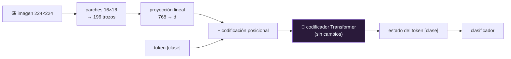

# P46 — Vision Transformer

> Arquitectura y entrenamiento · Trocea la imagen en parches y trátalos como palabras. La
> convolución deja de ser obligatoria en visión.

**Nivel:** L3 · **Motor:** `vit` · **Notebook:** [`P46_vit.ipynb`](../../../notebooks/papers/P46_vit.ipynb)
· **Anexo:** [complejidad y coste](../../annexes/A05_COMPLEJIDAD_Y_COSTE.md)

## 1. Identificación

| Campo | Valor |
|---|---|
| **Título original** | *An Image is Worth 16x16 Words: Transformers for Image Recognition at Scale* |
| **Autoría** | Alexey Dosovitskiy, Lucas Beyer, Alexander Kolesnikov y otros |
| **Año** | 2020 |
| **Venue** | arXiv:2010.11929 · ICLR 2021 |
| **Fuente primaria** | [arXiv:2010.11929](https://arxiv.org/abs/2010.11929) |
| **Acceso** | Abierto |
| **Fecha de consulta** | 2026-08-16 |

## 2. Problema anterior

Desde [AlexNet](../P04_alexnet/README.md), la convolución era el supuesto de fondo de toda la
visión por computador. Su fuerza está en tres **sesgos inductivos** que trae de fábrica: localidad
—los píxeles cercanos importan juntos—, equivarianza a la traslación —un gato es un gato esté donde
esté— y jerarquía espacial.

Mientras tanto, en lenguaje el [Transformer](../P08_transformer/README.md) había desplazado a las
recurrentes por completo. La pregunta natural quedaba abierta: ¿esos sesgos son **necesarios**, o
simplemente muy útiles cuando hay pocos datos?

## 3. Propuesta

Aplicar un Transformer casi sin modificar a la imagen. Se parte en parches fijos —16×16 píxeles—,
cada parche se aplana y se proyecta linealmente a un vector, se le suma una codificación posicional
y se le añade un token de clase. A partir de ahí, es literalmente el codificador del Transformer.

Ningún sesgo inductivo espacial. Ni localidad, ni equivarianza, ni jerarquía: solo el orden que
inyecta la codificación posicional.

Y el resultado que da nombre al artículo — *at scale*: con datos suficientes, la ausencia de sesgos
deja de ser un problema y se convierte en ventaja, porque el modelo aprende de los datos la
estructura que la convolución imponía de antemano.

## 4. Intuición sin fórmulas

Un rompecabezas donde te dan las piezas numeradas por su posición. Nadie te dice que las piezas
contiguas se relacionan más: lo descubres mirando muchísimos rompecabezas.

**Dónde deja de funcionar la analogía:** con pocos rompecabezas, quien ya sabe que las piezas
vecinas encajan gana siempre. Ese «ya sabe» es exactamente el sesgo inductivo de la convolución, y
por eso la CNN gana en régimen de datos medianos.

## 5. Matemática mínima

```text
Imagen H×W×C, parche P×P
    N = (H/P) · (W/P)  parches
    cada uno se aplana a P²·C y se proyecta a dimensión d

    z₀ = [x_clase ; x¹E ; x²E ; … ; x^N E] + E_pos

Coste de la atención: O(N²)
```

| imagen | parche | tokens (+clase) | coste de atención relativo |
|---|---|---:|---:|
| 224×224 | 32×32 | 50 | 0,06 |
| 224×224 | 16×16 | 197 | 1,00 |
| 384×384 | 16×16 | 577 | 8,58 |
| 512×512 | 16×16 | 1025 | 27,07 |

Bajar el parche de 32 a 16 multiplica el coste por **17**: la resolución se paga al cuadrado. Ese
es el compromiso central de la arquitectura.

<!-- puente:inicio -->
> [!TIP]
> **Puente matemático.** Esta sección da por sabido lo siguiente. Si algo no te suena,
> léelo primero: está explicado una sola vez, en un solo sitio, y sirve para todas las fichas.

| Dónde | Qué necesitas de ahí |
|---|---|
| [**A05 §2** · El cruce: atención frente a recurrencia](../../annexes/A05_COMPLEJIDAD_Y_COSTE.md#2-el-cruce-atención-frente-a-recurrencia) | el coste cuadrático en el número de parches, que decide la resolución viable |
| [**A01 §4** · Matrices como transformaciones](../../annexes/A01_ALGEBRA_Y_GEOMETRIA.md#4-matrices-como-transformaciones) | proyectar un parche aplanado es una transformación lineal |
<!-- puente:fin -->

## 6. Arquitectura o flujo



## 7. Qué observar en el paper original

- La **curva por tamaño de preentrenamiento**: es el resultado de verdad. Con conjuntos medianos la
  CNN gana; a partir de cierta escala, se invierte. Todo el artículo depende de esa figura.
- Que la arquitectura es **deliberadamente aburrida**: usan el Transformer estándar para que el
  resultado sea atribuible a la escala y no a un truco arquitectónico.
- Las **visualizaciones de atención**: en capas bajas atiende localmente aunque nadie se lo pidió.
  Redescubre la localidad.
- La discusión sobre la **codificación posicional 2D frente a 1D**, y por qué apenas importa.

## 8. Evidencia y resultados

Preentrenamiento en conjuntos de imágenes de tamaño creciente —del orden de un millón, diez
millones y cientos de millones de imágenes— con evaluación por transferencia a varios conjuntos de
clasificación.

> Las cifras por conjunto y por tamaño de preentrenamiento están en el artículo. Verificarlas allí.
> El punto de cruce entre CNN y ViT es el dato que hay que leer, no el máximo absoluto.

La miniatura de este eje cuenta tokens y coste de atención: hace tangible por qué la resolución es
cara y qué se gana bajando el tamaño de parche.

## 9. Impacto

- Unificó las arquitecturas de visión y lenguaje, lo que hizo posible que un mismo modelo procese
  ambas modalidades — la base de todo lo multimodal actual.
- Es el codificador visual de [CLIP](../P18_clip/README.md) y de la mayoría de modelos de
  visión-lenguaje.
- Abrió la línea de preentrenamiento autosupervisado en imagen (MAE, DINO).
- Y validó una tesis más general del campo: los sesgos inductivos son un sustituto de los datos,
  y con datos suficientes, dejan de compensar.

## 10. Limitaciones

1. **Hambre de datos**: sin preentrenamiento a gran escala, una CNN comparable lo supera.
2. **Coste cuadrático en el número de parches**, que hace cara la alta resolución.
3. **Los parches son una rejilla rígida**: parten objetos por la mitad sin miramiento.
4. **Menos eficiente en datos por diseño**: lo que la convolución sabe gratis, aquí hay que
   aprenderlo.
5. **La comparación con CNN depende del régimen** de datos y de cómputo: no hay un ganador absoluto,
   y el propio paper es explícito en esto.
6. **Difícil en tareas densas** (segmentación, detección) sin modificaciones, que llegaron después
   con arquitecturas jerárquicas como Swin.

## 11. Errores comunes

| Error | Corrección |
|---|---|
| «ViT es mejor que las CNN» | Solo por encima de cierta escala de preentrenamiento. Por debajo, la CNN gana — y el paper lo muestra. |
| «No tiene ningún sesgo inductivo» | Tiene uno: la partición en parches impone una rejilla. Lo que no tiene son localidad ni equivarianza. |
| «Es un Transformer adaptado a imagen» | Es lo contrario: la aportación es que **no** hace falta adaptarlo. La adaptación está en la entrada. |
| «El token de clase es imprescindible» | Es una elección heredada de BERT. El promediado de parches funciona de forma comparable. |
| «Parches más pequeños siempre mejor» | Mejora la resolución y multiplica el coste al cuadrado: de parche 32 a 16, ×17. |

## 12. Relación con trabajos anteriores

- **[P08 Transformer](../P08_transformer/README.md) (2017)** — la arquitectura, usada casi tal cual.
- **[P09 BERT](../P09_bert/README.md) (2018)** — de donde viene el token de clase y el esquema de
  preentrenar y transferir.
- **[P04 AlexNet](../P04_alexnet/README.md) (2012)** y **[P44 ResNet](../P44_resnet/README.md)
  (2015)** — el paradigma convolucional que se cuestiona.
- **[P19 Leyes de escalado](../P19_scaling_laws/README.md) (2020)** — el marco que explica por qué
  «a escala» es el argumento central.

## 13. Relación con trabajos posteriores

- **[P18 CLIP](../P18_clip/README.md) (2021)** — usa un ViT como codificador de imagen.
- **Swin Transformer (2021)** — reintroduce jerarquía y ventanas locales para tareas densas.
- **MAE y DINO (2021)** — preentrenamiento autosupervisado sobre ViT.
- **Modelos multimodales (2022+)** — la unificación arquitectónica que este paper hace posible.

## 14. Notebook asociado

[`P46_vit.ipynb`](../../../notebooks/papers/P46_vit.ipynb)

**Qué implementa:** el conteo de tokens y el coste relativo de atención para cuatro
configuraciones de imagen y parche, y la comparación explícita de sesgos inductivos entre CNN y
ViT.

**Qué NO implementa:** no hay imagen, ni parches reales, ni modelo, ni entrenamiento. El resultado
central del paper —qué pasa al preentrenar a escala— no es reproducible aquí.

```bash
ai-evolution paper-lab P46 --seed 7
```

## 15. Actividades Bloom

| Nivel | Actividad |
|---|---|
| **Recordar** | Enumera los tres sesgos inductivos de la convolución. |
| **Explicar** | Explica por qué ViT necesita más datos que una CNN. |
| **Aplicar** | Calcula los tokens de una imagen de 640×640 con parches de 16. |
| **Analizar** | ¿Por qué el coste crece al cuadrado al bajar el tamaño de parche? |
| **Evaluar** | «Las CNN quedaron obsoletas». Evalúa con el régimen de datos en la mano. |
| **Crear** | Diseña un esquema de parcheado que reduzca el coste sin perder resolución efectiva. |

## 16. Autoevaluación

1. ¿Cómo se convierte una imagen en una secuencia?
2. ¿Qué sesgos inductivos pierde ViT y qué gana a cambio?
3. ¿Cuántos tokens produce una imagen de 224×224 con parches de 16?
4. ¿Por qué la alta resolución es cara?
5. ¿En qué régimen gana la CNN?
6. ¿Qué redescubre el modelo en sus capas bajas?
7. ¿Por qué este paper importa para lo multimodal?

## 17. Respuestas esperadas

1. Se parte en parches de tamaño fijo, cada uno se aplana y se proyecta linealmente a un vector, y
   se le suma una codificación posicional. Se añade un token de clase al principio.
2. Pierde localidad, equivarianza a la traslación y jerarquía espacial. Gana capacidad de modelar
   relaciones a larga distancia desde la primera capa y de escalar mejor con datos.
3. 196 parches más el token de clase: 197.
4. Porque el coste de la atención es cuadrático en el número de tokens, y el número de tokens crece
   con el cuadrado del lado de la imagen dividido por el del parche.
5. Con conjuntos de datos pequeños o medianos, donde sus sesgos inductivos sustituyen a datos que
   no existen.
6. La localidad: las visualizaciones muestran que en capas bajas la atención se concentra en
   parches cercanos, aunque nada en la arquitectura se lo imponga.
7. Porque unifica la arquitectura: si imagen y texto son secuencias de vectores procesadas por el
   mismo bloque, un solo modelo puede consumir ambas.

## 18. Fuentes primarias

- Dosovitskiy, A. et al. (2021). *An Image is Worth 16x16 Words: Transformers for Image Recognition
  at Scale*. **ICLR 2021**. [arXiv:2010.11929](https://arxiv.org/abs/2010.11929) ·
  consultado 2026-08-16.
- Vaswani, A. et al. (2017). *Attention Is All You Need*.
  [arXiv:1706.03762](https://arxiv.org/abs/1706.03762) · consultado 2026-08-16.

---

[⬅️ Anterior: P45 Destilación](../P45_distillation/README.md) ·
[📇 Índice](../../catalog/PAPERS_INDEX.md) ·
[📝 Evaluación](../../../assessments/papers/P46_vit.md) ·
[🏫 Clase 061 · Clasificación y representación visual](../../../classes/part-05-language-vision-audio-and-multimodal-ai/061-clasificacion-y-representacion-visual/README.md) ·
[➡️ Siguiente: P47 AlphaFold](../P47_alphafold/README.md)
