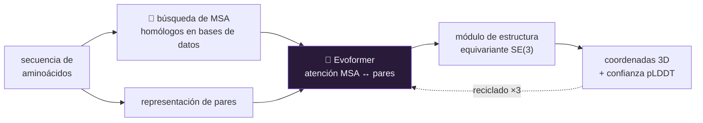

# P47 — AlphaFold 2

> Arquitectura y entrenamiento · El caso donde el aprendizaje profundo resolvió, en la práctica, un
> problema abierto de la biología durante cincuenta años.

**Nivel:** L4 · **Motor:** `alphafold` · **Notebook:** [`P47_alphafold.ipynb`](../../../notebooks/papers/P47_alphafold.ipynb)
· **Anexo:** [álgebra y geometría](../../annexes/A01_ALGEBRA_Y_GEOMETRIA.md)

## 1. Identificación

| Campo | Valor |
|---|---|
| **Título original** | *Highly accurate protein structure prediction with AlphaFold* |
| **Autoría** | John Jumper, Richard Evans, Alexander Pritzel y otros (DeepMind) |
| **Año** | 2021 |
| **Venue** | *Nature* 596, 583–589 |
| **Fuente primaria** | [doi.org/10.1038/s41586-021-03819-2](https://doi.org/10.1038/s41586-021-03819-2) |
| **Acceso** | Abierto |
| **Fecha de consulta** | 2026-08-16 |

## 2. Problema anterior

Una proteína es una cadena de aminoácidos que se pliega en una forma tridimensional concreta, y esa
forma determina lo que hace. Determinarla experimentalmente —cristalografía, resonancia,
criomicroscopía— cuesta meses o años y mucho dinero por estructura.

Predecirla desde la secuencia era un problema abierto desde los años setenta. La evaluación
comunitaria **CASP**, celebrada cada dos años desde 1994, mostraba progreso lento: en 2018 el mejor
resultado seguía lejos de la precisión experimental.

## 3. Propuesta

Un sistema entrenado de extremo a extremo con tres piezas que se refuerzan:

1. **Alineamientos múltiples de secuencias (MSA)**: proteínas homólogas de otras especies. Si dos
   posiciones mutan juntas a lo largo de la evolución, probablemente estén en contacto. Es
   información evolutiva, no solo química.
2. **Evoformer**: atención que opera a la vez sobre el MSA y sobre una representación de **pares**
   de residuos, dejando que ambas se actualicen mutuamente.
3. **Módulo de estructura**: produce coordenadas 3D directamente, con una arquitectura equivariante
   a rotaciones y traslaciones, y **recicla** su salida como entrada varias veces.

El puente conceptual: la geometría 3D queda determinada —salvo rotación y reflexión— por las
distancias entre pares. Predecir qué residuos están cerca es, en la práctica, predecir la forma.

## 4. Intuición sin fórmulas

Reconstruir el plano de una ciudad conociendo solo las distancias entre cada par de esquinas. Con
suficientes distancias, la disposición queda fijada; solo puedes girar o reflejar el mapa entero.

**Dónde deja de funcionar la analogía:** las distancias de la ciudad te las dan. Aquí hay que
**predecirlas** desde la secuencia, y ese es el problema entero.

## 5. Matemática mínima

```text
De distancias a coordenadas:

    dado d_ij para todo par (i,j), encontrar x_i ∈ ℝ³ tal que
        ‖x_i − x_j‖ ≈ d_ij

    minimizando  Σ_{i<j} ( ‖x_i − x_j‖ − d_ij )²

La solución es única salvo rotación, traslación y reflexión.
```

La miniatura del eje hace exactamente esto: parte de ocho puntos en posiciones **aleatorias** y,
usando solo la matriz de distancias, converge por descenso de gradiente a la estructura correcta —
el error cuadrático cae de 20,04 a 0,0 en menos de 150 pasos.

<!-- puente:inicio -->
> [!TIP]
> **Puente matemático.** Esta sección da por sabido lo siguiente. Si algo no te suena,
> léelo primero: está explicado una sola vez, en un solo sitio, y sirve para todas las fichas.

| Dónde | Qué necesitas de ahí |
|---|---|
| [**A01 §2** · Norma y coseno](../../annexes/A01_ALGEBRA_Y_GEOMETRIA.md#2-norma-y-coseno) | distancias y normas: la geometría queda fijada por las distancias entre pares |
| [**A01 §5** · Proyección y subespacios](../../annexes/A01_ALGEBRA_Y_GEOMETRIA.md#5-proyección-y-subespacios) | por qué la solución es única solo salvo rotación, traslación y reflexión |
<!-- puente:fin -->

## 6. Arquitectura o flujo



## 7. Qué observar en el paper original

- El **resultado de CASP14**: mediana de GDT en torno a 92 sobre 100, con la precisión experimental
  como referencia. Es el dato que cambió el campo.
- El papel del **MSA**: cómo la señal coevolutiva sustituye a información física que no se modela.
- El **reciclado**: pasar la predicción de vuelta por la red varias veces, un truco simple con
  mucho efecto.
- La métrica **pLDDT** de confianza por residuo. Que el modelo diga *dónde* no está seguro es
  posiblemente tan importante como la predicción misma.

## 8. Evidencia y resultados

Evaluación en CASP14, la competición comunitaria a ciegas donde las estructuras reales no son
públicas cuando se predice. AlphaFold 2 alcanzó una exactitud comparable a la determinación
experimental en la mayoría de los objetivos.

> Las cifras exactas de GDT por categoría están en el artículo de *Nature* y en los materiales de
> CASP14. Verificarlas allí. El diseño a ciegas de CASP es lo que hace creíble el resultado, y
> merece más atención que el número.

La miniatura de este eje **no predice** nada: recibe la matriz de distancias y reconstruye la
geometría. Aísla la mitad geométrica del problema, no la difícil.

## 9. Impacto

- La base de datos derivada publicó predicciones para más de 200 millones de proteínas, de acceso
  abierto, transformando la práctica en biología estructural.
- Demis Hassabis y John Jumper compartieron el **Premio Nobel de Química de 2024** por este trabajo.
- Es el argumento más sólido a favor de que estos métodos producen conocimiento científico y no
  solo productos.
- Cambió las expectativas sobre qué problemas científicos son abordables así, con el riesgo de
  extrapolar de más.

## 10. Limitaciones

1. **Predice estructuras estáticas**: una proteína real se mueve, y su función suele depender de
   ese movimiento.
2. **Depende del MSA**: con proteínas huérfanas, sin homólogos conocidos, la calidad cae.
3. **No modela bien complejos ni ligandos** en la versión de 2021; eso llega con AlphaFold-Multimer
   y AlphaFold 3.
4. **Predecir la estructura no es entender el plegamiento**: el proceso físico por el que la
   proteína llega a esa forma sigue sin explicarse.
5. **No predice el efecto de mutaciones** de forma fiable, que es lo que muchas aplicaciones
   clínicas necesitan.
6. **Coste computacional alto** para el entrenamiento, y dependencia de bases de datos curadas
   durante décadas por la comunidad.

## 11. Errores comunes

| Error | Corrección |
|---|---|
| «Resolvió el problema del plegamiento» | Resolvió la **predicción de estructura**. El plegamiento —cómo llega físicamente a esa forma— sigue abierto. |
| «Simula la física de la proteína» | No hay simulación física. Aprende de estructuras conocidas y de señal evolutiva. |
| «Sustituye al trabajo experimental» | Es una hipótesis de altísima calidad. La validación experimental sigue siendo necesaria, y el pLDDT indica dónde más. |
| «Funciona igual con cualquier proteína» | Depende críticamente de tener homólogos. Sin MSA útil, la calidad cae. |
| «Una proteína tiene una estructura» | Muchas tienen regiones desordenadas o varias conformaciones funcionales. Una predicción estática no captura eso. |

## 12. Relación con trabajos anteriores

- **[P08 Transformer](../P08_transformer/README.md) (2017)** — la atención, adaptada a operar sobre
  MSA y sobre pares.
- **[P44 ResNet](../P44_resnet/README.md) (2015)** — la profundidad con atajos que el sistema usa.
- **AlphaFold 1 (2020)** — la versión anterior, basada en predecir distancias y optimizar aparte.
  [doi.org/10.1038/s41586-019-1923-7](https://doi.org/10.1038/s41586-019-1923-7)
- **Anfinsen (1972)** — la hipótesis de que la secuencia determina la estructura, que es la premisa
  de todo el problema.

## 13. Relación con trabajos posteriores

- **AlphaFold-Multimer (2021)** y **AlphaFold 3 (2024)** — complejos, ácidos nucleicos y ligandos.
- **ESMFold (2022)** — predicción sin MSA usando un modelo de lenguaje de proteínas.
- **Modelos de fundación para la ciencia (2023+)** — la línea que este trabajo legitima.
- **[P16 Sistemas agénticos](../P16_agentic_systems/README.md)** — la aplicación de estos métodos al
  ciclo de descubrimiento completo, todavía muy abierta.

## 14. Notebook asociado

[`P47_alphafold.ipynb`](../../../notebooks/papers/P47_alphafold.ipynb)

**Qué implementa:** la reconstrucción de coordenadas 3D a partir de una matriz de distancias por
descenso de gradiente, con ocho puntos, partiendo de posiciones aleatorias.

**Qué NO implementa:** absolutamente nada del sistema real. No hay MSA, ni Evoformer, ni módulo de
estructura, ni proteína. La matriz de distancias **se da**, y predecirla desde la secuencia es el
problema entero. Es la parte geométrica, que es la fácil.

```bash
ai-evolution paper-lab P47 --seed 7
```

## 15. Actividades Bloom

| Nivel | Actividad |
|---|---|
| **Recordar** | Enumera las tres piezas del sistema y qué aporta cada una. |
| **Explicar** | Explica por qué la coevolución de dos posiciones sugiere contacto físico. |
| **Aplicar** | Ejecuta el notebook con 16 puntos y observa la convergencia. |
| **Analizar** | ¿Por qué la solución es única solo salvo rotación y reflexión? |
| **Evaluar** | «AlphaFold resolvió el plegamiento de proteínas». Evalúa la afirmación. |
| **Crear** | Diseña un criterio para decidir cuándo una predicción necesita validación experimental. |

## 16. Autoevaluación

1. ¿Qué predice exactamente el sistema y qué no?
2. ¿Qué información aporta el MSA que no está en la secuencia?
3. ¿Por qué las distancias entre pares determinan la geometría?
4. ¿Qué es el pLDDT y por qué importa tanto?
5. ¿Por qué CASP hace creíble el resultado?
6. ¿Qué pasa con una proteína sin homólogos conocidos?
7. ¿Qué diferencia hay entre predecir la estructura y entender el plegamiento?

## 17. Respuestas esperadas

1. Predice la **estructura tridimensional** de la proteína a partir de su secuencia. No predice el
   proceso físico de plegamiento, ni su dinámica, ni de forma fiable el efecto de mutaciones.
2. Señal **coevolutiva**: si dos posiciones mutan de forma correlacionada a lo largo de la
   evolución, es probable que estén en contacto en la estructura. Eso no se ve en una sola
   secuencia.
3. Porque fijar todas las distancias entre pares fija la configuración salvo movimientos rígidos:
   rotación, traslación y reflexión.
4. Es una estimación de confianza **por residuo**. Importa porque indica en qué partes de la
   predicción se puede confiar y cuáles requieren validación experimental.
5. Porque es una evaluación a ciegas: las estructuras reales no son públicas en el momento de
   predecir, así que no puede haber contaminación ni ajuste al conjunto de prueba.
6. La calidad de la predicción cae, porque falta la señal evolutiva de la que el sistema depende.
7. Predecir la estructura es dar el resultado final. Entender el plegamiento sería explicar el
   proceso físico por el que la cadena llega a esa forma, que sigue sin resolverse.

## 18. Fuentes primarias

- Jumper, J. et al. (2021). *Highly accurate protein structure prediction with AlphaFold*.
  **Nature** 596, 583–589. [doi.org/10.1038/s41586-021-03819-2](https://doi.org/10.1038/s41586-021-03819-2)
  · consultado 2026-08-16.
- Senior, A. W. et al. (2020). *Improved protein structure prediction using potentials from deep
  learning* (AlphaFold 1). **Nature** 577, 706–710.
  [doi.org/10.1038/s41586-019-1923-7](https://doi.org/10.1038/s41586-019-1923-7) ·
  consultado 2026-08-16.

---

[⬅️ Anterior: P46 Vision Transformer](../P46_vit/README.md) ·
[📇 Índice](../../catalog/PAPERS_INDEX.md) ·
[📝 Evaluación](../../../assessments/papers/P47_alphafold.md) ·
[🏫 Clase 181 · IA para ciencia, clima y salud responsable](../../../classes/part-14-frontier-research-and-capstones/181-ia-para-ciencia-clima-y-salud-responsable/README.md) ·
[➡️ Siguiente: P48 LoRA](../P48_lora/README.md)
