# P48 — LoRA

> Arquitectura y entrenamiento · Si la actualización útil de un modelo tiene rango bajo, se puede
> entrenar factorizada — y ajustar un modelo grande deja de exigir un centro de datos.

**Nivel:** L3 · **Motor:** `lora` · **Notebook:** [`P48_lora.ipynb`](../../../notebooks/papers/P48_lora.ipynb)
· **Anexo:** [álgebra y geometría](../../annexes/A01_ALGEBRA_Y_GEOMETRIA.md)

## 1. Identificación

| Campo | Valor |
|---|---|
| **Título original** | *LoRA: Low-Rank Adaptation of Large Language Models* |
| **Autoría** | Edward J. Hu, Yelong Shen, Phillip Wallis y otros |
| **Año** | 2021 |
| **Venue** | arXiv:2106.09685 · ICLR 2022 |
| **Fuente primaria** | [arXiv:2106.09685](https://arxiv.org/abs/2106.09685) |
| **Acceso** | Abierto |
| **Fecha de consulta** | 2026-08-16 |

## 2. Problema anterior

Ajustar un modelo grande a una tarea significaba actualizar **todos** sus pesos. Con
[GPT-3](../P10_gpt3/README.md) eso son 175 000 millones de parámetros: memoria de optimizador
prohibitiva —Adam guarda dos estados por parámetro—, y una copia completa del modelo por cada tarea.

Existían alternativas de ajuste parcial. Los *adapters* insertaban capas nuevas, pero añadían
latencia en inferencia. El *prefix tuning* consumía parte de la ventana de contexto. Ninguna era
gratis.

## 3. Propuesta

Congelar `W` y aprender su **actualización** en forma factorizada:

```text
W' = W + BA,  con B ∈ ℝ^{d×r},  A ∈ ℝ^{r×d},  r ≪ d
```

La hipótesis, sugerida por trabajo previo sobre la dimensionalidad intrínseca del ajuste: la
actualización que hace falta para adaptar el modelo a una tarea tiene **rango bajo**. Si es así,
`BA` la representa con una fracción diminuta de los parámetros.

Y la propiedad que lo hace práctico: al desplegar, `BA` se **suma** a `W`. El modelo resultante es
una matriz normal, sin capas extra. **Cero latencia añadida** en inferencia — a diferencia de los
adapters.

## 4. Intuición sin fórmulas

Un manual de mil páginas y una fe de erratas de dos. No reimprimes el manual: publicas la fe de
erratas, y cada especialidad tiene la suya sobre el mismo manual.

**Dónde deja de funcionar la analogía:** una fe de erratas corrige puntos sueltos. `BA` es una
corrección que toca **toda** la matriz, pero con una estructura muy restringida —solo `r`
direcciones independientes—. Es densa y de rango bajo, no dispersa.

## 5. Matemática mínima

```text
Parámetros a entrenar:
    ajuste completo : d × d
    LoRA            : 2 × d × r

Con d = 128:
```

| rango `r` | ajuste completo | LoRA | fracción | reducción |
|---:|---:|---:|---:|---:|
| 1 | 16 384 | 256 | 1,6 % | 64× |
| 4 | 16 384 | 1 024 | 6,3 % | 16× |
| 16 | 16 384 | 4 096 | 25 % | 4× |
| 64 | 16 384 | 16 384 | 100 % | 1× |

Con `r = d/2` ya no se ahorra nada: `2·d·r = d²`. El método solo tiene sentido con `r` pequeño, y
eso es una **apuesta** sobre la estructura del problema, no un teorema.

`A` se inicializa aleatoria y `B` a cero, de modo que `BA = 0` al empezar: el ajuste arranca
exactamente desde el modelo base.

<!-- puente:inicio -->
> [!TIP]
> **Puente matemático.** Esta sección da por sabido lo siguiente. Si algo no te suena,
> léelo primero: está explicado una sola vez, en un solo sitio, y sirve para todas las fichas.

| Dónde | Qué necesitas de ahí |
|---|---|
| [**A01 §4** · Matrices como transformaciones](../../annexes/A01_ALGEBRA_Y_GEOMETRIA.md#4-matrices-como-transformaciones) | el **rango** de una matriz: toda la hipótesis del método está ahí |
| [**A01 §5** · Proyección y subespacios](../../annexes/A01_ALGEBRA_Y_GEOMETRIA.md#5-proyección-y-subespacios) | subespacios: `BA` restringe la actualización a uno de dimensión `r` |
<!-- puente:fin -->

## 6. Arquitectura o flujo

```mermaid
flowchart LR
    X["x"] --> W["W congelada<br/>❄️ d×d"]
    X --> A["A · r×d<br/>🔥 entrenable"]
    A --> B["B · d×r<br/>🔥 entrenable"]
    W --> S(("➕"))
    B --> S
    S --> Y["h = Wx + BAx"]
    S -.->|"al desplegar:<br/>W ← W + BA"| D["una matriz normal<br/>✅ sin latencia extra"]
    style W fill:#1a2a3a,stroke:#58a6ff
```



## 7. Qué observar en el paper original

- El **estudio de rango**: `r = 1` o `2` ya funciona sorprendentemente bien en muchas tareas. Es la
  evidencia principal de la hipótesis de rango bajo.
- **A qué matrices aplicarlo**: los autores encuentran que las proyecciones de consulta y valor de
  la atención dan mejor resultado que repartir el presupuesto entre todas.
- La comparación explícita de **latencia** frente a adapters. Es el argumento de ingeniería que
  explica su adopción.
- El análisis de la **relación entre el subespacio de `BA` y las direcciones de `W`**, en el
  apéndice: sugiere que amplifica direcciones que ya existían pero estaban poco pesadas.

## 8. Evidencia y resultados

Experimentos sobre modelos de lenguaje de distintos tamaños en tareas de comprensión y generación,
comparando ajuste completo, adapters, prefix tuning y LoRA a varios rangos.

> Las cifras por tarea y rango están en el artículo. Verificarlas allí. Lo que hay que retener: con
> una fracción muy pequeña de parámetros entrenables, la calidad se mantiene comparable al ajuste
> completo en las tareas evaluadas.

La miniatura de este eje solo cuenta parámetros y enseña la forma de una actualización de rango 2.
No entrena nada.

## 9. Impacto

- Hizo el ajuste de modelos grandes accesible fuera de los grandes laboratorios: un adaptador cabe
  en unos megabytes y se entrena en una GPU de consumo.
- Creó un **ecosistema**: miles de adaptadores compartidos sobre unos pocos modelos base, con
  servidores que cargan y descargan adaptadores por petición.
- Es la base de [QLoRA](../P49_qlora/README.md), que lo combina con cuantización para bajar aún más
  el requisito de memoria.
- Y cambió la economía del ajuste fino: de decisión estratégica cara a experimento barato.

## 10. Limitaciones

1. **La hipótesis de rango bajo es empírica**: nada garantiza que la actualización útil lo sea para
   toda tarea, especialmente si exige conocimiento realmente nuevo.
2. **`r` y las matrices objetivo son hiperparámetros** cuya elección importa y no es automática.
3. **Menor capacidad de cambio que el ajuste completo**: con desplazamientos de dominio grandes, la
   diferencia aparece.
4. **Componer varios adaptadores no es trivial**: sumarlos no equivale a aprenderlos juntos.
5. **No reduce la memoria del modelo base** durante el entrenamiento —solo la del optimizador y los
   gradientes—; para eso hace falta cuantizar.
6. **La comparación con ajuste completo depende de la tarea y del presupuesto** del estudio.

## 11. Errores comunes

| Error | Corrección |
|---|---|
| «Entrena menos parámetros, luego es más rápido» | Reduce memoria de optimizador y de gradientes, pero la pasada hacia delante sigue recorriendo el modelo entero. |
| «Añade latencia como los adapters» | No: `BA` se suma a `W` al desplegar y queda una matriz normal. Ese es su argumento central. |
| «Rango mayor siempre mejor» | El paper muestra que rangos muy pequeños bastan. Con `r = d/2` se pierde todo el ahorro. |
| «Puede aprender cualquier cosa que aprenda el ajuste completo» | Está restringido a un subespacio de rango `r`. La hipótesis es empírica, no una garantía. |
| «Reduce la memoria necesaria para cargar el modelo» | La base sigue completa en memoria. Reducirla es lo que aporta QLoRA cuantizándola. |

## 12. Relación con trabajos anteriores

- **[P08 Transformer](../P08_transformer/README.md) (2017)** — las matrices de proyección sobre las
  que se aplica.
- **[P10 GPT-3](../P10_gpt3/README.md) (2020)** — la escala que hace inviable el ajuste completo.
- **Adapters (Houlsby et al., 2019)** — la alternativa con coste de latencia.
  [arXiv:1902.00751](https://arxiv.org/abs/1902.00751)
- **Aghajanyan et al. (2020)** — la dimensionalidad intrínseca del ajuste, que motiva la hipótesis.
  [arXiv:2012.13255](https://arxiv.org/abs/2012.13255)

## 13. Relación con trabajos posteriores

- **[P49 QLoRA](../P49_qlora/README.md) (2023)** — LoRA sobre una base cuantizada a 4 bits.
- **DoRA, LoRA+, AdaLoRA (2023-2024)** — variantes que reparten el rango o descomponen magnitud y
  dirección.
- **Servidores multiadaptador (2023+)** — infraestructura que explota que la base es compartida.
- **[P45 Destilación](../P45_distillation/README.md) (2015)** — la vía alternativa para abaratar:
  achicar el modelo en vez de su ajuste.

## 14. Notebook asociado

[`P48_lora.ipynb`](../../../notebooks/papers/P48_lora.ipynb)

**Qué implementa:** el conteo de parámetros para cuatro rangos con `d = 128`, y la construcción
explícita de una actualización de rango 2 como producto `BA`.

**Qué NO implementa:** no entrena nada. Ni modelo, ni tarea, ni comparación de calidad. La
hipótesis central del paper —que la actualización útil es de rango bajo— aquí se enuncia, no se
verifica.

```bash
ai-evolution paper-lab P48 --seed 7
```

## 15. Actividades Bloom

| Nivel | Actividad |
|---|---|
| **Recordar** | Escribe la ecuación de LoRA e identifica qué se congela. |
| **Explicar** | Explica por qué no añade latencia en inferencia. |
| **Aplicar** | Calcula el ahorro con `d = 4096` y `r = 8`. |
| **Analizar** | ¿A partir de qué `r` deja de haber ahorro y por qué? |
| **Evaluar** | Una tarea exige conocimiento de dominio muy nuevo. ¿Confiarías en LoRA? |
| **Crear** | Diseña un experimento que mida si la actualización útil de una tarea es de rango bajo. |

## 16. Autoevaluación

1. ¿Qué se entrena y qué se congela?
2. ¿Por qué `B` se inicializa a cero?
3. ¿Por qué no hay latencia añadida en inferencia?
4. ¿Qué memoria ahorra exactamente y cuál no?
5. ¿A partir de qué rango desaparece el ahorro?
6. ¿Es la hipótesis de rango bajo un teorema?
7. ¿Qué añade QLoRA sobre esto?

## 17. Respuestas esperadas

1. Se entrenan las dos matrices pequeñas `A` y `B`; la matriz original `W` queda congelada y no
   recibe gradiente.
2. Para que `BA = 0` al inicio y el modelo arranque exactamente en el comportamiento del modelo
   base, sin una perturbación aleatoria de partida.
3. Porque al desplegar se calcula `W + BA` una sola vez y queda una matriz de las mismas
   dimensiones. No hay capas adicionales que recorrer.
4. Ahorra la memoria del optimizador y de los gradientes, que solo se necesitan para los parámetros
   entrenables. **No** ahorra la memoria de cargar el modelo base, que sigue completo.
5. A partir de `r = d/2`, donde `2·d·r = d²` y se entrenan tantos parámetros como en el ajuste
   completo.
6. No. Es una hipótesis empírica bien respaldada en las tareas evaluadas, no una garantía general.
7. Cuantizar la base congelada a 4 bits, que es justo la memoria que LoRA no reduce.

## 18. Fuentes primarias

- Hu, E. J. et al. (2022). *LoRA: Low-Rank Adaptation of Large Language Models*. **ICLR 2022**.
  [arXiv:2106.09685](https://arxiv.org/abs/2106.09685) · consultado 2026-08-16.
- Aghajanyan, A., Zettlemoyer, L. y Gupta, S. (2020). *Intrinsic Dimensionality Explains the
  Effectiveness of Language Model Fine-Tuning*.
  [arXiv:2012.13255](https://arxiv.org/abs/2012.13255) · consultado 2026-08-16.

---

[⬅️ Anterior: P47 AlphaFold](../P47_alphafold/README.md) ·
[📇 Índice](../../catalog/PAPERS_INDEX.md) ·
[📝 Evaluación](../../../assessments/papers/P48_lora.md) ·
[🏫 Clase 077 · LoRA, QLoRA y adaptación eficiente](../../../classes/part-06-foundation-models-and-llm-engineering/077-lora-qlora-y-adaptacion-eficiente/README.md) ·
[➡️ Siguiente: P49 QLoRA](../P49_qlora/README.md)
