# P49 — QLoRA y cuantización

> Arquitectura y entrenamiento · Menos bits por peso. Un modelo de 70 000 millones baja de 140 GB a
> 35 GB y pasa de necesitar un clúster a caber en una sola tarjeta.

**Nivel:** L3 · **Motor:** `quantization` · **Notebook:** [`P49_qlora.ipynb`](../../../notebooks/papers/P49_qlora.ipynb)
· **Anexo:** [complejidad y coste](../../annexes/A05_COMPLEJIDAD_Y_COSTE.md)

## 1. Identificación

| Campo | Valor |
|---|---|
| **Título original** | *QLoRA: Efficient Finetuning of Quantized LLMs* |
| **Autoría** | Tim Dettmers, Artidoro Pagnoni, Ari Holtzman, Luke Zettlemoyer |
| **Año** | 2023 |
| **Venue** | arXiv:2305.14314 · NeurIPS 2023 |
| **Fuente primaria** | [arXiv:2305.14314](https://arxiv.org/abs/2305.14314) |
| **Acceso** | Abierto |
| **Fecha de consulta** | 2026-08-16 |

## 2. Problema anterior

[LoRA](../P48_lora/README.md) redujo drásticamente la memoria del **optimizador**, pero dejó
intacto el problema mayor: el modelo base sigue cargado en memoria completo y en precisión de 16
bits. Un modelo de 70 000 millones de parámetros ocupa así **140 GB**, muy por encima de cualquier
tarjeta única.

La cuantización existía y se usaba en inferencia, pero cuantizar y luego **entrenar** encima
planteaba dudas: si los pesos base están degradados, ¿el ajuste todavía funciona?

## 3. Propuesta

Cuantizar la base congelada a 4 bits y entrenar los adaptadores LoRA en precisión alta. Como la
base no recibe gradiente, su degradación no se propaga por la optimización — solo afecta a la
función que el adaptador tiene que corregir.

Tres piezas técnicas concretas:

1. **NF4** (*NormalFloat 4-bit*): un formato de 4 bits cuyos niveles están colocados según la
   distribución normal que siguen los pesos, en vez de repartidos uniformemente.
2. **Doble cuantización**: cuantizar también las constantes de escala, que con bloques pequeños
   dejan de ser despreciables.
3. **Optimizadores paginados**: descargar estados del optimizador a memoria del sistema en los
   picos, para no agotar la tarjeta.

## 4. Intuición sin fórmulas

Guardar fotos con menos profundidad de color. Con suficientes niveles no se nota; a partir de
cierto punto aparecen bandas. Y si los niveles se reparten donde hay más información —en vez de
uniformemente— se aguanta mucho más antes de que se note.

**Dónde deja de funcionar la analogía:** en una foto el deterioro se ve. En un modelo hay que
**medirlo en una tarea**, porque el error sobre los pesos no dice cuánto empeora el comportamiento.

## 5. Matemática mínima

```text
Cuantización uniforme a b bits:
    niveles = 2^b
    paso    = (max − min) / (niveles − 1)
    ŵ       = min + round((w − min)/paso) · paso

Memoria de un modelo de N parámetros: N · b / 8 bytes
```

Con 2000 pesos simulados de una gaussiana:

| bits | niveles | error cuadrático medio | memoria de un modelo de 70 000 M |
|---:|---:|---:|---:|
| 16 | 65 536 | 1,43e-06 | 140,0 GB |
| 8 | 256 | 3,66e-04 | 70,0 GB |
| 4 | 16 | 6,32e-03 | 35,0 GB |
| 3 | 8 | 1,33e-02 | 26,2 GB |
| 2 | 4 | 3,11e-02 | 17,5 GB |

La memoria baja **linealmente** con los bits; el error crece mucho más deprisa. Ahí está el
compromiso, y por qué 4 bits acabó siendo el punto habitual.

<!-- puente:inicio -->
> [!TIP]
> **Puente matemático.** Esta sección da por sabido lo siguiente. Si algo no te suena,
> léelo primero: está explicado una sola vez, en un solo sitio, y sirve para todas las fichas.

| Dónde | Qué necesitas de ahí |
|---|---|
| [**A05 §3** · La cuenta que decide el hardware: memoria](../../annexes/A05_COMPLEJIDAD_Y_COSTE.md#3-la-cuenta-que-decide-el-hardware-memoria) | la cuenta de memoria: bits por parámetro por número de parámetros |
| [**A02 §6** · Gaussianas y el proceso de difusión](../../annexes/A02_PROBABILIDAD_Y_VEROSIMILITUD.md#6-gaussianas-y-el-proceso-de-difusión) | la gaussiana que siguen los pesos, que es lo que NF4 aprovecha |
<!-- puente:fin -->

## 6. Arquitectura o flujo

```mermaid
flowchart LR
    W["W base<br/>❄️ NF4 · 4 bits"] --> DQ["descuantizar<br/>al vuelo"]
    X["x"] --> DQ
    DQ --> H1["Wx en 16 bits"]
    X --> A["A · 🔥 16 bits"] --> B["B · 🔥 16 bits"]
    H1 --> S(("➕"))
    B --> S
    S --> Y["h = Wx + BAx"]
    Y -.->|"gradiente SOLO a A y B"| A
    style W fill:#1a2a3a,stroke:#58a6ff
```



## 7. Qué observar en el paper original

- La **justificación de NF4**: por qué colocar los niveles según la distribución normal es mejor
  que repartirlos uniformemente, dado que los pesos se distribuyen así.
- El experimento clave: **igualar la calidad de un ajuste en 16 bits** con la base cuantizada a 4.
  Es la afirmación central y hay que ver con qué modelos y tareas se sostiene.
- La familia de modelos **Guanaco** y su evaluación, incluyendo el uso de un modelo como juez —con
  todas las cautelas que eso merece.
- El análisis del **tamaño de bloque** y de la doble cuantización: cuánto ahorra realmente.

## 8. Evidencia y resultados

Ajuste de modelos de varios tamaños con la base cuantizada, comparado contra ajuste en 16 bits, con
evaluación en conjuntos de instrucciones y comparativas por preferencia.

> Las cifras están en el artículo. Verificarlas allí, con una cautela metodológica: parte de la
> evaluación usa modelos como jueces, y esa metodología tiene sesgos conocidos —hacia respuestas
> largas, hacia el estilo del propio juez—.

La miniatura de este eje mide el error de **reconstrucción de pesos**, no la calidad del modelo. Es
deliberado: hace visible que son dos cosas distintas.

## 9. Impacto

- Puso el ajuste de modelos grandes al alcance de una sola tarjeta de consumo, con un efecto
  inmediato sobre quién puede participar en el campo.
- Aceleró el ecosistema de modelos abiertos ajustados, que a partir de 2023 se multiplicó.
- Consolidó los 4 bits como punto de operación estándar para inferencia local.
- Y desplazó la conversación sobre coste: de «cuántos parámetros» a «cuántos bits por parámetro».

## 10. Limitaciones

1. **La cuantización degrada**: puede ser imperceptible en promedio y notarse en casos concretos,
   sobre todo en razonamiento largo o en tareas de precisión.
2. **Descuantizar al vuelo cuesta cómputo**: se ahorra memoria, no necesariamente tiempo.
3. **Depende de núcleos especializados**: sin ellos, el rendimiento es malo.
4. **El error de reconstrucción de pesos no predice la degradación de la tarea**; hay que medir en
   la tarea.
5. **La evaluación con modelos como jueces es discutible**, y buena parte de los resultados
   comparativos la usan.
6. **Por debajo de 4 bits el deterioro se acelera** y deja de ser aceptable en general.

## 11. Errores comunes

| Error | Corrección |
|---|---|
| «4 bits es la mitad de bueno que 8» | La relación entre bits y calidad no es lineal. Hay que medir en la tarea, no extrapolar. |
| «Cuantizar acelera la inferencia» | Ahorra memoria y ancho de banda. La velocidad depende de los núcleos y puede incluso empeorar sin ellos. |
| «El error de cuantización mide la pérdida de calidad» | No. Son magnitudes distintas y su relación no es directa. |
| «QLoRA es solo LoRA con menos bits» | Aporta NF4, doble cuantización y optimizadores paginados. Sin esas piezas, no funciona igual. |
| «Cuantizar los adaptadores también» | Los adaptadores se entrenan en precisión alta: son los que reciben gradiente y ahí la precisión sí importa. |

## 12. Relación con trabajos anteriores

- **[P48 LoRA](../P48_lora/README.md) (2021)** — la mitad del método.
- **LLM.int8() (2022)**, del mismo autor principal — cuantización a 8 bits para inferencia.
  [arXiv:2208.07339](https://arxiv.org/abs/2208.07339)
- **[P45 Destilación](../P45_distillation/README.md) (2015)** — la vía alternativa: achicar el
  modelo en vez de sus bits.
- **[P10 GPT-3](../P10_gpt3/README.md) (2020)** — la escala que crea el problema de memoria.

## 13. Relación con trabajos posteriores

- **GPTQ y AWQ (2023)** — cuantización guiada por datos para inferencia.
- **Cuantización a 1-2 bits (2024)** — el límite inferior, con degradación aún discutida.
- **Modelos locales (2023+)** — todo el ecosistema de ejecución en equipo propio depende de esto.
- **[P21 Mezcla de expertos](../P21_moe/README.md)** — la otra vía para desacoplar capacidad de
  coste por token.

## 14. Notebook asociado

[`P49_qlora.ipynb`](../../../notebooks/papers/P49_qlora.ipynb)

**Qué implementa:** cuantización uniforme de 2000 pesos gaussianos a 16, 8, 4, 3 y 2 bits, con el
error de reconstrucción y la memoria resultante para un modelo de 70 000 millones.

**Qué NO implementa:** no hay NF4 —se usa cuantización uniforme, que es peor—, ni doble
cuantización, ni adaptadores, ni ninguna medida de calidad en tarea, que es lo único que decide si
una cuantización es aceptable.

```bash
ai-evolution paper-lab P49 --seed 7
```

## 15. Actividades Bloom

| Nivel | Actividad |
|---|---|
| **Recordar** | Enumera las tres aportaciones técnicas de QLoRA. |
| **Explicar** | Explica por qué la base puede cuantizarse y los adaptadores no. |
| **Aplicar** | Calcula la memoria de un modelo de 8000 M a 4 bits. |
| **Analizar** | ¿Por qué NF4 es mejor que una rejilla uniforme para pesos gaussianos? |
| **Evaluar** | Un informe reporta «sin pérdida de calidad a 4 bits». ¿Qué exiges para creerlo? |
| **Crear** | Diseña un protocolo de evaluación de cuantización que no dependa de un modelo juez. |

## 16. Autoevaluación

1. ¿Qué memoria reduce QLoRA que LoRA no reducía?
2. ¿Por qué la base cuantizada no arruina el entrenamiento?
3. ¿Qué es NF4 y por qué no es una rejilla uniforme?
4. ¿La cuantización acelera la inferencia?
5. ¿Por qué el error de cuantización no basta para evaluar?
6. ¿Qué precisión llevan los adaptadores y por qué?
7. ¿Qué cautela metodológica exige la evaluación del paper?

## 17. Respuestas esperadas

1. La del **modelo base cargado**. LoRA reducía la del optimizador y los gradientes, pero la base
   seguía ocupando 16 bits por parámetro.
2. Porque la base está congelada y no recibe gradiente: su degradación cambia la función de
   partida, pero no interfiere con la optimización de los adaptadores, que sí están en precisión
   alta.
3. Un formato de 4 bits cuyos niveles se colocan según los cuantiles de una distribución normal.
   Como los pesos siguen aproximadamente esa distribución, se asignan más niveles donde hay más
   masa, y el error baja frente a una rejilla uniforme.
4. No necesariamente. Ahorra memoria y ancho de banda; el tiempo depende de tener núcleos
   especializados y de descuantizar al vuelo, que cuesta cómputo.
5. Porque mide la distancia entre pesos originales y cuantizados, no el comportamiento del modelo.
   Dos cuantizaciones con el mismo error pueden degradar tareas de forma muy distinta.
6. Precisión alta, típicamente 16 bits, porque son los únicos parámetros que reciben gradiente y
   ahí la precisión numérica sí afecta a la optimización.
7. Que parte de los resultados comparativos usa modelos como jueces, una metodología con sesgos
   conocidos hacia respuestas largas y hacia el estilo del propio juez.

## 18. Fuentes primarias

- Dettmers, T., Pagnoni, A., Holtzman, A. y Zettlemoyer, L. (2023). *QLoRA: Efficient Finetuning of
  Quantized LLMs*. **NeurIPS 2023**. [arXiv:2305.14314](https://arxiv.org/abs/2305.14314) ·
  consultado 2026-08-16.
- Dettmers, T. et al. (2022). *LLM.int8(): 8-bit Matrix Multiplication for Transformers at Scale*.
  [arXiv:2208.07339](https://arxiv.org/abs/2208.07339) · consultado 2026-08-16.

---

[⬅️ Anterior: P48 LoRA](../P48_lora/README.md) ·
[📇 Índice](../../catalog/PAPERS_INDEX.md) ·
[📝 Evaluación](../../../assessments/papers/P49_qlora.md) ·
[🏫 Clase 085 · Cuantización e inferencia local](../../../classes/part-06-foundation-models-and-llm-engineering/085-cuantizacion-e-inferencia-local/README.md) ·
[➡️ Siguiente: P50 IA constitucional](../P50_constitutional_ai/README.md)
