# P50 — IA constitucional

> Evaluación y seguridad · Sustituir parte del juicio humano por un conjunto de principios
> **escritos**, y dejar que el modelo se critique a sí mismo contra ellos.

**Nivel:** L4 · **Motor:** `constitutional_ai` · **Notebook:** [`P50_constitutional_ai.ipynb`](../../../notebooks/papers/P50_constitutional_ai.ipynb)
· **Anexo:** [probabilidad y verosimilitud](../../annexes/A02_PROBABILIDAD_Y_VEROSIMILITUD.md)

## 1. Identificación

| Campo | Valor |
|---|---|
| **Título original** | *Constitutional AI: Harmlessness from AI Feedback* |
| **Autoría** | Yuntao Bai, Saurav Kadavath, Sandipan Kundu y otros (Anthropic) |
| **Año** | 2022 |
| **Venue** | arXiv:2212.08073 |
| **Fuente primaria** | [arXiv:2212.08073](https://arxiv.org/abs/2212.08073) |
| **Acceso** | Abierto |
| **Fecha de consulta** | 2026-08-16 |

## 2. Problema anterior

[RLHF](../P12_instructgpt_rlhf/README.md) funcionaba, y traía tres problemas de fondo.

El primero es de **escala**: hacen falta muchísimas comparaciones humanas, y son caras y lentas.
El segundo es **humano**: revisar contenido dañino durante meses tiene un coste real sobre las
personas que lo hacen. El tercero es de **auditoría**: lo que el modelo aprende son las preferencias
implícitas de un grupo de anotadores, con sus criterios y sus sesgos, y no hay documento contra el
cual verificar si el comportamiento resultante es el pretendido.

Además, los modelos alineados así tendían a la **evasión**: negarse sin explicar, que es seguro y
poco útil.

## 3. Propuesta

Escribir los principios y ponerlos en el bucle. Dos fases:

1. **Supervisada**: el modelo genera una respuesta, se le pide que la **critique** contra un
   principio concreto de la lista y que la **revise**. Se entrena con las respuestas revisadas.
2. **Refuerzo (RLAIF)**: en vez de comparaciones humanas, el propio modelo compara pares de
   respuestas guiándose por los principios, y con esas preferencias se entrena el modelo de
   recompensa.

El cambio importante no es que se ahorren etiquetas. Es que **el criterio pasa a ser un documento
legible**: se puede leer, discutir, versionar y criticar. Deja de estar disperso en el juicio
implícito de anotadores.

## 4. Intuición sin fórmulas

Un código deontológico escrito frente a «pregúntale al jefe». El código no garantiza buenas
decisiones, pero sí que se pueda discutir la regla, y no solo el caso.

**Dónde deja de funcionar la analogía:** un profesional entiende el código; el modelo solo lo
recibe como texto en su contexto. Que lo cite no prueba que sea la causa de su comportamiento.

## 5. Matemática mínima

```text
Fase 1 — supervisada:
    respuesta   ← modelo(petición)
    crítica     ← modelo(respuesta, principio_i)      ¿lo viola?
    revisión    ← modelo(respuesta, crítica)
    entrenar el modelo sobre (petición → revisión)

Fase 2 — RLAIF:
    preferencia ← modelo(respuesta_A, respuesta_B, principios)
    modelo de recompensa ← preferencias generadas por IA
    política ← RL contra ese modelo de recompensa

Etiquetas humanas de inocuidad usadas: 0
```

La miniatura del eje ejecuta la fase 1 con reglas explícitas: la respuesta inicial *«No pienso
ayudarte con eso, deberías replantearte por qué lo preguntas»* cumple el principio de seguridad y
**viola los otros dos** —juzga al usuario y se niega sin explicar—. La revisión corrige ambos sin
una sola etiqueta humana nueva.

<!-- puente:inicio -->
> [!TIP]
> **Puente matemático.** Esta sección da por sabido lo siguiente. Si algo no te suena,
> léelo primero: está explicado una sola vez, en un solo sitio, y sirve para todas las fichas.

| Dónde | Qué necesitas de ahí |
|---|---|
| [**A02 §5** · Bradley-Terry: aprender de comparaciones](../../annexes/A02_PROBABILIDAD_Y_VEROSIMILITUD.md#5-bradley-terry-aprender-de-comparaciones) | Bradley-Terry, ahora con preferencias generadas por IA en vez de humanas |
<!-- puente:fin -->

## 6. Arquitectura o flujo

```mermaid
flowchart LR
    Q["petición"] --> R0["respuesta inicial"]
    P["📜 principios<br/>explícitos"] --> C["autocrítica<br/>¿viola alguno?"]
    R0 --> C
    C --> R1["✏️ respuesta revisada"]
    R1 --> SFT["fase 1: ajuste supervisado"]
    SFT --> PR["fase 2: preferencias<br/>generadas por IA"]
    P --> PR
    PR --> RM["modelo de recompensa"] --> RL["RL sobre la política"]
    style P fill:#2a2a1a,stroke:#d29922
```



## 7. Qué observar en el paper original

- **La constitución misma**, en el apéndice. Leerla completa es el ejercicio más instructivo del
  artículo: se ve qué es un principio operativo y qué es una declaración de intenciones.
- La **cadena crítica-revisión**, con ejemplos reales de respuestas antes y después.
- El resultado sobre **evasión**: modelos menos evasivos y a la vez menos dañinos, que es lo
  interesante — se suele asumir que ese intercambio es forzoso.
- Que la **utilidad** sigue entrenándose con retroalimentación humana. Solo la inocuidad pasa a
  retroalimentación de IA.

## 8. Evidencia y resultados

Comparaciones entre modelos entrenados con RLHF y con IA constitucional, evaluando inocuidad,
utilidad y evasión mediante comparaciones por preferencia.

> Las curvas están en el artículo. Verificarlas allí. El resultado que importa es la relación
> conjunta entre inocuidad y evasión, no cada métrica por separado.

La miniatura de este eje **no es el método**: la crítica está codificada con reglas fijas, mientras
que en el paper la genera el propio modelo y puede fallar. Es la forma del bucle, no su contenido.

## 9. Impacto

- Estableció la retroalimentación de IA como alternativa práctica a la humana en parte del proceso
  de alineamiento.
- Popularizó publicar el criterio: hoy varias organizaciones publican documentos de especificación
  de comportamiento, versionados y criticables.
- Redujo la exposición de anotadores humanos a contenido dañino.
- Y trasladó el debate de «qué hace el modelo» a «quién escribe los principios y con qué autoridad»
  — que es la pregunta correcta, aunque el método no la responda.

## 10. Limitaciones

1. **No resuelve quién decide los principios.** Los hace explícitos, que es distinto y también
   valioso, pero la legitimidad sigue siendo una cuestión política abierta.
2. **La autocrítica hereda las limitaciones del modelo**: si no reconoce un daño, no lo criticará.
3. **Riesgo de retroalimentación circular**: el modelo evalúa según criterios que él mismo
   interpreta, y los sesgos pueden reforzarse.
4. **Los principios se contradicen entre sí** en casos reales, y su resolución no está especificada.
5. **Cumplir la letra no es cumplir la intención**: un modelo puede satisfacer el texto y fallar en
   el fondo.
6. **La utilidad sigue necesitando humanos**, así que el ahorro es parcial.

## 11. Errores comunes

| Error | Corrección |
|---|---|
| «Elimina a los humanos del alineamiento» | Solo de la retroalimentación de inocuidad. Los principios los escriben personas y la utilidad sigue usando retroalimentación humana. |
| «Los principios garantizan el comportamiento» | Son entrada de entrenamiento, no una restricción verificable. El modelo puede violarlos. |
| «Es una constitución en sentido jurídico» | Es un documento de criterios de entrenamiento, sin mecanismo de aplicación ni de apelación. |
| «Resuelve el problema de los valores» | Lo hace **explícito y discutible**, que es un avance real, pero no decide de quién son esos valores. |
| «Si el modelo cita el principio, lo está siguiendo» | Citar es comportamiento superficial. Que el principio sea la causa del comportamiento es una afirmación causal que hay que probar aparte. |

## 12. Relación con trabajos anteriores

- **[P12 InstructGPT / RLHF](../P12_instructgpt_rlhf/README.md) (2022)** — el método que extiende y
  cuyos costes ataca.
- **[P10 GPT-3](../P10_gpt3/README.md) (2020)** — la capacidad de seguir instrucciones en contexto
  que hace viable la autocrítica.
- **[P28 Cadena de pensamiento](../P28_chain_of_thought/README.md) (2022)** — el razonamiento
  explícito en el que se apoya la crítica.

## 13. Relación con trabajos posteriores

- **[P15 DPO](../P15_dpo/README.md) (2023)** — simplifica la otra mitad, la optimización de
  preferencias.
- **RLAIF (2023)** — el estudio comparativo directo entre retroalimentación humana y de IA.
  [arXiv:2309.00267](https://arxiv.org/abs/2309.00267)
- **Especificaciones de comportamiento publicadas (2024+)** — la práctica de publicar el criterio.
- **[P51 SWE-bench](../P51_swebench/README.md) (2023)** — el enfoque opuesto para evaluar: un
  verificador objetivo en vez de un juicio.

## 14. Notebook asociado

[`P50_constitutional_ai.ipynb`](../../../notebooks/papers/P50_constitutional_ai.ipynb)

**Qué implementa:** el bucle crítica-revisión sobre una respuesta evasiva, con tres principios y la
traza de qué principio viola y por qué.

**Qué NO implementa:** la crítica está codificada con reglas, no generada por un modelo. Falta
entera la segunda fase de refuerzo. Es la **forma** del método, no el método.

```bash
ai-evolution paper-lab P50 --seed 7
```

## 15. Actividades Bloom

| Nivel | Actividad |
|---|---|
| **Recordar** | Enumera las dos fases y qué produce cada una. |
| **Explicar** | Explica por qué hacer explícito el criterio es un avance aunque no decida los valores. |
| **Aplicar** | Ejecuta el notebook y añade un cuarto principio. |
| **Analizar** | ¿Qué pasa si dos principios se contradicen en un caso concreto? |
| **Evaluar** | «El modelo cita el principio, luego lo sigue». Evalúa el razonamiento. |
| **Crear** | Escribe tres principios operativos para un asistente de tu dominio, con su criterio de violación. |

## 16. Autoevaluación

1. ¿Qué tres problemas de RLHF ataca?
2. ¿Qué hace la fase supervisada y qué la de refuerzo?
3. ¿Qué significa que el criterio sea auditable?
4. ¿Qué es la evasión y por qué es un problema?
5. ¿Qué parte del alineamiento sigue necesitando humanos?
6. ¿Cuál es el riesgo de que el modelo se evalúe a sí mismo?
7. ¿Qué pregunta deja abierta el método?

## 17. Respuestas esperadas

1. El coste de las etiquetas humanas, el impacto sobre los anotadores expuestos a contenido dañino,
   y la imposibilidad de auditar un criterio que solo existe implícito en sus juicios.
2. La supervisada genera crítica y revisión contra los principios y entrena sobre las respuestas
   revisadas. La de refuerzo genera **preferencias** con el propio modelo y entrena un modelo de
   recompensa con ellas.
3. Que existe un documento legible que se puede leer, discutir, versionar y criticar, en vez de un
   criterio disperso en el juicio implícito de un grupo de anotadores.
4. Negarse sin explicar. Es un problema porque es seguro pero inútil, y porque un modelo puede
   parecer alineado simplemente por no ayudar nunca.
5. Escribir los principios, y la retroalimentación de **utilidad**, que en el paper sigue siendo
   humana. Solo la inocuidad pasa a retroalimentación de IA.
6. Retroalimentación circular: si el modelo no reconoce un daño, no lo critica, y sus sesgos pueden
   reforzarse en vez de corregirse.
7. Quién escribe los principios y con qué legitimidad. El método hace la pregunta visible y
   explícita, pero no la responde.

## 18. Fuentes primarias

- Bai, Y. et al. (2022). *Constitutional AI: Harmlessness from AI Feedback*.
  [arXiv:2212.08073](https://arxiv.org/abs/2212.08073) · consultado 2026-08-16.
- Lee, H. et al. (2023). *RLAIF: Scaling Reinforcement Learning from Human Feedback with AI
  Feedback*. [arXiv:2309.00267](https://arxiv.org/abs/2309.00267) · consultado 2026-08-16.

---

[⬅️ Anterior: P49 QLoRA](../P49_qlora/README.md) ·
[📇 Índice](../../catalog/PAPERS_INDEX.md) ·
[📝 Evaluación](../../../assessments/papers/P50_constitutional_ai.md) ·
[🏫 Clase 078 · RLHF, RLAIF y DPO](../../../classes/part-06-foundation-models-and-llm-engineering/078-rlhf-rlaif-y-dpo/README.md) ·
[➡️ Siguiente: P51 SWE-bench](../P51_swebench/README.md)
