# P51 — SWE-bench

> Evaluación y seguridad · Deja de preguntar si el código *parece* correcto. Pregunta si pasan los
> tests del repositorio.

**Nivel:** L3 · **Motor:** `swebench` · **Notebook:** [`P51_swebench.ipynb`](../../../notebooks/papers/P51_swebench.ipynb)
· **Anexo:** [complejidad y coste](../../annexes/A05_COMPLEJIDAD_Y_COSTE.md)

## 1. Identificación

| Campo | Valor |
|---|---|
| **Título original** | *SWE-bench: Can Language Models Resolve Real-World GitHub Issues?* |
| **Autoría** | Carlos E. Jimenez, John Yang, Alexander Wettig y otros |
| **Año** | 2023 |
| **Venue** | arXiv:2310.06770 · ICLR 2024 |
| **Fuente primaria** | [arXiv:2310.06770](https://arxiv.org/abs/2310.06770) |
| **Acceso** | Abierto |
| **Fecha de consulta** | 2026-08-16 |

## 2. Problema anterior

Las evaluaciones de programación de la época —HumanEval, MBPP— pedían funciones autocontenidas de
pocas líneas, con el enunciado en el propio docstring. Los modelos las saturaron rápido, y la
distancia entre ese resultado y ser útil en un repositorio real seguía siendo enorme.

Lo que faltaba en esas pruebas es justo lo que define el trabajo real: **localizar** dónde tocar en
un código que no cabe en el contexto, entender una incidencia escrita por una persona con
información incompleta, y no romper nada más.

## 3. Propuesta

Construir la evaluación a partir de **incidencias reales resueltas** en repositorios de Python
populares. Cada instancia contiene:

- el texto de la incidencia tal como lo escribió alguien;
- el repositorio en el commit exacto anterior a la solución;
- los **tests** que el arreglo real hizo pasar.

El criterio de éxito es binario y no negociable: aplicar el parche generado y ejecutar la suite. O
pasan los tests, o no.

Ese criterio es lo que aporta el trabajo. Un test es un verificador objetivo que **no se puede
convencer con prosa**.

## 4. Intuición sin fórmulas

Un examen de mecánica con dos correcciones posibles: describir cómo arreglarías el motor, o
arrancarlo. La segunda no admite interpretación.

**Dónde deja de funcionar la analogía:** un motor que arranca funciona. Un test que pasa solo
prueba lo que ese test comprueba — y puede haberse conseguido de una forma terrible.

## 5. Matemática mínima

```text
% resuelto = instancias con TODOS los tests en verde / instancias totales

Cinco intentos, tres criterios:
```

| criterio | tasa |
|---|---:|
| «parece correcto» | 80 % |
| «compila» | 80 % |
| **tests pasan** | **40 %** |

La brecha entre 80 % y 40 % es exactamente el problema que ataca el benchmark. Los criterios
blandos inflan, y siempre en la misma dirección.

## 6. Arquitectura o flujo

```mermaid
flowchart LR
    I["📋 incidencia real<br/>escrita por una persona"] --> M["modelo / agente"]
    R["📦 repositorio<br/>en el commit anterior"] --> M
    M --> P["parche generado"]
    P --> AP["aplicar al repo"]
    AP --> T{"🧪 ejecutar la suite<br/>del repositorio"}
    T -->|"todo verde"| OK["✅ resuelto"]
    T -->|"cualquier fallo"| NO["❌ no resuelto"]
    style T fill:#2a2a1a,stroke:#d29922
```



## 7. Qué observar en el paper original

- El **proceso de construcción**: cómo se filtran las incidencias para que sean verificables y
  reproducibles. Es la mitad del trabajo y casi nunca se comenta.
- Las **tasas iniciales**, muy bajas, y el contraste con los resultados saturados de HumanEval.
- La discusión sobre **contaminación**: las incidencias son públicas y anteriores al corte de datos
  de los modelos evaluados. El paper es honesto al respecto.
- El subconjunto **SWE-bench Lite** y por qué existe: el coste de ejecutar la evaluación completa
  no es trivial.

## 8. Evidencia y resultados

Evaluación de modelos de lenguaje sobre más de dos mil incidencias reales de doce repositorios de
Python, con tasas de resolución iniciales de un solo dígito porcentual.

> Las cifras están en el artículo, y **envejecen muy rápido**: la tasa del estado del arte ha
> subido mucho desde 2023. Verificar siempre contra la tabla pública vigente, no contra una cifra
> citada de memoria.

La miniatura de este eje no evalúa nada: con cinco casos escritos a mano, exhibe la diferencia
entre medir apariencia y medir tests.

## 9. Impacto

- Se convirtió en la referencia de facto para agentes de programación, y en el número que se cita
  al presentar cada modelo nuevo.
- Impulsó la investigación en **localización de código**: encontrar dónde tocar resultó ser tan
  difícil como escribir el arreglo.
- Estableció un patrón para el resto del campo: evaluar con verificadores objetivos y ejecutables
  siempre que exista uno.
- Y dejó ver un límite del enfoque: cuando un benchmark se vuelve el objetivo, empieza a optimizarse
  para él.

## 10. Limitaciones

1. **Contaminación**: las incidencias y sus soluciones son públicas y pueden estar en los datos de
   entrenamiento.
2. **Pasar los tests no es una buena solución**: puede lograrse de forma frágil, rompiendo el
   diseño, o incluso modificando los tests si no se impide.
3. **Solo Python**, y solo repositorios con buena cobertura de tests: un sesgo importante.
4. **Muchas incidencias reales no tienen test asociado**, y quedan fuera por construcción.
5. **Coste de ejecución alto**, lo que empuja a evaluar en subconjuntos y complica comparar cifras.
6. **Optimizar para el benchmark** es un riesgo real desde que se convirtió en la métrica pública
   de referencia.

## 11. Errores comunes

| Error | Corrección |
|---|---|
| «Resuelve el X % de incidencias reales» | El X % de **estas** incidencias, de repos con buenos tests, en Python. La generalización es una afirmación aparte. |
| «Pasar los tests es resolver bien» | Es un mínimo objetivo, no un juicio de calidad. Nada dice del diseño ni del mantenimiento. |
| «Comparar cifras entre informes» | Hay variantes (completo, Lite, Verified) y andamiajes distintos. Sin especificar cuál, las cifras no son comparables. |
| «La contaminación está descartada» | No lo está, y el propio paper lo discute. Es una limitación estructural del diseño. |
| «Es la mejor medida de un programador» | Mide reparación de incidencias con test. No mide diseño, revisión, comunicación ni trabajo en un código sin cobertura. |

## 12. Relación con trabajos anteriores

- **HumanEval (2021)** — la evaluación que satura y que este trabajo reemplaza.
  [arXiv:2107.03374](https://arxiv.org/abs/2107.03374)
- **[P13 ReAct](../P13_react/README.md) (2022)** — el patrón de agente que se evalúa aquí.
- **[P16 Sistemas agénticos](../P16_agentic_systems/README.md)** — los sistemas que este benchmark
  mide.

## 13. Relación con trabajos posteriores

- **SWE-agent (2024)** — el andamiaje de interfaz agente-computadora construido sobre este
  benchmark. [arXiv:2405.15793](https://arxiv.org/abs/2405.15793)
- **SWE-bench Verified (2024)** — subconjunto revisado por personas para eliminar instancias mal
  especificadas.
- **Benchmarks ejecutables en otros dominios (2024+)** — la generalización del criterio.
- **[P50 IA constitucional](../P50_constitutional_ai/README.md) (2022)** — el enfoque opuesto:
  criterios de juicio donde no hay verificador objetivo posible.

## 14. Notebook asociado

[`P51_swebench.ipynb`](../../../notebooks/papers/P51_swebench.ipynb)

**Qué implementa:** cinco intentos con tres criterios de éxito distintos y el cálculo de la tasa
según cada uno, para hacer visible cuánto inflan los criterios blandos.

**Qué NO implementa:** no hay repositorio, ni incidencia, ni parche, ni suite de tests. Cinco casos
escritos a mano no son una evaluación: son la ilustración de un criterio.

```bash
ai-evolution paper-lab P51 --seed 7
```

## 15. Actividades Bloom

| Nivel | Actividad |
|---|---|
| **Recordar** | Enumera los tres componentes de una instancia del benchmark. |
| **Explicar** | Explica por qué un test es mejor verificador que un juicio. |
| **Aplicar** | Ejecuta el notebook y añade un caso que compile pero rompa otro test. |
| **Analizar** | ¿Por qué la contaminación es un problema estructural aquí? |
| **Evaluar** | Dos informes reportan cifras distintas. ¿Qué preguntas antes de compararlas? |
| **Crear** | Diseña un benchmark ejecutable para una tarea de tu dominio. |

## 16. Autoevaluación

1. ¿Qué contiene cada instancia?
2. ¿Cuál es el criterio de éxito y por qué es distinto de los anteriores?
3. ¿Qué muestra la brecha entre 80 % y 40 %?
4. ¿Por qué la contaminación es difícil de descartar?
5. ¿Qué no mide este benchmark?
6. ¿Por qué las cifras entre informes no son directamente comparables?
7. ¿Qué habilidad resultó ser más difícil de lo esperado?

## 17. Respuestas esperadas

1. El texto de una incidencia real, el repositorio en el commit anterior a su solución, y los tests
   que el arreglo real hizo pasar.
2. Aplicar el parche y que **todos** los tests pasen. Es objetivo y ejecutable, frente a criterios
   de similitud con una solución de referencia o de juicio sobre el código.
3. Cuánto inflan los criterios blandos: el doble de tasa aparente frente a la verificable, siempre
   en la dirección optimista.
4. Porque las incidencias y sus soluciones son públicas en GitHub y anteriores al corte de datos de
   los modelos evaluados. No hay forma limpia de garantizar que no estuvieran en el entrenamiento.
5. Diseño, mantenibilidad, revisión, comunicación, y el trabajo en repositorios sin cobertura de
   tests. Tampoco cubre lenguajes distintos de Python.
6. Porque existen variantes del conjunto (completo, Lite, Verified) y andamiajes de agente muy
   distintos. Sin especificar ambos, los números miden cosas diferentes.
7. Localizar dónde hay que tocar. En un repositorio que no cabe en el contexto, encontrar el
   archivo y la función resultó tan difícil como escribir el arreglo.

## 18. Fuentes primarias

- Jimenez, C. E. et al. (2024). *SWE-bench: Can Language Models Resolve Real-World GitHub Issues?*
  **ICLR 2024**. [arXiv:2310.06770](https://arxiv.org/abs/2310.06770) · consultado 2026-08-16.
- Yang, J. et al. (2024). *SWE-agent: Agent-Computer Interfaces Enable Automated Software
  Engineering*. [arXiv:2405.15793](https://arxiv.org/abs/2405.15793) · consultado 2026-08-16.

---

[⬅️ Anterior: P50 IA constitucional](../P50_constitutional_ai/README.md) ·
[📇 Índice](../../catalog/PAPERS_INDEX.md) ·
[📝 Evaluación](../../../assessments/papers/P51_swebench.md) ·
[🏫 Clase 160 · Diseño de evaluaciones y criterios de éxito](../../../classes/part-13-evaluation-safety-security-and-governance/160-diseno-de-evaluaciones-y-criterios-de-exito/README.md) ·
[➡️ Siguiente: P52 Superposición](../P52_superposition/README.md)
