# P52 — Superposición y autoencoders dispersos

> Evaluación y seguridad · Un modelo guarda más conceptos que neuronas tiene. Por eso una neurona
> no significa una cosa — y por eso interpretarlo es difícil.

**Nivel:** L4 · **Motor:** `superposition` · **Notebook:** [`P52_superposition.ipynb`](../../../notebooks/papers/P52_superposition.ipynb)
· **Anexo:** [álgebra y geometría](../../annexes/A01_ALGEBRA_Y_GEOMETRIA.md)

## 1. Identificación

| Campo | Valor |
|---|---|
| **Título original** | *Toy Models of Superposition* (2022) y *Towards Monosemanticity: Decomposing Language Models With Dictionary Learning* (2023) |
| **Autoría** | Nelson Elhage, Tristan Hume, Trenton Bricken y otros (Anthropic) |
| **Año** | 2022–2023 |
| **Venue** | *Transformer Circuits Thread* |
| **Fuente primaria** | [transformer-circuits.pub/2022/toy_model](https://transformer-circuits.pub/2022/toy_model/index.html) · [transformer-circuits.pub/2023/monosemantic-features](https://transformer-circuits.pub/2023/monosemantic-features/index.html) |
| **Acceso** | Abierto |
| **Fecha de consulta** | 2026-08-16 |

## 2. Problema anterior

Al mirar dentro de una red buscando qué representa cada neurona, aparecía un patrón desconcertante:
la mayoría responde a **cosas sin relación aparente**. Una misma unidad se activa con texto en
japonés, con citas bíblicas y con nombres de compuestos químicos.

Ese fenómeno —la **polisemanticidad**— bloqueaba la interpretabilidad. Si la unidad de análisis
natural no corresponde a un concepto, no hay por dónde empezar.

La explicación cómoda era que las redes son un desorden. Resultó ser lo contrario.

## 3. Propuesta

La polisemanticidad no es desorden: es **compresión**, y es óptima.

En un espacio de `d` dimensiones solo caben `d` direcciones perfectamente ortogonales. Pero si se
acepta un poco de solape, caben **muchísimas más** direcciones casi ortogonales. Si el modelo
necesita representar más conceptos que dimensiones tiene —y los necesita, porque el mundo tiene más
conceptos que neuronas una capa—, guardarlos en superposición es la estrategia correcta.

El precio es la **interferencia**: los conceptos se pisan un poco. Y funciona porque los conceptos
son **dispersos**: en un texto dado, casi ninguno está activo, así que la interferencia rara vez se
manifiesta a la vez.

De ahí la propuesta práctica: entrenar un **autoencoder disperso** con muchas más unidades que la
capa original, que descomponga las activaciones en características más interpretables.

## 4. Intuición sin fórmulas

Un armario donde caben diez cajas si no se tocan, y cuarenta si se aceptan solapes — sabiendo que
casi nunca abres más de dos a la vez.

**Dónde deja de funcionar la analogía:** las cajas del armario existen físicamente separadas. Aquí
los conceptos son **direcciones** en un espacio continuo, y su solape se suma en cada activación.

## 5. Matemática mínima

```text
En ℝ^d hay exactamente d direcciones ortogonales.
Pero hay exponencialmente muchas casi ortogonales (Johnson-Lindenstrauss).

Con vectores aleatorios normalizados en dimensión 8:
```

| conceptos | ratio conceptos/dim | solape medio | solape **máximo** |
|---:|---:|---:|---:|
| 8 | 1,0× | 0,253 | 0,734 |
| 24 | 3,0× | 0,310 | 0,900 |
| 80 | 10,0× | 0,290 | 0,925 |

El solape **medio** apenas cambia —depende de la dimensión, no del número de conceptos—. Lo que
crece es el **peor caso**: con 80 conceptos hay algún par que se solapa 0,925, casi paralelo. Esa
es la interferencia que el modelo tiene que tolerar, y por eso la dispersión es la condición que
hace viable el truco.

<!-- puente:inicio -->
> [!TIP]
> **Puente matemático.** Esta sección da por sabido lo siguiente. Si algo no te suena,
> léelo primero: está explicado una sola vez, en un solo sitio, y sirve para todas las fichas.

| Dónde | Qué necesitas de ahí |
|---|---|
| [**A01 §1** · Producto escalar](../../annexes/A01_ALGEBRA_Y_GEOMETRIA.md#1-producto-escalar) | el producto escalar entre direcciones **es** la interferencia |
| [**A01 §2** · Norma y coseno](../../annexes/A01_ALGEBRA_Y_GEOMETRIA.md#2-norma-y-coseno) | coseno y casi-ortogonalidad: cuántas direcciones caben de verdad en `d` dimensiones |
<!-- puente:fin -->

## 6. Arquitectura o flujo

```mermaid
flowchart LR
    A["activaciones de una capa<br/>d dimensiones<br/>🔴 polisemánticas"] --> E["codificador<br/>d → 8d"]
    E --> S["🟢 características dispersas<br/>penalización L1<br/>casi todas en cero"]
    S --> D["decodificador<br/>8d → d"]
    D --> R["reconstrucción ≈ activaciones"]
    S -.->|"cada característica<br/>UNA cosa interpretable"| I["'citas legales'<br/>'ADN'<br/>'hebreo'"]
    style S fill:#1a3a2a,stroke:#3fb950
```



## 7. Qué observar en el paper original

- Los **modelos de juguete** de 2022: el fenómeno se reproduce en una red minúscula y controlada,
  con la dispersión como parámetro. Es la evidencia más limpia.
- Las **estructuras geométricas** que emergen —dígonos, triángulos, pentágonos, tetraedros— según el
  nivel de dispersión. Es un resultado inesperado y bonito.
- En el trabajo de 2023, las **características encontradas** y sus ejemplos activadores. Vale la
  pena juzgar por uno mismo cuán interpretables son.
- Los **experimentos de ablación**: activar o suprimir una característica y ver qué cambia en la
  salida. Es lo único que respalda una afirmación causal.

## 8. Evidencia y resultados

Los modelos de juguete muestran superposición de forma controlada, con la dispersión como variable.
El trabajo de 2023 aplica autoencoders dispersos a una capa de un modelo de lenguaje pequeño y
obtiene miles de características con ejemplos activadores coherentes.

> Los resultados están en los artículos originales, con visualizaciones interactivas que no se
> pueden resumir en una tabla. Consultarlos allí. Esta es también la parte del eje donde el trabajo
> está más **en curso**: es investigación abierta, no un método asentado.

La miniatura de este eje usa **direcciones aleatorias**, no características aprendidas. Muestra que
el fenómeno es posible geométricamente, no que sea lo que un modelo real hace.

## 9. Impacto

- Dio a la interpretabilidad mecanicista una unidad de análisis utilizable: la característica en
  lugar de la neurona.
- Convirtió el problema de «las redes son cajas negras» en algo más preciso y por tanto atacable:
  la base natural no es la correcta, hay que encontrar otra.
- Abrió una línea de trabajo activa sobre control de modelos mediante intervención en
  características.
- Y dio una explicación de por qué la interpretabilidad era tan difícil, que es en sí un avance.

## 10. Limitaciones

1. **Interpretable no es causal**: que una característica se active con textos legales no prueba que
   el modelo la **use** para nada. Hace falta intervenir y medir.
2. **Elegir el tamaño del diccionario es un arte**: demasiado pequeño y no separa, demasiado grande
   y las características se fragmentan.
3. **Se aplica a una capa a la vez**: componer una explicación del modelo completo sigue abierto.
4. **La reconstrucción no es perfecta**, y lo que se pierde puede importar.
5. **Coste alto**: entrenar autoencoders sobre modelos grandes es caro.
6. **El fenómeno está bien demostrado en modelos de juguete**; su forma exacta en modelos de
   frontera es objeto de investigación activa.

## 11. Errores comunes

| Error | Corrección |
|---|---|
| «Cada neurona representa un concepto» | La mayoría son polisemánticas. Ese es el punto de partida del trabajo. |
| «La superposición es un defecto» | Es una estrategia de compresión eficiente. El modelo hace bien en usarla. |
| «El autoencoder revela lo que el modelo piensa» | Da una descomposición que **reconstruye** las activaciones. Que corresponda a lo que el modelo usa causalmente hay que demostrarlo aparte. |
| «Más características, mejor interpretación» | Diccionarios muy grandes fragmentan conceptos en trozos sin sentido. Hay un compromiso. |
| «Esto ya resolvió la interpretabilidad» | Es investigación en curso, con limitaciones reconocidas por sus autores. |

## 12. Relación con trabajos anteriores

- **[P08 Transformer](../P08_transformer/README.md) (2017)** — la arquitectura que se intenta
  interpretar.
- **[P05 Word2Vec](../P05_word2vec/README.md) (2013)** — la idea de concepto-como-dirección, aquí
  llevada al interior del modelo.
- **Johnson-Lindenstrauss (1984)** — el resultado geométrico que hace posible la superposición.
- **[P42 Ejemplos adversarios](../P42_adversarial/README.md) (2014)** — la otra cara de la dimensión
  alta: la interferencia también se puede explotar.

## 13. Relación con trabajos posteriores

- **Scaling Monosemanticity (2024)** — la aplicación a un modelo de producción, con millones de
  características. [transformer-circuits.pub/2024/scaling-monosemanticity](https://transformer-circuits.pub/2024/scaling-monosemanticity/index.html)
- **Control mediante características (2024+)** — intervenir en el modelo actuando sobre ellas.
- **Interpretabilidad como herramienta de seguridad** — la promesa: auditar lo que el modelo hace
  antes de desplegarlo, todavía lejos de cumplirse.

## 14. Notebook asociado

[`P52_superposition.ipynb`](../../../notebooks/papers/P52_superposition.ipynb)

**Qué implementa:** el almacenamiento de 8, 24 y 80 direcciones aleatorias en 8 dimensiones, con
el solape medio y máximo entre pares.

**Qué NO implementa:** no hay autoencoder disperso, ni modelo, ni características aprendidas. Las
direcciones aleatorias muestran que el fenómeno es geométricamente posible; en un modelo real la
estructura no es aleatoria y esa diferencia importa.

```bash
ai-evolution paper-lab P52 --seed 7
```

## 15. Actividades Bloom

| Nivel | Actividad |
|---|---|
| **Recordar** | Define polisemanticidad y superposición con tus palabras. |
| **Explicar** | Explica por qué la dispersión es la condición que hace viable la superposición. |
| **Aplicar** | Ejecuta el notebook con dimensión 16 y compara los solapes. |
| **Analizar** | ¿Por qué el solape medio no crece con el número de conceptos y el máximo sí? |
| **Evaluar** | «Encontramos la característica del engaño». ¿Qué evidencia exiges? |
| **Crear** | Diseña un experimento de ablación que distinga correlación de uso causal. |

## 16. Autoevaluación

1. ¿Qué es la polisemanticidad y por qué bloquea la interpretabilidad?
2. ¿Cuántas direcciones ortogonales caben en `d` dimensiones, y cuántas casi ortogonales?
3. ¿Por qué la superposición es óptima y no un defecto?
4. ¿Qué papel juega la dispersión?
5. ¿Qué hace un autoencoder disperso?
6. ¿Por qué interpretable no implica causal?
7. ¿Qué distancia hay entre estos resultados y un modelo de frontera?

## 17. Respuestas esperadas

1. Que una misma neurona responde a conceptos sin relación entre sí. Bloquea la interpretabilidad
   porque la unidad de análisis natural —la neurona— no corresponde a nada interpretable.
2. Exactamente `d` ortogonales. Casi ortogonales, un número exponencial en `d`, que es lo que
   garantiza el resultado de Johnson-Lindenstrauss.
3. Porque el modelo necesita representar más conceptos de los que caben en direcciones ortogonales,
   y aceptar un poco de solape le permite guardar muchísimos más con una pérdida pequeña.
4. Es la condición que hace tolerable la interferencia: como casi ningún concepto está activo a la
   vez, los solapes rara vez se manifiestan simultáneamente.
5. Descompone las activaciones de una capa en muchas más unidades que la capa original, con una
   penalización que fuerza que casi todas estén en cero, buscando características que representen
   una sola cosa.
6. Porque el autoencoder solo garantiza que la descomposición **reconstruye** las activaciones. Que
   el modelo use esa característica para producir su salida es una afirmación causal que exige
   intervenir —activarla o suprimirla— y medir el efecto.
7. Los modelos de juguete demuestran el fenómeno de forma limpia y controlada; en modelos de
   frontera el trabajo está en curso, es caro, y sus propios autores reconocen las limitaciones.

## 18. Fuentes primarias

- Elhage, N. et al. (2022). *Toy Models of Superposition*. **Transformer Circuits Thread**.
  [transformer-circuits.pub/2022/toy_model](https://transformer-circuits.pub/2022/toy_model/index.html)
  · consultado 2026-08-16.
- Bricken, T. et al. (2023). *Towards Monosemanticity: Decomposing Language Models With Dictionary
  Learning*. **Transformer Circuits Thread**.
  [transformer-circuits.pub/2023/monosemantic-features](https://transformer-circuits.pub/2023/monosemantic-features/index.html)
  · consultado 2026-08-16.

---

[⬅️ Anterior: P51 SWE-bench](../P51_swebench/README.md) ·
[📇 Índice](../../catalog/PAPERS_INDEX.md) ·
[📝 Evaluación](../../../assessments/papers/P52_superposition.md) ·
[🏫 Clase 167 · Explicabilidad, incertidumbre y calibración](../../../classes/part-13-evaluation-safety-security-and-governance/167-explicabilidad-incertidumbre-y-calibracion/README.md) ·
[➡️ Índice de papers](../../catalog/PAPERS_INDEX.md)
