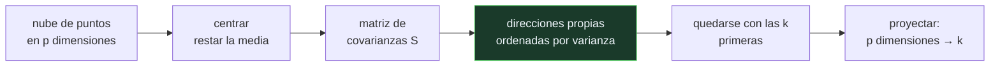

# P53 — PCA

> Ruta de fundamentos · Antes de aprender nada hay que saber resumir. La primera
> respuesta a «¿qué dirección explica esta nube?», y por qué no es la de mínimos cuadrados.

**Nivel:** L2 · **Motor:** `pca` · **Notebook:** [`P53_pca.ipynb`](../../../notebooks/papers/P53_pca.ipynb)
· **Anexo:** [álgebra y geometría](../../annexes/A01_ALGEBRA_Y_GEOMETRIA.md)

## 1. Identificación

| Campo | Valor |
|---|---|
| **Título original** | *On Lines and Planes of Closest Fit to Systems of Points in Space* |
| **Autoría** | Karl Pearson |
| **Año** | 1901 |
| **Venue** | Philosophical Magazine, Series 6, 2(11), 559–572 |
| **Fuente primaria** | [doi:10.1080/14786440109462720](https://doi.org/10.1080/14786440109462720) |
| **Acceso** | Restringido |
| **Fecha de consulta** | 2026-08-17 |

## 2. Problema anterior

Los mínimos cuadrados llevaban un siglo funcionando, y con un supuesto escondido: que una
variable es la que se explica y la otra la que explica. El error se mide **en vertical**, como
distancia de cada punto a la recta a lo largo del eje `y`.

Cuando las dos variables son del mismo tipo —dos medidas de un mismo cráneo, dos rasgos de una
misma planta— ese supuesto no tiene defensa. Y se nota: regresar `y` sobre `x` da una recta,
regresar `x` sobre `y` da otra distinta, y no hay ningún criterio dentro del método para elegir.

Pearson lo plantea como un problema geométrico y no estadístico: **¿cuál es la recta que pasa más
cerca de la nube?**

## 3. Propuesta

Cambiar lo que se minimiza. En vez de la distancia vertical, la distancia **perpendicular**:

```text
minimizar  Σ d⊥²      en lugar de     Σ (y − ŷ)²
```

La distancia perpendicular no distingue entre las variables: rotar los ejes no cambia el
resultado. Esa dirección es lo que hoy llamamos el **primer componente principal**, y coincide con
la dirección de máxima varianza de la nube.

El artículo generaliza además a planos y a espacios de más dimensiones: dado un conjunto de
puntos en `p` dimensiones, encontrar el subespacio de dimensión `k` más próximo a todos ellos.

## 4. Intuición sin fórmulas

Un enjambre de mosquitos alargado. Pregunta: ¿en qué dirección va el enjambre? La respuesta no
depende de cómo hayas puesto los ejes, ni de si mides la altura en metros o la longitud en pasos.
Es una propiedad de la nube, no del sistema de coordenadas.

Los mínimos cuadrados sí dependen de eso: cambian según qué variable pongas en el eje vertical.

**Dónde deja de funcionar la analogía:** el enjambre tiene una dirección física real; una nube de
datos puede no tenerla. Si los puntos forman una nube redonda, el primer eje existe
matemáticamente pero no significa nada, y la varianza explicada lo delata.

## 5. Matemática mínima

```text
Centrar los datos:      x̃ = x − x̄ ,  ỹ = y − ȳ

Matriz de covarianzas:  S = [ Sxx  Sxy ]
                            [ Sxy  Syy ]

Dirección del eje principal:   tan(2θ) = 2·Sxy / (Sxx − Syy)

Los tres candidatos, sobre la MISMA nube:
    mínimos cuadrados y|x  →  pendiente Sxy / Sxx        minimiza el error VERTICAL
    eje principal          →  pendiente tan(θ)           minimiza el error PERPENDICULAR
    mínimos cuadrados x|y  →  pendiente Syy / Sxy        minimiza el error HORIZONTAL
```

La miniatura del eje lo hace explícito con diez puntos: las pendientes salen **0,7782**, **0,9097**
y **1,0956**. Cada recta gana en su propio criterio de error y pierde en el ajeno. El eje
principal queda siempre entre las otras dos —en las 50 nubes perturbadas que prueba el motor, las
50 veces—, porque es la solución simétrica.

<!-- puente:inicio -->
> [!TIP]
> **Puente matemático.** Esta sección da por sabido lo siguiente. Si algo no te suena,
> léelo primero: está explicado una sola vez, en un solo sitio, y sirve para todas las fichas.

| Dónde | Qué necesitas de ahí |
|---|---|
| [**A01 §5** · Proyección y subespacios](../../annexes/A01_ALGEBRA_Y_GEOMETRIA.md#5-proyección-y-subespacios) | qué es proyectar un punto sobre una dirección y por qué eso reduce dimensiones |
| [**A01 §1** · Producto escalar](../../annexes/A01_ALGEBRA_Y_GEOMETRIA.md#1-producto-escalar) | la operación con la que se calcula la proyección y la varianza a lo largo de un eje |
<!-- puente:fin -->

## 6. Arquitectura o flujo



## 7. Qué observar en el paper original

- La **formulación del problema** en la primera página: Pearson no busca predecir, busca *ajustar*.
  Es una diferencia de objetivo, no de técnica, y explica todo lo demás.
- El tratamiento de **planos y subespacios**, no solo de rectas. La generalización a `k`
  dimensiones ya está en el artículo de 1901.
- Que **no hay autovalores**: Pearson llega al mismo eje por minimización directa. La formulación
  espectral que hoy se enseña es de Hotelling (1933).
- La discusión sobre **unidades de medida**: si las variables se miden en escalas distintas, el
  resultado cambia. Es el origen de la costumbre de estandarizar antes de aplicar PCA.

## 8. Evidencia y resultados

El artículo es analítico: demuestra que el subespacio buscado es el que maximiza la varianza
proyectada, e ilustra el método con ejemplos de medidas biométricas.

> No hay tabla de resultados que verificar. Lo verificable es la derivación, y conviene seguirla
> con lápiz: es corta.

La miniatura de este eje mide lo que el artículo argumenta —que cada criterio de error produce una
recta distinta— sobre diez puntos, y reporta que el primer eje explica el **92,19 %** de la
varianza de esa nube concreta.

## 9. Impacto

- PCA es, junto con la regresión, la técnica estadística más usada del último siglo. Aparece bajo
  otros nombres en casi todas las disciplinas: análisis factorial, descomposición de Karhunen-Loève,
  descomposición en valores singulares truncada.
- Es el primer eslabón de una línea que atraviesa todo el programa: **representar con menos
  dimensiones sin perder lo que importa**. De aquí salen los embeddings de
  [P05](../P05_word2vec/README.md) y la idea misma de espacio latente.
- Su lectura geométrica —direcciones que significan— es la que permite hablar de analogías
  vectoriales o de superposición ([P52](../P52_superposition/README.md)) sin que sea una metáfora.
- En la práctica moderna sigue siendo la primera herramienta de inspección de un conjunto de datos
  nuevo, antes de cualquier modelo.

## 10. Limitaciones

1. **Es lineal.** Si la estructura de los datos es curva, el primer eje puede ser irrelevante. De
   ahí la necesidad de métodos como t-SNE o UMAP para visualización.
2. **Depende de la escala.** Cambiar las unidades de una variable cambia los ejes. Estandarizar es
   una decisión con consecuencias, no un trámite.
3. **Máxima varianza no es máxima información útil.** La dirección de más varianza puede ser ruido
   de medición, y la señal relevante puede vivir en un eje de varianza pequeña.
4. **Los componentes rara vez son interpretables.** Son combinaciones lineales de todas las
   variables; llamarlos «factores» con nombre propio es una interpretación añadida.
5. **Sensible a valores atípicos**, porque la varianza lo es. Un punto lejano puede girar el eje
   principal por sí solo.

## 11. Errores comunes

| Error | Corrección |
|---|---|
| «PCA es lo mismo que la regresión lineal» | Minimizan errores distintos —perpendicular frente a vertical— y dan rectas distintas sobre los mismos puntos. La miniatura lo muestra con tres pendientes. |
| «El primer componente es «la variable más importante»» | Es una combinación lineal de todas. No selecciona variables: las mezcla. |
| «Más varianza explicada es siempre mejor» | Si la varianza dominante es ruido de medición, quedarse con ella es quedarse con el ruido. |
| «Da igual estandarizar o no» | No da igual: los ejes cambian. Con variables en unidades distintas, no estandarizar deja que la de mayor rango numérico domine. |
| «Lo inventó Hotelling en 1933» | Hotelling le da la forma moderna y el nombre «componentes principales». El problema y su solución geométrica son de Pearson, 1901. |

## 12. Relación con trabajos anteriores

- **Gauss y Legendre (1805–1809)** — mínimos cuadrados: el método que Pearson señala como
  insuficiente para variables simétricas.
- **Galton (1886)** — regresión y correlación: el vocabulario estadístico dentro del cual Pearson
  trabaja, y que él mismo formaliza.
- **Cauchy (1830)** — ejes principales de una forma cuadrática: la maquinaria geométrica ya
  existía en mecánica; Pearson la trae a los datos.

## 13. Relación con trabajos posteriores

- **Hotelling (1933)** — la formulación en términos de varianza y el nombre de «componentes
  principales». [doi:10.1037/h0071325](https://doi.org/10.1037/h0071325)
- **Eckart y Young (1936)** — la conexión con la descomposición en valores singulares, que es como
  hoy se calcula.
- **[P05 word2vec](../P05_word2vec/README.md) (2013)** — la idea de que las direcciones de un
  espacio vectorial significan, ahora aprendidas en vez de calculadas.
- **[P52 Superposición](../P52_superposition/README.md) (2023)** — qué pasa cuando hay más
  conceptos que dimensiones y la ortogonalidad deja de ser posible.

## 14. Notebook asociado

[`P53_pca.ipynb`](../../../notebooks/papers/P53_pca.ipynb)

**Qué implementa:** las tres rectas candidatas sobre la misma nube, con su error vertical y perpendicular, la varianza explicada por cada eje y la comprobación de que el eje principal queda entre las dos rectas de mínimos cuadrados.

**Qué NO implementa:** no hay descomposición espectral general ni datos de más de dos dimensiones. El caso 2×2 se resuelve en forma cerrada porque cabe en la pantalla, no porque sea el método.

```bash
ai-evolution paper-lab P53 --seed 7
```

## 15. Actividades Bloom

| Nivel | Actividad |
|---|---|
| **Recordar** | Escribe qué error minimiza cada una de las tres rectas. |
| **Explicar** | Explica por qué regresar `y` sobre `x` y `x` sobre `y` da rectas distintas. |
| **Aplicar** | Ejecuta el notebook y cambia dos puntos de la nube; observa qué pendiente se mueve más. |
| **Analizar** | Deriva `tan(2θ) = 2·Sxy/(Sxx − Syy)` a partir de la condición de mínima distancia perpendicular. |
| **Evaluar** | «El primer componente es la variable más informativa». Evalúa la afirmación. |
| **Crear** | Diseña un conjunto de puntos donde el primer componente explique el 99 % de la varianza y aun así no sirva para la tarea. Justifica por qué. |

## 16. Autoevaluación

1. ¿Qué error minimiza el eje principal y qué error minimizan los mínimos cuadrados?
2. ¿Por qué hay dos rectas de mínimos cuadrados y solo un eje principal?
3. ¿Qué relación hay entre el eje principal y la varianza?
4. ¿Por qué importa estandarizar antes de aplicar PCA?
5. ¿Qué significa que un eje explique el 92 % de la varianza?
6. ¿En qué caso el primer componente no significa nada útil?
7. ¿Qué aportó Hotelling que no estuviera en Pearson?

## 17. Respuestas esperadas

1. El eje principal minimiza la suma de distancias **perpendiculares** al cuadrado. Los mínimos cuadrados minimizan las distancias **verticales** (o las horizontales, según qué variable se regrese sobre cuál).
2. Porque los mínimos cuadrados eligen una variable como dependiente, y hay dos elecciones posibles. El criterio perpendicular es simétrico: no hay nada que elegir, y por eso da una sola respuesta.
3. El eje principal es la dirección de **máxima varianza** de la nube proyectada. Minimizar la distancia perpendicular y maximizar la varianza proyectada son el mismo problema, porque la suma de las dos cantidades es constante.
4. Porque el resultado depende de las unidades. Una variable medida en milímetros tiene mucha más varianza numérica que la misma medida en metros, y dominaría el primer eje sin aportar más información.
5. Que proyectar los puntos sobre ese eje conserva el 92 % de la dispersión total. No significa que se conserve el 92 % de lo que interesa para una tarea concreta: eso hay que comprobarlo aparte.
6. Cuando la nube es aproximadamente esférica —todas las direcciones con varianza similar—, o cuando la varianza dominante viene del ruido de medición y no de la señal.
7. La formulación en términos de varianza, el nombre «componentes principales» y el tratamiento estadístico —muestreo, estimación—. El problema geométrico y su solución ya estaban en 1901.

## 18. Fuentes primarias

- Pearson, K. (1901). *On Lines and Planes of Closest Fit to Systems of Points in Space*.
  **Philosophical Magazine**, 6(2), 559–572.
  [doi:10.1080/14786440109462720](https://doi.org/10.1080/14786440109462720) · consultado 2026-08-17.
- Hotelling, H. (1933). *Analysis of a Complex of Statistical Variables into Principal Components*.
  [doi:10.1037/h0071325](https://doi.org/10.1037/h0071325) · consultado 2026-08-17.
- Jolliffe, I. y Cadima, J. (2016). *Principal component analysis: a review and recent developments*.
  [doi:10.1098/rsta.2015.0202](https://doi.org/10.1098/rsta.2015.0202) · consultado 2026-08-17.

---

[⬅️ Anterior: P52 Superposición](../P52_superposition/README.md) ·
[📇 Índice](../../catalog/PAPERS_INDEX.md) ·
[📝 Evaluación](../../../assessments/papers/P53_pca.md) ·
[🏫 Clase 005 · Vectores, matrices y geometría para IA](../../../classes/part-00-foundations-history-and-scientific-method/005-vectores-matrices-y-geometria-para-ia/README.md) ·
[➡️ Siguiente: P54 Neurona lógica](../P54_mcculloch_pitts/README.md)
