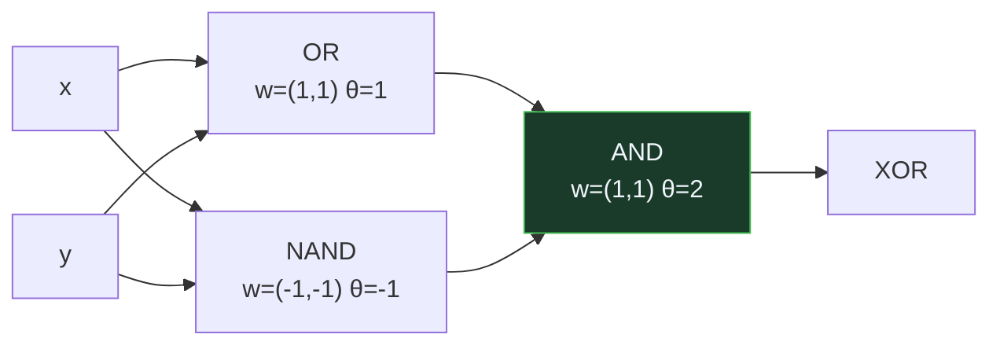

# P54 — Neurona lógica

> Ruta de fundamentos · Reduce la neurona a una suma con umbral y demuestra que con esa
> pieza se calcula cualquier proposición lógica. Es computabilidad, no aprendizaje.

**Nivel:** L1 · **Motor:** `mcculloch_pitts` · **Notebook:** [`P54_mcculloch_pitts.ipynb`](../../../notebooks/papers/P54_mcculloch_pitts.ipynb)
· **Anexo:** [álgebra y geometría](../../annexes/A01_ALGEBRA_Y_GEOMETRIA.md)

## 1. Identificación

| Campo | Valor |
|---|---|
| **Título original** | *A Logical Calculus of the Ideas Immanent in Nervous Activity* |
| **Autoría** | Warren S. McCulloch, Walter Pitts |
| **Año** | 1943 |
| **Venue** | Bulletin of Mathematical Biophysics, 5, 115–133 |
| **Fuente primaria** | [doi:10.1007/BF02478259](https://doi.org/10.1007/BF02478259) |
| **Acceso** | Restringido |
| **Fecha de consulta** | 2026-08-17 |

## 2. Problema anterior

En 1943 había dos cuerpos de conocimiento que no se hablaban. Por un lado, la neurofisiología
describía la actividad nerviosa: umbrales, sinapsis excitatorias e inhibitorias, el carácter de
todo-o-nada del disparo. Por otro, la lógica formal y la teoría de la computabilidad de Turing
describían qué se puede calcular.

Faltaba el puente. Sin un modelo formal de la neurona, no se podía plantear siquiera la pregunta
de qué es capaz de computar una red nerviosa, y por tanto tampoco discutir si el pensamiento es
computable.

## 3. Propuesta

Un modelo deliberadamente pobre de la neurona, elegido para que sea tratable:

- la salida es **binaria** (dispara o no dispara), en tiempo discreto;
- dispara si la suma de sus entradas excitatorias alcanza un **umbral**;
- una entrada **inhibitoria** activa impide el disparo de forma absoluta.

Con esa pieza, el artículo demuestra que cualquier proposición de la lógica proposicional puede
realizarse con una red de estas unidades, y que las redes con ciclos pueden mantener actividad en
el tiempo, es decir, algo parecido a memoria.

## 4. Intuición sin fórmulas

Un comité que vota. Cada miembro emite un voto con un peso, y la propuesta sale adelante si la
suma supera un número acordado. Además hay un miembro con derecho de veto: si lo ejerce, no
importa cuántos votos haya a favor.

Con comités así encadenados —la salida de uno como entrada del siguiente— se puede construir
cualquier regla de decisión que se pueda enunciar con «y», «o» y «no».

**Dónde deja de funcionar la analogía:** los miembros del comité deliberan y cambian de opinión.
Estas unidades no: sus pesos son fijos, puestos por quien diseña la red. Aquí no hay nadie
aprendiendo nada.

## 5. Matemática mínima

```text
Unidad de umbral:
    salida = 1   si   Σ wᵢ·xᵢ ≥ θ   y   ninguna inhibitoria está activa
    salida = 0   en otro caso

Con dos entradas:
    AND   : w = (1, 1)    θ = 2
    OR    : w = (1, 1)    θ = 1
    NAND  : w = (−1, −1)  θ = −1
    XOR   : no existe ninguna (w, θ)

Dos capas sí:
    XOR(x, y) = AND( OR(x, y), NAND(x, y) )
```

La miniatura recorre las **175** configuraciones con pesos enteros en `[−2, 2]` y umbrales en
`[−3, 3]`: 4 calculan AND, 5 calculan OR, 5 calculan NAND y **0** calculan XOR. Con dos capas, XOR
sale exacto. Y el contador de parámetros aprendidos marca **0**, que es el punto de toda la ficha.

## 6. Arquitectura o flujo



## 7. Qué observar en el paper original

- La **tesis explícita**: «la actividad neuronal es un fenómeno de todo-o-nada, y por tanto puede
  tratarse con lógica proposicional». Todo el artículo cuelga de esa reducción.
- El papel de la **inhibición absoluta**, que no es un peso negativo cualquiera sino un veto. Es
  una diferencia importante con las redes modernas.
- El tratamiento del **tiempo discreto** y de las **redes con ciclos**, que es la parte menos
  citada y la que sugiere memoria.
- Que el artículo **no propone ningún procedimiento para fijar los pesos**. No es un olvido: no es
  su pregunta.

## 8. Evidencia y resultados

El artículo es una demostración matemática, no un experimento. Lo que aporta es un teorema de
representabilidad: toda proposición lógica expresable en el cálculo que definen puede realizarse
con una red de unidades de umbral.

> No hay datos ni mediciones que verificar. Lo verificable es la construcción, y es larga y densa;
> la notación de Pitts es de las más difíciles de la literatura fundacional.

La miniatura del eje comprueba el caso pequeño de forma exhaustiva, que es lo que se puede hacer
en un cuaderno: enumerar todas las configuraciones y contar cuáles realizan cada función.

## 9. Impacto

- Es el primer modelo matemático de una neurona, y el antecedente directo del perceptrón de
  [P01](../P01_perceptron/README.md) quince años después.
- Von Neumann lo cita en el borrador del EDVAC (1945): influye en la arquitectura de los
  computadores tanto como en la IA.
- Da origen a la **teoría de autómatas**: Kleene (1956) formaliza sobre este trabajo los conjuntos
  regulares y los autómatas finitos.
- Establece un patrón que se repite en todo el campo: reducir un fenómeno biológico a una pieza
  computable y ver hasta dónde llega. Las redes actuales no se parecen a una neurona real, y esa
  distancia empieza aquí, declarada.

## 10. Limitaciones

1. **Neurofisiológicamente falso.** Las neuronas reales no son binarias, ni síncronas, ni tienen
   inhibición absoluta. Los propios autores lo asumen como idealización.
2. **No hay aprendizaje.** Los pesos y umbrales los pone quien diseña. Toda la cuestión de cómo
   ajustarlos a partir de ejemplos queda fuera.
3. **La notación es un obstáculo real.** El formalismo de Pitts hace que el artículo se cite mucho
   más de lo que se lee, y eso alimenta las atribuciones erróneas.
4. **El salto de la lógica al pensamiento no está justificado.** Que una red pueda computar
   proposiciones no dice nada sobre cómo se representa el significado.
5. **Sin tratamiento del ruido ni de la incertidumbre**, que son centrales en cualquier sistema
   biológico o artificial que funcione con datos reales.

## 11. Errores comunes

| Error | Corrección |
|---|---|
| «Es el primer modelo de red neuronal que aprende» | No aprende nada. Los pesos son de diseño. El aprendizaje llega con Rosenblatt en 1958. |
| «Demuestra que las redes neuronales no pueden hacer XOR» | Demuestra lo contrario: una red SÍ puede, con dos capas. Lo que no puede es una sola unidad. |
| «El límite del XOR es este artículo» | El resultado famoso sobre XOR es de Minsky y Papert (1969), y va sobre el APRENDIZAJE del perceptrón de una capa, no sobre la representabilidad. |
| «Es un modelo de cómo funciona el cerebro» | Es una idealización que los autores declaran como tal. Su valor es formal, no descriptivo. |
| «La inhibición es simplemente un peso negativo» | En el modelo de 1943 es un veto absoluto: si está activa, la unidad no dispara aunque la suma excitatoria sea enorme. |

## 12. Relación con trabajos anteriores

- **Turing (1936)** — computabilidad y la máquina universal: el marco dentro del cual la pregunta
  «¿qué puede computar una red?» tiene sentido.
- **Whitehead y Russell (1910)** — el aparato de la lógica proposicional que McCulloch y Pitts
  usan como lenguaje de llegada.
- **Sherrington (1906)** — la neurofisiología de la sinapsis excitatoria e inhibitoria, que es lo
  que se está idealizando.

## 13. Relación con trabajos posteriores

- **[P01 El perceptrón](../P01_perceptron/README.md) (1958)** — la misma unidad, más una regla
  para ajustar sus pesos a partir de ejemplos. Ahí empieza el aprendizaje.
- **Kleene (1956)** — *Representation of Events in Nerve Nets and Finite Automata*: de aquí salen
  los autómatas finitos y las expresiones regulares.
- **Hebb (1949)** — la regla de plasticidad que aporta lo que falta: un mecanismo por el que los
  pesos podrían cambiar solos.
- **[P02 Backpropagation](../P02_backpropagation/README.md) (1986)** — la respuesta definitiva a
  cómo ajustar los pesos de una red de varias capas.

## 14. Notebook asociado

[`P54_mcculloch_pitts.ipynb`](../../../notebooks/papers/P54_mcculloch_pitts.ipynb)

**Qué implementa:** la enumeración exhaustiva de las 175 configuraciones de una unidad de umbral con dos entradas, cuántas realizan cada función booleana, la construcción de XOR con dos capas y la inhibición absoluta.

**Qué NO implementa:** no hay aprendizaje, ni ciclos, ni tiempo. La parte del artículo que trata redes recurrentes y memoria —la más interesante y la menos citada— no está en la miniatura.

```bash
ai-evolution paper-lab P54 --seed 7
```

## 15. Actividades Bloom

| Nivel | Actividad |
|---|---|
| **Recordar** | Escribe los pesos y el umbral que realizan AND, OR y NAND con dos entradas. |
| **Explicar** | Explica por qué una sola unidad de umbral no puede realizar XOR. |
| **Aplicar** | Ejecuta el notebook y encuentra a mano una configuración que realice «x AND NOT y». |
| **Analizar** | Analiza la diferencia entre inhibición absoluta y peso negativo, y qué cambia en la tabla de verdad. |
| **Evaluar** | «Este artículo demuestra los límites de las redes neuronales». Evalúa la afirmación. |
| **Crear** | Diseña con unidades de umbral un sumador de un bit y cuenta cuántas unidades necesitas. |

## 16. Autoevaluación

1. ¿Qué modelo de neurona propone el artículo y qué tres elementos lo definen?
2. ¿Cuántos parámetros aprende esta neurona?
3. ¿Por qué una sola unidad no puede realizar XOR?
4. ¿Cómo se realiza XOR entonces?
5. ¿Qué diferencia hay entre este trabajo y el perceptrón de 1958?
6. ¿Qué es la inhibición absoluta?
7. ¿Qué línea de la informática nace de aquí además de la IA?

## 17. Respuestas esperadas

1. Una unidad de umbral: salida binaria, suma ponderada de entradas y disparo si esa suma alcanza un umbral, con inhibición que veta el disparo.
2. Ninguno. Los pesos y el umbral los fija quien diseña la red. Es un resultado sobre qué se puede **calcular**, no sobre qué se puede **aprender**.
3. Porque XOR no es linealmente separable: no existe ninguna recta —ningún par (w, θ)— que deje los casos (0,1) y (1,0) a un lado y los casos (0,0) y (1,1) al otro. La miniatura lo comprueba sobre las 175 configuraciones posibles.
4. Con dos capas: una capa que calcula OR y NAND, y encima una unidad AND. La composición da la tabla de verdad exacta de XOR.
5. McCulloch y Pitts responden qué puede computar una red con pesos dados. Rosenblatt responde cómo una unidad puede encontrar sus propios pesos a partir de ejemplos. Son preguntas distintas, y la segunda presupone la primera.
6. Una entrada que, si está activa, impide el disparo sea cual sea la suma excitatoria. No es un peso negativo grande: es un veto.
7. La teoría de autómatas. Kleene formaliza sobre este trabajo los autómatas finitos y los conjuntos regulares, de donde salen las expresiones regulares.

## 18. Fuentes primarias

- McCulloch, W. S. y Pitts, W. (1943). *A Logical Calculus of the Ideas Immanent in Nervous
  Activity*. **Bulletin of Mathematical Biophysics**, 5, 115–133.
  [doi:10.1007/BF02478259](https://doi.org/10.1007/BF02478259) · consultado 2026-08-17.
- Kleene, S. C. (1956). *Representation of Events in Nerve Nets and Finite Automata*.
  [doi:10.1515/9781400882618-002](https://doi.org/10.1515/9781400882618-002) · consultado 2026-08-17.
- Piccinini, G. (2004). *The First Computational Theory of Mind and Brain: A Close Look at
  McCulloch and Pitts's Logical Calculus*.
  [doi:10.1023/B:SYNT.0000029946.34028.f4](https://doi.org/10.1023/B:SYNT.0000029946.34028.f4) ·
  consultado 2026-08-17.

---

[⬅️ Anterior: P53 PCA](../P53_pca/README.md) ·
[📇 Índice](../../catalog/PAPERS_INDEX.md) ·
[📝 Evaluación](../../../assessments/papers/P54_mcculloch_pitts.md) ·
[🏫 Clase 001 · Qué es inteligencia artificial y qué no es](../../../classes/part-00-foundations-history-and-scientific-method/001-que-es-inteligencia-artificial-y-que-no-es/README.md) ·
[➡️ Siguiente: P55 Teoría de la información](../P55_shannon/README.md)
