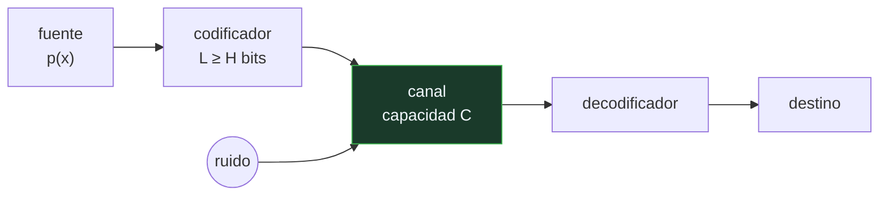

# P55 — Teoría de la información

> Ruta de fundamentos · Le pone unidad, cota y límite a la información. El bit, la
> entropía y la capacidad del canal salen todos del mismo artículo.

**Nivel:** L2 · **Motor:** `shannon` · **Notebook:** [`P55_shannon.ipynb`](../../../notebooks/papers/P55_shannon.ipynb)
· **Anexo:** [probabilidad y verosimilitud](../../annexes/A02_PROBABILIDAD_Y_VEROSIMILITUD.md)

## 1. Identificación

| Campo | Valor |
|---|---|
| **Título original** | *A Mathematical Theory of Communication* |
| **Autoría** | Claude E. Shannon |
| **Año** | 1948 |
| **Venue** | Bell System Technical Journal, 27(3–4), 379–423 y 623–656 |
| **Fuente primaria** | [doi:10.1002/j.1538-7305.1948.tb01338.x](https://doi.org/10.1002/j.1538-7305.1948.tb01338.x) |
| **Acceso** | Abierto |
| **Fecha de consulta** | 2026-08-17 |

## 2. Problema anterior

Se sabía transmitir señales por cable y por radio, y se sabía que había un compromiso entre
ancho de banda, potencia y ruido. Lo que no había era una **medida**: ninguna forma de decir
cuánta información lleva un mensaje, cuánto se puede comprimir sin pérdida, o cuánto se puede
transmitir por un canal con ruido antes de que sea imposible recuperarlo.

Sin esa medida, cada sistema de comunicación se diseñaba a ojo y no había forma de saber si se
estaba cerca del óptimo o muy lejos.

## 3. Propuesta

Separar la información del significado. Un mensaje informa en la medida en que **sorprende**: si
solo hubiera un mensaje posible, recibirlo no aportaría nada.

Formalizado, la sorpresa media de una fuente es su **entropía**:

```text
H(X) = − Σ p(x) · log₂ p(x)     bits por símbolo
```

De ahí salen los dos teoremas que estructuran el artículo:

- **codificación de fuente**: ningún código sin pérdida puede bajar de `H` bits por símbolo, y
  siempre existe uno que se queda por debajo de `H + 1`;
- **codificación de canal**: un canal con ruido tiene una capacidad `C`, y por debajo de `C` se
  puede transmitir con probabilidad de error tan pequeña como se quiera.

## 4. Intuición sin fórmulas

Adivinar una carta. Si la baraja tiene 52 cartas distintas, cada respuesta te informa mucho. Si
la baraja tiene 52 ases de picas, la respuesta no te informa de nada: ya sabías cuál era.

Comprimir es aprovechar eso: dar nombres cortos a lo que pasa a menudo y nombres largos a lo raro.
Es lo que hace el código Morse al asignar un punto a la «e».

**Dónde deja de funcionar la analogía:** la baraja tiene cartas independientes. El lenguaje no: si
has leído «buenos», lo que viene tiene poca sorpresa. La entropía por símbolo del texto real es
mucho menor que la que se calcula contando frecuencias sueltas.

## 5. Matemática mínima

```text
Entropía:            H(X) = − Σ p(x) log₂ p(x)

Teorema de fuente:   H ≤ L < H + 1        L = longitud media del mejor código

Canal binario simétrico con probabilidad de error p:
    C = 1 − H(p)     bits por uso del canal
```

La miniatura calcula las tres fuentes y su código de Huffman:

| Fuente | H (bits) | Código medio | Ahorro sobre código fijo |
|---|---:|---:|---:|
| uniforme | 2,0 | 2,0 | 0 % |
| sesgada | 1,319 | 1,45 | 27,5 % |
| casi determinista | 0,2419 | 1,05 | 47,5 % |

En las tres se cumple `H ≤ L < H + 1`. Y con un canal que se equivoca el 10 % de las veces, la
capacidad cae a **0,531** bits por uso: el ruido se paga en tasa, no en fiabilidad.

<!-- puente:inicio -->
> [!TIP]
> **Puente matemático.** Esta sección da por sabido lo siguiente. Si algo no te suena,
> léelo primero: está explicado una sola vez, en un solo sitio, y sirve para todas las fichas.

| Dónde | Qué necesitas de ahí |
|---|---|
| [**A02 §2** · Entropía](../../annexes/A02_PROBABILIDAD_Y_VEROSIMILITUD.md#2-entropía) | la definición y por qué el logaritmo aparece ahí y no otra función |
| [**A02 §3** · Verosimilitud y entropía cruzada](../../annexes/A02_PROBABILIDAD_Y_VEROSIMILITUD.md#3-verosimilitud-y-entropía-cruzada) | cómo esta misma cantidad se convierte en la función de pérdida de casi todo el programa |
<!-- puente:fin -->

## 6. Arquitectura o flujo



## 7. Qué observar en el paper original

- La **primera página**: Shannon declara explícitamente que los aspectos semánticos son
  irrelevantes para el problema de ingeniería. Esa frase evita una montaña de malentendidos y casi
  nadie la cita.
- La **derivación axiomática de H**: se enuncian tres propiedades que debe cumplir una medida de
  incertidumbre y se demuestra que solo la forma `−Σ p log p` las satisface.
- El **teorema de codificación de canal**, que es el resultado contraintuitivo: se puede transmitir
  con error arbitrariamente pequeño por un canal ruidoso, mientras se esté por debajo de `C`.
- Los **modelos de aproximación del inglés** por orden creciente: letras equiprobables, luego
  frecuencias, luego pares, luego palabras. Es un modelo de lenguaje de 1948.

## 8. Evidencia y resultados

Los resultados son teoremas, no mediciones. El artículo demuestra las cotas y da construcciones
que las alcanzan asintóticamente.

> El teorema de canal es **existencial**: demuestra que existe un código bueno, no cómo
> construirlo. Los códigos que se acercan a la capacidad tardaron cincuenta años en aparecer
> (turbo-códigos, LDPC).

La miniatura verifica el teorema de fuente en el caso pequeño, con Huffman —que es óptimo entre
los códigos símbolo a símbolo— sobre tres fuentes con entropías muy distintas.

## 9. Impacto

- Funda una disciplina entera. Toda la teoría de codificación, la compresión y las
  telecomunicaciones modernas descienden de aquí.
- En aprendizaje automático es **la función de pérdida**: la entropía cruzada que minimiza un
  clasificador es esta cantidad, y la perplejidad de un modelo de lenguaje es su exponencial.
- La divergencia KL, que estructura el VAE ([P38](../P38_vae/README.md)) y la destilación
  ([P45](../P45_distillation/README.md)), se define sobre estas mismas cantidades.
- La idea de que **comprimir es modelar** —un buen modelo asigna probabilidad alta a lo que ocurre,
  y por tanto lo codifica corto— es la conexión más profunda entre este artículo y el
  preentrenamiento de un modelo de lenguaje.

## 10. Limitaciones

1. **Ignora el significado por diseño.** Es una elección deliberada y correcta para el problema
   de ingeniería, pero convierte la teoría en muda sobre lo que a veces se le quiere preguntar.
2. **Los teoremas son asintóticos.** Valen para bloques de longitud creciente; con mensajes cortos
   las cotas no se alcanzan.
3. **El teorema de canal no es constructivo.** Dice que existe un código; encontrarlo fue trabajo
   de medio siglo.
4. **Supone que la distribución de la fuente se conoce.** En la práctica hay que estimarla, y esa
   estimación introduce su propio error.
5. **La entropía por símbolo con símbolos independientes es una cota floja** para fuentes con
   estructura, que es el caso de todo lenguaje natural.

## 11. Errores comunes

| Error | Corrección |
|---|---|
| «Información es lo mismo que conocimiento útil» | La teoría mide sorpresa. Un texto aleatorio tiene entropía máxima y valor nulo. |
| «Un mensaje comprimido tiene menos información» | Tiene la misma información en menos bits. La compresión sin pérdida no destruye nada: elimina redundancia. |
| «La entropía es una analogía tomada de la física» | La forma funcional coincide con la de Boltzmann y eso no es casual, pero aquí es una magnitud definida y demostrada dentro de su propio marco. |
| «El ruido hace imposible transmitir sin error» | El teorema de canal dice lo contrario: por debajo de la capacidad, el error puede hacerse tan pequeño como se quiera. Lo que se paga es tasa. |
| «Con más ancho de banda siempre se transmite más» | La capacidad depende del ancho de banda y de la relación señal-ruido. Aumentar uno con el otro fijo tiene rendimientos decrecientes. |

## 12. Relación con trabajos anteriores

- **Nyquist (1924)** y **Hartley (1928)** — las primeras cuantificaciones de la tasa de
  transmisión, que Shannon generaliza y de las que toma el uso del logaritmo.
- **Boltzmann y Gibbs** — la entropía de la mecánica estadística, con la misma forma funcional.
- **Turing (1936)** — el marco formal de lo computable, contemporáneo y complementario: uno acota
  lo que se puede calcular, el otro lo que se puede transmitir.

## 13. Relación con trabajos posteriores

- **Huffman (1952)** — el código óptimo símbolo a símbolo, que es el que usa la miniatura.
- **Kullback y Leibler (1951)** — la divergencia que mide cuánto se pierde al usar una
  distribución en lugar de otra; aparece en [P38](../P38_vae/README.md) y en
  [P45](../P45_distillation/README.md).
- **Shannon (1951)** — *Prediction and Entropy of Printed English*: el propio Shannon estimando la
  entropía del lenguaje natural. Es el ancestro directo de la perplejidad.
- **[P19 Chinchilla](../P19_scaling_laws/README.md) (2022)** — las leyes de escalado se enuncian
  sobre una pérdida que es, literalmente, bits por token.

## 14. Notebook asociado

[`P55_shannon.ipynb`](../../../notebooks/papers/P55_shannon.ipynb)

**Qué implementa:** la entropía de tres fuentes con sesgo creciente, su código de Huffman construido de forma determinista, la comprobación de la cota `H ≤ L < H+1` y la capacidad de un canal binario simétrico.

**Qué NO implementa:** no hay codificación aritmética, ni modelos con dependencias, ni el teorema de canal (que es asintótico y no cabe en una miniatura). Las fuentes tienen símbolos independientes.

```bash
ai-evolution paper-lab P55 --seed 7
```

## 15. Actividades Bloom

| Nivel | Actividad |
|---|---|
| **Recordar** | Escribe la definición de entropía y di en qué unidades se mide. |
| **Explicar** | Explica por qué una fuente uniforme no se puede comprimir. |
| **Aplicar** | Ejecuta el notebook y añade una cuarta fuente con la distribución que quieras. |
| **Analizar** | Analiza por qué el código de la fuente sesgada mide 1,45 y no 1,319. |
| **Evaluar** | «La compresión destruye información». Evalúa la afirmación. |
| **Crear** | Estima la entropía por carácter de un texto real y compárala con la entropía condicionada al carácter anterior. |

## 16. Autoevaluación

1. ¿Qué mide la entropía y en qué unidades?
2. ¿Qué dice el teorema de codificación de fuente?
3. ¿Por qué la fuente uniforme no consigue ningún ahorro?
4. ¿Qué es la capacidad de un canal?
5. ¿Por qué el teorema de canal es contraintuitivo?
6. ¿Qué relación hay entre entropía y la pérdida de un clasificador?
7. ¿Qué deja fuera la teoría por decisión explícita de Shannon?

## 17. Respuestas esperadas

1. La sorpresa media de una fuente: cuántos bits hacen falta, en promedio, para identificar un símbolo emitido por ella. La unidad es el bit cuando el logaritmo es en base 2.
2. Que ningún código sin pérdida puede usar menos de `H` bits por símbolo en promedio, y que siempre existe uno que se queda por debajo de `H + 1`. La entropía es una cota que se toca y no se cruza.
3. Porque todos sus símbolos son igual de probables: no hay ninguno frecuente al que darle un código corto. Su entropía ya es 2 bits y el código de longitud fija de 2 bits es óptimo.
4. El máximo número de bits por uso que se pueden transmitir con probabilidad de error arbitrariamente pequeña. Para un canal binario simétrico con error `p`, vale `1 − H(p)`.
5. Porque dice que el ruido no impide la transmisión fiable: solo limita la **tasa**. Mientras se esté por debajo de la capacidad, existe un código que hace el error tan pequeño como se pida.
6. Son la misma cantidad. La entropía cruzada mide los bits que se gastan al codificar la distribución real con el modelo aprendido; minimizarla es acercar el modelo a los datos.
7. El significado. Shannon declara en la primera página que los aspectos semánticos son irrelevantes para el problema de ingeniería que aborda.

## 18. Fuentes primarias

- Shannon, C. E. (1948). *A Mathematical Theory of Communication*. **Bell System Technical
  Journal**, 27, 379–423 y 623–656.
  [doi:10.1002/j.1538-7305.1948.tb01338.x](https://doi.org/10.1002/j.1538-7305.1948.tb01338.x) ·
  consultado 2026-08-17.
- Shannon, C. E. (1951). *Prediction and Entropy of Printed English*.
  [doi:10.1002/j.1538-7305.1951.tb01366.x](https://doi.org/10.1002/j.1538-7305.1951.tb01366.x) ·
  consultado 2026-08-17.
- Cover, T. y Thomas, J. *Elements of Information Theory*.
  [doi:10.1002/047174882X](https://doi.org/10.1002/047174882X) · consultado 2026-08-17.

---

[⬅️ Anterior: P54 Neurona lógica](../P54_mcculloch_pitts/README.md) ·
[📇 Índice](../../catalog/PAPERS_INDEX.md) ·
[📝 Evaluación](../../../assessments/papers/P55_shannon.md) ·
[🏫 Clase 006 · Probabilidad, incertidumbre y estadística básica](../../../classes/part-00-foundations-history-and-scientific-method/006-probabilidad-incertidumbre-y-estadistica-basica/README.md) ·
[➡️ Siguiente: P56 Juego de imitación](../P56_turing/README.md)
