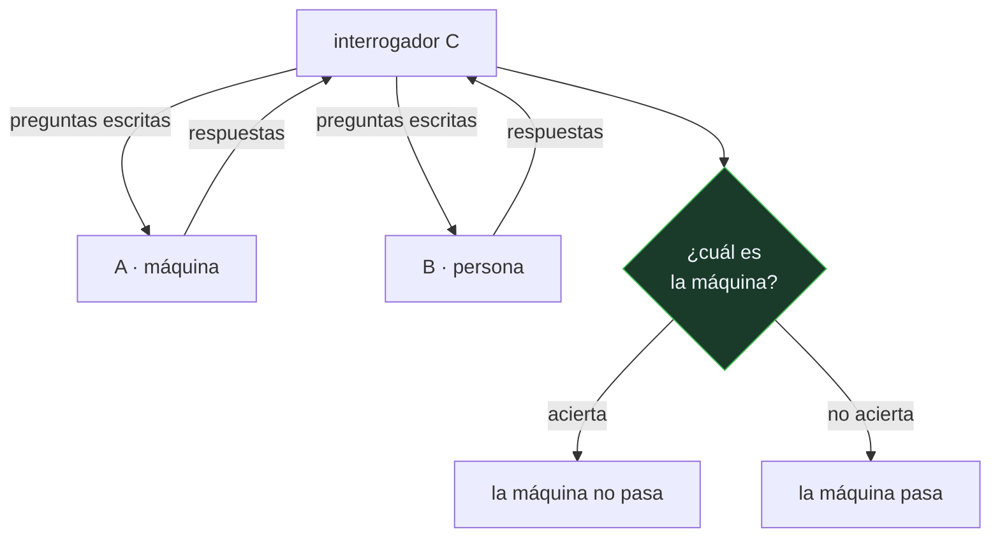

# P56 — Juego de imitación

> Ruta de fundamentos · No responde si las máquinas pueden pensar: sustituye esa pregunta
> por otra que sí se puede ejecutar, y responde nueve objeciones por adelantado.

**Nivel:** L1 · **Motor:** `turing` · **Notebook:** [`P56_turing.ipynb`](../../../notebooks/papers/P56_turing.ipynb)
· **Anexo:** [complejidad y coste](../../annexes/A05_COMPLEJIDAD_Y_COSTE.md)

## 1. Identificación

| Campo | Valor |
|---|---|
| **Título original** | *Computing Machinery and Intelligence* |
| **Autoría** | Alan M. Turing |
| **Año** | 1950 |
| **Venue** | Mind, LIX(236), 433–460 |
| **Fuente primaria** | [doi:10.1093/mind/LIX.236.433](https://doi.org/10.1093/mind/LIX.236.433) |
| **Acceso** | Restringido |
| **Fecha de consulta** | 2026-08-17 |

## 2. Problema anterior

«¿Pueden pensar las máquinas?» es una pregunta que no se puede investigar. Exige definir
«máquina» y «pensar», y ambas definiciones son objeto de disputa filosófica sin resolución a la
vista. Turing lo dice en la primera página: si se responde encuestando el uso ordinario de las
palabras, la conclusión es absurda.

El problema, entonces, no es la respuesta: es que la pregunta no tiene forma empírica. Sin
reformularla no hay experimento posible, ni criterio para saber si se ha avanzado.

## 3. Propuesta

Reemplazar la pregunta por un procedimiento. En el **juego de imitación**, un interrogador
conversa por escrito con dos interlocutores ocultos —una persona y una máquina— y tiene que
decidir cuál es cuál. Si no lo consigue mejor que por azar, la pregunta original pierde interés
práctico.

Turing dedica la mitad del artículo a responder nueve objeciones anticipadas —teológica, del
«avestruz», matemática, de la conciencia, de las incapacidades, de Lady Lovelace, del sistema
nervioso continuo, de la informalidad de la conducta y de la percepción extrasensorial— y termina
proponiendo lo que hoy llamaríamos aprendizaje: en vez de programar una mente adulta, programar
una **máquina niño** y educarla.

## 4. Intuición sin fórmulas

Una entrevista de trabajo a ciegas, por chat, en la que no se pregunta al candidato si es
inteligente sino que se le pone a resolver cosas.

La astucia está en el canal: sólo texto. Elimina de un golpe la voz, la cara y el cuerpo, que no
tienen nada que ver con la pregunta y sí con nuestros prejuicios sobre quién parece inteligente.

**Dónde deja de funcionar la analogía:** una entrevista busca al mejor candidato; el juego busca
indistinguibilidad. Un sistema que resolviera los problemas *mejor* que la persona sería
detectado inmediatamente, y perdería el juego por exceso.

## 5. Matemática mínima

No hay fórmula. Hay un **protocolo**, y su poder discriminante depende por completo de las
preguntas que se hagan:

```text
interrogador ──preguntas escritas──▶  A (máquina)  y  B (persona)
             ◀──respuestas────────

pregunta superficial  → no compromete: cualquier respuesta plausible pasa
pregunta con anclaje  → exige memoria entre turnos, aritmética, coherencia,
                        producción sostenida  → discrimina
```

La miniatura ejecuta la misma máquina bajo dos protocolos. Con el juez ingenuo —tres preguntas
superficiales— **pasa**; con el protocolo completo —siete preguntas, de las que cuatro exigen un
compromiso verificable— **no pasa**.

El resultado del test es, en parte, una propiedad del interrogatorio. Es la primera aparición en
el campo del problema que setenta años después se llama validez de constructo.

## 6. Arquitectura o flujo



## 7. Qué observar en el paper original

- La **primera sección**, donde Turing descarta la pregunta original. Es el movimiento
  intelectual del artículo y suele saltarse por ir directo al juego.
- La **sección 6**, con las nueve objeciones. Es la mitad del texto y la parte más viva: casi
  todas las críticas actuales al test están ahí, formuladas y respondidas en 1950.
- La respuesta a **Lady Lovelace** («una máquina no puede originar nada»): Turing la contesta
  apelando a que las máquinas sí sorprenden a quien las programa, y a que se puede aprender.
- La **sección 7**, la de la máquina niño: la propuesta de educar en vez de programar. Es la parte
  más profética y la menos citada.
- Las **estimaciones cuantitativas**: 10⁹ bits de memoria, cinco minutos de conversación, 70 % de
  aciertos del juez hacia el año 2000. Cualquier discusión sobre si «se ha superado» tiene que
  citar esas condiciones.

## 8. Evidencia y resultados

No hay experimento. Es un artículo filosófico con un diseño experimental propuesto, publicado en
una revista de filosofía.

> Turing no ejecuta el juego ni presenta ningún sistema. La única cuantificación es su predicción
> para el año 2000, y él la presenta como conjetura.

La miniatura de este eje no simula una partida: ilustra por qué dos protocolos distintos sobre la
misma máquina dan veredictos opuestos. Es el punto metodológico, no el histórico.

## 9. Impacto

- Define el marco en el que se discutió la IA durante medio siglo, y le da al campo su primera
  pregunta operacional.
- La objeción de Searle (1980) —la habitación china— se formula explícitamente contra este
  artículo, y es a su vez uno de los textos más discutidos de la filosofía de la mente.
- La idea de la **máquina niño** anticipa el aprendizaje automático: no escribir el comportamiento
  final sino el procedimiento que lo adquiere. Es la línea que va a
  [P01](../P01_perceptron/README.md) y de ahí a todo lo demás.
- Su lección metodológica sobrevive al test: cuando se evalúa un sistema conversacional, se está
  evaluando también al evaluador. Es el problema que
  [P62](../P62_benchmark_validez/README.md) formaliza.

## 10. Limitaciones

1. **Mide indistinguibilidad conductual, no comprensión.** Turing lo sabe y por eso lo llama
   juego; usarlo como prueba de mente es ir más lejos de lo que el texto autoriza.
2. **Premia el engaño.** Para pasar hay que simular errores aritméticos y demoras humanas. Un
   sistema mejor que una persona pierde.
3. **No es reproducible sin protocolo.** Sin fijar jueces, duración y tipo de preguntas, dos
   ejecuciones no son comparables. La miniatura muestra exactamente eso.
4. **Es antropocéntrico.** Define inteligencia como parecerse a un humano conversando, lo que
   excluye formas de competencia que no se parecen a nosotros.
5. **La objeción de la conciencia queda sin responder.** Turing la esquiva por diseño; no la
   resuelve, y sigue abierta.

## 11. Errores comunes

| Error | Corrección |
|---|---|
| «El sistema X superó el test de Turing» | El artículo no define un umbral universal de aprobado. Sin protocolo, jueces y duración declarados, la frase no es comprobable. |
| «El test mide si una máquina piensa» | Mide si un interrogador la distingue de una persona conversando. Turing propone eso precisamente para no tener que definir «pensar». |
| «Turing predijo que las máquinas pensarían en el año 2000» | Predijo que hacia 2000 un juez acertaría solo el 70 % tras cinco minutos, con máquinas de 10⁹ bits. Es una afirmación sobre el juego, no sobre el pensamiento. |
| «El test es una métrica de evaluación» | Es un experimento mental que reformula una pregunta. Como métrica es débil: no es reproducible ni discrimina de forma estable. |
| «Turing no consideró las objeciones filosóficas» | Les dedica la mitad del artículo. Nueve objeciones, enunciadas y respondidas una a una. |

## 12. Relación con trabajos anteriores

- **Turing (1936)** — *On Computable Numbers*: la máquina universal, sin la cual la pregunta por
  las máquinas pensantes no tendría un referente preciso.
- **Descartes (1637)** — el uso del lenguaje como criterio para distinguir un autómata de una
  mente: el mismo criterio que Turing formaliza, tres siglos después.
- **[P54 McCulloch y Pitts](../P54_mcculloch_pitts/README.md) (1943)** — el modelo formal que hace
  plausible pensar el cerebro como sistema computable.

## 13. Relación con trabajos posteriores

- **[P57 Propuesta de Dartmouth](../P57_dartmouth/README.md) (1955)** — la agenda que convierte la
  pregunta de Turing en un programa de investigación con nombre.
- **Searle (1980)** — la habitación china: la objeción de que manipular símbolos no es entender.
  [doi:10.1017/S0140525X00005756](https://doi.org/10.1017/S0140525X00005756)
- **[P10 GPT-3](../P10_gpt3/README.md) (2020)** — el primer sistema con el que la discusión sobre
  el test deja de ser hipotética en la práctica cotidiana.
- **[P62 Validez de benchmarks](../P62_benchmark_validez/README.md) (2021)** — la formalización
  moderna del problema que la miniatura ilustra: qué mide realmente el instrumento.

## 14. Notebook asociado

[`P56_turing.ipynb`](../../../notebooks/papers/P56_turing.ipynb)

**Qué implementa:** el contraste entre dos protocolos de interrogatorio sobre la misma máquina, la clasificación de las preguntas según si exigen un compromiso verificable, y el mapa de las objeciones del artículo con su estado actual.

**Qué NO implementa:** no hay ningún modelo de lenguaje, ni partida real, ni juez. Las respuestas están escritas a mano: se ilustra el protocolo, no se ejecuta el juego.

```bash
ai-evolution paper-lab P56 --seed 7
```

## 15. Actividades Bloom

| Nivel | Actividad |
|---|---|
| **Recordar** | Enuncia el juego de imitación con sus tres participantes. |
| **Explicar** | Explica por qué Turing sustituye la pregunta original en vez de responderla. |
| **Aplicar** | Ejecuta el notebook y añade una pregunta propia clasificándola como discriminante o no. |
| **Analizar** | Analiza por qué la misma máquina obtiene veredictos opuestos con dos protocolos. |
| **Evaluar** | «Este sistema superó el test de Turing». Evalúa qué habría que declarar para que la afirmación fuese comprobable. |
| **Crear** | Diseña un protocolo de diez preguntas para distinguir hoy un modelo de lenguaje de una persona, y justifica qué compromiso exige cada una. |

## 16. Autoevaluación

1. ¿Qué pregunta descarta Turing y por qué?
2. ¿En qué consiste el juego de imitación?
3. ¿Qué mide el test además de la máquina?
4. ¿Cuántas objeciones responde el artículo y cuál queda abierta?
5. ¿Qué es la máquina niño y por qué importa?
6. ¿Por qué el test premia el engaño?
7. ¿Qué condiciones incluía la predicción de Turing para el año 2000?

## 17. Respuestas esperadas

1. Descarta «¿pueden pensar las máquinas?» porque exige definir «máquina» y «pensar», y esas definiciones no están disponibles ni se pueden zanjar por encuesta del uso ordinario.
2. Un interrogador conversa por escrito con dos interlocutores ocultos —una persona y una máquina— e intenta decidir cuál es cuál. Si no lo consigue mejor que por azar, la pregunta original pierde interés.
3. Mide también al interrogador. La miniatura lo muestra: la misma máquina pasa con un protocolo de preguntas superficiales y no pasa cuando las preguntas exigen memoria, aritmética o coherencia.
4. Nueve. La de la conciencia queda deliberadamente sin responder: el test la esquiva por diseño y por eso no puede zanjarla.
5. La propuesta de programar un sistema con capacidad de aprender y educarlo, en lugar de escribir directamente el comportamiento adulto. Es la anticipación del aprendizaje automático.
6. Porque exige indistinguibilidad, no excelencia. Una máquina que resolviera aritmética instantáneamente sería identificada al momento; para pasar tendría que fingir errores y demoras.
7. Máquinas con unos 10⁹ bits de memoria, cinco minutos de conversación y un juez que acertara solo el 70 % de las veces. Citar la predicción sin esas condiciones no dice nada.

## 18. Fuentes primarias

- Turing, A. M. (1950). *Computing Machinery and Intelligence*. **Mind**, LIX(236), 433–460.
  [doi:10.1093/mind/LIX.236.433](https://doi.org/10.1093/mind/LIX.236.433) · consultado 2026-08-17.
- Searle, J. (1980). *Minds, Brains, and Programs*. **Behavioral and Brain Sciences**, 3(3), 417–424.
  [doi:10.1017/S0140525X00005756](https://doi.org/10.1017/S0140525X00005756) · consultado 2026-08-17.
- Moor, J. (2001). *The Status and Future of the Turing Test*.
  [doi:10.1023/A:1011218925467](https://doi.org/10.1023/A:1011218925467) · consultado 2026-08-17.

---

[⬅️ Anterior: P55 Teoría de la información](../P55_shannon/README.md) ·
[📇 Índice](../../catalog/PAPERS_INDEX.md) ·
[📝 Evaluación](../../../assessments/papers/P56_turing.md) ·
[🏫 Clase 002 · De Turing a Dartmouth: nacimiento formal del campo](../../../classes/part-00-foundations-history-and-scientific-method/002-de-turing-a-dartmouth-nacimiento-formal-del-campo/README.md) ·
[➡️ Siguiente: P57 Propuesta de Dartmouth](../P57_dartmouth/README.md)
