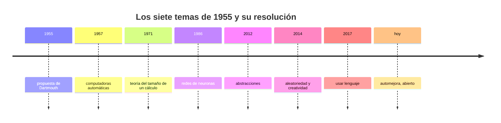

# P57 — Propuesta de Dartmouth

> Ruta de fundamentos · El documento que le pone nombre al campo y fija su agenda. Siete
> temas para dos meses de verano; seis tardaron décadas y uno sigue abierto.

**Nivel:** L1 · **Motor:** `dartmouth` · **Notebook:** [`P57_dartmouth.ipynb`](../../../notebooks/papers/P57_dartmouth.ipynb)
· **Anexo:** [complejidad y coste](../../annexes/A05_COMPLEJIDAD_Y_COSTE.md)

## 1. Identificación

| Campo | Valor |
|---|---|
| **Título original** | *A Proposal for the Dartmouth Summer Research Project on Artificial Intelligence* |
| **Autoría** | John McCarthy, Marvin L. Minsky, Nathaniel Rochester, Claude E. Shannon |
| **Año** | 1955 |
| **Venue** | Solicitud a la Fundación Rockefeller · reimpresa en AI Magazine 27(4), 2006 |
| **Fuente primaria** | [Texto original (Stanford)](http://jmc.stanford.edu/articles/dartmouth/dartmouth.pdf) |
| **Acceso** | Abierto |
| **Fecha de consulta** | 2026-08-17 |

## 2. Problema anterior

A mediados de los cincuenta había trabajos brillantes y dispersos: la teoría de la información
de Shannon, los autómatas, la cibernética de Wiener, los primeros programas de juego, el modelo
de neurona de McCulloch y Pitts. Cada línea tenía su vocabulario, su comunidad y su revista.

Faltaba lo que hace que un conjunto de trabajos sea un campo: un nombre común, una agenda de
problemas compartida y un foro donde discutirlos. McCarthy quería además un término que no
arrastrara la carga de «cibernética», asociada por entonces a Wiener y a su enfoque.

## 3. Propuesta

Reunir a diez investigadores durante dos meses del verano de 1956 en Dartmouth College, sobre
una conjetura explícita:

> Todo aspecto del aprendizaje, o cualquier otra característica de la inteligencia, puede en
> principio describirse con precisión suficiente para que una máquina lo simule.

Y una lista de siete temas de trabajo: computadoras automáticas, cómo programar un computador
para usar lenguaje, redes de neuronas, teoría del tamaño de un cálculo, automejora, abstracciones,
y aleatoriedad y creatividad.

El documento acuña además el término que da nombre a todo: **inteligencia artificial**.

## 4. Intuición sin fórmulas

Un acta fundacional. No trae resultados, trae un mapa: aquí están los problemas, este es el
nombre del territorio, y estos somos los que vamos a trabajarlo.

La lista de siete temas es sorprendentemente buena. Casi setenta años después sigue siendo un
índice razonable de lo que el campo hace.

**Dónde deja de funcionar la analogía:** un acta fundacional suele escribirse cuando ya hay algo
que fundar. Aquí se escribe antes, y esa es la razón de que la estimación de plazos sea la que es.

## 5. Matemática mínima

No hay matemática: es una solicitud de financiación de unas pocas páginas. Lo que sí se puede
cuantificar es la distancia entre el plan y lo que ocurrió.

```text
Plan          : 2 meses · 10 personas · 13.500 dólares solicitados
Realidad      : 7 temas, de los que 6 tienen hoy un resultado sólido
Media de años hasta ese resultado: 25,5
```

| Tema propuesto en 1955 | Resultado sólido | Años | Dónde vive hoy |
|---|---:|---:|---|
| Computadoras automáticas | 1957 | 2 | toda la computación |
| Redes de neuronas | 1986 | 31 | [P02](../P02_backpropagation/README.md) |
| Teoría del tamaño de un cálculo | 1971 | 16 | complejidad computacional |
| Abstracciones | 2012 | 57 | [P04](../P04_alexnet/README.md), [P05](../P05_word2vec/README.md) |
| Aleatoriedad y creatividad | 2014 | 59 | [P39](../P39_gan/README.md), [P17](../P17_diffusion/README.md) |
| Usar lenguaje | 2017 | 62 | [P08](../P08_transformer/README.md)–[P10](../P10_gpt3/README.md) |
| **Automejora** | — | — | **abierto** |

Las fechas de la columna son un juicio de este programa, defendible y discutible. La conclusión no
depende de afinarlas: sea cual sea el criterio, la distancia con «dos meses» es de dos órdenes de
magnitud.

## 6. Arquitectura o flujo



## 7. Qué observar en el paper original

- La **conjetura central**, en la primera página. Es una afirmación fuerte y falsable, y todo el
  campo se puede leer como el intento de comprobarla.
- El **presupuesto**: 13.500 dólares. Contrastarlo con el coste de entrenar un modelo actual es el
  ejercicio de perspectiva más barato que existe.
- El tema de la **automejora**, redactado en 1955 en términos que describen con precisión lo que
  hoy se discute sobre agentes que se corrigen.
- Que el término «inteligencia artificial» aparece **sin justificación ni definición**. McCarthy
  explicó después que quería un nombre neutro, no un programa teórico.
- Quién firma y quién asistió: no coinciden. El encuentro fue más un taller de puertas abiertas
  que el proyecto coordinado que describe el documento.

## 8. Evidencia y resultados

Ninguna. Y es importante decirlo con todas las letras: es una **solicitud de financiación**, no un
artículo científico. No contiene experimentos, datos, evaluación ni resultados.

> Citar la propuesta de Dartmouth como evidencia de algo es un error de categoría. Su valor es
> histórico y programático.

La miniatura de este eje no valida el documento: lo contrasta con la cronología posterior, y
convierte la comparación en una tabla que se puede discutir.

## 9. Impacto

- Le da nombre al campo. Todo lo que viene después se agrupa bajo un término acuñado en este
  documento.
- Fija una agenda que ha resultado notablemente duradera: sus siete temas siguen siendo una
  taxonomía razonable.
- Establece el **patrón de expectativas** que define el ciclo de inviernos y resurgimientos: se
  subestima sistemáticamente lo que a una persona le parece fácil. Es el material de la clase 003.
- Consolida la separación con la cibernética, con consecuencias institucionales que duraron
  décadas.

## 10. Limitaciones

1. **No es un resultado.** No aporta método, evidencia ni evaluación.
2. **La estimación de plazos falla por dos órdenes de magnitud**, y ese error no es anecdótico: es
   el primer caso de un patrón que se repite en cada ciclo de expectativas.
3. **El optimismo tiene un sesgo identificable**: los problemas que resultaron difíciles —visión,
   lenguaje, movimiento— son los que las personas hacen sin esfuerzo consciente.
4. **La conjetura central no es comprobable como está enunciada**: «con precisión suficiente» no
   tiene criterio.
5. **El relato posterior está idealizado.** El encuentro real fue disperso y no produjo el
   programa coordinado que la propuesta describía.

## 11. Errores comunes

| Error | Corrección |
|---|---|
| «En Dartmouth se inventó la inteligencia artificial» | Se acuñó el término y se reunió a la comunidad. El trabajo técnico previo —Turing, McCulloch y Pitts, Shannon— ya existía. |
| «La propuesta contiene los primeros resultados del campo» | No contiene ninguno. Es una petición de fondos: pedían 13.500 dólares para un taller de verano. |
| «Los firmantes fueron ingenuos» | Eran de los mejores del campo. El error de estimación es estructural, no personal, y es justamente lo que hay que aprender del documento. |
| «Los diez participantes previstos asistieron dos meses» | La asistencia fue irregular y el formato acabó siendo un taller abierto, no un proyecto coordinado. |
| «La agenda de 1955 quedó obsoleta» | Seis de sus siete temas tienen respuesta y el séptimo —la automejora— es hoy uno de los frentes más activos. |

## 12. Relación con trabajos anteriores

- **[P56 Turing](../P56_turing/README.md) (1950)** — la pregunta operacional que la propuesta
  convierte en programa de trabajo.
- **[P55 Shannon](../P55_shannon/README.md) (1948)** — uno de los cuatro firmantes llega con la
  teoría de la información ya publicada.
- **[P54 McCulloch y Pitts](../P54_mcculloch_pitts/README.md) (1943)** — el modelo de neurona que
  aparece como tercer tema de la lista.
- **Wiener (1948)** — la cibernética: el marco del que McCarthy quería distinguirse al elegir un
  nombre nuevo.

## 13. Relación con trabajos posteriores

- **Newell, Shaw y Simon (1959)** — el General Problem Solver: el primer intento serio del tema
  de la resolución de problemas.
- **[P58 Símbolos y búsqueda](../P58_simbolos_y_busqueda/README.md) (1976)** — el balance que dos
  de los protagonistas hacen veinte años después.
- **[P01 El perceptrón](../P01_perceptron/README.md) (1958)** — el tema de las redes de neuronas,
  dos años después del encuentro.
- **[P08 Transformer](../P08_transformer/README.md) (2017)** — el cierre del tema del lenguaje,
  62 años más tarde.

## 14. Notebook asociado

[`P57_dartmouth.ipynb`](../../../notebooks/papers/P57_dartmouth.ipynb)

**Qué implementa:** la tabla de los siete temas con su año de resolución y dónde vive cada uno en el programa, la media de años hasta el resultado y el contraste con el plan de dos meses.

**Qué NO implementa:** no hay ninguna evaluación del documento ni reconstrucción del encuentro. Las fechas de resolución son un juicio editorial del programa, pensado para discutirse en clase.

```bash
ai-evolution paper-lab P57 --seed 7
```

## 15. Actividades Bloom

| Nivel | Actividad |
|---|---|
| **Recordar** | Enumera los siete temas de la propuesta. |
| **Explicar** | Explica por qué el documento no es un artículo científico. |
| **Aplicar** | Ejecuta el notebook y propón una fecha distinta para uno de los temas, con criterio. |
| **Analizar** | Analiza qué tienen en común los temas que más tardaron en resolverse. |
| **Evaluar** | «En Dartmouth se inventó la IA». Evalúa la afirmación. |
| **Crear** | Escribe la propuesta de Dartmouth para 2026: siete problemas abiertos con criterio explícito de qué contaría como resuelto. |

## 16. Autoevaluación

1. ¿Qué tipo de documento es la propuesta de Dartmouth?
2. ¿Cuál es su conjetura central?
3. ¿Cuántos temas propone y cuántos siguen abiertos?
4. ¿Cuál tardó más en resolverse y por qué es significativo?
5. ¿Qué aporta el documento al campo?
6. ¿Qué patrón inaugura su error de estimación?
7. ¿Por qué McCarthy quería un término nuevo?

## 17. Respuestas esperadas

1. Una solicitud de financiación a la Fundación Rockefeller para un taller de verano. No contiene experimentos, datos ni resultados.
2. Que todo aspecto del aprendizaje o de la inteligencia puede describirse con precisión suficiente para que una máquina lo simule. Es una afirmación fuerte y programática.
3. Siete. Seis tienen hoy un resultado sólido; la **automejora** sigue abierta y es lo que se discute en los agentes que se corrigen a sí mismos.
4. El uso del lenguaje: 62 años hasta el Transformer. Es significativo porque hablar es lo que cualquier persona hace sin esfuerzo, y esa facilidad aparente es justo la fuente del error de estimación.
5. Un nombre —«inteligencia artificial»— y una agenda. No aporta método ni evidencia, y ese es exactamente su papel histórico.
6. El de subestimar lo que a las personas les resulta fácil y sobrestimar el plazo. Es el motor de los ciclos de expectativas, inviernos y resurgimientos que estudia la clase 003.
7. Para separar el nuevo campo de la cibernética de Wiener, tanto por razones intelectuales como institucionales. Buscaba un término neutro, no una tesis.

## 18. Fuentes primarias

- McCarthy, J., Minsky, M., Rochester, N. y Shannon, C. (1955). *A Proposal for the Dartmouth
  Summer Research Project on Artificial Intelligence*.
  [Texto original](http://jmc.stanford.edu/articles/dartmouth/dartmouth.pdf) · consultado 2026-08-17.
- Reimpresión en **AI Magazine** 27(4), 2006.
  [doi:10.1609/aimag.v27i4.1904](https://doi.org/10.1609/aimag.v27i4.1904) · consultado 2026-08-17.
- Moor, J. (2006). *The Dartmouth College Artificial Intelligence Conference: The Next Fifty Years*.
  [doi:10.1609/aimag.v27i4.1911](https://doi.org/10.1609/aimag.v27i4.1911) · consultado 2026-08-17.

---

[⬅️ Anterior: P56 Juego de imitación](../P56_turing/README.md) ·
[📇 Índice](../../catalog/PAPERS_INDEX.md) ·
[📝 Evaluación](../../../assessments/papers/P57_dartmouth.md) ·
[🏫 Clase 003 · Inviernos, resurgimientos y ciclos de expectativas](../../../classes/part-00-foundations-history-and-scientific-method/003-inviernos-resurgimientos-y-ciclos-de-expectativas/README.md) ·
[➡️ Siguiente: P58 Símbolos y búsqueda](../P58_simbolos_y_busqueda/README.md)
