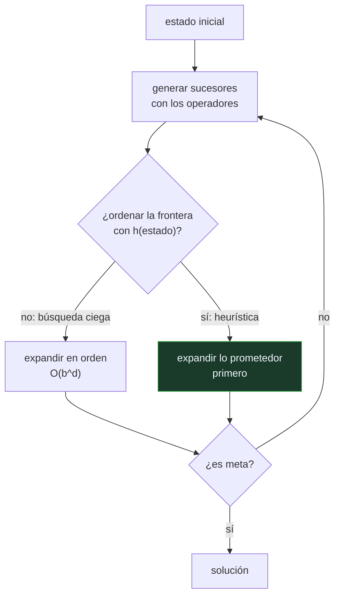

# P58 — Símbolos y búsqueda

> Ruta de fundamentos · Veinte años de IA simbólica resumidos en dos hipótesis falsables:
> pensar es manipular símbolos, y resolver es buscar sabiendo dónde no mirar.

**Nivel:** L2 · **Motor:** `simbolos_y_busqueda` · **Notebook:** [`P58_simbolos_y_busqueda.ipynb`](../../../notebooks/papers/P58_simbolos_y_busqueda.ipynb)
· **Anexo:** [complejidad y coste](../../annexes/A05_COMPLEJIDAD_Y_COSTE.md)

## 1. Identificación

| Campo | Valor |
|---|---|
| **Título original** | *Computer Science as Empirical Inquiry: Symbols and Search* |
| **Autoría** | Allen Newell, Herbert A. Simon |
| **Año** | 1976 |
| **Venue** | Communications of the ACM, 19(3), 113–126 · conferencia del premio Turing |
| **Fuente primaria** | [doi:10.1145/360018.360022](https://doi.org/10.1145/360018.360022) |
| **Acceso** | Restringido |
| **Fecha de consulta** | 2026-08-17 |

## 2. Problema anterior

Para 1976 había veinte años de programas: jugadores de ajedrez, demostradores de teoremas,
resolvedores de problemas, sistemas de planificación. Cada uno se justificaba por su desempeño en
su dominio.

Lo que faltaba era la tesis. ¿Qué tienen en común? ¿Qué se está afirmando sobre el pensamiento
cuando se dice que un programa «resuelve problemas»? Sin una hipótesis explícita, la disciplina no
podía ser refutada y por tanto tampoco podía ser empírica.

## 3. Propuesta

Dos hipótesis, enunciadas como afirmaciones empíricas sobre el mundo, no como definiciones:

**Hipótesis del sistema de símbolos físicos.** Un sistema de símbolos físicos tiene los medios
necesarios y suficientes para la acción inteligente general. Necesarios: cualquier sistema que
exhiba inteligencia general será un sistema de símbolos. Suficientes: se puede organizar uno para
que la exhiba.

**Hipótesis de la búsqueda heurística.** Los problemas se resuelven generando y probando
soluciones candidatas en un espacio de estados, guiados por información sobre la estructura del
problema. La inteligencia no está en probar más rápido: está en **no probar**.

Y una tesis metodológica sobre la informática misma: es una ciencia empírica, y sus programas son
experimentos.

## 4. Intuición sin fórmulas

Buscar las llaves en casa. La búsqueda ciega es abrir todos los cajones en orden. La búsqueda
heurística es preguntarse dónde sueles dejarlas y empezar por ahí.

Las dos exploran el mismo espacio con las mismas acciones posibles. La diferencia es el **orden**,
y ese orden es toda la diferencia entre encontrarlas en un minuto o en una tarde.

**Dónde deja de funcionar la analogía:** en casa hay pocos cajones. En el ajedrez la búsqueda
ciega no es lenta: es imposible, con más posiciones que átomos en el universo observable. La
heurística no es una comodidad, es la condición de existencia.

## 5. Matemática mínima

```text
Espacio de estados:  (estados, operadores, estado inicial, prueba de meta)

Coste de la búsqueda ciega a profundidad d con ramificación b:  O(b^d)

Búsqueda guiada: ordenar la frontera por h(estado), una estimación
                 del coste restante  →  cambia el orden, no el espacio
```

La miniatura resuelve el mismo 8-puzzle de dos formas:

| Estrategia | Nodos expandidos | Profundidad de la solución |
|---|---:|---:|
| ciega (anchura) | 83 | 6 |
| guiada por distancia Manhattan | 7 | 6 |

Una razón de **11,86×** sobre el mismo problema, el mismo espacio y los mismos operadores. Y con
ramificación 2,7, la búsqueda exhaustiva pasa de 53 nodos a profundidad 4 a **423 911 582** a
profundidad 20: ningún hardware cierra ese hueco.

<!-- puente:inicio -->
> [!TIP]
> **Puente matemático.** Esta sección da por sabido lo siguiente. Si algo no te suena,
> léelo primero: está explicado una sola vez, en un solo sitio, y sirve para todas las fichas.

| Dónde | Qué necesitas de ahí |
|---|---|
| [**A05 §1** · Notación O(): qué dice y qué no](../../annexes/A05_COMPLEJIDAD_Y_COSTE.md#1-notación-o-qué-dice-y-qué-no) | por qué un crecimiento exponencial no se arregla con hardware más rápido |
<!-- puente:fin -->

## 6. Arquitectura o flujo



## 7. Qué observar en el paper original

- El enunciado **literal** de las dos hipótesis, y el cuidado con que se presentan como
  empíricas y por tanto refutables. Es la parte que se cita mal más a menudo.
- La definición de **símbolo** que dan: un patrón físico que puede designar y ser manipulado. No
  es la noción lingüística ni la lógica.
- La discusión de **por qué la búsqueda heurística es la respuesta a la explosión combinatoria**,
  y no la potencia de cálculo.
- La tesis sobre la informática como **indagación empírica**: los programas son experimentos y las
  arquitecturas, teorías.
- Las **evidencias** que aportan: veinte años de sistemas, desde el Logic Theorist hasta los
  sistemas de producción. Es un balance, no un experimento nuevo.

## 8. Evidencia y resultados

El artículo es una síntesis y una argumentación, no un experimento. Su evidencia es la
acumulación de sistemas construidos entre 1956 y 1976 y lo que se aprendió de ellos.

> Las dos hipótesis se presentan como **empíricas**, es decir, sujetas a refutación por la
> evidencia futura. Y en buena medida han sido cuestionadas: es exactamente lo que sus autores
> pedían.

La miniatura mide lo único que se puede medir en un cuaderno: la diferencia en nodos expandidos
entre buscar con y sin información sobre el problema.

## 9. Impacto

- Es la formulación canónica de la IA simbólica y el texto que se cita para definirla.
- La búsqueda heurística que enuncia es la estructura de la parte 01 completa del programa: de los
  espacios de estados a la planificación con STRIPS.
- **Sobrevive al cambio de paradigma**: la búsqueda en árbol de
  [AlphaGo](../P27_alphago/README.md) es esta idea con una red que aporta la heurística, y el
  bucle de [ReAct](../P13_react/README.md) es esta idea con un modelo de lenguaje generando los
  operadores. Cambia quién propone; la estructura no cambia.
- Provoca la reacción que funda otra tradición: la robótica situada de Brooks nace explícitamente
  contra la hipótesis de los símbolos.

## 10. Limitaciones

1. **La hipótesis de los símbolos no está demostrada**, ni podría estarlo por medios formales: es
   empírica, y sigue en disputa cincuenta años después.
2. **El aprendizaje profundo la esquiva.** Las representaciones distribuidas no son símbolos
   discretos manipulables, y sin embargo producen competencia.
3. **La robótica situada la niega en su parte «necesarios»**: hay comportamiento competente sin
   representación simbólica del mundo (Brooks, 1990).
4. **La búsqueda necesita que alguien aporte la heurística**, y el artículo no dice de dónde sale.
   Esa pregunta tarda cuarenta años en responderse aprendiéndola.
5. **Presupone que el problema viene formulado.** Formular el espacio de estados es la parte
   difícil en casi cualquier tarea real, y queda fuera.

## 11. Errores comunes

| Error | Corrección |
|---|---|
| «La hipótesis de los símbolos físicos es un hecho establecido» | Es una hipótesis empírica, y los autores insisten en ello. Está en disputa activa. |
| «La búsqueda heurística encuentra siempre la mejor solución» | Encuentra una solución rápido. La optimalidad exige condiciones sobre la heurística: es lo que aporta A* en [P67](../P67_a_estrella/README.md). |
| «El problema de la explosión combinatoria se resuelve con más cómputo» | Es exponencial: pasar de profundidad 16 a 20 multiplica por 53 el coste. Ningún hardware cierra ese hueco; hay que no mirar. |
| «La heurística cambia el problema» | No cambia ni el espacio de estados ni los operadores. Cambia el ORDEN en que se exploran. |
| «El aprendizaje profundo refutó este artículo» | Lo cuestiona en la parte «necesarios» de la hipótesis de los símbolos. La hipótesis de la búsqueda heurística sigue viva, y AlphaGo es su mejor ejemplo. |

## 12. Relación con trabajos anteriores

- **Newell, Shaw y Simon (1959)** — el General Problem Solver: el sistema del que se generaliza la
  hipótesis de la búsqueda.
- **[P57 Propuesta de Dartmouth](../P57_dartmouth/README.md) (1955)** — la agenda cuyo balance es
  este artículo.
- **Simon (1955)** — racionalidad limitada: la idea de que decidir bien con recursos finitos exige
  heurísticas, no optimización.

## 13. Relación con trabajos posteriores

- **Brooks (1990)** — *Elephants Don't Play Chess*: la refutación situada de la parte
  «necesarios». [doi:10.1016/S0921-8890(05)80025-9](https://doi.org/10.1016/S0921-8890(05)80025-9)
- **[P27 AlphaGo](../P27_alphago/README.md) (2016)** — búsqueda en árbol con la heurística
  aprendida en vez de escrita. Es la hipótesis de la búsqueda, cuarenta años después.
- **[P13 ReAct](../P13_react/README.md) (2022)** — el mismo bucle de generar y probar, con un
  modelo de lenguaje proponiendo los operadores.
- **Nilsson (2007)** — balance de la hipótesis treinta años después.
  [doi:10.1609/aimag.v28i4.2077](https://doi.org/10.1609/aimag.v28i4.2077)

## 14. Notebook asociado

[`P58_simbolos_y_busqueda.ipynb`](../../../notebooks/papers/P58_simbolos_y_busqueda.ipynb)

**Qué implementa:** la comparación de nodos expandidos entre búsqueda ciega y búsqueda guiada por distancia Manhattan sobre el mismo 8-puzzle, y la tabla de crecimiento exponencial con la profundidad.

**Qué NO implementa:** no hay optimalidad garantizada —la búsqueda voraz de la miniatura encuentra una solución, no la mejor—, ni dominios parcialmente observables, ni aprendizaje de la heurística.

```bash
ai-evolution paper-lab P58 --seed 7
```

## 15. Actividades Bloom

| Nivel | Actividad |
|---|---|
| **Recordar** | Enuncia las dos hipótesis del artículo. |
| **Explicar** | Explica por qué una heurística no cambia el problema sino el orden de exploración. |
| **Aplicar** | Ejecuta el notebook y compara los nodos expandidos con y sin heurística. |
| **Analizar** | Analiza qué ocurre si la heurística devuelve siempre 0 y qué búsqueda obtienes. |
| **Evaluar** | «El aprendizaje profundo refutó la hipótesis de los símbolos». Evalúa la afirmación. |
| **Crear** | Implementa una heurística no admisible y comprueba qué le pasa a la longitud de la solución. |

## 16. Autoevaluación

1. ¿Qué afirma la hipótesis del sistema de símbolos físicos?
2. ¿Qué afirma la hipótesis de la búsqueda heurística?
3. ¿Por qué las presentan como hipótesis y no como definiciones?
4. ¿Qué cambia una heurística y qué no cambia?
5. ¿Por qué más cómputo no resuelve la explosión combinatoria?
6. ¿Dónde sobrevive esta idea en la IA actual?
7. ¿Qué tradición nace de negar la hipótesis de los símbolos?

## 17. Respuestas esperadas

1. Que un sistema de símbolos físicos —patrones que designan y se pueden manipular— tiene los medios necesarios y suficientes para la acción inteligente general.
2. Que resolver problemas consiste en generar y probar candidatos en un espacio de estados, guiados por información sobre la estructura del problema. La inteligencia está en no explorar.
3. Porque quieren que la informática sea una ciencia empírica: una hipótesis se puede refutar con evidencia, una definición no. Es la tesis metodológica del artículo.
4. Cambia el **orden** en que se expanden los estados. No cambia el espacio de estados, ni los operadores, ni el problema. La miniatura lo muestra: 83 nodos frente a 7, misma solución.
5. Porque el crecimiento es exponencial en la profundidad. Con ramificación 2,7, pasar de profundidad 16 a 20 multiplica por más de 50 el número de nodos. Duplicar la máquina compra menos de un nivel.
6. En la búsqueda en árbol de AlphaGo, con la heurística aprendida por una red, y en el bucle de generar y probar de los agentes con modelos de lenguaje. Cambia quién propone los candidatos.
7. La robótica situada de Brooks: comportamiento competente sin representación simbólica del mundo, con control reactivo por capas.

## 18. Fuentes primarias

- Newell, A. y Simon, H. A. (1976). *Computer Science as Empirical Inquiry: Symbols and Search*.
  **Communications of the ACM**, 19(3), 113–126.
  [doi:10.1145/360018.360022](https://doi.org/10.1145/360018.360022) · consultado 2026-08-17.
- Brooks, R. (1990). *Elephants Don't Play Chess*.
  [doi:10.1016/S0921-8890(05)80025-9](https://doi.org/10.1016/S0921-8890(05)80025-9) ·
  consultado 2026-08-17.
- Nilsson, N. (2007). *The Physical Symbol System Hypothesis: Status and Prospects*.
  [doi:10.1609/aimag.v28i4.2077](https://doi.org/10.1609/aimag.v28i4.2077) · consultado 2026-08-17.

---

[⬅️ Anterior: P57 Propuesta de Dartmouth](../P57_dartmouth/README.md) ·
[📇 Índice](../../catalog/PAPERS_INDEX.md) ·
[📝 Evaluación](../../../assessments/papers/P58_simbolos_y_busqueda.md) ·
[🏫 Clase 013 · Espacios de estados y formulación de problemas](../../../classes/part-01-symbolic-ai-search-logic-and-planning/013-espacios-de-estados-y-formulacion-de-problemas/README.md) ·
[➡️ Siguiente: P59 Agentes inteligentes](../P59_agente_racional/README.md)
