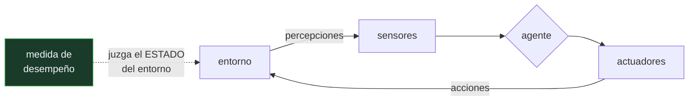

# P59 — Agentes inteligentes

> Ruta de fundamentos · Fija qué es un agente y qué lo hace racional. La respuesta no está
> en el agente: está en la medida de desempeño y en el entorno.

**Nivel:** L2 · **Motor:** `agente_racional` · **Notebook:** [`P59_agente_racional.ipynb`](../../../notebooks/papers/P59_agente_racional.ipynb)
· **Anexo:** [probabilidad y verosimilitud](../../annexes/A02_PROBABILIDAD_Y_VEROSIMILITUD.md)

## 1. Identificación

| Campo | Valor |
|---|---|
| **Título original** | *Intelligent Agents: Theory and Practice* |
| **Autoría** | Michael Wooldridge, Nicholas R. Jennings |
| **Año** | 1995 |
| **Venue** | The Knowledge Engineering Review, 10(2), 115–152 |
| **Fuente primaria** | [doi:10.1017/S0269888900008122](https://doi.org/10.1017/S0269888900008122) |
| **Acceso** | Restringido |
| **Fecha de consulta** | 2026-08-17 |

## 2. Problema anterior

A principios de los noventa «agente» se usaba para cosas incompatibles: un asistente de correo,
un robot móvil, un proceso en un sistema distribuido, un módulo con creencias y deseos. Cada
comunidad lo definía a su manera y las publicaciones no eran comparables.

Sin una definición operativa no se puede evaluar nada: no hay forma de decir si una arquitectura
es mejor que otra, ni siquiera de saber si están resolviendo el mismo problema.

## 3. Propuesta

Un survey que ordena el campo en tres niveles —teorías de agentes, arquitecturas y lenguajes— y
que fija una definición mínima con propiedades comprobables:

- **autonomía**: opera sin intervención directa y controla sus acciones y su estado interno;
- **reactividad**: percibe su entorno y responde a los cambios a tiempo;
- **proactividad**: toma la iniciativa hacia objetivos, no solo responde;
- **habilidad social**: interactúa con otros agentes.

Y el punto que sostiene esta ficha: la **racionalidad se juzga siempre respecto de una medida de
desempeño y de un entorno**. Un agente no es racional en abstracto. Racional tampoco es sinónimo
de omnisciente ni de perfecto: es maximizar el desempeño esperado dado lo que se ha percibido.

## 4. Intuición sin fórmulas

Dos aspiradoras en un piso de dos habitaciones. Una reacciona a lo que ve: si hay suciedad,
aspira; si no, se mueve. La otra recuerda dónde ha estado y se detiene cuando sabe que ya no queda
nada.

Si solo cuentas las habitaciones limpias, las dos empatan. Si además cobras por cada movimiento,
la primera pierde. Nada cambió en las aspiradoras: cambió lo que decidiste contar.

**Dónde deja de funcionar la analogía:** la aspiradora reflexiva «sabe» porque le dimos memoria.
En un entorno donde la suciedad reaparece, esa memoria pasa de ventaja a defecto, porque el agente
dejaría de mirar. La racionalidad depende también de si el entorno es estático.

## 5. Matemática mínima

```text
agente:  f : secuencia de percepciones → acción

racional ≠ omnisciente ≠ perfecto
racional = maximiza el valor esperado de la MEDIDA DE DESEMPEÑO,
           dada la secuencia de percepciones y el conocimiento disponible

Especificación completa = medida + entorno + actuadores + sensores
```

La miniatura ejecuta los dos agentes sobre los cuatro mundos posibles:

| Agente | Medida A (solo limpieza) | Medida B (limpieza − ½·movimientos) |
|---|---:|---:|
| reflejo simple | 8 | −2,0 |
| con modelo | 8 | 6,0 |

Con la medida A empatan. Con la medida B, uno gana y el otro pierde. **El código de los agentes es
idéntico en las dos columnas.**

<!-- puente:inicio -->
> [!TIP]
> **Puente matemático.** Esta sección da por sabido lo siguiente. Si algo no te suena,
> léelo primero: está explicado una sola vez, en un solo sitio, y sirve para todas las fichas.

| Dónde | Qué necesitas de ahí |
|---|---|
| [**A02 §1** · Softmax](../../annexes/A02_PROBABILIDAD_Y_VEROSIMILITUD.md#1-softmax) | cómo se convierte una puntuación en una decisión, que es lo que hace la política de un agente |
<!-- puente:fin -->

## 6. Arquitectura o flujo



## 7. Qué observar en el paper original

- La **distinción entre nociones débil y fuerte de agencia**: la débil son las cuatro propiedades;
  la fuerte añade estados mentales —creencias, deseos, intenciones— y compromete mucho más.
- La sección de **arquitecturas**: deliberativas (BDI), reactivas (subsunción de Brooks) e
  híbridas, con sus compromisos explícitos.
- La discusión sobre **lógicas de agentes**: qué se gana y qué se paga al razonar sobre creencias
  con lógicas modales.
- La advertencia final sobre el uso inflacionario del término. Treinta años después vuelve a ser
  pertinente palabra por palabra.

## 8. Evidencia y resultados

Es un survey: su evidencia es la literatura que revisa, no un experimento propio. Lo que aporta
es organización conceptual y vocabulario compartido.

> Un survey se juzga por la calidad de sus distinciones, no por sus números. Este es citado
> masivamente porque las suyas resistieron.

La miniatura de este eje no reproduce nada del artículo: ilustra el punto que hoy es más útil, que
es la dependencia de la racionalidad respecto de la medida de desempeño.

## 9. Impacto

- Es la referencia canónica de la definición de agente, y la base del capítulo 2 de Russell y
  Norvig, que es como la mayoría del campo aprendió el concepto.
- Su marco reaparece intacto en los agentes con modelos de lenguaje: percepción, política,
  actuadores y medida. Lo que llamamos hoy «herramientas» son actuadores; lo que llamamos
  «contexto» es percepción.
- La distinción entre reactivo y deliberativo estructura la discusión entre respuesta directa y
  planificación en [ReAct](../P13_react/README.md) y sucesores.
- La exigencia de declarar la medida de desempeño antes de construir es la raíz de lo que
  [P16](../P16_agentic_systems/README.md) llama criterio de parada y presupuesto.

## 10. Limitaciones

1. **Es un survey de 1995**: las arquitecturas concretas que revisa están superadas, aunque las
   distinciones sigan valiendo.
2. **La noción fuerte de agencia —creencias, deseos, intenciones— es discutible** como descripción
   de un sistema artificial, y el artículo lo reconoce.
3. **No aporta método de evaluación.** Dice que hay que especificar la medida, no cómo elegirla,
   que es la parte difícil.
4. **El entorno multiagente queda esbozado.** La coordinación real es materia de la parte 10 del
   programa, no de aquí.
5. **No anticipa el aprendizaje como fuente de la política.** En 1995 la política se diseña; hoy
   se entrena.

## 11. Errores comunes

| Error | Corrección |
|---|---|
| «Un agente es cualquier programa que hace cosas solo» | Autonomía es una de las cuatro propiedades. Sin reactividad, proactividad y capacidad de interacción, es un proceso automatizado, no un agente. |
| «Racional significa que toma la mejor decisión posible» | Significa que maximiza el desempeño ESPERADO con lo que ha percibido. Con información incompleta, la decisión racional puede salir mal. |
| «La medida de desempeño se puede decidir después» | Es parte de la especificación. La miniatura muestra dos agentes que empatan con una medida y se separan con otra: sin medida no hay veredicto. |
| «La medida debe evaluar lo que hace el agente» | Debe evaluar el ESTADO DEL ENTORNO. Si se puntúa la actividad, un agente que ensucia para volver a limpiar puntúa alto. |
| «Un agente con más información siempre es mejor» | Depende del entorno y de la medida. En un entorno dinámico, un agente con memoria que deja de mirar es peor que uno reactivo. |

## 12. Relación con trabajos anteriores

- **Brooks (1986)** — la arquitectura de subsunción: agencia sin representación simbólica del
  mundo, uno de los polos que el survey ordena.
- **Rao y Georgeff (1991)** — la arquitectura BDI: el polo deliberativo.
- **[P58 Símbolos y búsqueda](../P58_simbolos_y_busqueda/README.md) (1976)** — la tradición
  simbólica de la que la agencia deliberativa es heredera directa.

## 13. Relación con trabajos posteriores

- **Russell y Norvig** — *Artificial Intelligence: A Modern Approach*, capítulo 2: la
  formulación con la que el concepto se enseña. [aima.cs.berkeley.edu](https://aima.cs.berkeley.edu/)
- **[P13 ReAct](../P13_react/README.md) (2022)** — el bucle percibir-razonar-actuar con un modelo
  de lenguaje en el lugar de la política.
- **[P16 Sistemas agentic](../P16_agentic_systems/README.md) (2023–)** — memoria, presupuesto y
  criterio de parada: los mismos problemas con otro vocabulario.
- **[P33 AutoGen](../P33_autogen/README.md) (2023)** — la habilidad social del survey, treinta años
  después, como orquestación conversacional.

## 14. Notebook asociado

[`P59_agente_racional.ipynb`](../../../notebooks/papers/P59_agente_racional.ipynb)

**Qué implementa:** dos agentes —reflejo y con modelo— ejecutados sobre los cuatro mundos posibles, evaluados bajo dos medidas de desempeño distintas, con el conteo de movimientos y aspiraciones.

**Qué NO implementa:** no hay incertidumbre, ni acciones que fallen, ni otros agentes, ni aprendizaje de la política. Son las tres cosas que hacen difícil el diseño de agentes reales.

```bash
ai-evolution paper-lab P59 --seed 7
```

## 15. Actividades Bloom

| Nivel | Actividad |
|---|---|
| **Recordar** | Enumera las cuatro propiedades que definen a un agente según el survey. |
| **Explicar** | Explica por qué racional no es lo mismo que omnisciente. |
| **Aplicar** | Ejecuta el notebook y define una tercera medida que penalice las aspiraciones innecesarias. |
| **Analizar** | Analiza por qué el agente reflejo no puede detenerse. |
| **Evaluar** | «Este agente es mejor que aquel». Evalúa qué falta para que la afirmación tenga sentido. |
| **Crear** | Especifica con las cuatro dimensiones —medida, entorno, actuadores, sensores— un agente para una tarea real, y construye dos versiones para compararlas. |

## 16. Autoevaluación

1. ¿Qué cuatro propiedades definen a un agente en la noción débil?
2. ¿Qué diferencia hay entre la noción débil y la fuerte de agencia?
3. ¿Respecto de qué se juzga la racionalidad?
4. ¿Por qué el agente reflejo no puede parar?
5. ¿Sobre qué debe definirse la medida de desempeño?
6. ¿Qué cuatro cosas hay que especificar para diseñar un agente?
7. ¿Dónde reaparece este marco en los agentes actuales?

## 17. Respuestas esperadas

1. Autonomía, reactividad, proactividad y habilidad social. Es una definición mínima y comprobable, pensada para que dos trabajos se puedan comparar.
2. La débil se queda en propiedades observables del comportamiento. La fuerte atribuye además estados mentales —creencias, deseos, intenciones—, lo que compromete mucho más y es discutible en un sistema artificial.
3. Respecto de una **medida de desempeño** y de un **entorno**. No hay racionalidad en abstracto: la miniatura muestra dos agentes que empatan bajo una medida y se separan bajo otra.
4. Porque no recuerda haber visto las dos casillas limpias. Su límite está en la **percepción**, no en la decisión: con lo que percibe, moverse es lo mejor que puede hacer.
5. Sobre el **estado del entorno**, no sobre la actividad del agente. Si se puntúa la actividad, se premia a un agente que genera trabajo para hacerlo.
6. La medida de desempeño, el entorno, los actuadores y los sensores. Sin las cuatro, no hay especificación y no hay evaluación posible.
7. Íntegro: el contexto es percepción, las herramientas son actuadores, la política es el modelo y el criterio de parada es la medida. El vocabulario cambió; el marco no.

## 18. Fuentes primarias

- Wooldridge, M. y Jennings, N. R. (1995). *Intelligent Agents: Theory and Practice*.
  **The Knowledge Engineering Review**, 10(2), 115–152.
  [doi:10.1017/S0269888900008122](https://doi.org/10.1017/S0269888900008122) · consultado 2026-08-17.
- Franklin, S. y Graesser, A. (1996). *Is it an Agent, or just a Program?*
  [doi:10.1007/BFb0013570](https://doi.org/10.1007/BFb0013570) · consultado 2026-08-17.
- Russell, S. y Norvig, P. *Artificial Intelligence: A Modern Approach*, capítulo 2.
  [aima.cs.berkeley.edu](https://aima.cs.berkeley.edu/) · consultado 2026-08-17.

---

[⬅️ Anterior: P58 Símbolos y búsqueda](../P58_simbolos_y_busqueda/README.md) ·
[📇 Índice](../../catalog/PAPERS_INDEX.md) ·
[📝 Evaluación](../../../assessments/papers/P59_agente_racional.md) ·
[🏫 Clase 004 · Agentes racionales, entornos y medidas de desempeño](../../../classes/part-00-foundations-history-and-scientific-method/004-agentes-racionales-entornos-y-medidas-de-desempeno/README.md) ·
[➡️ Siguiente: P60 Valor predictivo](../P60_valor_predictivo/README.md)
