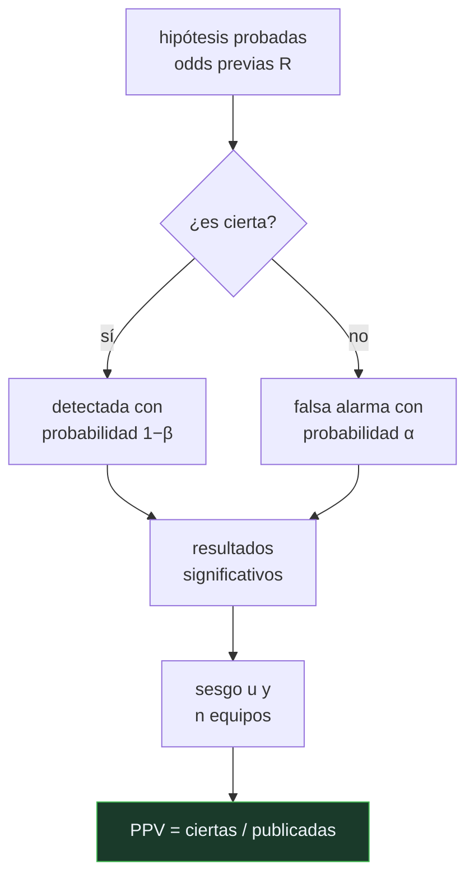

# P60 — Valor predictivo

> Ruta de fundamentos · Le pone fórmula a la pregunta que el valor p no responde: dado que
> esto se publicó, ¿qué probabilidad hay de que sea cierto?

**Nivel:** L3 · **Motor:** `valor_predictivo` · **Notebook:** [`P60_valor_predictivo.ipynb`](../../../notebooks/papers/P60_valor_predictivo.ipynb)
· **Anexo:** [probabilidad y verosimilitud](../../annexes/A02_PROBABILIDAD_Y_VEROSIMILITUD.md)

## 1. Identificación

| Campo | Valor |
|---|---|
| **Título original** | *Why Most Published Research Findings Are False* |
| **Autoría** | John P. A. Ioannidis |
| **Año** | 2005 |
| **Venue** | PLoS Medicine, 2(8), e124 |
| **Fuente primaria** | [doi:10.1371/journal.pmed.0020124](https://doi.org/10.1371/journal.pmed.0020124) |
| **Acceso** | Abierto |
| **Fecha de consulta** | 2026-08-17 |

## 2. Problema anterior

La significancia estadística se leía —y se sigue leyendo— como sinónimo de verdad. «p < 0,05»
se interpretaba como «hay un 95 % de probabilidad de que esto sea cierto», que es una lectura
sencillamente incorrecta.

El valor p responde: *si la hipótesis nula fuese cierta, ¿qué probabilidad habría de observar un
dato tan extremo?* La pregunta que interesa es la inversa: *dado este dato, y dado que el estudio
se publicó, ¿qué probabilidad hay de que la hipótesis sea cierta?* Nadie estaba poniendo número a
esa segunda pregunta, y depende de cosas que no aparecen en el artículo publicado.

## 3. Propuesta

Modelar explícitamente el **valor predictivo positivo** de un hallazgo: la probabilidad de que sea
cierto, dado que ha resultado significativo. El modelo depende de cuatro cosas, y solo una de
ellas es el umbral de significancia:

- `R`: las **odds previas** de que la hipótesis probada sea cierta en ese campo;
- `1 − β`: el **poder** del estudio;
- `α`: el nivel de significancia;
- `u`: el **sesgo**, entendido como la parte de resultados no significativos que acaban
  presentándose como significativos por decisiones de análisis.

Y una extensión por **número de equipos**: cuanta más gente persiga el mismo hallazgo, más
probable es que alguien lo encuentre por azar y lo publique primero.

## 4. Intuición sin fórmulas

Un detector de metales en una playa. Suena el 95 % de las veces que hay una moneda y se equivoca
el 5 % de las veces que no la hay. Suena. ¿Hay una moneda?

Depende de cuántas monedas hay enterradas. Si la playa está llena, casi seguro. Si hay una en
todo el arenal, la mayoría de los pitidos son falsas alarmas por más bueno que sea el detector.

**Dónde deja de funcionar la analogía:** la playa no cambia según cuánta gente busque. En la
ciencia sí: si cien equipos rastrean el mismo arenal, el primero que publique será probablemente
el que tuvo la falsa alarma más llamativa.

## 5. Matemática mínima

```text
PPV = P(hipótesis cierta | resultado significativo)

Sin sesgo:      PPV = (1−β)·R / (R − β·R + α)

Con sesgo u:    PPV = [(1−β)R + u·β·R] / [R + α − β·R + u − u·α + u·β·R]

Con n equipos:  PPV = (R − R·βⁿ) / (R + 1 − (1−α)ⁿ − R·βⁿ)
```

La miniatura evalúa cinco escenarios con **el mismo α = 0,05** en todos:

| Escenario | R | poder | sesgo | equipos | PPV |
|---|---:|---:|---:|---:|---:|
| ensayo confirmatorio | 1,0 | 0,80 | 0 | 1 | **0,9412** |
| exploratorio típico | 0,1 | 0,50 | 0 | 1 | **0,5** |
| exploratorio con sesgo | 0,1 | 0,50 | 0,3 | 1 | **0,1625** |
| cinco equipos en carrera | 0,1 | 0,50 | 0 | 5 | **0,2998** |
| barrido masivo | 0,001 | 0,60 | 0,1 | 1 | **0,0044** |

El umbral de significancia no se mueve en ninguna fila. Lo que se mueve es todo lo demás.

<!-- puente:inicio -->
> [!TIP]
> **Puente matemático.** Esta sección da por sabido lo siguiente. Si algo no te suena,
> léelo primero: está explicado una sola vez, en un solo sitio, y sirve para todas las fichas.

| Dónde | Qué necesitas de ahí |
|---|---|
| [**A02 §3** · Verosimilitud y entropía cruzada](../../annexes/A02_PROBABILIDAD_Y_VEROSIMILITUD.md#3-verosimilitud-y-entropía-cruzada) | la diferencia entre P(dato | hipótesis) y P(hipótesis | dato), que es de lo que trata toda la ficha |
<!-- puente:fin -->

## 6. Arquitectura o flujo



## 7. Qué observar en el paper original

- Los **seis corolarios** del artículo. Son la parte práctica: cuanto más pequeños los estudios,
  más pequeños los efectos, más relaciones probadas, más flexibilidad de diseño, más intereses y
  más equipos, menos probable es que un hallazgo sea cierto.
- Que el modelo es **analítico**: no mide cuántos resultados son falsos, demuestra qué implican
  sus supuestos. Confundir esas dos cosas es el error de lectura más común.
- La definición operativa de **sesgo**: no es fraude, es la acumulación de decisiones de análisis
  que empujan en la dirección deseada.
- El tratamiento de la **competencia entre equipos**, que es la parte más aplicable a un campo con
  el ritmo de publicación de la IA.

## 8. Evidencia y resultados

El artículo no presenta datos empíricos. Es un modelo probabilístico con supuestos declarados y
sus consecuencias.

> El título es una afirmación fuerte y el artículo la sostiene **condicionalmente**: es cierta si
> los supuestos sobre R, poder y sesgo son los que él estima para los campos que discute.

La confirmación empírica llega después, con los proyectos de replicación: el más citado, el de la
Open Science Collaboration (2015), reprodujo con éxito 36 de 100 estudios de psicología.

La miniatura de este eje calcula el modelo sobre escenarios explícitos, para que se vea qué
palanca mueve qué.

## 9. Impacto

- Es uno de los artículos más citados de la historia de PLoS Medicine y una de las piezas
  fundacionales de la crisis de replicación.
- Cambió prácticas concretas: preinscripción de estudios, informes registrados, exigencia de
  declarar el poder y el tamaño del efecto.
- En IA, sus corolarios se traducen casi literalmente: muchos equipos persiguiendo el mismo
  benchmark, mucha flexibilidad de diseño —semillas, hiperparámetros, elección de comparación— y
  efectos pequeños. Es el diagnóstico que
  [P63](../P63_reproducibilidad/README.md) intenta tratar.
- Da al programa su criterio de lectura: preguntar por las odds previas y por el poder antes de
  aceptar un resultado.

## 10. Limitaciones

1. **Los parámetros no se observan.** `R`, el poder real y el sesgo se estiman o se suponen; el
   modelo es un marco de razonamiento, no una calculadora.
2. **Es analítico, no empírico.** No mide la tasa de falsedad de ninguna literatura concreta.
3. **El título es más categórico que el resultado.** «La mayoría» depende enteramente de los
   valores que se den a los parámetros.
4. **Supone el marco frecuentista de contraste de hipótesis**, que no describe bien buena parte de
   la investigación en IA, donde el problema dominante es otro.
5. **Trasladarlo a la IA exige cuidado**: aquí el modo de fallo característico no es el valor p,
   sino la fuga de datos, la selección de semilla y la comparación con líneas base mal ajustadas.

## 11. Errores comunes

| Error | Corrección |
|---|---|
| «p < 0,05 significa 95 % de probabilidad de que sea cierto» | α es P(dato extremo | hipótesis nula cierta). Lo que se quiere es P(hipótesis | dato), y para eso hacen falta las odds previas. |
| «El artículo demuestra que la ciencia está rota» | Demuestra qué implican ciertos supuestos sobre diseño e incentivos. Es un modelo, y su conclusión es condicional. |
| «Basta con bajar α a 0,005 para arreglarlo» | Ayuda, pero el poder y el sesgo pesan más. En la tabla del motor, subir el poder de 0,2 a 0,95 mueve el PPV de 0,29 a 0,66 con α fijo. |
| «El sesgo es fraude» | Es la acumulación de decisiones de análisis defendibles una a una que empujan en la misma dirección. No hace falta mala fe. |
| «Esto no aplica a la IA porque no usamos valores p» | Los corolarios sí aplican: muchos equipos, efectos pequeños, mucha flexibilidad de diseño. Cambia el mecanismo, no la conclusión. |

## 12. Relación con trabajos anteriores

- **Neyman y Pearson (1933)** — el marco de contraste de hipótesis con α y β dentro del cual se
  formula todo el modelo.
- **Sterling (1959)** — la primera documentación del sesgo de publicación: casi todo lo publicado
  era significativo.
- **Cohen (1962)** — el análisis del poder estadístico y la constatación de que la mayoría de los
  estudios lo tenían bajo.

## 13. Relación con trabajos posteriores

- **Open Science Collaboration (2015)** — la replicación de 100 estudios de psicología: la
  confirmación empírica. [doi:10.1126/science.aac4716](https://doi.org/10.1126/science.aac4716)
- **Wasserstein y Lazar (2016)** — la declaración de la ASA sobre los valores p.
  [doi:10.1080/00031305.2016.1154108](https://doi.org/10.1080/00031305.2016.1154108)
- **[P63 Reproducibilidad](../P63_reproducibilidad/README.md) (2021)** — la respuesta operativa
  dentro del aprendizaje automático.
- **[P62 Validez de benchmarks](../P62_benchmark_validez/README.md) (2021)** — el otro filo del
  mismo problema: no si el número es real, sino si mide lo que dice.

## 14. Notebook asociado

[`P60_valor_predictivo.ipynb`](../../../notebooks/papers/P60_valor_predictivo.ipynb)

**Qué implementa:** el cálculo del valor predictivo positivo sobre cinco escenarios con el mismo α, el efecto del sesgo y del número de equipos, y el barrido del poder estadístico con odds previas fijas.

**Qué NO implementa:** no hay datos reales ni estimación de los parámetros a partir de una literatura concreta. R, poder y sesgo se fijan a mano para ver qué palanca mueve qué.

```bash
ai-evolution paper-lab P60 --seed 7
```

## 15. Actividades Bloom

| Nivel | Actividad |
|---|---|
| **Recordar** | Escribe la fórmula del PPV e identifica cada símbolo. |
| **Explicar** | Explica la diferencia entre α y P(hipótesis cierta | dato). |
| **Aplicar** | Ejecuta el notebook y calcula el PPV de un escenario con odds previas 1:100. |
| **Analizar** | Analiza cuál de las cuatro palancas mueve más el PPV y por qué. |
| **Evaluar** | «Bajar el umbral a 0,005 resolvería el problema». Evalúa la afirmación con los datos del motor. |
| **Crear** | Aplica el modelo a un anuncio reciente de mejora en un benchmark: estima R, poder, sesgo y número de equipos, y documenta cada supuesto. |

## 16. Autoevaluación

1. ¿Qué es el valor predictivo positivo?
2. ¿Por qué p < 0,05 no significa 95 % de probabilidad de ser cierto?
3. ¿Qué papel juegan las odds previas?
4. ¿Qué es el sesgo en este modelo y por qué no es fraude?
5. ¿Por qué empeora el PPV cuando compiten más equipos?
6. ¿Es este un artículo empírico?
7. ¿Cómo se traducen sus corolarios a la investigación en IA?

## 17. Respuestas esperadas

1. La probabilidad de que un hallazgo sea cierto **dado que** ha resultado significativo. Es la pregunta que le interesa a quien lee, y no es la que responde el valor p.
2. Porque α es la probabilidad de observar un dato extremo **si la hipótesis nula fuese cierta**. Invertir el condicional exige conocer cuántas de las hipótesis que se prueban son ciertas.
3. Son el factor dominante. Con odds previas 1:10, poder 0,5 y α 0,05, el PPV es 0,5: la mitad de los hallazgos significativos son falsos antes de contar sesgo alguno.
4. Es la parte de resultados no significativos que acaban presentándose como significativos por decisiones de análisis. Cada decisión puede ser defendible; el problema es que todas empujan en la misma dirección.
5. Porque con `n` equipos probando lo mismo, la probabilidad de que **alguno** tenga una falsa alarma crece como `1 − (1−α)ⁿ`, y el que publica primero suele ser ese. Con cinco equipos el PPV cae de 0,5 a 0,2998.
6. No. Es un modelo analítico con supuestos declarados. La confirmación empírica llegó después con los proyectos de replicación.
7. Casi literalmente: muchos equipos persiguiendo el mismo benchmark, efectos pequeños y mucha flexibilidad de diseño —semillas, hiperparámetros, elección de la línea base—. Cambia el mecanismo, no la conclusión.

## 18. Fuentes primarias

- Ioannidis, J. P. A. (2005). *Why Most Published Research Findings Are False*.
  **PLoS Medicine**, 2(8), e124.
  [doi:10.1371/journal.pmed.0020124](https://doi.org/10.1371/journal.pmed.0020124) ·
  consultado 2026-08-17.
- Open Science Collaboration (2015). *Estimating the reproducibility of psychological science*.
  [doi:10.1126/science.aac4716](https://doi.org/10.1126/science.aac4716) · consultado 2026-08-17.
- Wasserstein, R. y Lazar, N. (2016). *The ASA Statement on p-Values*.
  [doi:10.1080/00031305.2016.1154108](https://doi.org/10.1080/00031305.2016.1154108) ·
  consultado 2026-08-17.

---

[⬅️ Anterior: P59 Agentes inteligentes](../P59_agente_racional/README.md) ·
[📇 Índice](../../catalog/PAPERS_INDEX.md) ·
[📝 Evaluación](../../../assessments/papers/P60_valor_predictivo.md) ·
[🏫 Clase 008 · Datos, evidencia, hipótesis y falsabilidad](../../../classes/part-00-foundations-history-and-scientific-method/008-datos-evidencia-hipotesis-y-falsabilidad/README.md) ·
[➡️ Siguiente: P61 Loros estocásticos](../P61_stochastic_parrots/README.md)
