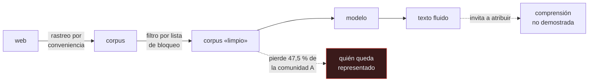

# P61 — Loros estocásticos

> Ruta de fundamentos · Pone por escrito lo que no aparece en la tabla de resultados: el
> coste de entrenar, quién queda representado en el corpus y qué se afirma de más.

**Nivel:** L1 · **Motor:** `stochastic_parrots` · **Notebook:** [`P61_stochastic_parrots.ipynb`](../../../notebooks/papers/P61_stochastic_parrots.ipynb)
· **Anexo:** [probabilidad y verosimilitud](../../annexes/A02_PROBABILIDAD_Y_VEROSIMILITUD.md)

## 1. Identificación

| Campo | Valor |
|---|---|
| **Título original** | *On the Dangers of Stochastic Parrots: Can Language Models Be Too Big? 🦜* |
| **Autoría** | Emily M. Bender, Timnit Gebru, Angelina McMillan-Major, Shmargaret Shmitchell |
| **Año** | 2021 |
| **Venue** | FAccT '21 · ACM Conference on Fairness, Accountability, and Transparency |
| **Fuente primaria** | [doi:10.1145/3442188.3445922](https://doi.org/10.1145/3442188.3445922) |
| **Acceso** | Abierto |
| **Fecha de consulta** | 2026-08-17 |

## 2. Problema anterior

Entre 2018 y 2021 el tamaño de los modelos de lenguaje creció tres órdenes de magnitud, y la
justificación era siempre la misma: mejoraban los benchmarks.

Tres costes quedaban fuera de esa cuenta. El **ambiental y económico**, que recae sobre quien no
se beneficia del modelo. El de **representación**: un corpus recogido por conveniencia de la web
refleja a quien publica en la web, y los filtros de limpieza no afectan por igual a todos. Y el
**epistémico**: la fluidez del texto generado invita a atribuir comprensión, y esa atribución no
estaba sostenida por ninguna evidencia.

## 3. Propuesta

Un análisis de riesgos **previo** al entrenamiento, con tres exigencias concretas:

1. **Presupuestar** el coste de cómputo y declararlo junto con los resultados.
2. **Documentar el corpus** —de dónde viene, a quién representa, qué filtros se aplicaron— antes
   de entrenar, no después.
3. **No confundir forma con significado**: un modelo de lenguaje ordena formas lingüísticas según
   su probabilidad; el significado requiere intención comunicativa, que el corpus no contiene.

De ahí la metáfora del título: un sistema que cose fragmentos de forma lingüística sin referencia
al significado, guiado por información probabilística.

## 4. Intuición sin fórmulas

Una encuesta hecha llamando por teléfono fijo a media tarde. La muestra es enorme y sin embargo
no es representativa: refleja a quien está en casa con teléfono fijo a esa hora.

Y luego, para «limpiarla», se descartan las respuestas con ciertas palabras. Suena neutral. Pero
las comunidades que han reapropiado esos términos pierden una parte mucho mayor de su voz que las
demás.

**Dónde deja de funcionar la analogía:** una encuesta declara su método de muestreo. Un corpus de
web recogido por rastreo no declara nada, y por eso hay que documentarlo aparte.

## 5. Matemática mínima

No hay formalismo: es un artículo de análisis. Lo que sí se puede cuantificar es el efecto
desigual de un filtro aplicado por igual.

| Comunidad | Documentos | Cuota antes | Retirados por lista | Cuota después | Variación |
|---|---:|---:|---:|---:|---:|
| mayoritaria | 9 400 | 94,00 % | 1,3 % | 96,07 % | **+2,07** |
| minoritaria A | 400 | 4,00 % | 47,5 % | 2,17 % | **−1,83** |
| minoritaria B | 200 | 2,00 % | 15,0 % | 1,76 % | −0,24 |

El filtro se aplica igual a todos los documentos. El resultado es que la comunidad mayoritaria
**gana** cuota tras la limpieza.

Y una segunda observación de la miniatura: una muestra de 20 documentos del corpus contiene 20 de
la comunidad mayoritaria. Quien audite el conjunto con una muestra pequeña no verá siquiera que
existen las otras.

## 6. Arquitectura o flujo



## 7. Qué observar en el paper original

- La sección de **coste ambiental**, y con qué cuidado se presenta: son órdenes de magnitud
  dependientes del centro de datos y del año, no cifras universales.
- El argumento sobre **listas de bloqueo**, que es el más concreto y el más comprobable: filtrar
  por palabras retira desproporcionadamente el habla de comunidades que las reapropian.
- La distinción entre **forma y significado**, que remite a Bender y Koller (2020) y es una tesis
  lingüística, no una predicción sobre capacidades.
- La propuesta positiva: **documentación de datos antes del entrenamiento**. Es lo más accionable
  del artículo y lo menos adoptado.
- El contexto de publicación, que forma parte de su historia: el despido de Timnit Gebru de Google
  ocurre durante el proceso de revisión.

## 8. Evidencia y resultados

Es un artículo de posición y análisis, no de experimentos. Su evidencia es la literatura previa
sobre corpus, sesgo y coste, organizada en un argumento.

> Ninguna de sus afirmaciones centrales es una medición propia. Eso no las invalida: las convierte
> en tesis argumentadas, que se discuten con argumentos y con datos de otros.

La miniatura de este eje **no reproduce nada del artículo**. Construye un corpus de juguete para
que se vea la mecánica del filtro desigual, que es la parte más fácil de comprobar y la más fácil
de olvidar.

## 9. Impacto

- Es el artículo más citado de la discusión sobre riesgos de los modelos de lenguaje, y el que
  fijó el vocabulario: «loro estocástico» entró en el lenguaje del campo.
- Empujó la práctica de documentar corpus —hojas de datos, tarjetas de modelo— y de declarar el
  coste de entrenamiento.
- Su tesis sobre forma y significado estructura una discusión que sigue abierta y que atraviesa
  [P52](../P52_superposition/README.md): qué se puede afirmar sobre lo que un modelo «entiende».
- Es también un caso de estudio sobre la relación entre investigación y financiación industrial,
  por las circunstancias de su publicación.

## 10. Limitaciones

1. **No aporta mediciones propias.** Sus afirmaciones son argumentativas y hay que evaluarlas
   como tales.
2. **Las cifras de coste envejecen rápido** y dependen del hardware, del centro de datos y del
   año. Citarlas como dato fijo es un error.
3. **La tesis sobre el significado es discutible** y está discutida: hay trabajo publicado que
   sostiene lo contrario, y el desacuerdo es genuino.
4. **No propone un criterio operativo de «demasiado grande»**, pese al subtítulo. La pregunta
   queda abierta.
5. **La metáfora del título se ha usado como eslogan**, lo que ha degradado un argumento
   discutible en una etiqueta. Eso perjudica sobre todo a quien quiere discutirlo en serio.

## 11. Errores comunes

| Error | Corrección |
|---|---|
| «El artículo dice que los modelos grandes no funcionan» | No dice nada sobre su desempeño. Dice que hay costes que no aparecen en la tabla de resultados. |
| ««Loro estocástico» es una tesis sobre las capacidades futuras» | Es una tesis lingüística sobre qué contiene el corpus y a qué tiene acceso el modelo. No predice qué tareas podrá resolver. |
| «Filtrar el corpus por palabras ofensivas es una mejora neutral» | La miniatura lo desmiente: el mismo filtro retira el 47,5 % de una comunidad y el 1,3 % de otra, y la mayoritaria acaba ganando cuota. |
| «Más datos implica más diversidad» | Un corpus grande recogido por conveniencia amplifica a quien ya tenía presencia. El tamaño no corrige el sesgo de muestreo: lo consolida. |
| «Las cifras de coste del artículo son la referencia actual» | Envejecen con cada generación de hardware. Sirven como orden de magnitud y como argumento de que la cuenta debe hacerse, no como dato citable. |

## 12. Relación con trabajos anteriores

- **Gebru et al. (2018)** — *Datasheets for Datasets*: la propuesta concreta de documentación que
  este artículo reclama que se aplique antes de entrenar.
- **Bender y Koller (2020)** — *Climbing towards NLU*: la tesis sobre forma y significado sobre la
  que se apoya. [doi:10.18653/v1/2020.acl-main.463](https://doi.org/10.18653/v1/2020.acl-main.463)
- **[P10 GPT-3](../P10_gpt3/README.md) (2020)** — el modelo cuya escala motiva directamente la
  pregunta del subtítulo.

## 13. Relación con trabajos posteriores

- **Dodge et al. (2021)** — documentación del corpus C4: el trabajo empírico que mide lo que este
  artículo argumenta. [doi:10.18653/v1/2021.emnlp-main.98](https://doi.org/10.18653/v1/2021.emnlp-main.98)
- **[P50 IA constitucional](../P50_constitutional_ai/README.md) (2022)** — una respuesta técnica
  al problema del comportamiento, con principios escritos en vez de listas de palabras.
- **[P19 Chinchilla](../P19_scaling_laws/README.md) (2022)** — la respuesta desde la eficiencia:
  modelos más pequeños y mejor entrenados, con menos cómputo.
- **[P62 Validez de benchmarks](../P62_benchmark_validez/README.md) (2021)** — la misma autoría
  parcial, aplicada al instrumento de medida.

## 14. Notebook asociado

[`P61_stochastic_parrots.ipynb`](../../../notebooks/papers/P61_stochastic_parrots.ipynb)

**Qué implementa:** el efecto desigual de un filtro por lista de bloqueo sobre tres comunidades de un corpus de juguete, el cambio de cuota tras el filtrado y qué ve una muestra pequeña del corpus.

**Qué NO implementa:** no hay corpus real, ni medición de coste energético, ni ningún modelo entrenado. La tabla es una ilustración de la mecánica, no un resultado del artículo.

```bash
ai-evolution paper-lab P61 --seed 7
```

## 15. Actividades Bloom

| Nivel | Actividad |
|---|---|
| **Recordar** | Enumera los tres tipos de coste que el artículo reclama contabilizar. |
| **Explicar** | Explica por qué un filtro aplicado por igual no afecta por igual. |
| **Aplicar** | Ejecuta el notebook y calcula cuántos puntos de cuota gana la comunidad mayoritaria. |
| **Analizar** | Analiza la diferencia entre la tesis lingüística del artículo y una predicción sobre capacidades. |
| **Evaluar** | «El artículo dice que los modelos grandes no sirven». Evalúa la afirmación. |
| **Crear** | Escribe la hoja de datos de un conjunto que uses: origen, poblaciones representadas, filtros aplicados y a quién dejaron fuera. |

## 16. Autoevaluación

1. ¿Qué tres costes señala el artículo que no aparecen en la tabla de resultados?
2. ¿Por qué un filtro por lista de palabras no es neutral?
3. ¿Qué significa exactamente «loro estocástico»?
4. ¿Qué propone el artículo en positivo?
5. ¿Aporta mediciones propias?
6. ¿Por qué «más datos» no equivale a «datos más diversos»?
7. ¿Qué parte de su tesis está genuinamente en disputa?

## 17. Respuestas esperadas

1. El ambiental y económico, el de representación —quién queda dentro del corpus— y el epistémico —qué comprensión se le atribuye al modelo sin evidencia—.
2. Porque las comunidades que han reapropiado los términos bloqueados pierden una fracción mucho mayor de su presencia. En la miniatura, el 47,5 % frente al 1,3 %, y la mayoritaria acaba ganando cuota.
3. Un sistema que cose fragmentos de forma lingüística según su probabilidad, sin referencia al significado ni intención comunicativa. Es una tesis sobre qué hay en los datos, no un insulto ni una predicción.
4. Documentar el corpus antes de entrenar, presupuestar y declarar el coste de cómputo, y no atribuir comprensión sin evidencia. La documentación previa es lo más accionable y lo menos adoptado.
5. No. Es un artículo de posición: organiza literatura previa en un argumento. Sus afirmaciones se discuten con argumentos y con datos de terceros.
6. Porque un corpus grande recogido por conveniencia refleja a quien ya publicaba mucho. Crecer en tamaño sin cambiar el método de muestreo consolida el sesgo en vez de diluirlo.
7. La tesis sobre el acceso al significado. Hay trabajo publicado que la contradice, y el desacuerdo es real: conviene presentarla como tesis discutida y no como hecho.

## 18. Fuentes primarias

- Bender, E. M., Gebru, T., McMillan-Major, A. y Shmitchell, S. (2021). *On the Dangers of
  Stochastic Parrots: Can Language Models Be Too Big?* **FAccT '21**.
  [doi:10.1145/3442188.3445922](https://doi.org/10.1145/3442188.3445922) · consultado 2026-08-17.
- Bender, E. M. y Koller, A. (2020). *Climbing towards NLU: On Meaning, Form, and Understanding*.
  [doi:10.18653/v1/2020.acl-main.463](https://doi.org/10.18653/v1/2020.acl-main.463) ·
  consultado 2026-08-17.
- Dodge, J. et al. (2021). *Documenting Large Webtext Corpora: A Case Study on the Colossal Clean
  Crawled Corpus*. [doi:10.18653/v1/2021.emnlp-main.98](https://doi.org/10.18653/v1/2021.emnlp-main.98)
  · consultado 2026-08-17.

---

[⬅️ Anterior: P60 Valor predictivo](../P60_valor_predictivo/README.md) ·
[📇 Índice](../../catalog/PAPERS_INDEX.md) ·
[📝 Evaluación](../../../assessments/papers/P61_stochastic_parrots.md) ·
[🏫 Clase 011 · Ética desde el diseño y límites de automatización](../../../classes/part-00-foundations-history-and-scientific-method/011-etica-desde-el-diseno-y-limites-de-automatizacion/README.md) ·
[➡️ Siguiente: P62 Validez de benchmarks](../P62_benchmark_validez/README.md)
