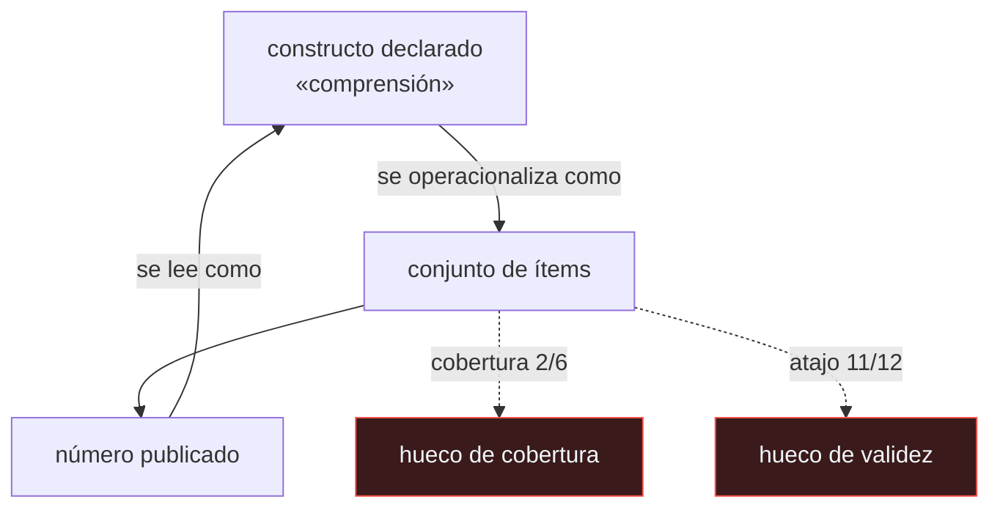

# P62 — Validez de benchmarks

> Ruta de fundamentos · Trae al campo la validez de constructo: un número alto no prueba la
> capacidad que el benchmark dice medir, y a veces mide un atajo.

**Nivel:** L3 · **Motor:** `benchmark_validez` · **Notebook:** [`P62_benchmark_validez.ipynb`](../../../notebooks/papers/P62_benchmark_validez.ipynb)
· **Anexo:** [probabilidad y verosimilitud](../../annexes/A02_PROBABILIDAD_Y_VEROSIMILITUD.md)

## 1. Identificación

| Campo | Valor |
|---|---|
| **Título original** | *AI and the Everything in the Whole Wide World Benchmark* |
| **Autoría** | Inioluwa Deborah Raji, Emily M. Bender, Amandalynne Paullada, Emily Denton, Alex Hanna |
| **Año** | 2021 |
| **Venue** | NeurIPS 2021 · Datasets and Benchmarks Track · arXiv:2111.15366 |
| **Fuente primaria** | [arXiv:2111.15366](https://arxiv.org/abs/2111.15366) |
| **Acceso** | Abierto |
| **Fecha de consulta** | 2026-08-17 |

## 2. Problema anterior

Los benchmarks pasaron de ser herramientas de comparación acotada a presentarse como pruebas de
capacidades generales: «comprensión de lenguaje natural», «razonamiento», «sentido común».

El salto es de escala pero también de tipo. Un conjunto de ítems mide lo que miden sus ítems. Si
la etiqueta promete un constructo general y los ítems cubren una porción estrecha —y encima
admiten estrategias que los superan sin la capacidad—, el ranking mide otra cosa distinta de la
que nombra. El campo no tenía vocabulario para señalar ese problema.

## 3. Propuesta

Importar de la psicometría el concepto de **validez de constructo** y aplicarlo a los benchmarks
como instrumentos de medida. Las preguntas que propone hacerle a cualquier benchmark:

- ¿Qué constructo dice medir, y está definido?
- ¿Qué cubren realmente sus ítems, y qué parte del constructo queda fuera?
- ¿Existe alguna estrategia que lo supere sin poseer la capacidad?
- ¿Quién decidió qué entra y qué no, y con qué criterio?

El título alude al libro infantil de Grover: un «museo de todo lo que hay en el mundo entero» que
resulta contener una sola habitación. La tesis es que un benchmark general es una contradicción,
no un objetivo difícil.

## 4. Intuición sin fórmulas

Un examen de conducir que solo evalúa aparcar en línea. Quien lo aprueba sabe aparcar. Llamarlo
«examen de conducción» es una promesa que los ejercicios no respaldan.

Peor todavía: si en ese examen el aparcamiento correcto siempre está en el mismo lado, se aprueba
memorizando el lado. La nota sube y la capacidad no.

**Dónde deja de funcionar la analogía:** el examen de conducir tiene un dominio bien definido. Los
constructos que nombran los benchmarks de IA —«comprensión», «razonamiento»— no lo tienen, y esa
es justamente la mitad del problema.

## 5. Matemática mínima

No hay formalismo. Hay un procedimiento de auditoría, que la miniatura ejecuta sobre un
benchmark ficticio de 12 ítems:

```text
capacidad declarada     : «comprensión de lenguaje natural»
subhabilidades declaradas: 6
subhabilidades medidas   : 2          ← cobertura 2/6

estrategia sin capacidad : «responder siempre la opción más larga»
    aciertos: 11/12  =  91,7 %
azar (4 opciones)        :  3/12  =  25,0 %
```

Una regla que no lee el ítem saca 91,7 %. El número publicado por el benchmark no distingue esa
estrategia de la capacidad que dice medir, y ninguna métrica de agregación va a arreglarlo: el
problema está en los ítems, no en la media.

## 6. Arquitectura o flujo



## 7. Qué observar en el paper original

- La distinción entre **validez interna, externa y de constructo**, y por qué el campo solo
  vigilaba la primera.
- El argumento sobre los **benchmarks «generales»**: no es que sean difíciles de construir, es que
  la generalidad no se puede operacionalizar en un conjunto finito de ítems.
- El análisis de **quién decide** qué entra en un benchmark, que es una decisión de poder poco
  documentada.
- Los **ejemplos históricos** que analizan, incluidos benchmarks de visión y de lenguaje muy
  usados, y cómo sus etiquetas prometieron más de lo que medían.

## 8. Evidencia y resultados

Es un artículo de análisis conceptual con estudios de caso, no un experimento. Su aportación es
un marco de evaluación, no una medición.

> La evidencia empírica que respalda su tesis viene de otra literatura: el aprendizaje por atajos
> (Geirhos et al., 2020) y el sesgo de los conjuntos de datos (Torralba y Efros, 2011).

La miniatura de este eje construye un benchmark ficticio para que el modo de fallo se pueda ver y
contar. No mide ningún benchmark real, y no debe leerse como si lo hiciera.

## 9. Impacto

- Introdujo en el vocabulario del campo la validez de constructo, que hoy aparece de forma
  rutinaria en las discusiones sobre evaluación.
- Contribuyó al cambio de diseño hacia benchmarks con **verificación externa**, donde el acierto
  no depende del formato del ítem: [SWE-bench](../P51_swebench/README.md) es el ejemplo canónico,
  porque los tests del repositorio son difíciles de fingir.
- Dio argumentos a la crítica de los rankings agregados y de las tablas de líderes como forma
  principal de comunicar progreso.
- Aporta al programa el procedimiento de lectura crítica de la clase 010: mirar los ítems, buscar
  el atajo, comprobar la cobertura.

## 10. Limitaciones

1. **No propone un benchmark alternativo.** Es un diagnóstico; construir instrumentos válidos es
   más difícil que señalar su invalidez.
2. **La validez de constructo viene de la psicometría**, donde los constructos tienen décadas de
   teoría detrás. Trasplantarla a «razonamiento» no es inmediato.
3. **El criterio de «demasiado general» no está operacionalizado.** Queda como juicio.
4. **No cuantifica** cuántos benchmarks en uso sufren el problema ni en qué grado.
5. **Puede leerse como nihilismo evaluativo**, y no lo es: la conclusión es medir cosas más
   estrechas y nombrarlas con precisión, no dejar de medir.

## 11. Errores comunes

| Error | Corrección |
|---|---|
| «El problema se arregla con más ítems» | Si los ítems admiten el mismo atajo, más ítems dan el mismo número con más decimales. El problema es de diseño, no de tamaño. |
| «Si dos modelos se evalúan igual, la comparación es justa» | Es justa entre ellos y sobre ese instrumento. No autoriza a hablar de la capacidad que el instrumento nombra. |
| «La validez es un problema de la métrica» | La métrica puede ser perfecta. El problema es la distancia entre lo que miden los ítems y lo que afirma la etiqueta. |
| «Un benchmark general es un objetivo difícil pero deseable» | La tesis del artículo es que es una contradicción: la generalidad no se operacionaliza en un conjunto finito de ítems. |
| «Basta con que el conjunto de test no se haya filtrado al entrenamiento» | Es necesario y no suficiente. Sin fuga de datos, un atajo de formato sigue produciendo una puntuación alta sin capacidad. |

## 12. Relación con trabajos anteriores

- **Torralba y Efros (2011)** — *Unbiased Look at Dataset Bias*: la constatación de que un modelo
  puede reconocer de qué conjunto viene una imagen.
- **Geirhos et al. (2020)** — aprendizaje por atajos: la evidencia empírica de que las redes
  aprenden regularidades superficiales.
  [doi:10.1038/s42256-020-00257-z](https://doi.org/10.1038/s42256-020-00257-z)
- **[P61 Loros estocásticos](../P61_stochastic_parrots/README.md) (2021)** — el mismo escepticismo
  aplicado al corpus en vez de al instrumento de medida.

## 13. Relación con trabajos posteriores

- **[P51 SWE-bench](../P51_swebench/README.md) (2023)** — un benchmark cuyo criterio de acierto
  es externo al formato del ítem: pasan o no pasan los tests del repositorio.
- **Bowman y Dahl (2021)** — *What Will it Take to Fix Benchmarking in NLU?*
  [doi:10.18653/v1/2021.naacl-main.385](https://doi.org/10.18653/v1/2021.naacl-main.385)
- **[P63 Reproducibilidad](../P63_reproducibilidad/README.md) (2021)** — el otro requisito: que el
  número sea repetible, además de válido.
- **[P52 Superposición](../P52_superposition/README.md) (2023)** — mirar dentro del modelo cuando
  medir por fuera no basta.

## 14. Notebook asociado

[`P62_benchmark_validez.ipynb`](../../../notebooks/papers/P62_benchmark_validez.ipynb)

**Qué implementa:** la auditoría de un benchmark ficticio: cobertura declarada frente a real, puntuación de una estrategia sin capacidad, línea del azar y muestra de ítems a inspeccionar a mano.

**Qué NO implementa:** no evalúa ningún benchmark real ni ningún modelo. Los ítems son inventados para exhibir el modo de fallo, y no deben citarse como resultado.

```bash
ai-evolution paper-lab P62 --seed 7
```

## 15. Actividades Bloom

| Nivel | Actividad |
|---|---|
| **Recordar** | Define validez de constructo con tus palabras. |
| **Explicar** | Explica por qué una puntuación alta puede ser compatible con no tener la capacidad. |
| **Aplicar** | Ejecuta el notebook y calcula la ventaja del atajo sobre el azar. |
| **Analizar** | Analiza por qué añadir más ítems no resuelve el problema. |
| **Evaluar** | «El modelo A comprende mejor el lenguaje porque saca más puntos». Evalúa la afirmación. |
| **Crear** | Audita un benchmark real de tu área: lee veinte ítems, identifica el constructo declarado, la cobertura y un atajo posible. |

## 16. Autoevaluación

1. ¿Qué es la validez de constructo?
2. ¿Qué mide realmente un benchmark que admite un atajo?
3. ¿Por qué el artículo sostiene que un benchmark general es una contradicción?
4. ¿Resuelve el problema añadir más ítems?
5. ¿Qué hace distinto a un benchmark con verificación externa?
6. ¿Aporta el artículo mediciones propias?
7. ¿Cuál es el procedimiento mínimo antes de citar una puntuación?

## 17. Respuestas esperadas

1. La correspondencia entre lo que un instrumento mide y el concepto que dice medir. Un instrumento puede ser fiable y preciso y aun así medir otra cosa.
2. Mide el atajo. En la miniatura, «responder la opción más larga» acierta 11 de 12 frente a 3 de 12 del azar, sin ninguna capacidad detrás.
3. Porque la generalidad no se puede operacionalizar en un conjunto finito de ítems: cualquier conjunto concreto cubre una porción y deja fuera el resto, por grande que sea.
4. No, si los ítems nuevos comparten el mismo atajo o la misma cobertura estrecha. Se obtiene el mismo número con menos varianza, que es peor: parece más sólido.
5. Que el criterio de acierto no depende del formato del ítem. En SWE-bench, pasar los tests del repositorio es difícil de fingir con una heurística de superficie.
6. No. Es análisis conceptual con estudios de caso. La evidencia empírica de los atajos viene de otra literatura, como Geirhos et al. (2020).
7. Tres pasos: leer una muestra de ítems, buscar una estrategia que los supere sin la capacidad, y comprobar qué parte del constructo declarado cubren realmente.

## 18. Fuentes primarias

- Raji, I. D., Bender, E. M., Paullada, A., Denton, E. y Hanna, A. (2021). *AI and the Everything
  in the Whole Wide World Benchmark*. **NeurIPS 2021 Datasets and Benchmarks**.
  [arXiv:2111.15366](https://arxiv.org/abs/2111.15366) · consultado 2026-08-17.
- Bowman, S. y Dahl, G. (2021). *What Will it Take to Fix Benchmarking in Natural Language
  Understanding?* [doi:10.18653/v1/2021.naacl-main.385](https://doi.org/10.18653/v1/2021.naacl-main.385)
  · consultado 2026-08-17.
- Geirhos, R. et al. (2020). *Shortcut Learning in Deep Neural Networks*.
  [doi:10.1038/s42256-020-00257-z](https://doi.org/10.1038/s42256-020-00257-z) ·
  consultado 2026-08-17.

---

[⬅️ Anterior: P61 Loros estocásticos](../P61_stochastic_parrots/README.md) ·
[📇 Índice](../../catalog/PAPERS_INDEX.md) ·
[📝 Evaluación](../../../assessments/papers/P62_benchmark_validez.md) ·
[🏫 Clase 010 · Cómo leer papers, benchmarks y claims de IA](../../../classes/part-00-foundations-history-and-scientific-method/010-como-leer-papers-benchmarks-y-claims-de-ia/README.md) ·
[➡️ Siguiente: P63 Reproducibilidad](../P63_reproducibilidad/README.md)
