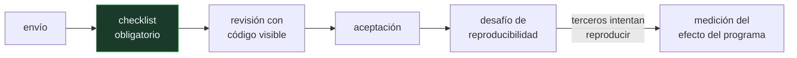

# P63 — Reproducibilidad

> Ruta de fundamentos · Convierte la reproducibilidad en un requisito del proceso de
> publicación, con checklist y datos sobre su efecto. Cierra el suelo metodológico.

**Nivel:** L3 · **Motor:** `reproducibilidad` · **Notebook:** [`P63_reproducibilidad.ipynb`](../../../notebooks/papers/P63_reproducibilidad.ipynb)
· **Anexo:** [probabilidad y verosimilitud](../../annexes/A02_PROBABILIDAD_Y_VEROSIMILITUD.md)

## 1. Identificación

| Campo | Valor |
|---|---|
| **Título original** | *Improving Reproducibility in Machine Learning Research (A Report from the NeurIPS 2019 Reproducibility Program)* |
| **Autoría** | Joelle Pineau, Philippe Vincent-Lamarre, Koustuv Sinha, Vincent Larivière, Alina Beygelzimer, Florence d'Alché-Buc, Emily Fox, Hugo Larochelle |
| **Año** | 2021 |
| **Venue** | Journal of Machine Learning Research, 22(164), 1–20 |
| **Fuente primaria** | [JMLR 22(164)](https://jmlr.org/papers/v22/20-303.html) |
| **Acceso** | Abierto |
| **Fecha de consulta** | 2026-08-17 |

## 2. Problema anterior

Un artículo de aprendizaje automático reporta una mejora. Para que otra persona pueda
comprobarla necesita saber: qué semillas, cuántas corridas, qué entorno, qué búsqueda de
hiperparámetros, qué partición exacta de los datos y cuánto cómputo. Nada de eso era obligatorio
declarar.

Sin esos campos, una mejora real y una mejora aparente son **indistinguibles desde el texto**. No
hace falta mala fe: basta probar cinco semillas y reportar la mejor, algo que un formato sin
obligación de declararlas permite y que nadie puede detectar.

## 3. Propuesta

Intervenir sobre el proceso de publicación, no sobre los autores. El programa de NeurIPS 2019
introdujo tres piezas:

1. Un **checklist de reproducibilidad** obligatorio en el envío, con campos concretos:
   código, semillas y entorno, media y desviación sobre varias corridas, hiperparámetros y su
   búsqueda, partición de los datos, coste de cómputo, definición de la métrica y límites.
2. Una **política de código**, con envío recomendado y visible para la revisión.
3. Un **desafío de reproducibilidad**, en el que terceros intentan reproducir artículos aceptados.

Y, crucialmente, el artículo **mide el efecto** de esas intervenciones: no las propone a ciegas.

## 4. Intuición sin fórmulas

Una receta de cocina que dice «hornear hasta que esté listo». Puede ser una receta excelente y
aun así nadie la puede repetir: falta la temperatura, el tiempo y el tamaño del molde.

El checklist no juzga si el plato está bueno. Obliga a escribir la temperatura.

**Dónde deja de funcionar la analogía:** una receta mal escrita se detecta al primer intento. Un
resultado irreproducible puede sobrevivir años como referencia, porque replicarlo cuesta más que
citarlo.

## 5. Matemática mínima

No hay modelo: hay una intervención y su medición. Lo que sí se puede exhibir es el mecanismo
por el que un formato permisivo produce mejoras aparentes.

```text
baseline  : 71,2 · 73,8 · 70,4 · 74,9 · 72,1   → media 72,48 ± 1,851
propuesta : 73,0 · 72,4 · 74,6 · 71,8 · 73,9   → media 73,14 ± 1,126

reportando la semilla 42 :  +4,2      ← lo que se publica
en media sobre cinco     :  +0,66     ← lo que hay
gana en                  :  3 de 5 semillas
rangos                   :  se SOLAPAN
```

Nada de esto es fraude. Cada número es real. La diferencia entre las dos lecturas es **qué campos
obliga a declarar el formato**.

La miniatura puntúa además tres artículos ficticios contra un checklist de ocho ítems: 8/8, 4/8 y
2/8. La diferencia entre ellos no está en la calidad de la idea, sino en si alguien puede
comprobarla.

<!-- puente:inicio -->
> [!TIP]
> **Puente matemático.** Esta sección da por sabido lo siguiente. Si algo no te suena,
> léelo primero: está explicado una sola vez, en un solo sitio, y sirve para todas las fichas.

| Dónde | Qué necesitas de ahí |
|---|---|
| [**A02 §2** · Entropía](../../annexes/A02_PROBABILIDAD_Y_VEROSIMILITUD.md#2-entropía) | por qué una media sin dispersión no informa: la incertidumbre es parte del resultado |
<!-- puente:fin -->

## 6. Arquitectura o flujo



## 7. Qué observar en el paper original

- El **checklist completo**, campo por campo. Es la parte directamente aplicable a cualquier
  trabajo propio, incluido un proyecto del programa.
- La distinción entre **reproducibilidad** (mismo código y datos, mismo resultado), **replicación**
  (código nuevo, misma conclusión) y **generalización**. Se confunden constantemente.
- Los **datos sobre el efecto**: qué proporción de artículos empezó a publicar código y qué
  cambió en las revisiones tras introducir el checklist.
- La discusión sobre el **coste** de estas exigencias y sobre quién lo asume, que es la objeción
  seria a este tipo de programas.

## 8. Evidencia y resultados

Este sí es un artículo empírico: reporta el efecto de una intervención sobre una conferencia
completa, con datos de envíos, revisiones y disponibilidad de código.

> Lo que mide es la adopción y sus efectos sobre el proceso, no la veracidad de los resultados
> publicados. Un checklist no puede hacer eso, y el artículo no lo pretende.

La miniatura de este eje no reproduce ese estudio: ilustra con números inventados el mecanismo por
el que reportar una semilla en vez de cinco invierte una conclusión.

## 9. Impacto

- El checklist de NeurIPS se adoptó, con variantes, en la mayoría de las conferencias grandes del
  campo. Es probablemente el cambio de práctica más extendido de la última década.
- Normalizó publicar código junto al artículo, que en 2018 era la excepción.
- Consolidó el reporte de media y desviación sobre varias corridas, en lugar del número único.
- Para este programa es la ficha operativa: define qué debe contener un experimento propio para
  que otra persona pueda comprobarlo. Es el contenido de la clase 009 y el criterio con el que se
  evalúan los proyectos.

## 10. Limitaciones

1. **Un checklist no hace cierto un resultado**: lo hace comprobable. Confundir las dos cosas
   lleva a decepcionarse con la herramienta.
2. **Es un requisito de forma y se puede rellenar de forma ritual**, marcando casillas sin aportar
   lo que piden.
3. **El coste recae de forma desigual** sobre grupos con menos recursos, y esa objeción no está
   resuelta.
4. **Mide adopción, no verdad.** El estudio no puede decir cuántos resultados publicados son
   correctos.
5. **Cinco semillas siguen siendo pocas** para un contraste serio, y el artículo no fija un
   estándar de cuántas hacen falta.

## 11. Errores comunes

| Error | Corrección |
|---|---|
| «Reportar el mejor resultado de varias corridas es hacer trampa» | Es lo que un formato sin obligación de declarar el número de corridas permite y hace indetectable. El arreglo es cambiar el formato, no acusar. |
| «Reproducibilidad y replicación son lo mismo» | Reproducir es obtener el mismo resultado con el mismo código y datos. Replicar es llegar a la misma conclusión con una implementación nueva. |
| «Si el código está publicado, el resultado es reproducible» | Sin semillas, entorno y partición exacta de datos, el mismo código puede dar otro número. El código es un ítem del checklist, no el checklist. |
| «El checklist garantiza que el resultado es correcto» | Garantiza que se puede auditar. Son cosas distintas y el artículo lo dice. |
| «Una mejora de 4 puntos siempre es significativa» | Depende de la dispersión. En la miniatura, 4,2 puntos en una semilla son 0,66 en media, con rangos solapados. |

## 12. Relación con trabajos anteriores

- **[P60 Ioannidis](../P60_valor_predictivo/README.md) (2005)** — el diagnóstico general del que
  este artículo es la respuesta operativa dentro del aprendizaje automático.
- **Henderson et al. (2018)** — *Deep Reinforcement Learning that Matters*: la demostración de que
  la varianza entre semillas invertía conclusiones publicadas.
  [doi:10.1609/aaai.v32i1.11694](https://doi.org/10.1609/aaai.v32i1.11694)
- **Gundersen y Kjensmo (2018)** — la medición del estado de la reproducibilidad en IA.
  [doi:10.1609/aaai.v32i1.11503](https://doi.org/10.1609/aaai.v32i1.11503)

## 13. Relación con trabajos posteriores

- **[P51 SWE-bench](../P51_swebench/README.md) (2023)** — evaluación con criterio externo y
  ejecutable, que es la forma más fuerte de hacer un resultado comprobable.
- **[P62 Validez de benchmarks](../P62_benchmark_validez/README.md) (2021)** — el requisito
  complementario: que el número, además de repetible, mida lo que dice.
- **Tarjetas de modelo y hojas de datos** — la misma lógica de documentación obligatoria aplicada
  a modelos y a conjuntos de datos.

## 14. Notebook asociado

[`P63_reproducibilidad.ipynb`](../../../notebooks/papers/P63_reproducibilidad.ipynb)

**Qué implementa:** el efecto de reportar una semilla frente a cinco sobre la misma pareja de resultados, con media, desviación, rango y número de semillas favorables, y la puntuación de tres artículos contra un checklist de ocho ítems.

**Qué NO implementa:** no reproduce el estudio de NeurIPS ni sus datos de adopción. Los números de exactitud son inventados y elegidos para que el solape de rangos sea visible.

```bash
ai-evolution paper-lab P63 --seed 7
```

## 15. Actividades Bloom

| Nivel | Actividad |
|---|---|
| **Recordar** | Enumera cinco ítems del checklist de reproducibilidad. |
| **Explicar** | Explica la diferencia entre reproducir y replicar. |
| **Aplicar** | Ejecuta el notebook con varias semillas y observa cómo cambia la «mejora» reportada. |
| **Analizar** | Analiza por qué el solape de rangos invalida la lectura de una mejora de 4,2 puntos. |
| **Evaluar** | «El código está publicado, luego es reproducible». Evalúa la afirmación. |
| **Crear** | Toma un experimento propio, ejecútalo con cinco semillas y publica media, desviación y rango. Comprueba si alguna conclusión previa no sobrevive. |

## 16. Autoevaluación

1. ¿Qué problema concreto ataca el checklist?
2. ¿Qué diferencia hay entre reproducibilidad, replicación y generalización?
3. ¿Por qué reportar una sola semilla puede invertir una conclusión?
4. ¿Garantiza el checklist que un resultado sea cierto?
5. ¿Qué mide empíricamente el artículo?
6. ¿Cuál es la objeción seria a este tipo de programas?
7. ¿Qué tres campos mínimos debería traer cualquier resultado numérico?

## 17. Respuestas esperadas

1. Que sin semillas, entorno, número de corridas, hiperparámetros y partición de datos, una mejora real y una aparente son indistinguibles desde el texto del artículo.
2. Reproducir es obtener el mismo resultado con el mismo código y los mismos datos. Replicar es llegar a la misma conclusión con una implementación independiente. Generalizar es que la conclusión valga en condiciones distintas.
3. Porque la varianza entre semillas puede ser mayor que la diferencia entre métodos. En la miniatura, 4,2 puntos con la semilla 42 son 0,66 en media, y la propuesta solo gana en 3 de 5.
4. No. Garantiza que sea **comprobable**. Son cosas distintas, y el artículo es explícito al respecto.
5. El efecto del programa sobre el proceso: adopción del checklist, publicación de código y cambios en la revisión. No mide la veracidad de los resultados publicados.
6. El coste. Cumplir el checklist exige recursos —cómputo para varias corridas, tiempo para documentar— y ese coste recae de forma desigual entre grupos.
7. Media, desviación y número de corridas. Sin los tres, el lector no puede saber si la diferencia cabe dentro del ruido.

## 18. Fuentes primarias

- Pineau, J. et al. (2021). *Improving Reproducibility in Machine Learning Research (A Report from
  the NeurIPS 2019 Reproducibility Program)*. **JMLR**, 22(164), 1–20.
  [jmlr.org/papers/v22/20-303.html](https://jmlr.org/papers/v22/20-303.html) ·
  [arXiv:2003.12206](https://arxiv.org/abs/2003.12206) · consultado 2026-08-17.
- Henderson, P. et al. (2018). *Deep Reinforcement Learning that Matters*.
  [doi:10.1609/aaai.v32i1.11694](https://doi.org/10.1609/aaai.v32i1.11694) · consultado 2026-08-17.
- Gundersen, O. E. y Kjensmo, S. (2018). *State of the Art: Reproducibility in Artificial
  Intelligence*. [doi:10.1609/aaai.v32i1.11503](https://doi.org/10.1609/aaai.v32i1.11503) ·
  consultado 2026-08-17.

---

[⬅️ Anterior: P62 Validez de benchmarks](../P62_benchmark_validez/README.md) ·
[📇 Índice](../../catalog/PAPERS_INDEX.md) ·
[📝 Evaluación](../../../assessments/papers/P63_reproducibilidad.md) ·
[🏫 Clase 009 · Entornos, Python, Git y experimentos reproducibles](../../../classes/part-00-foundations-history-and-scientific-method/009-entornos-python-git-y-experimentos-reproducibles/README.md) ·
[➡️ Siguiente: P64 General Problem Solver](../P64_gps/README.md)
