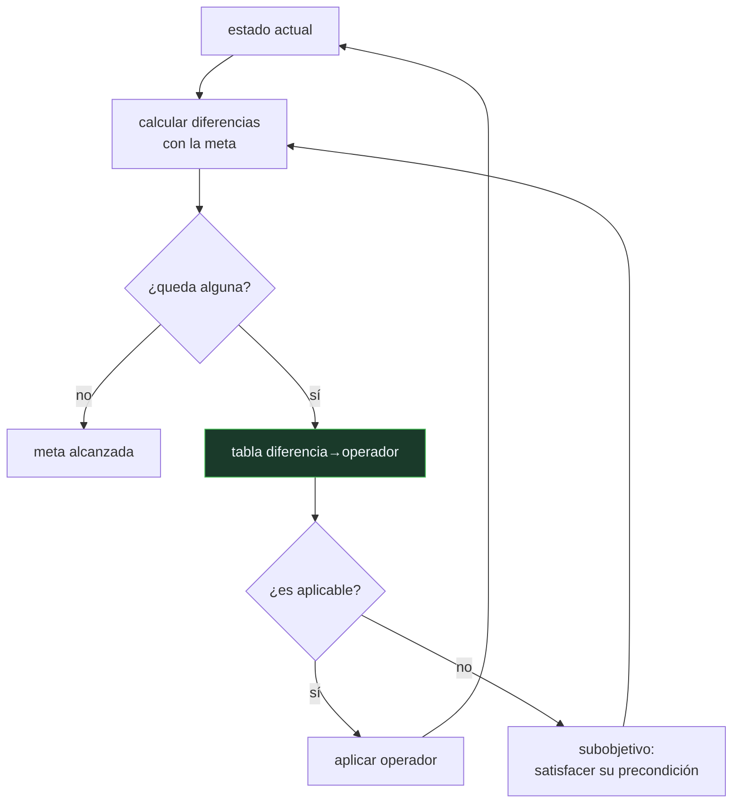

# P64 — General Problem Solver

> Ruta simbólica · El primer intento de separar el método de resolución del dominio.
> El operador no se prueba: se elige por la diferencia que reduce.

**Nivel:** L2 · **Motor:** `gps` · **Notebook:** [`P64_gps.ipynb`](../../../notebooks/papers/P64_gps.ipynb)
· **Anexo:** [complejidad y coste](../../annexes/A05_COMPLEJIDAD_Y_COSTE.md)

## 1. Identificación

| Campo | Valor |
|---|---|
| **Título original** | *Report on a General Problem-Solving Program* |
| **Autoría** | Allen Newell, J. C. Shaw, Herbert A. Simon |
| **Año** | 1959 |
| **Venue** | IFIP Congress 1959, París, 256–264 |
| **Fuente primaria** | [Registro en CMU Archives](https://findingaids.library.cmu.edu/repositories/2/archival_objects/22561) |
| **Acceso** | Restringido |
| **Fecha de consulta** | 2026-08-17 |

## 2. Problema anterior

Los programas de los años cincuenta resolvían un problema y solo uno. El Logic Theory Machine
demostraba teoremas de lógica proposicional; otro programa jugaba a las damas; otro resolvía
integrales. Cada uno llevaba su método fundido con su dominio.

La pregunta de Newell, Shaw y Simon es si existe un **método** que sobreviva al cambio de dominio.
Si pensar es una capacidad general, debería haber algo común entre demostrar un teorema y planear
un viaje, y ese algo debería poder programarse una sola vez.

## 3. Propuesta

El **análisis medios-fines**. En vez de generar acciones y ver qué pasa, se mira la distancia
entre el estado actual y la meta:

1. calcular las **diferencias** entre el estado actual y el estado deseado;
2. elegir la diferencia más importante;
3. consultar una **tabla diferencia→operador**: qué operador reduce esa diferencia concreta;
4. si el operador no es aplicable, convertir sus precondiciones en un **subobjetivo** y repetir.

La estructura es recursiva y el conocimiento del dominio queda concentrado en un solo sitio: la
tabla. Cambiar de dominio, en principio, es cambiar la tabla.

## 4. Intuición sin fórmulas

Arreglar una avería. No pruebas herramientas al azar: miras qué síntoma tienes y coges la que
sirve para ese síntoma. Si la herramienta está en el maletero y el maletero está cerrado, tu
problema deja de ser la avería y pasa a ser la llave.

**Dónde deja de funcionar la analogía:** el mecánico sabe qué herramienta sirve porque tiene años
de oficio. GPS necesita que alguien escriba esa correspondencia entera antes de arrancar, y ahí
está exactamente su límite.

## 5. Matemática mínima

No hay formalismo: hay un esquema de control.

```text
mientras diferencias(estado, meta) ≠ ∅:
    d  ← diferencia más importante
    op ← tabla[d]                            ← el conocimiento del dominio
    si op no es aplicable:
        subobjetivo ← reducir lo que bloquea su precondición
    aplicar(op)
```

La miniatura resuelve un dominio de cuatro atributos con cinco operadores:

| Paso | Diferencia atacada | Operador |
|---:|---|---|
| 1 | hambre | desayunar |
| 2 | vestido | vestirse |
| 3 | puerta (subobjetivo de «lugar») | abrir_puerta |
| 4 | lugar | conducir |
| 5 | puerta | cerrar_puerta |

Cinco pasos. A ciegas, con cinco operadores, habría **3 125** secuencias de esa longitud que
probar. La diferencia entre 5 y 3 125 es lo que aporta el método — y viene de la tabla.

<!-- puente:inicio -->
> [!TIP]
> **Puente matemático.** Esta sección da por sabido lo siguiente. Si algo no te suena,
> léelo primero: está explicado una sola vez, en un solo sitio, y sirve para todas las fichas.

| Dónde | Qué necesitas de ahí |
|---|---|
| [**A05 §1** · Notación O(): qué dice y qué no](../../annexes/A05_COMPLEJIDAD_Y_COSTE.md#1-notación-o-qué-dice-y-qué-no) | por qué probar secuencias a ciegas crece como bⁿ y deja de ser una opción muy pronto |
<!-- puente:fin -->

## 6. Arquitectura o flujo



## 7. Qué observar en el paper original

- La **tabla de conexión** entre tipos de diferencia y operadores. Es la pieza que hace funcionar
  todo y la que hay que reescribir en cada dominio: mirarla es entender el límite del programa.
- La estructura **recursiva de subobjetivos**, y cómo se decide cuándo abandonar una rama.
- La ambición declarada de **simular el pensamiento humano**, no solo de resolver: GPS nace dentro
  de un programa de psicología cognitiva y se contrasta con protocolos de personas pensando en voz
  alta.
- La **ordenación de diferencias por importancia**, que el artículo trata como parte del método y
  que en la práctica es otro conocimiento de dominio.

## 8. Evidencia y resultados

El artículo reporta el comportamiento del programa sobre problemas de lógica simbólica y algunos
puzles, y lo compara con protocolos verbales de personas resolviendo los mismos problemas.

> Es una demostración de viabilidad, no una evaluación cuantitativa en el sentido actual. No hay
> conjunto de test, ni línea base, ni medida agregada.

La miniatura del eje aísla el mecanismo —elegir por diferencia y crear subobjetivos— sobre un
dominio de juguete, y cuantifica lo único cuantificable aquí: cuánto se ahorra frente a probar
secuencias a ciegas.

## 9. Impacto

- Establece la **separación entre motor y dominio** que estructura toda la IA simbólica posterior,
  y que sigue siendo la arquitectura de cualquier sistema de reglas.
- El análisis medios-fines se formaliza doce años después en
  [STRIPS](../P68_strips/README.md), con precondiciones y efectos explícitos.
- Es también el primer caso claro del patrón que se repite en el campo: un método general cuya
  potencia real está en el conocimiento específico que hay que darle.
- En su contexto psicológico, inaugura la tradición de comparar programas con protocolos verbales
  humanos, que llega hasta la ciencia cognitiva actual.

## 10. Limitaciones

1. **La generalidad es del método, no del sistema.** Sin la tabla diferencia→operador escrita a
   mano, GPS no hace nada. Ese fue el límite que acabó con la promesa de un resolvedor universal.
2. **No hay tratamiento de la interacción entre subobjetivos.** Resolver uno puede destruir otro,
   que es el problema que reaparece con nombre propio en STRIPS.
3. **Requiere que el problema venga formulado** como estados, operadores y diferencias. Formularlo
   es la parte difícil de cualquier problema real.
4. **No aprende nada.** Ni la tabla, ni la ordenación de diferencias, ni de sus propios fracasos.
5. **La evaluación es cualitativa** y no permite comparar con alternativas.

## 11. Errores comunes

| Error | Corrección |
|---|---|
| «GPS resuelve problemas de cualquier dominio» | Resuelve problemas de cualquier dominio para el que alguien haya escrito la tabla diferencia→operador. Lo general es el método. |
| «El análisis medios-fines es una heurística de búsqueda» | Es un esquema de control completo: decide qué operador probar y cuándo abrir un subobjetivo. La heurística, si la hay, está en la ordenación de diferencias. |
| «Es un antecedente del aprendizaje automático» | Es lo contrario: todo el conocimiento se introduce a mano. Su límite es justamente el que el aprendizaje viene a resolver. |
| «La recursión de subobjetivos garantiza encontrar el plan» | No hay garantía. Sin tratamiento de la interacción entre submetas, la recursión puede deshacer lo ya conseguido. |
| «Fue superado y abandonado» | Su arquitectura sigue viva: un agente con herramientas es un motor general más una tabla de qué herramienta sirve para qué. Cambió quién escribe la tabla. |

## 12. Relación con trabajos anteriores

- **Newell, Shaw y Simon (1957)** — el Logic Theory Machine: el programa específico del que se
  quiere extraer un método general.
- **[P57 Propuesta de Dartmouth](../P57_dartmouth/README.md) (1955)** — la agenda que pide
  precisamente esto en su tema de resolución de problemas.
- **Simon (1955)** — racionalidad limitada: decidir bien con recursos finitos exige heurísticas.

## 13. Relación con trabajos posteriores

- **[P58 Símbolos y búsqueda](../P58_simbolos_y_busqueda/README.md) (1976)** — el balance de esta
  línea por sus propios autores, y la formulación de las dos hipótesis.
- **[P68 STRIPS](../P68_strips/README.md) (1971)** — la formalización del mismo esquema con
  precondiciones, lista de añadir y lista de borrar.
- **[P67 A*](../P67_a_estrella/README.md) (1968)** — la otra mitad del problema: cómo elegir con
  garantía cuando hay muchos caminos.
- **[P13 ReAct](../P13_react/README.md) (2022)** — motor general más tabla de operadores, con un
  modelo de lenguaje escribiendo la tabla sobre la marcha.

## 14. Notebook asociado

[`P64_gps.ipynb`](../../../notebooks/papers/P64_gps.ipynb)

**Qué implementa:** el análisis medios-fines sobre un dominio de cuatro atributos: la tabla diferencia→operador, la traza con el subobjetivo que aparece cuando el operador no es aplicable, y la cuenta de secuencias que habría que probar a ciegas.

**Qué NO implementa:** no hay retroceso, ni ordenación de diferencias por importancia, ni tratamiento de submetas que se estorban. Tampoco hay comparación con protocolos humanos, que era la mitad del interés del artículo original.

```bash
ai-evolution paper-lab P64 --seed 7
```

## 15. Actividades Bloom

| Nivel | Actividad |
|---|---|
| **Recordar** | Escribe los cuatro pasos del ciclo de análisis medios-fines. |
| **Explicar** | Explica por qué la tabla diferencia→operador es conocimiento del dominio y no del método. |
| **Aplicar** | Ejecuta el notebook y añade un operador nuevo con su entrada en la tabla. |
| **Analizar** | Analiza en qué paso de la traza aparece el subobjetivo y por qué era necesario. |
| **Evaluar** | «GPS es un resolvedor universal». Evalúa la afirmación. |
| **Crear** | Modela un problema de tu trabajo como estados, diferencias y operadores, y mide cuánto esfuerzo te lleva la tabla frente al motor. |

## 16. Autoevaluación

1. ¿Qué separa GPS que antes iba junto?
2. ¿Cómo elige GPS el operador que aplica?
3. ¿Qué hace cuando el operador no es aplicable?
4. ¿Dónde está el conocimiento del dominio?
5. ¿Por qué el método no es tan general como promete el nombre?
6. ¿Qué no resuelve GPS de la planificación?
7. ¿Dónde sobrevive su arquitectura hoy?

## 17. Respuestas esperadas

1. El método de resolución y el dominio concreto. Antes, cada programa llevaba su método fundido con su problema; GPS propone un motor reutilizable más una descripción del dominio.
2. Por la **diferencia** entre el estado actual y la meta. Consulta una tabla que asocia cada tipo de diferencia con los operadores que la reducen. No prueba operadores a ver qué pasa.
3. Convierte las precondiciones del operador en un **subobjetivo** y aplica el mismo método para alcanzarlo. Es un esquema recursivo.
4. En la tabla diferencia→operador, que hay que escribir para cada dominio nuevo. El motor no cambia; la tabla es todo el trabajo.
5. Porque la potencia real está en la tabla, y la tabla es específica. El método viaja entre dominios; el conocimiento no, y sin él el método no resuelve nada.
6. La interacción entre submetas: alcanzar una puede destruir otra. Ese problema reaparece con nombre propio —la anomalía de Sussman— en STRIPS.
7. En cualquier agente con herramientas: un bucle general que decide qué acción sirve para qué objetivo, más un catálogo de acciones. Lo que cambió es que hoy el catálogo puede describirse en lenguaje natural.

## 18. Fuentes primarias

- Newell, A., Shaw, J. C. y Simon, H. A. (1959). *Report on a General Problem-Solving Program*.
  **IFIP Congress 1959**, París, 256–264.
  [Registro en CMU Archives](https://findingaids.library.cmu.edu/repositories/2/archival_objects/22561)
  · [Actas en DBLP](https://dblp.org/db/conf/ifip/ifip1959.html) · consultado 2026-08-17.
- Newell, A. y Simon, H. A. (1976). *Computer Science as Empirical Inquiry*.
  [doi:10.1145/360018.360022](https://doi.org/10.1145/360018.360022) · consultado 2026-08-17.
- Fikes, R. y Nilsson, N. (1971). *STRIPS*.
  [doi:10.1016/0004-3702(71)90010-5](https://doi.org/10.1016/0004-3702(71)90010-5) ·
  consultado 2026-08-17.

---

[⬅️ Anterior: P63 Reproducibilidad](../P63_reproducibilidad/README.md) ·
[📇 Índice](../../catalog/PAPERS_INDEX.md) ·
[📝 Evaluación](../../../assessments/papers/P64_gps.md) ·
[🏫 Clase 013 · Espacios de estados y formulación de problemas](../../../classes/part-01-symbolic-ai-search-logic-and-planning/013-espacios-de-estados-y-formulacion-de-problemas/README.md) ·
[➡️ Siguiente: P65 DPLL](../P65_dpll/README.md)
