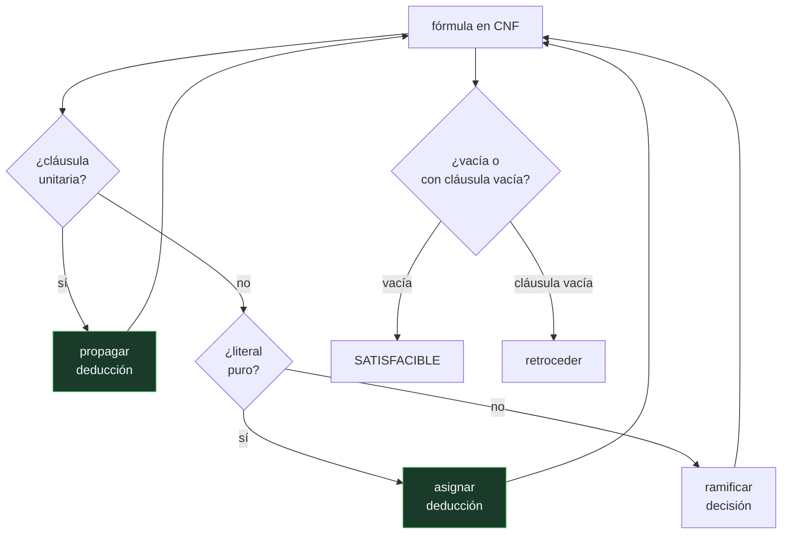

# P65 — DPLL

> Ruta simbólica · Propagar antes de ramificar. Sesenta años después sigue siendo el
> esqueleto de todos los solucionadores SAT del mundo.

**Nivel:** L2 · **Motor:** `dpll` · **Notebook:** [`P65_dpll.ipynb`](../../../notebooks/papers/P65_dpll.ipynb)
· **Anexo:** [complejidad y coste](../../annexes/A05_COMPLEJIDAD_Y_COSTE.md)

## 1. Identificación

| Campo | Valor |
|---|---|
| **Título original** | *A Machine Program for Theorem-Proving* |
| **Autoría** | Martin Davis, George Logemann, Donald Loveland |
| **Año** | 1962 |
| **Venue** | Communications of the ACM, 5(7), 394–397 |
| **Fuente primaria** | [doi:10.1145/368273.368557](https://doi.org/10.1145/368273.368557) |
| **Acceso** | Restringido |
| **Fecha de consulta** | 2026-08-17 |

## 2. Problema anterior

El procedimiento de Davis y Putnam (1960) decidía satisfacibilidad eliminando variables por
resolución. Era correcto y completo, y consumía memoria de forma impracticable: cada eliminación
podía multiplicar el número de cláusulas.

En las máquinas de 1962 eso significaba que fórmulas modestas no cabían. El problema no era la
corrección del método: era que no se podía ejecutar.

## 3. Propuesta

Cambiar la eliminación por una **búsqueda en profundidad con retroceso**, y apoyarla en dos
reglas que no requieren elegir nada:

- **propagación unitaria**: si una cláusula ha quedado con un solo literal, ese literal tiene que
  ser cierto. No es una apuesta, es una deducción;
- **literal puro**: si una variable aparece siempre con el mismo signo, asignarla en ese sentido
  nunca perjudica.

Solo cuando ninguna de las dos se aplica se **ramifica**: se elige una variable y se prueban sus
dos valores. El consumo de memoria pasa a ser lineal en el número de variables.

## 4. Intuición sin fórmulas

Un sudoku. Primero rellenas todas las casillas que solo admiten un número — eso no es adivinar,
es deducir, y nunca hay que borrarlo. Solo cuando ya no queda ninguna casilla forzada eliges una
con dos opciones y pruebas.

Quien empieza probando sin haber agotado las deducciones tarda muchísimo más, y borra
constantemente.

**Dónde deja de funcionar la analogía:** un sudoku bien planteado tiene solución única. Una
fórmula puede tener muchas, una o ninguna, y el procedimiento tiene que responder también en el
caso de ninguna, que es el más caro.

## 5. Matemática mínima

```text
DPLL(F, asignación):
    si F está vacía              → SATISFACIBLE
    si F contiene cláusula vacía → conflicto: retroceder
    si hay cláusula unitaria (L) → asignar L y repetir       ← DEDUCCIÓN
    si hay literal puro L        → asignar L y repetir       ← DEDUCCIÓN
    v ← elegir variable
    devolver DPLL(F, asignación ∪ {v=1}) o DPLL(F, asignación ∪ {v=0})   ← DECISIÓN
```

La miniatura resuelve una fórmula de 6 cláusulas y 5 variables:

| Magnitud | Valor |
|---|---:|
| nodos visitados por DPLL | **5** |
| filas de la tabla de verdad completa | 32 |
| propagaciones unitarias | 3 |
| asignaciones que satisfacen la fórmula | 3 de 32 |

Con cinco variables el factor es 6,4×. La cuenta que importa es la otra: con cincuenta variables,
la tabla completa tiene 10¹⁵ filas y la proporción de soluciones no cambia. Por eso se propaga.

<!-- puente:inicio -->
> [!TIP]
> **Puente matemático.** Esta sección da por sabido lo siguiente. Si algo no te suena,
> léelo primero: está explicado una sola vez, en un solo sitio, y sirve para todas las fichas.

| Dónde | Qué necesitas de ahí |
|---|---|
| [**A05 §1** · Notación O(): qué dice y qué no](../../annexes/A05_COMPLEJIDAD_Y_COSTE.md#1-notación-o-qué-dice-y-qué-no) | qué significa que un problema sea exponencial y por qué eso no lo hace irresoluble en la práctica |
<!-- puente:fin -->

## 6. Arquitectura o flujo



## 7. Qué observar en el paper original

- Que el artículo se presenta como un **programa de máquina**, con preocupaciones de memoria
  explícitas. Es ingeniería, y esa es su aportación frente al procedimiento anterior.
- La distinción entre las dos reglas de deducción y el paso de ramificación. Todo el rendimiento
  posterior del campo viene de mover trabajo de la segunda a las primeras.
- Que la **regla del literal puro** es la menos usada en los solucionadores modernos: cuesta
  detectarla y aporta poco frente a la propagación unitaria.
- El contexto: esto se escribe para demostrar teoremas de primer orden vía Herbrand, no para
  resolver SAT como problema propio. SAT como disciplina llega mucho después.

## 8. Evidencia y resultados

El artículo reporta la implementación y su comportamiento sobre fórmulas concretas, con énfasis
en el consumo de memoria frente al método anterior.

> No hay evaluación comparativa en el sentido moderno: no existían conjuntos de prueba
> estandarizados, y el criterio era si la fórmula cabía en la máquina.

La miniatura mide lo comparable en un cuaderno: nodos visitados frente a filas de la tabla de
verdad, y cuántos de esos pasos son deducción y cuántos decisión.

## 9. Impacto

- Es el algoritmo base de **todos** los solucionadores SAT modernos. Lo que se añadió después
  —aprendizaje de cláusulas por conflicto, reinicios, heurísticas de actividad, estructuras de
  datos perezosas— se monta encima de este bucle.
- SAT pasó de curiosidad teórica a herramienta industrial: verificación de hardware, planificación,
  análisis de dependencias de paquetes, comprobación de modelos.
- Es el ejemplo canónico de un problema NP-completo que en la práctica se resuelve a escala
  enorme. Enseña que «exponencial en el peor caso» y «inviable» no son sinónimos.
- La disciplina de **agotar la deducción antes de decidir** reaparece en la propagación de
  restricciones ([P70](../P70_arco_consistencia/README.md)) y en cualquier motor de inferencia.

## 10. Limitaciones

1. **Sigue siendo exponencial en el peor caso.** DPLL no evita la NP-completitud: la administra.
2. **La elección de variable es el cuello de botella** y el artículo no dice cómo hacerla. Ahí
   está el rendimiento de un solucionador real.
3. **No aprende de los conflictos.** Al retroceder pierde la información de por qué falló; eso lo
   arregla el aprendizaje de cláusulas, treinta y siete años después.
4. **El literal puro cuesta detectarlo** y rinde poco: en la práctica moderna casi se abandonó.
5. **Solo decide satisfacibilidad proposicional.** Toda la expresividad de primer orden queda
   fuera y exige el aparato de Herbrand.

## 11. Errores comunes

| Error | Corrección |
|---|---|
| «La propagación unitaria es una heurística» | Es una deducción: si una cláusula tiene un solo literal, ese literal tiene que ser cierto. No se retrocede sobre ella. |
| «DPLL resuelve SAT en tiempo polinómico» | No. SAT es NP-completo y DPLL es exponencial en el peor caso. Lo que hace es reducir muchísimo el trabajo en instancias con estructura. |
| «Es un algoritmo histórico ya superado» | Es el esqueleto de los solucionadores actuales. Lo que se añadió se monta encima, no lo sustituye. |
| «Da igual el orden en que se elijan las variables» | Es lo que más pesa en el rendimiento. Las heurísticas de decisión son el área donde se compite hoy. |
| «Si no encuentra solución es que no la buscó bien» | DPLL es completo: si termina sin encontrarla, la fórmula es insatisfacible, y eso es una demostración. |

## 12. Relación con trabajos anteriores

- **Davis y Putnam (1960)** — el procedimiento por eliminación de variables, correcto y con
  consumo de memoria impracticable.
- **Herbrand (1930)** — el teorema que reduce la validez de primer orden a satisfacibilidad
  proposicional, y que motiva todo el enfoque.
- **[P58 Símbolos y búsqueda](../P58_simbolos_y_busqueda/README.md) (1976)** — el marco general de
  búsqueda en el que este algoritmo encaja como caso.

## 13. Relación con trabajos posteriores

- **[P66 Resolución](../P66_resolucion/README.md) (1965)** — la regla única que resuelve el caso
  de primer orden que DPLL solo aborda vía Herbrand.
- **Marques-Silva y Sakallah (1999)** — GRASP y el aprendizaje de cláusulas por conflicto: el
  salto que hace industriales a los solucionadores.
  [doi:10.1109/12.769433](https://doi.org/10.1109/12.769433)
- **Moskewicz et al. (2001)** — Chaff y las estructuras de datos perezosas.
- **[P70 Consistencia de arco](../P70_arco_consistencia/README.md) (1977)** — la misma disciplina
  de deducir antes de decidir, en restricciones no booleanas.

## 14. Notebook asociado

[`P65_dpll.ipynb`](../../../notebooks/papers/P65_dpll.ipynb)

**Qué implementa:** el bucle completo de DPLL sobre una fórmula de seis cláusulas, con el conteo separado de propagaciones unitarias, literales puros y ramificaciones, y la comparación con la tabla de verdad completa.

**Qué NO implementa:** no hay aprendizaje de cláusulas, ni reinicios, ni heurísticas de decisión: justo las tres cosas a las que los solucionadores modernos deben su rendimiento.

```bash
ai-evolution paper-lab P65 --seed 7
```

## 15. Actividades Bloom

| Nivel | Actividad |
|---|---|
| **Recordar** | Escribe las dos reglas de deducción de DPLL. |
| **Explicar** | Explica por qué la propagación unitaria no es una apuesta. |
| **Aplicar** | Ejecuta el notebook y añade una cláusula que haga la fórmula insatisfacible. |
| **Analizar** | Analiza qué proporción de los pasos es deducción y qué proporción es decisión. |
| **Evaluar** | «DPLL resuelve SAT eficientemente». Evalúa la afirmación. |
| **Crear** | Codifica un sudoku de 4×4 en forma normal conjuntiva y resuélvelo con el motor. |

## 16. Autoevaluación

1. ¿Qué problema del método anterior resuelve DPLL?
2. ¿Cuáles son las dos reglas de deducción?
3. ¿Cuándo ramifica el algoritmo?
4. ¿Por qué no se retrocede sobre una propagación unitaria?
5. ¿Es DPLL polinómico?
6. ¿Qué le falta respecto de un solucionador moderno?
7. ¿Qué significa que sea completo?

## 17. Respuestas esperadas

1. El consumo de memoria. Davis y Putnam eliminaban variables por resolución y el número de cláusulas explotaba; DPLL busca en profundidad con retroceso y el consumo pasa a ser lineal en las variables.
2. La propagación unitaria —una cláusula con un solo literal obliga a asignarlo— y el literal puro —una variable que siempre aparece con el mismo signo se puede asignar en ese sentido—.
3. Solo cuando ninguna de las dos reglas de deducción se aplica. Ramificar es el último recurso, no el primero.
4. Porque no es una decisión: es una consecuencia lógica de la fórmula y de lo ya asignado. Si lleva a conflicto, el problema está antes, en alguna decisión previa.
5. No. SAT es NP-completo y DPLL es exponencial en el peor caso. Su valor es práctico: en instancias con estructura, la deducción hace casi todo el trabajo.
6. Aprendizaje de cláusulas por conflicto, reinicios y heurísticas de decisión basadas en actividad. Todo eso se monta encima del bucle de 1962.
7. Que si termina sin encontrar solución, ha demostrado que no existe. No es un «no la encontré»: es un «no la hay».

## 18. Fuentes primarias

- Davis, M., Logemann, G. y Loveland, D. (1962). *A Machine Program for Theorem-Proving*.
  **Communications of the ACM**, 5(7), 394–397.
  [doi:10.1145/368273.368557](https://doi.org/10.1145/368273.368557) · consultado 2026-08-17.
- Marques-Silva, J. y Sakallah, K. (1999). *GRASP: A Search Algorithm for Propositional
  Satisfiability*. [doi:10.1109/12.769433](https://doi.org/10.1109/12.769433) · consultado 2026-08-17.
- Biere, A. et al. *Handbook of Satisfiability*.
  [doi:10.3233/FAIA336](https://doi.org/10.3233/FAIA336) · consultado 2026-08-17.

---

[⬅️ Anterior: P64 General Problem Solver](../P64_gps/README.md) ·
[📇 Índice](../../catalog/PAPERS_INDEX.md) ·
[📝 Evaluación](../../../assessments/papers/P65_dpll.md) ·
[🏫 Clase 019 · Lógica proposicional e inferencia](../../../classes/part-01-symbolic-ai-search-logic-and-planning/019-logica-proposicional-e-inferencia/README.md) ·
[➡️ Siguiente: P66 Resolución](../P66_resolucion/README.md)
