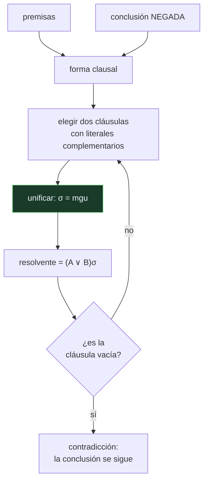

# P66 — Resolución

> Ruta simbólica · Una sola regla de inferencia para toda la lógica de primer orden, y
> el algoritmo que la hace computable: la unificación.

**Nivel:** L3 · **Motor:** `resolucion` · **Notebook:** [`P66_resolucion.ipynb`](../../../notebooks/papers/P66_resolucion.ipynb)
· **Anexo:** [complejidad y coste](../../annexes/A05_COMPLEJIDAD_Y_COSTE.md)

## 1. Identificación

| Campo | Valor |
|---|---|
| **Título original** | *A Machine-Oriented Logic Based on the Resolution Principle* |
| **Autoría** | J. A. Robinson |
| **Año** | 1965 |
| **Venue** | Journal of the ACM, 12(1), 23–41 |
| **Fuente primaria** | [doi:10.1145/321250.321253](https://doi.org/10.1145/321250.321253) |
| **Acceso** | Restringido |
| **Fecha de consulta** | 2026-08-17 |

## 2. Problema anterior

Los cálculos lógicos existentes —deducción natural, sistemas de Hilbert— estaban diseñados para
que una persona siguiera la demostración. Tienen muchas reglas, y cada regla abre caminos
alternativos.

Para una máquina eso es catastrófico: en cada paso hay decenas de reglas aplicables y ningún
criterio para elegir. El espacio de demostraciones se hace inmanejable. Hacía falta una lógica
*orientada a máquina*, con pocas reglas y aplicación mecánica.

## 3. Propuesta

Una **única** regla de inferencia sobre cláusulas —la resolución— más el algoritmo que la hace
posible en primer orden: la **unificación**.

```text
de  (A ∨ L)  y  (B ∨ ¬L')   con σ = mgu(L, L')
se sigue  (A ∨ B)σ
```

La unificación calcula el **unificador más general**: la sustitución mínima que iguala dos
términos, sin comprometer nada que no haga falta. Y las demostraciones se hacen por
**refutación**: se niega la conclusión, se añade a las premisas y se busca la cláusula vacía.

## 4. Intuición sin fórmulas

Dos testigos. Uno dice «fue Juan o fue de noche». El otro dice «no fue de noche, o llovía». Si
ambos dicen la verdad, entonces «fue Juan o llovía»: el punto en que se contradicen —lo de la
noche— se cancela y queda el resto.

La unificación es lo que permite hacer eso cuando los testigos hablan en general: uno dice «todos
los humanos son mortales» y el otro «Sócrates es humano». Hay que darse cuenta de que «x» puede
ser «Sócrates».

**Dónde deja de funcionar la analogía:** los testigos hablan de un caso. La lógica de primer orden
cuantifica sobre todo un universo, y esa generalidad es la que hace el procedimiento
semidecidible: si la conclusión no se sigue, puede no terminar nunca.

## 5. Matemática mínima

```text
Unificador más general (mgu):

    Humano(x)        y  Humano(Sócrates)   →  σ = {x = Sócrates}
    Padre(x, y)      y  Padre(Juan, z)     →  σ = {x = Juan, y = z}
    Conoce(x, M(x))  y  Conoce(Ana, M(Ana))→  σ = {x = Ana}
    Humano(Sócrates) y  Humano(Platón)     →  no unifican

Refutación:
    ∀x Humano(x) → Mortal(x)     ⟹  ¬Humano(x) ∨ Mortal(x)
    Humano(Sócrates)
    ¬Mortal(Sócrates)            ← la conclusión NEGADA
    ────────────────────────────────
    □  (cláusula vacía)          ⟹ la conclusión se sigue
```

La miniatura comprueba los cuatro casos de unificación —tres unifican, uno no— y cierra la
refutación con la cláusula vacía. Repárese en el segundo caso: el unificador liga `x = Juan` y
deja `y = z` sin resolver. Comprometer más sería perder generalidad.

## 6. Arquitectura o flujo



## 7. Qué observar en el paper original

- La definición del **unificador más general** y la demostración de que existe y es único salvo
  renombramiento. Es el corazón técnico del artículo.
- El **algoritmo de unificación** propiamente dicho, y la condición que hace falta para que sea
  correcto: la comprobación de ocurrencia.
- La demostración de **completitud por refutación**: si un conjunto de cláusulas es
  insatisfacible, la resolución deriva la cláusula vacía.
- Que el título dice «orientada a máquina». Es una declaración de intenciones: no se busca una
  lógica más natural, se busca una más mecanizable.

## 8. Evidencia y resultados

Es un artículo matemático: demuestra corrección y completitud del método, y da el algoritmo de
unificación con su justificación.

> No hay experimentos. Lo verificable es la demostración, y es exigente: el artículo es denso y
> merece leerse con el algoritmo de unificación implementado al lado.

La miniatura de este eje implementa unificación y un bucle de resolución mínimo, suficiente para
cerrar la refutación clásica de Sócrates y para exhibir qué pares de términos no unifican.

## 9. Impacto

- Es la base de **Prolog** y de la programación lógica: una consulta en Prolog es una refutación
  por resolución con una estrategia concreta.
- Es la base de los demostradores automáticos de teoremas, y por esa vía de buena parte de la
  verificación formal de software y hardware.
- La **unificación** salió de la lógica y se instaló en todas partes: inferencia de tipos en
  lenguajes funcionales, motores de reglas, emparejamiento de patrones.
- La estrategia de **negar la conclusión y buscar contradicción** es hoy el patrón estándar en
  comprobación de modelos y análisis estático.

## 10. Limitaciones

1. **La lógica de primer orden es semidecidible.** Si la conclusión se sigue, el procedimiento
   termina; si no, puede no terminar nunca. No es un defecto del método: es del problema.
2. **La saturación explota.** Sin estrategias de restricción —conjunto soporte, resolución
   unitaria, de entrada— el número de resolventes crece sin control.
3. **La comprobación de ocurrencia cuesta**, y omitirla —como hacen muchos Prolog— hace el sistema
   incorrecto en casos que se pueden construir.
4. **La conversión a forma clausal** no es trivial y puede aumentar mucho el tamaño de la fórmula.
5. **No maneja incertidumbre ni excepciones**, que es justamente lo que la práctica exige y lo que
   motiva los factores de certeza de [P69](../P69_mycin/README.md).

## 11. Errores comunes

| Error | Corrección |
|---|---|
| «La resolución demuestra que algo es cierto» | Demuestra que la negación de la conclusión es incompatible con las premisas. Es una refutación, y por eso cierra con el vacío. |
| «El unificador más general es cualquier sustitución que iguale los términos» | Es la mínima. En `Padre(x,y)` con `Padre(Juan,z)` liga x=Juan y deja y=z libre; ligar y a algo concreto perdería generalidad. |
| «Si el procedimiento no termina, la conclusión es falsa» | Puede no terminar precisamente porque la lógica de primer orden es semidecidible. No terminar no es información. |
| «La comprobación de ocurrencia es un detalle de implementación» | Sin ella se pueden construir términos infinitos y el sistema deja de ser correcto. Omitirla es una decisión de velocidad con riesgo declarado. |
| «Una sola regla significa que el método es simple» | La regla es simple; controlar la explosión de resolventes es todo lo contrario, y es donde está la investigación posterior. |

## 12. Relación con trabajos anteriores

- **[P65 DPLL](../P65_dpll/README.md) (1962)** — el caso proposicional, y la vía Herbrand que este
  artículo hace innecesaria.
- **Herbrand (1930)** — el teorema que conecta primer orden con satisfacibilidad proposicional.
- **Prawitz (1960)** — el uso implícito de unificación que Robinson formaliza y demuestra.

## 13. Relación con trabajos posteriores

- **Kowalski (1974)** — la lógica como lenguaje de programación: el paso de la resolución a
  Prolog.
- **Colmerauer y Roussel (1996)** — la historia del nacimiento de Prolog.
  [doi:10.1145/234286.1057820](https://doi.org/10.1145/234286.1057820)
- **[P69 MYCIN](../P69_mycin/README.md) (1975)** — qué hacer cuando las premisas no son ciertas ni
  falsas, sino indicios.
- **[P71 Ontologías](../P71_ontologia/README.md) (1993)** — la representación del conocimiento
  sobre la que estos motores razonan.

## 14. Notebook asociado

[`P66_resolucion.ipynb`](../../../notebooks/papers/P66_resolucion.ipynb)

**Qué implementa:** el algoritmo de unificación sobre cuatro pares de términos, con su unificador más general, y una refutación completa que cierra con la cláusula vacía.

**Qué NO implementa:** no hay comprobación de ocurrencia, ni estrategias de restricción, ni tratamiento del caso en que la conclusión no se sigue. El bucle está acotado para que termine siempre.

```bash
ai-evolution paper-lab P66 --seed 7
```

## 15. Actividades Bloom

| Nivel | Actividad |
|---|---|
| **Recordar** | Escribe la regla de resolución con su unificador. |
| **Explicar** | Explica qué es el unificador más general y por qué se pide el más general. |
| **Aplicar** | Ejecuta el notebook y añade un par de términos que no unifiquen. |
| **Analizar** | Analiza por qué una demostración por refutación cierra con la cláusula vacía. |
| **Evaluar** | «Si el demostrador no termina, la conclusión es falsa». Evalúa la afirmación. |
| **Crear** | Formaliza en cláusulas un dominio pequeño y demuestra una conclusión por refutación a mano. |

## 16. Autoevaluación

1. ¿Cuántas reglas de inferencia necesita el método?
2. ¿Qué es la unificación y para qué hace falta?
3. ¿Qué es el unificador más general?
4. ¿Cómo se demuestra una conclusión por refutación?
5. ¿Por qué el procedimiento puede no terminar?
6. ¿Qué es la comprobación de ocurrencia y qué pasa si se omite?
7. ¿Dónde vive hoy la unificación fuera de la lógica?

## 17. Respuestas esperadas

1. Una: la resolución. Ese es el resultado. Lo que hace falta añadir no es otra regla sino un algoritmo —la unificación— que permita aplicarla con variables.
2. Es el cálculo de la sustitución que iguala dos términos. Hace falta porque en primer orden las cláusulas hablan de todo un universo con variables, y hay que reconocer que `x` puede ser `Sócrates`.
3. La sustitución mínima que iguala los términos: cualquier otro unificador se obtiene componiéndolo con algo más. Comprometer más de lo necesario perdería generalidad.
4. Se niega la conclusión, se añade al conjunto de premisas y se resuelve hasta derivar la cláusula vacía. La cláusula vacía es la contradicción, y su existencia demuestra que la conclusión se seguía.
5. Porque la lógica de primer orden es semidecidible: si la conclusión se sigue, se encuentra la refutación; si no se sigue, la búsqueda puede continuar indefinidamente.
6. Es comprobar que la variable que se va a sustituir no aparece dentro del término que la sustituye. Sin ella se construyen términos infinitos y el sistema deja de ser correcto.
7. En la inferencia de tipos de lenguajes como ML o Haskell, en los motores de reglas y en el emparejamiento de patrones de casi cualquier lenguaje moderno.

## 18. Fuentes primarias

- Robinson, J. A. (1965). *A Machine-Oriented Logic Based on the Resolution Principle*.
  **Journal of the ACM**, 12(1), 23–41.
  [doi:10.1145/321250.321253](https://doi.org/10.1145/321250.321253) · consultado 2026-08-17.
- Colmerauer, A. y Roussel, P. (1996). *The birth of Prolog*.
  [doi:10.1145/234286.1057820](https://doi.org/10.1145/234286.1057820) · consultado 2026-08-17.
- Davis, M., Logemann, G. y Loveland, D. (1962). *A Machine Program for Theorem-Proving*.
  [doi:10.1145/368273.368557](https://doi.org/10.1145/368273.368557) · consultado 2026-08-17.

---

[⬅️ Anterior: P65 DPLL](../P65_dpll/README.md) ·
[📇 Índice](../../catalog/PAPERS_INDEX.md) ·
[📝 Evaluación](../../../assessments/papers/P66_resolucion.md) ·
[🏫 Clase 020 · Lógica de primer orden y unificación](../../../classes/part-01-symbolic-ai-search-logic-and-planning/020-logica-de-primer-orden-y-unificacion/README.md) ·
[➡️ Siguiente: P67 A*](../P67_a_estrella/README.md)
